# 01 — Modèle de Données & Architecture Technique

> **Cultivia — Simulateur Agricole Multijoueur**
> Document fondation pour le développement du jeu web.
> Synchronisé avec : PHASE0-PHASE5_6 specs (source de vérité)

---

## Table des matières

1. [Entités Core](#1-entités-core)
2. [Entités Parcelles & Cultures](#2-entités-parcelles--cultures)
3. [Entités Élevage](#3-entités-élevage)
4. [Entités Bâtiments & Matériels](#4-entités-bâtiments--matériels)
5. [Entités Économie & Commerce](#5-entités-économie--commerce)
6. [Entités Activités Secondaires](#6-entités-activités-secondaires)
7. [Entités Sociales & Méta](#7-entités-sociales--méta)
8. [Diagramme ER Mermaid](#8-diagramme-er-mermaid)
9. [Architecture Technique](#9-architecture-technique)

---

## 1. Entités Core

### 1.1 Account (cross-serveur)

```sql
-- Compte global (cross-serveur) — Réf: PHASE0 Feature 1
CREATE TABLE account (
  id              UUID PRIMARY KEY DEFAULT gen_random_uuid(),
  email           VARCHAR(255) NOT NULL UNIQUE,
  password_hash   VARCHAR(255) NOT NULL,
  email_verified  BOOLEAN NOT NULL DEFAULT false,
  verification_token UUID,
  verification_expires_at TIMESTAMPTZ,
  created_at      TIMESTAMPTZ NOT NULL DEFAULT now(),
  updated_at      TIMESTAMPTZ NOT NULL DEFAULT now()
);
CREATE INDEX idx_account_email ON account(email);
CREATE INDEX idx_account_verification_token ON account(verification_token) WHERE verification_token IS NOT NULL;
```

### 1.2 Server

```sql
-- Réf: PHASE0 Feature 2
CREATE TABLE server (
  id              SERIAL PRIMARY KEY,
  name            VARCHAR(50) NOT NULL UNIQUE,
  slug            VARCHAR(20) NOT NULL UNIQUE,
  country         VARCHAR(10) NOT NULL,
  difficulty      SMALLINT NOT NULL CHECK (difficulty BETWEEN 1 AND 5),
  price_per_ha    DECIMAL(10,2) NOT NULL,
  max_parcel_ha   SMALLINT NOT NULL DEFAULT 100,
  ht_base         DECIMAL(6,2) NOT NULL DEFAULT 40.00,
  starting_balance DECIMAL(14,2) NOT NULL DEFAULT 100000.00,
  current_day     INT NOT NULL DEFAULT 1,
  current_month   SMALLINT NOT NULL DEFAULT 3,
  current_season  VARCHAR(10) NOT NULL DEFAULT 'spring',
  current_year    INT NOT NULL DEFAULT 1,
  is_active       BOOLEAN NOT NULL DEFAULT true,
  max_players     INT NOT NULL DEFAULT 5000,
  created_at      TIMESTAMPTZ NOT NULL DEFAULT now()
);
```

### 1.3 Region

```sql
CREATE TABLE region (
  id           SERIAL PRIMARY KEY,
  server_id    INT NOT NULL REFERENCES server(id),
  name         VARCHAR(100) NOT NULL,
  code         VARCHAR(10) NOT NULL,
  weather_zone SMALLINT NOT NULL CHECK (weather_zone BETWEEN 1 AND 4),
  UNIQUE(server_id, name),
  UNIQUE(server_id, code)
);
```

### 1.4 Department

```sql
CREATE TABLE department (
  id        SERIAL PRIMARY KEY,
  region_id INT NOT NULL REFERENCES region(id),
  name      VARCHAR(100) NOT NULL,
  code      VARCHAR(10) NOT NULL,
  UNIQUE(region_id, name),
  UNIQUE(region_id, code)
);
```

### 1.5 Prefecture

```sql
-- Réf: IDENTITE_CULTIVIA §2 — ~340 préfectures/sous-préfectures réelles
CREATE TABLE prefecture (
  id            SERIAL PRIMARY KEY,
  department_id INT NOT NULL REFERENCES department(id),
  name          VARCHAR(100) NOT NULL,
  lat           DECIMAL(8,5) NOT NULL,
  lng           DECIMAL(8,5) NOT NULL,
  is_prefecture BOOLEAN NOT NULL DEFAULT false,
  UNIQUE(department_id, name)
);
CREATE INDEX idx_prefecture_dept ON prefecture(department_id);

-- Réf: IDENTITE_CULTIVIA §2.3 — distances pré-calculées
CREATE TABLE distance_matrix (
  id              SERIAL PRIMARY KEY,
  prefecture_a_id INT NOT NULL REFERENCES prefecture(id),
  prefecture_b_id INT NOT NULL REFERENCES prefecture(id),
  distance_km     SMALLINT NOT NULL,
  UNIQUE(prefecture_a_id, prefecture_b_id),
  CHECK(prefecture_a_id < prefecture_b_id)
);
CREATE INDEX idx_distance_lookup ON distance_matrix(prefecture_a_id, prefecture_b_id);
```

### 1.6 Player

```sql
-- Réf: PHASE0 Feature 1 — profil joueur par serveur
CREATE TYPE starter_kit AS ENUM ('cultivator', 'breeder', 'versatile');

CREATE TABLE player (
  id              UUID PRIMARY KEY DEFAULT gen_random_uuid(),
  account_id      UUID NOT NULL REFERENCES account(id) ON DELETE CASCADE,
  server_id       INT NOT NULL REFERENCES server(id),
  username        VARCHAR(50) NOT NULL,
  avatar_url      VARCHAR(500),
  balance         DECIMAL(14,2) NOT NULL DEFAULT 100000.00,
  ht_today        DECIMAL(6,2) NOT NULL DEFAULT 40.00,
  ht_max          DECIMAL(6,2) NOT NULL DEFAULT 40.00,
  seniority_days  INT NOT NULL DEFAULT 0,
  license_expires TIMESTAMPTZ,
  is_online       BOOLEAN NOT NULL DEFAULT false,
  created_at      TIMESTAMPTZ NOT NULL DEFAULT now(),
  last_login      TIMESTAMPTZ,
  UNIQUE(account_id, server_id),
  UNIQUE(server_id, username),
  CONSTRAINT chk_player_balance CHECK (balance >= -30000.00)
);
CREATE INDEX idx_player_account ON player(account_id);
CREATE INDEX idx_player_server ON player(server_id);
```

### 1.7 Refresh Token

```sql
-- Réf: PHASE0 Feature 1
CREATE TABLE refresh_token (
  id          UUID PRIMARY KEY DEFAULT gen_random_uuid(),
  account_id  UUID NOT NULL REFERENCES account(id) ON DELETE CASCADE,
  token_hash  VARCHAR(255) NOT NULL UNIQUE,
  family_id   UUID NOT NULL,
  expires_at  TIMESTAMPTZ NOT NULL,
  revoked_at  TIMESTAMPTZ,
  created_at  TIMESTAMPTZ NOT NULL DEFAULT now()
);
CREATE INDEX idx_refresh_token_account ON refresh_token(account_id);
CREATE INDEX idx_refresh_token_family ON refresh_token(family_id);
CREATE INDEX idx_refresh_token_expires ON refresh_token(expires_at) WHERE revoked_at IS NULL;
```

### 1.8 Farm

```sql
CREATE TABLE farm (
  id          SERIAL PRIMARY KEY,
  player_id   UUID NOT NULL REFERENCES player(id),
  prefecture_id     INT NOT NULL REFERENCES prefecture(id),
  name        VARCHAR(100) NOT NULL,
  is_primary  BOOLEAN NOT NULL DEFAULT true,
  guard_player_id UUID REFERENCES player(id),
  created_at  TIMESTAMPTZ NOT NULL DEFAULT now()
);
```

### 1.9 Employee

```sql
CREATE TABLE employee (
  id          SERIAL PRIMARY KEY,
  farm_id     INT NOT NULL REFERENCES farm(id),
  role        VARCHAR(30) NOT NULL,
  salary      DECIMAL(10,2) NOT NULL,
  pa_per_day  DECIMAL(6,2) NOT NULL,
  hired_at    TIMESTAMPTZ NOT NULL DEFAULT now(),
  contract_end TIMESTAMPTZ,
  skill_json  JSONB DEFAULT '{}'
);
```

### 1.10 BankAccount

```sql
-- SELECT FOR UPDATE obligatoire sur toute opération financière
CREATE TABLE bank_account (
  id         SERIAL PRIMARY KEY,
  player_id  UUID NOT NULL REFERENCES player(id),
  type       VARCHAR(20) NOT NULL DEFAULT 'main',
  balance    DECIMAL(14,2) NOT NULL DEFAULT 100000.00,
  created_at TIMESTAMPTZ NOT NULL DEFAULT now(),
  UNIQUE(player_id, type)
);
```

### 1.11 Loan

```sql
-- Réf: F033 (demander prêt), F079 (remboursement anticipé), T9 (mensualité auto)
CREATE TABLE loan (
  id              SERIAL PRIMARY KEY,
  player_id       UUID NOT NULL REFERENCES player(id),
  principal       DECIMAL(12,2) NOT NULL CHECK (principal > 0),
  remaining       DECIMAL(12,2) NOT NULL CHECK (remaining >= 0),
  interest_rate   DECIMAL(5,4) NOT NULL,
  duration_months SMALLINT NOT NULL,
  monthly_payment DECIMAL(10,2) NOT NULL,
  months_paid     SMALLINT NOT NULL DEFAULT 0,
  created_at      TIMESTAMPTZ NOT NULL DEFAULT now(),
  completed_at    TIMESTAMPTZ,
  closed_at       TIMESTAMPTZ,  -- F079: date de clôture anticipée
  status          VARCHAR(15) NOT NULL DEFAULT 'active' CHECK (status IN ('active','completed','repaid_early','defaulted'))
);
CREATE INDEX idx_loan_player ON loan(player_id) WHERE status = 'active';
```

### 1.12 Savings

```sql
-- Réf: F032 (souscrire), F065 (clôture anticipée), F066 (tick intérêts)
CREATE TABLE savings (
  id          SERIAL PRIMARY KEY,
  player_id   UUID NOT NULL REFERENCES player(id),
  duration    SMALLINT NOT NULL CHECK (duration IN (1,3,5)),
  rate        DECIMAL(4,2) NOT NULL,
  amount      DECIMAL(12,2) NOT NULL CHECK (amount <= 100000),
  status      VARCHAR(15) NOT NULL DEFAULT 'active' CHECK (status IN ('active','matured','closed_early')),
  total_interest_paid DECIMAL(12,2) NOT NULL DEFAULT 0,
  next_interest_at TIMESTAMPTZ,
  opened_at   TIMESTAMPTZ NOT NULL DEFAULT now(),
  matures_at  TIMESTAMPTZ NOT NULL,
  closed_at   TIMESTAMPTZ  -- F065: date de clôture anticipée (0€ intérêts)
);
CREATE INDEX idx_savings_player ON savings(player_id) WHERE status = 'active';
-- Réf: Tick intérêts (F066, étape 15)
CREATE INDEX idx_savings_interest ON savings(next_interest_at) WHERE status = 'active';
```

### 1.13 Transaction

```sql
-- SELECT FOR UPDATE obligatoire sur toute opération financière
CREATE TABLE transaction (
  id          BIGSERIAL PRIMARY KEY,
  player_id   UUID NOT NULL REFERENCES player(id),
  account_type VARCHAR(20) NOT NULL DEFAULT 'main',
  amount      DECIMAL(14,2) NOT NULL,
  balance_after DECIMAL(14,2) NOT NULL,
  category    VARCHAR(50) NOT NULL,
  label       VARCHAR(200) NOT NULL,
  reference_type VARCHAR(30),
  reference_id   INT,
  created_at  TIMESTAMPTZ NOT NULL DEFAULT now()
);
CREATE INDEX idx_transaction_player ON transaction(player_id, created_at DESC);
CREATE INDEX idx_transaction_category ON transaction(player_id, category);
```

### 1.14 Tick Log & Lock

```sql
-- Réf: PHASE0 Feature 3
CREATE TABLE tick_log (
  id          BIGSERIAL PRIMARY KEY,
  server_id   INT NOT NULL REFERENCES server(id),
  game_day    INT NOT NULL,
  game_month  SMALLINT NOT NULL,
  game_season VARCHAR(10) NOT NULL,
  game_year   INT NOT NULL,
  started_at  TIMESTAMPTZ NOT NULL,
  finished_at TIMESTAMPTZ,
  status      VARCHAR(20) NOT NULL DEFAULT 'running',
  error_message TEXT,
  steps_completed JSONB DEFAULT '[]',
  failed_player_ids UUID[] DEFAULT '{}',
  duration_ms INT,
  UNIQUE(server_id, game_day, game_year)
);
CREATE INDEX idx_tick_log_server ON tick_log(server_id, started_at DESC);

CREATE TABLE tick_lock (
  server_id   INT PRIMARY KEY REFERENCES server(id),
  locked_at   TIMESTAMPTZ,
  locked_by   VARCHAR(100),
  expires_at  TIMESTAMPTZ
);
```

### 1.15 Notification

```sql
-- Réf: PHASE0 Feature 7
CREATE TABLE notification (
  id          UUID PRIMARY KEY DEFAULT gen_random_uuid(),
  player_id   UUID NOT NULL REFERENCES player(id) ON DELETE CASCADE,
  type        VARCHAR(50) NOT NULL,
  priority    VARCHAR(10) NOT NULL DEFAULT 'info',
  title       VARCHAR(200) NOT NULL,
  body        TEXT,
  data        JSONB,
  is_read     BOOLEAN NOT NULL DEFAULT false,
  read_at     TIMESTAMPTZ,
  created_at  TIMESTAMPTZ NOT NULL DEFAULT now(),
  expires_at  TIMESTAMPTZ NOT NULL DEFAULT now() + INTERVAL '30 days'
);
CREATE INDEX idx_notification_player ON notification(player_id, created_at DESC);
CREATE INDEX idx_notification_unread ON notification(player_id, is_read) WHERE is_read = false;
CREATE INDEX idx_notification_expires ON notification(expires_at);
```

### 1.16 ActionLog

```sql
CREATE TABLE action_log (
  id          BIGSERIAL PRIMARY KEY,
  player_id   UUID NOT NULL REFERENCES player(id),
  pa_spent    DECIMAL(6,2) NOT NULL CHECK (pa_spent > 0),
  action_type VARCHAR(50) NOT NULL,
  details     JSONB,
  performed_at TIMESTAMPTZ NOT NULL DEFAULT now()
);
CREATE INDEX idx_action_log_player ON action_log(player_id, performed_at DESC);
```

### 1.17 Skill Progress

```sql
-- Réf: GAMEPLAY_VALIDATION F2.12 — Savoir-Faire (PO 2.1)
CREATE TABLE skill_progress (
  id          SERIAL PRIMARY KEY,
  player_id   UUID NOT NULL REFERENCES player(id),
  branch      VARCHAR(20) NOT NULL CHECK (branch IN ('cultures','elevage','commerce')),
  xp          INT NOT NULL DEFAULT 0,
  tier        SMALLINT NOT NULL DEFAULT 0 CHECK (tier BETWEEN 0 AND 10),
  updated_at  TIMESTAMPTZ NOT NULL DEFAULT now(),
  UNIQUE(player_id, branch)
);
CREATE INDEX idx_skill_player ON skill_progress(player_id);
```

### 1.18 Player Settings

```sql
-- Réf: REUNION_PLENIERE_FINALE B2 — Préférences joueur
CREATE TABLE player_settings (
  player_id    UUID PRIMARY KEY REFERENCES player(id) ON DELETE CASCADE,
  dark_mode    BOOLEAN NOT NULL DEFAULT false,
  density      VARCHAR(10) NOT NULL DEFAULT 'normal',
  expert_soil  BOOLEAN NOT NULL DEFAULT false
);
```

### 1.19 Player Contract

```sql
-- Réf: GAMEPLAY_VALIDATION F3.4 — Contrats joueur-joueur (PO 2.2)
CREATE TYPE starter_kit AS ENUM ('cultivator', 'breeder', 'versatile');

CREATE TABLE player_contract (
  id              SERIAL PRIMARY KEY,
  proposer_id     UUID NOT NULL REFERENCES player(id),
  target_id       UUID NOT NULL REFERENCES player(id),
  product         VARCHAR(50) NOT NULL,
  quantity_per_month DECIMAL(12,2) NOT NULL,
  price_per_ton   DECIMAL(10,2) NOT NULL,
  duration_months SMALLINT NOT NULL,
  penalty_pct     DECIMAL(4,2) NOT NULL DEFAULT 20.00,
  status          VARCHAR(15) NOT NULL DEFAULT 'pending' CHECK (status IN ('pending','active','completed','cancelled')),
  months_delivered SMALLINT NOT NULL DEFAULT 0,
  created_at      TIMESTAMPTZ NOT NULL DEFAULT now(),
  accepted_at     TIMESTAMPTZ,
  completed_at    TIMESTAMPTZ,
  CHECK(proposer_id <> target_id)
);
CREATE INDEX idx_pcontract_proposer ON player_contract(proposer_id, status);
CREATE INDEX idx_pcontract_target ON player_contract(target_id, status);

CREATE TYPE starter_kit AS ENUM ('cultivator', 'breeder', 'versatile');

CREATE TABLE player_contract_delivery (
  id          SERIAL PRIMARY KEY,
  contract_id INT NOT NULL REFERENCES player_contract(id),
  month_num   SMALLINT NOT NULL,
  delivered   DECIMAL(12,2) NOT NULL DEFAULT 0,
  expected    DECIMAL(12,2) NOT NULL,
  penalty_applied DECIMAL(12,2) NOT NULL DEFAULT 0,
  delivered_at TIMESTAMPTZ
);
```

### 1.20 Idempotency Key

```sql
-- Réf: REVIEW_FINALE I4 — Protection double-click / idempotence
CREATE TABLE idempotency_key (
  id          SERIAL PRIMARY KEY,
  player_id   UUID NOT NULL REFERENCES player(id),
  key         VARCHAR(100) NOT NULL,
  endpoint    VARCHAR(200) NOT NULL,
  response    JSONB NOT NULL,
  created_at  TIMESTAMPTZ NOT NULL DEFAULT now(),
  expires_at  TIMESTAMPTZ NOT NULL DEFAULT now() + INTERVAL '24 hours',
  UNIQUE(player_id, key)
);
CREATE INDEX idx_idempotency_expires ON idempotency_key(expires_at);
```

---

## 2. Entités Parcelles & Cultures

### 2.1 Parcel

```sql
-- Réf: PHASE1 Feature 1
CREATE TABLE parcel (
  id              UUID PRIMARY KEY DEFAULT gen_random_uuid(),
  farm_id         INT NOT NULL REFERENCES farm(id),
  prefecture_id         INT NOT NULL REFERENCES prefecture(id),
  type            VARCHAR(20) NOT NULL,
  area_m2         INT NOT NULL CHECK (area_m2 BETWEEN 10000 AND 2000000),
  soil_quality    SMALLINT NOT NULL CHECK (soil_quality BETWEEN 1 AND 3),
  is_bio          BOOLEAN NOT NULL DEFAULT false,
  bio_conversion_start TIMESTAMPTZ,
  stones_level    SMALLINT NOT NULL DEFAULT 0 CHECK (stones_level BETWEEN 0 AND 100),
  stones_broyage_until TIMESTAMPTZ,
  irrigation_type VARCHAR(20),
  water_source_level SMALLINT,
  bought_at       TIMESTAMPTZ NOT NULL DEFAULT now(),
  bought_price    DECIMAL(12,2) NOT NULL,
  n_reserve       DECIMAL(8,2) NOT NULL DEFAULT 50,
  p_reserve       DECIMAL(8,2) NOT NULL DEFAULT 50,
  k_reserve       DECIMAL(8,2) NOT NULL DEFAULT 50,
  ca_reserve      DECIMAL(8,2) NOT NULL DEFAULT 50,
  mg_reserve      DECIMAL(8,2) NOT NULL DEFAULT 50,
  s_reserve       DECIMAL(8,2) NOT NULL DEFAULT 50,
  last_soil_analysis TIMESTAMPTZ,
  rain_gauge      SMALLINT NOT NULL DEFAULT 50 CHECK (rain_gauge BETWEEN 0 AND 100),
  sun_gauge       SMALLINT NOT NULL DEFAULT 50 CHECK (sun_gauge BETWEEN 0 AND 100),
  fatigue_index   DECIMAL(5,2) NOT NULL DEFAULT 0 CHECK (fatigue_index BETWEEN 0 AND 100),
  soil_state      VARCHAR(15) NOT NULL DEFAULT 'fallow' CHECK (soil_state IN ('fallow','prepared'))
);
CREATE INDEX idx_parcel_farm ON parcel(farm_id);
CREATE INDEX idx_parcel_zone ON parcel(prefecture_id);
```

### 2.2 Soil Analysis

```sql
-- Réf: PHASE1 Feature 2
CREATE TABLE soil_analysis (
  id          SERIAL PRIMARY KEY,
  parcel_id   UUID NOT NULL REFERENCES parcel(id) ON DELETE CASCADE,
  n_value     DECIMAL(8,2) NOT NULL,
  p_value     DECIMAL(8,2) NOT NULL,
  k_value     DECIMAL(8,2) NOT NULL,
  ca_value    DECIMAL(8,2) NOT NULL,
  mg_value    DECIMAL(8,2) NOT NULL,
  s_value     DECIMAL(8,2) NOT NULL,
  analyzed_at TIMESTAMPTZ NOT NULL DEFAULT now(),
  expires_at  TIMESTAMPTZ NOT NULL
);
CREATE INDEX idx_soil_analysis_parcel ON soil_analysis(parcel_id, analyzed_at DESC);
```

### 2.3 CropType (référentiel)

```sql
CREATE TABLE crop_type (
  id              SERIAL PRIMARY KEY,
  name            VARCHAR(50) NOT NULL UNIQUE,
  slug            VARCHAR(30) NOT NULL UNIQUE,
  category        VARCHAR(20) NOT NULL,
  seed_kg_per_ha  DECIMAL(8,2) NOT NULL,
  seed_price_kg   DECIMAL(6,2) NOT NULL,
  base_price_ton  DECIMAL(10,2) NOT NULL,
  rotation_years  SMALLINT NOT NULL DEFAULT 1,
  sow_months      SMALLINT[] NOT NULL,
  harvest_months  SMALLINT[] NOT NULL,
  growth_days     SMALLINT NOT NULL,
  harvest_machine VARCHAR(30) NOT NULL,
  produces_straw  BOOLEAN NOT NULL DEFAULT false,
  straw_yield_t_ha DECIMAL(4,1) DEFAULT 0,
  bio_eligible    BOOLEAN NOT NULL DEFAULT true,
  nutrient_needs  JSONB NOT NULL DEFAULT '{}'
);
```

### 2.4 Crop (instance)

```sql
-- Réf: PHASE1 Feature 7 — synchronisé avec state machine
CREATE TABLE crop (
  id            UUID PRIMARY KEY DEFAULT gen_random_uuid(),
  parcel_id     UUID NOT NULL REFERENCES parcel(id),
  crop_type_id  INT NOT NULL REFERENCES crop_type(id),
  seed_type     VARCHAR(5) NOT NULL DEFAULT 'GP',
  state         VARCHAR(15) NOT NULL DEFAULT 'sown',
  is_bio        BOOLEAN NOT NULL DEFAULT false,
  growth_pct    DECIMAL(5,2) NOT NULL DEFAULT 0,
  quality       SMALLINT CHECK (quality BETWEEN 1 AND 3),
  sown_at       TIMESTAMPTZ NOT NULL DEFAULT now(),
  harvested_at  TIMESTAMPTZ,
  yield_tons    DECIMAL(10,3),
  technique     VARCHAR(20) NOT NULL DEFAULT 'traditional',
  treated_fungicide  BOOLEAN DEFAULT false,
  treated_herbicide  BOOLEAN DEFAULT false,
  treated_insecticide BOOLEAN DEFAULT false,
  rolled        BOOLEAN DEFAULT false,
  fertilized    BOOLEAN DEFAULT false,
  car_contract_id INT REFERENCES car_contract(id),
  UNIQUE(parcel_id, harvested_at),
  CONSTRAINT chk_crop_growth CHECK (growth_pct BETWEEN 0 AND 100)
);
CREATE INDEX idx_crop_parcel ON crop(parcel_id) WHERE harvested_at IS NULL;
-- Réf: REVIEW_FINALE R9 — Index pour le tick dailyCropGrowth
CREATE INDEX idx_crop_active_state ON crop(state) WHERE state IN ('sown','growing') AND harvested_at IS NULL;
```

### 2.5 Crop History & Yield Region

```sql
-- Réf: PHASE1 Feature 7
CREATE TABLE crop_history (
  id            SERIAL PRIMARY KEY,
  parcel_id     UUID NOT NULL REFERENCES parcel(id),
  crop_type_id  INT NOT NULL REFERENCES crop_type(id),
  sown_year     INT NOT NULL,
  harvested_year INT
);
CREATE INDEX idx_crop_history_parcel ON crop_history(parcel_id, crop_type_id);

CREATE TABLE crop_yield_region (
  id           SERIAL PRIMARY KEY,
  crop_type_id INT NOT NULL REFERENCES crop_type(id),
  region_id    INT NOT NULL REFERENCES region(id),
  yield_ton_ha DECIMAL(6,2),
  UNIQUE(crop_type_id, region_id)
);
```

### 2.6 Straw On Field

```sql
-- Réf: PHASE1 Feature 13
CREATE TABLE straw_on_field (
  id          SERIAL PRIMARY KEY,
  parcel_id   UUID NOT NULL REFERENCES parcel(id) ON DELETE CASCADE,
  quantity_kg DECIMAL(10,2) NOT NULL,
  crop_type   VARCHAR(30) NOT NULL,
  created_at  TIMESTAMPTZ NOT NULL DEFAULT now(),
  UNIQUE(parcel_id)
);
```

### 2.7 Input Type (engrais & traitements)

```sql
-- Réf: PHASE1 Feature 8
CREATE TABLE input_type (
  id          SERIAL PRIMARY KEY,
  name        VARCHAR(80) NOT NULL,
  slug        VARCHAR(30) NOT NULL UNIQUE,
  category    VARCHAR(20) NOT NULL,
  price_per_unit DECIMAL(8,2) NOT NULL,
  unit        VARCHAR(10) NOT NULL DEFAULT 'kg',
  dose_per_ha DECIMAL(8,2) NOT NULL,
  nutrients   JSONB DEFAULT '{}',
  description TEXT
);
```

### 2.8 Inventory

```sql
CREATE TABLE inventory (
  id          BIGSERIAL PRIMARY KEY,
  farm_id     INT NOT NULL REFERENCES farm(id),
  building_id UUID REFERENCES building(id),
  product     VARCHAR(50) NOT NULL,
  quality     SMALLINT CHECK (quality BETWEEN 1 AND 3),
  quantity    DECIMAL(14,2) NOT NULL DEFAULT 0,
  unit        VARCHAR(10) NOT NULL DEFAULT 'kg',
  expires_at  TIMESTAMPTZ,
  UNIQUE(farm_id, building_id, product, quality)
);

-- Audit réalisme transport 2026-04-06
-- Livraisons en transit (marchandises achetées au marché, pas encore arrivées)
CREATE TABLE delivery (
  id          BIGSERIAL PRIMARY KEY,
  farm_id     INT NOT NULL REFERENCES farm(id),
  product     VARCHAR(50) NOT NULL,
  quantity    DECIMAL(14,2) NOT NULL,
  unit        VARCHAR(10) NOT NULL DEFAULT 'kg',
  quality     SMALLINT CHECK (quality BETWEEN 1 AND 3),
  status      VARCHAR(20) NOT NULL DEFAULT 'in_transit', -- in_transit | delivered
  origin_prefecture_id INT NOT NULL,
  distance_km DECIMAL(8,2) NOT NULL,
  departure_at TIMESTAMPTZ NOT NULL DEFAULT now(),
  arrival_at  TIMESTAMPTZ NOT NULL,
  delivered_at TIMESTAMPTZ,
  target_building_id UUID REFERENCES building(id),
  created_at  TIMESTAMPTZ NOT NULL DEFAULT now()
);
CREATE INDEX idx_delivery_farm_status ON delivery(farm_id, status);
-- Réf: Tick livraison (F050, étape 2) — recherche des livraisons arrivées
CREATE INDEX idx_delivery_arrival ON delivery(arrival_at) WHERE status = 'in_transit';
```

### 2.9 TreeType & Orchard (arboriculture)

```sql
-- Réf: PHASE5_6 Feature 8
CREATE TABLE tree_type (
  id              SERIAL PRIMARY KEY,
  name            VARCHAR(50) NOT NULL UNIQUE,
  trees_per_ha    INT NOT NULL,
  plant_months    SMALLINT[] NOT NULL,
  harvest_months  SMALLINT[] NOT NULL,
  optimal_age_days INT NOT NULL,
  price_per_kg_min DECIMAL(6,2) NOT NULL,
  price_per_kg_max DECIMAL(6,2) NOT NULL,
  needs_cold_storage BOOLEAN NOT NULL DEFAULT false,
  cold_storage_days SMALLINT DEFAULT 0,
  caliber_options JSONB,
  max_ha          DECIMAL(4,2) NOT NULL DEFAULT 5.0
);

CREATE TABLE orchard (
  id            SERIAL PRIMARY KEY,
  parcel_id     UUID NOT NULL REFERENCES parcel(id),
  tree_type_id  INT NOT NULL REFERENCES tree_type(id),
  tree_count    INT NOT NULL,
  tree_age_days INT NOT NULL DEFAULT 0,
  dead_trees    INT NOT NULL DEFAULT 0,
  hail_net      BOOLEAN NOT NULL DEFAULT false,
  hail_net_count INT NOT NULL DEFAULT 0,
  last_prune    TIMESTAMPTZ,
  last_thin     TIMESTAMPTZ,
  planted_at    TIMESTAMPTZ NOT NULL DEFAULT now()
);

CREATE TABLE orchard_harvest (
  id          SERIAL PRIMARY KEY,
  orchard_id  INT NOT NULL REFERENCES orchard(id),
  quantity_kg DECIMAL(10,2) NOT NULL,
  quality     SMALLINT NOT NULL CHECK (quality BETWEEN 1 AND 3),
  caliber     VARCHAR(10),
  harvested_at TIMESTAMPTZ NOT NULL DEFAULT now()
);

CREATE TABLE orchard_yield_region (
  id            SERIAL PRIMARY KEY,
  tree_type_id  INT NOT NULL REFERENCES tree_type(id),
  region_id     INT NOT NULL REFERENCES region(id),
  yield_ton_ha  DECIMAL(6,2),
  UNIQUE(tree_type_id, region_id)
);
```

### 2.10 Hedge & Wood Chips

```sql
-- Réf: PHASE5_6 Feature 9
CREATE TABLE hedge (
  id          SERIAL PRIMARY KEY,
  parcel_id   UUID NOT NULL REFERENCES parcel(id) UNIQUE,
  plant_count INT NOT NULL,
  alive_count INT NOT NULL,
  planted_at  TIMESTAMPTZ NOT NULL DEFAULT now(),
  last_trim   TIMESTAMPTZ,
  wood_cut_kg DECIMAL(10,2) NOT NULL DEFAULT 0,
  wood_chip_kg DECIMAL(10,2) NOT NULL DEFAULT 0
);

CREATE TABLE wood_chip_platform (
  id          SERIAL PRIMARY KEY,
  farm_id     INT NOT NULL REFERENCES farm(id),
  capacity_t  INT NOT NULL DEFAULT 10000,
  stock_kg    DECIMAL(12,2) NOT NULL DEFAULT 0,
  cost_per_t  DECIMAL(6,2) NOT NULL DEFAULT 1.0
);
```

### 2.11 Forest

```sql
-- Réf: PHASE5_6 Feature 2
CREATE TABLE forest (
  id          SERIAL PRIMARY KEY,
  farm_id     INT NOT NULL REFERENCES farm(id),
  prefecture_id     INT NOT NULL REFERENCES prefecture(id),
  total_ha    DECIMAL(6,2) NOT NULL,
  road_km     DECIMAL(4,2) NOT NULL DEFAULT 0,
  track_km    DECIMAL(4,2) NOT NULL DEFAULT 0,
  depot_m2    INT NOT NULL DEFAULT 0,
  slope_pct   SMALLINT NOT NULL DEFAULT 0,
  bought_at   TIMESTAMPTZ NOT NULL DEFAULT now(),
  bought_price DECIMAL(12,2) NOT NULL
);

CREATE TABLE forest_station (
  id          SERIAL PRIMARY KEY,
  forest_id   INT NOT NULL REFERENCES forest(id),
  station_num SMALLINT NOT NULL CHECK (station_num BETWEEN 1 AND 20),
  area_ha     DECIMAL(4,2) NOT NULL CHECK (area_ha BETWEEN 1 AND 3),
  species     VARCHAR(50) NOT NULL,
  tree_age    INT NOT NULL DEFAULT 0,
  tree_count  INT NOT NULL DEFAULT 0,
  height_m    DECIMAL(4,1) NOT NULL DEFAULT 0,
  circumf_cm  DECIMAL(5,1) NOT NULL DEFAULT 0,
  diameter_cm DECIMAL(5,1) GENERATED ALWAYS AS (circumf_cm / 3.14159) STORED,
  soil_type   VARCHAR(30),
  soil_depth  VARCHAR(20),
  drainage    VARCHAR(20),
  vegetation  VARCHAR(50),
  situation   VARCHAR(30),
  watercourse BOOLEAN NOT NULL DEFAULT false,
  fauna       JSONB DEFAULT '[]',
  stumps_cleared BOOLEAN NOT NULL DEFAULT true,
  last_work   VARCHAR(30),
  UNIQUE(forest_id, station_num)
);

CREATE TABLE forest_work (
  id          SERIAL PRIMARY KEY,
  station_id  INT NOT NULL REFERENCES forest_station(id),
  work_type   VARCHAR(30) NOT NULL,
  pa_spent    DECIMAL(6,2) NOT NULL,
  performed_by VARCHAR(10) NOT NULL DEFAULT 'player',
  performed_at TIMESTAMPTZ NOT NULL DEFAULT now()
);

CREATE TABLE forest_wood_stock (
  id          SERIAL PRIMARY KEY,
  forest_id   INT NOT NULL REFERENCES forest(id),
  species     VARCHAR(50) NOT NULL,
  volume_m3   DECIMAL(10,2) NOT NULL DEFAULT 0,
  source_type VARCHAR(10) NOT NULL CHECK (source_type IN ('thinning','final_cut'))
);

CREATE TABLE tree_species (
  id              SERIAL PRIMARY KEY,
  name            VARCHAR(50) NOT NULL UNIQUE,
  growth_rate     DECIMAL(4,2) NOT NULL,
  max_height_m    DECIMAL(5,1) NOT NULL,
  wood_price_m3   DECIMAL(8,2) NOT NULL,
  plants_per_ha   INT NOT NULL DEFAULT 1100
);
```

### 2.12 Compost Batch

```sql
-- Réf: F078 — Compostage fumier
CREATE TABLE compost_batch (
  id          SERIAL PRIMARY KEY,
  farm_id     INT NOT NULL REFERENCES farm(id),
  quantity_in DECIMAL(10,2) NOT NULL,
  quantity_out DECIMAL(10,2) NOT NULL,
  status      VARCHAR(15) NOT NULL DEFAULT 'composting' CHECK (status IN ('composting','ready','used')),
  started_at  TIMESTAMPTZ NOT NULL DEFAULT now(),
  ready_at    TIMESTAMPTZ NOT NULL
);
CREATE INDEX idx_compost_farm ON compost_batch(farm_id, status);
-- Réf: Tick compostage (étape 13) — recherche des batches prêts
CREATE INDEX idx_compost_ready ON compost_batch(ready_at) WHERE status = 'composting';
```

---

## 3. Entités Élevage

### 3.1 AnimalSpecies & AnimalBreed

```sql
CREATE TABLE animal_species (
  id                SERIAL PRIMARY KEY,
  name              VARCHAR(30) NOT NULL UNIQUE,
  housing_type      VARCHAR(30) NOT NULL,
  gestation_months  SMALLINT NOT NULL,
  max_insem_per_day SMALLINT NOT NULL,
  slaughter_yield_min DECIMAL(4,2),
  slaughter_yield_max DECIMAL(4,2),
  lifespan_years    SMALLINT NOT NULL,
  pasture_start_month SMALLINT,
  pasture_end_month   SMALLINT,
  bio_eligible      BOOLEAN NOT NULL DEFAULT true
);

CREATE TABLE animal_breed (
  id              SERIAL PRIMARY KEY,
  species_id      INT NOT NULL REFERENCES animal_species(id),
  name            VARCHAR(60) NOT NULL,
  category        VARCHAR(20),
  birth_weight_kg DECIMAL(6,2) NOT NULL,
  adult_weight_f  DECIMAL(8,2) NOT NULL,
  adult_weight_m  DECIMAL(8,2),
  milk_per_day    DECIMAL(6,2) DEFAULT 0,
  wool_per_shear  DECIMAL(4,2) DEFAULT 0,
  eggs_per_day    SMALLINT DEFAULT 0,
  offspring_min   SMALLINT NOT NULL DEFAULT 1,
  offspring_max   SMALLINT NOT NULL DEFAULT 1,
  is_ivrad        BOOLEAN NOT NULL DEFAULT false,
  server_exclusive INT REFERENCES server(id),
  genetic_indices JSONB NOT NULL DEFAULT '[]',
  UNIQUE(species_id, name)
);
```

### 3.2 Animal

```sql
-- Réf: PHASE2 §1 — colonnes health et life_stage ajoutées
CREATE TABLE animal (
  id            UUID PRIMARY KEY DEFAULT gen_random_uuid(),
  farm_id       INT NOT NULL REFERENCES farm(id),
  breed_id      INT NOT NULL REFERENCES animal_breed(id),
  sex           CHAR(1) NOT NULL CHECK (sex IN ('M','F')),
  name          VARCHAR(60),
  birth_date    TIMESTAMPTZ NOT NULL,
  parent_father_id UUID REFERENCES animal(id),
  parent_mother_id UUID REFERENCES animal(id),
  weight_kg     DECIMAL(8,2) NOT NULL,
  age_days      INT NOT NULL DEFAULT 0,
  health        SMALLINT NOT NULL DEFAULT 100 CHECK (health BETWEEN 0 AND 100),
  life_stage    VARCHAR(10) NOT NULL DEFAULT 'newborn' CHECK (life_stage IN ('newborn','young','adult','dead')),
  is_adult      BOOLEAN NOT NULL DEFAULT false,
  location_type VARCHAR(20) NOT NULL DEFAULT 'building',
  building_id   UUID REFERENCES building(id),
  parcel_id     UUID REFERENCES parcel(id),
  is_bio        BOOLEAN NOT NULL DEFAULT false,
  is_sick       BOOLEAN NOT NULL DEFAULT false,
  vaccinated_until TIMESTAMPTZ,
  last_fed_at   TIMESTAMPTZ,
  days_unfed    SMALLINT NOT NULL DEFAULT 0,
  is_lactating  BOOLEAN NOT NULL DEFAULT false,
  is_nursing    BOOLEAN NOT NULL DEFAULT false,
  nursing_until TIMESTAMPTZ,
  pregnant_until TIMESTAMPTZ,
  foie_gras     BOOLEAN NOT NULL DEFAULT false,
  label_plein_air BOOLEAN NOT NULL DEFAULT false,
  outdoor_pct   DECIMAL(5,2) NOT NULL DEFAULT 0,
  genetics      JSONB NOT NULL DEFAULT '{}',
  genetic_value DECIMAL(6,2) NOT NULL DEFAULT 0,
  is_named      BOOLEAN NOT NULL DEFAULT false,
  bought_from   VARCHAR(20) DEFAULT 'coop',
  is_fused      BOOLEAN NOT NULL DEFAULT false,
  fused_count   INT DEFAULT 1,
  created_at    TIMESTAMPTZ NOT NULL DEFAULT now(),
  -- Audit réalisme transport 2026-04-06
  status        VARCHAR(20) NOT NULL DEFAULT 'available', -- available | in_transit
  arrival_at    TIMESTAMPTZ  -- NULL si available, date d'arrivée si in_transit
);
CREATE INDEX idx_animal_farm ON animal(farm_id);
CREATE INDEX idx_animal_breed ON animal(breed_id);
-- Réf: Tick arrivée animaux (F048, étape 2)
CREATE INDEX idx_animal_transit ON animal(arrival_at) WHERE status = 'in_transit';
```

### 3.3 Animal Health Log

```sql
-- Réf: PHASE2 §1
CREATE TABLE animal_health_log (
  id          BIGSERIAL PRIMARY KEY,
  animal_id   UUID NOT NULL REFERENCES animal(id),
  event_type  VARCHAR(20) NOT NULL,
  description TEXT,
  health_before SMALLINT NOT NULL,
  health_after  SMALLINT NOT NULL,
  created_at  TIMESTAMPTZ NOT NULL DEFAULT now()
);
CREATE INDEX idx_health_log_animal ON animal_health_log(animal_id, created_at DESC);
```

### 3.4 Animal Feeding Log

```sql
-- Réf: PHASE2 §4
CREATE TABLE animal_feeding_log (
  id          BIGSERIAL PRIMARY KEY,
  animal_id   UUID NOT NULL REFERENCES animal(id),
  farm_id     INT NOT NULL REFERENCES farm(id),
  ration_id   INT REFERENCES animal_ration(id),
  quality     SMALLINT NOT NULL CHECK (quality BETWEEN 1 AND 3),
  fed_at      TIMESTAMPTZ NOT NULL DEFAULT now()
);
CREATE INDEX idx_feeding_animal ON animal_feeding_log(animal_id, fed_at DESC);
```

### 3.4b Auto Feed Config

```sql
-- Réf: F010 — Nourrissage automatique
CREATE TABLE auto_feed_config (
  id          SERIAL PRIMARY KEY,
  building_id UUID NOT NULL REFERENCES building(id) ON DELETE CASCADE,
  ration_id   INT NOT NULL REFERENCES animal_ration(id),
  method      VARCHAR(10) NOT NULL DEFAULT 'manual',
  is_active   BOOLEAN NOT NULL DEFAULT true,
  created_at  TIMESTAMPTZ NOT NULL DEFAULT now(),
  UNIQUE(building_id)
);
```

### 3.5 AnimalRation

```sql
CREATE TABLE animal_ration (
  id          SERIAL PRIMARY KEY,
  breed_id    INT REFERENCES animal_breed(id),
  species_id  INT REFERENCES animal_species(id),
  age_group   VARCHAR(20) NOT NULL,
  ration_name VARCHAR(60) NOT NULL,
  components  JSONB NOT NULL,
  water_l     DECIMAL(6,1) NOT NULL,
  total_kg    DECIMAL(8,2) NOT NULL
);
```

### 3.6 Building Animal Capacity

```sql
-- Réf: PHASE2 §3
CREATE TABLE building_animal_capacity (
  id          SERIAL PRIMARY KEY,
  building_id UUID NOT NULL REFERENCES building(id),
  animal_count INT NOT NULL DEFAULT 0,
  max_capacity INT NOT NULL,
  updated_at  TIMESTAMPTZ NOT NULL DEFAULT now()
);
```

### 3.7 Water Trough & Consumption

```sql
-- Réf: PHASE2 §5
CREATE TABLE water_trough (
  id          SERIAL PRIMARY KEY,
  parcel_id   UUID NOT NULL REFERENCES parcel(id),
  capacity_l  INT NOT NULL,
  current_l   DECIMAL(10,2) NOT NULL DEFAULT 0,
  has_pipeline BOOLEAN NOT NULL DEFAULT false,
  created_at  TIMESTAMPTZ NOT NULL DEFAULT now()
);

CREATE TABLE water_consumption_log (
  id          BIGSERIAL PRIMARY KEY,
  farm_id     INT NOT NULL REFERENCES farm(id),
  source_type VARCHAR(20) NOT NULL,
  source_id   INT NOT NULL,
  liters      DECIMAL(10,2) NOT NULL,
  animal_count INT NOT NULL,
  consumed_at TIMESTAMPTZ NOT NULL DEFAULT now()
);
```

### 3.8 Litter & Slurry Logs

```sql
-- Réf: PHASE2 §6-7
CREATE TABLE litter_log (
  id            BIGSERIAL PRIMARY KEY,
  building_id   UUID NOT NULL REFERENCES building(id),
  farm_id       INT NOT NULL REFERENCES farm(id),
  straw_used_kg DECIMAL(10,2) NOT NULL,
  manure_produced_kg DECIMAL(10,2) NOT NULL,
  created_at    TIMESTAMPTZ NOT NULL DEFAULT now()
);
CREATE INDEX idx_litter_building ON litter_log(building_id, created_at DESC);

CREATE TABLE slurry_log (
  id            BIGSERIAL PRIMARY KEY,
  building_id   UUID NOT NULL REFERENCES building(id),
  farm_id       INT NOT NULL REFERENCES farm(id),
  slurry_liters DECIMAL(10,2) NOT NULL,
  created_at    TIMESTAMPTZ NOT NULL DEFAULT now()
);
CREATE INDEX idx_slurry_building ON slurry_log(building_id, created_at DESC);
```

### 3.9 Reproduction

```sql
CREATE TABLE insemination (
  id          BIGSERIAL PRIMARY KEY,
  female_id   UUID NOT NULL REFERENCES animal(id),
  male_id     UUID REFERENCES animal(id),
  cia_dose_id INT REFERENCES cia_dose(id),
  method      VARCHAR(10) NOT NULL,
  success     BOOLEAN,
  performed_at TIMESTAMPTZ NOT NULL DEFAULT now()
);

-- Réf: PHASE2 §8
CREATE TABLE gestation (
  id            BIGSERIAL PRIMARY KEY,
  mother_id     UUID NOT NULL REFERENCES animal(id),
  father_id     UUID REFERENCES animal(id),
  cia_dose_id   INT REFERENCES cia_dose(id),
  insemination_id BIGINT NOT NULL REFERENCES insemination(id),
  start_date    TIMESTAMPTZ NOT NULL DEFAULT now(),
  due_date      TIMESTAMPTZ NOT NULL,
  birth_date    TIMESTAMPTZ,
  offspring_id  UUID REFERENCES animal(id),
  status        VARCHAR(15) NOT NULL DEFAULT 'ongoing' CHECK (status IN ('ongoing','born','failed'))
);
CREATE INDEX idx_gestation_mother ON gestation(mother_id, status);
```

### 3.10 Lactation

```sql
-- Réf: PHASE2 §9
CREATE TABLE lactation (
  id            BIGSERIAL PRIMARY KEY,
  animal_id     UUID NOT NULL REFERENCES animal(id),
  start_date    TIMESTAMPTZ NOT NULL,
  end_date      TIMESTAMPTZ,
  total_liters  DECIMAL(12,2) NOT NULL DEFAULT 0,
  avg_quality   DECIMAL(5,2) NOT NULL DEFAULT 50
);
CREATE INDEX idx_lactation_animal ON lactation(animal_id, start_date DESC);
```

### 3.11 Pasture Session

```sql
-- Réf: PHASE2 §10
CREATE TABLE pasture_session (
  id          BIGSERIAL PRIMARY KEY,
  animal_id   UUID NOT NULL REFERENCES animal(id),
  parcel_id   UUID NOT NULL REFERENCES parcel(id),
  start_date  TIMESTAMPTZ NOT NULL DEFAULT now(),
  end_date    TIMESTAMPTZ,
  is_winter_ration BOOLEAN NOT NULL DEFAULT false
);
CREATE INDEX idx_pasture_animal ON pasture_session(animal_id, end_date);
```

### 3.12 Slaughter Record

```sql
-- Réf: PHASE2 §11
CREATE TABLE slaughter_record (
  id              BIGSERIAL PRIMARY KEY,
  animal_id       UUID NOT NULL REFERENCES animal(id),
  farm_id         INT NOT NULL REFERENCES farm(id),
  live_weight_kg  DECIMAL(8,2) NOT NULL,
  carcass_weight_kg DECIMAL(8,2) NOT NULL,
  yield_pct       DECIMAL(5,2) NOT NULL,
  conformation    CHAR(1) NOT NULL CHECK (conformation IN ('A','B','C','D','E')),
  fattening       SMALLINT NOT NULL CHECK (fattening BETWEEN 1 AND 5),
  price_per_kg    DECIMAL(6,2) NOT NULL,
  total_price     DECIMAL(12,2) NOT NULL,
  genetic_bonus_pct DECIMAL(5,2) NOT NULL DEFAULT 0,
  is_bio          BOOLEAN NOT NULL DEFAULT false,
  slaughtered_at  TIMESTAMPTZ NOT NULL DEFAULT now()
);
CREATE INDEX idx_slaughter_farm ON slaughter_record(farm_id, slaughtered_at DESC);
```

### 3.13 Genetic Server Average

```sql
-- Réf: PHASE2 §12
CREATE TABLE genetic_server_avg (
  id          SERIAL PRIMARY KEY,
  server_id   INT NOT NULL REFERENCES server(id),
  breed_id    INT NOT NULL REFERENCES animal_breed(id),
  index_name  VARCHAR(20) NOT NULL,
  avg_value   DECIMAL(6,2) NOT NULL DEFAULT 50,
  updated_at  TIMESTAMPTZ NOT NULL DEFAULT now(),
  UNIQUE(server_id, breed_id, index_name)
);
```

### 3.14 Productions

```sql
CREATE TABLE milk_production (
  id          BIGSERIAL PRIMARY KEY,
  animal_id   UUID NOT NULL REFERENCES animal(id),
  farm_id     INT NOT NULL REFERENCES farm(id),
  liters      DECIMAL(8,2) NOT NULL,
  quality_ql  DECIMAL(5,2) NOT NULL DEFAULT 50,
  milking_num SMALLINT NOT NULL,
  produced_at TIMESTAMPTZ NOT NULL DEFAULT now()
);

CREATE TABLE egg_production (
  id          BIGSERIAL PRIMARY KEY,
  animal_id   UUID NOT NULL REFERENCES animal(id),
  farm_id     INT NOT NULL REFERENCES farm(id),
  count       SMALLINT NOT NULL,
  caliber     VARCHAR(2) NOT NULL,
  produced_at TIMESTAMPTZ NOT NULL DEFAULT now()
);

CREATE TABLE wool_production (
  id          BIGSERIAL PRIMARY KEY,
  animal_id   UUID NOT NULL REFERENCES animal(id),
  farm_id     INT NOT NULL REFERENCES farm(id),
  type        VARCHAR(20) NOT NULL,
  weight_kg   DECIMAL(6,3) NOT NULL,
  produced_at TIMESTAMPTZ NOT NULL DEFAULT now()
);
```

---

## 4. Entités Bâtiments & Matériels

### 4.1 BuildingType & Building

```sql
CREATE TABLE building_type (
  id            SERIAL PRIMARY KEY,
  name          VARCHAR(50) NOT NULL UNIQUE,
  slug          VARCHAR(30) NOT NULL UNIQUE,
  category      CHAR(1) NOT NULL DEFAULT 'b' CHECK (category IN ('b','a')),
  unit          VARCHAR(10) NOT NULL DEFAULT 'm2',
  base_cost_per_unit DECIMAL(10,2) NOT NULL,
  energy_kwh_base    DECIMAL(8,2) NOT NULL DEFAULT 0,
  max_level     SMALLINT NOT NULL DEFAULT 5,
  description   TEXT
);

CREATE TABLE building (
  id              UUID PRIMARY KEY DEFAULT gen_random_uuid(),
  farm_id         INT NOT NULL REFERENCES farm(id),
  building_type_id INT NOT NULL REFERENCES building_type(id),
  size            DECIMAL(10,2) NOT NULL,
  level           SMALLINT NOT NULL DEFAULT 1 CHECK (level BETWEEN 1 AND 5),
  wear_pct        DECIMAL(5,2) NOT NULL DEFAULT 0,
  energy_monthly  DECIMAL(10,2) NOT NULL DEFAULT 0,
  built_at        TIMESTAMPTZ NOT NULL DEFAULT now(),
  last_maintenance TIMESTAMPTZ,
  parent_building_id UUID REFERENCES building(id)
);
CREATE INDEX idx_building_farm ON building(farm_id);
```

### 4.2 VehicleType & Vehicle

```sql
-- Réf: PHASE1 Feature 4 — colonnes synchronisées
CREATE TABLE vehicle_type (
  id              SERIAL PRIMARY KEY,
  name            VARCHAR(80) NOT NULL,
  slug            VARCHAR(50) NOT NULL UNIQUE,
  family          VARCHAR(20) NOT NULL,
  brand           VARCHAR(50),
  model           VARCHAR(80),
  power_cv        SMALLINT,
  is_motorized    BOOLEAN NOT NULL DEFAULT false,
  base_price      DECIMAL(12,2) NOT NULL,
  hvc_travel      DECIMAL(6,3) DEFAULT 0.05,
  hvc_work        DECIMAL(6,3),
  work_width_m    DECIMAL(4,1),
  maneuverability SMALLINT DEFAULT 3 CHECK (maneuverability BETWEEN 1 AND 5),
  min_tractor_cv  SMALLINT,
  piece_count     SMALLINT NOT NULL DEFAULT 3 CHECK (piece_count BETWEEN 1 AND 5),
  pa_maintenance  DECIMAL(4,2) NOT NULL DEFAULT 1,
  pa_repair       DECIMAL(4,2) NOT NULL DEFAULT 2,
  wear_base_day   DECIMAL(5,3) NOT NULL DEFAULT 0.10
);

CREATE TABLE vehicle (
  id              UUID PRIMARY KEY DEFAULT gen_random_uuid(),
  farm_id         INT NOT NULL REFERENCES farm(id),
  vehicle_type_id INT NOT NULL REFERENCES vehicle_type(id),
  wear_pct        DECIMAL(5,2) NOT NULL DEFAULT 0,
  is_broken       BOOLEAN NOT NULL DEFAULT false,
  is_sheltered    BOOLEAN NOT NULL DEFAULT false,
  has_gps         BOOLEAN NOT NULL DEFAULT false,
  has_front_hitch BOOLEAN NOT NULL DEFAULT false,
  insurance_until TIMESTAMPTZ,
  bought_at       TIMESTAMPTZ NOT NULL DEFAULT now(),
  bought_price    DECIMAL(12,2) NOT NULL,
  is_shared       BOOLEAN NOT NULL DEFAULT false,
  shared_with     INT[] DEFAULT '{}',
  bought_from_dealership_id INT REFERENCES dealership(id),
  -- Audit réalisme transport 2026-04-06
  status          VARCHAR(20) NOT NULL DEFAULT 'available', -- available | in_delivery
  arrival_at      TIMESTAMPTZ  -- NULL si available, date d'arrivée si in_delivery
);
CREATE INDEX idx_vehicle_farm ON vehicle(farm_id);
-- Réf: Tick livraison matériel (F049, étape 2)
CREATE INDEX idx_vehicle_delivery ON vehicle(arrival_at) WHERE status = 'in_delivery';

CREATE TABLE vehicle_piece (
  id          SERIAL PRIMARY KEY,
  vehicle_id  UUID NOT NULL REFERENCES vehicle(id),
  piece_num   SMALLINT NOT NULL,
  wear_pct    DECIMAL(5,2) NOT NULL DEFAULT 0,
  replaced_at TIMESTAMPTZ,
  UNIQUE(vehicle_id, piece_num)
);

-- Réf: REVIEW_FINALE I1 — Mapping matériel → actions possibles
-- Remplace la recherche fragile par slug LIKE '%charrue%'
CREATE TABLE vehicle_type_action (
  id              SERIAL PRIMARY KEY,
  vehicle_type_id INT NOT NULL REFERENCES vehicle_type(id) ON DELETE CASCADE,
  action          VARCHAR(30) NOT NULL,
  -- Actions Phase 1: 'plow','harrow','sow','harvest_combine','harvest_beet',
  --   'spread_fertilizer','spray','spread_manure','press_straw','roll','transport'
  UNIQUE(vehicle_type_id, action)
);
CREATE INDEX idx_vta_action ON vehicle_type_action(action);

-- Seed data vehicle_type_action (Phase 1 MVP)
-- Charrues → plow
-- Herses rotatives → harrow
-- Semoirs → sow
-- Moissonneuses → harvest_combine
-- Bennes → transport
-- Épandeurs engrais → spread_fertilizer
-- Pulvérisateurs → spray
-- Épandeurs fumier → spread_manure
```

### 4.3 Vehicle Insurance

```sql
-- Réf: F062 — Assurance matériel
CREATE TABLE vehicle_insurance (
  id          SERIAL PRIMARY KEY,
  vehicle_id  UUID NOT NULL REFERENCES vehicle(id) ON DELETE CASCADE,
  premium     DECIMAL(10,2) NOT NULL,
  argus_at_sub DECIMAL(12,2) NOT NULL,
  status      VARCHAR(15) NOT NULL DEFAULT 'active',
  subscribed_at TIMESTAMPTZ NOT NULL DEFAULT now(),
  expires_at  TIMESTAMPTZ NOT NULL,
  UNIQUE(vehicle_id, status) -- 1 assurance active par véhicule
);
CREATE INDEX idx_vehicle_insurance_expires ON vehicle_insurance(expires_at) WHERE status = 'active';
```

---

## 5. Entités Économie & Commerce

### 5.1 Cooperative (PNJ)

```sql
CREATE TABLE cooperative (
  id         SERIAL PRIMARY KEY,
  server_id  INT NOT NULL REFERENCES server(id) UNIQUE,
  hvc_price  DECIMAL(4,2) NOT NULL DEFAULT 0.60,
  elec_price DECIMAL(4,2) NOT NULL DEFAULT 0.08
);
```

### 5.2 CoopRegional (CAR)

```sql
-- SELECT FOR UPDATE obligatoire sur toute opération financière CAR
CREATE TABLE coop_regional (
  id            SERIAL PRIMARY KEY,
  region_id     INT NOT NULL REFERENCES region(id),
  name          VARCHAR(100) NOT NULL,
  max_members   SMALLINT NOT NULL CHECK (max_members IN (3,5,7)),
  capital       DECIMAL(14,2) NOT NULL DEFAULT 0,
  capital_max   DECIMAL(14,2) NOT NULL DEFAULT 1000000,
  balance       DECIMAL(14,2) NOT NULL DEFAULT 0,
  hvc_price     DECIMAL(4,2),
  status        VARCHAR(15) NOT NULL DEFAULT 'active',
  dissolved_at  TIMESTAMPTZ,
  created_at    TIMESTAMPTZ NOT NULL DEFAULT now(),
  CHECK (balance >= -50000)
);

CREATE TABLE coop_member (
  id          SERIAL PRIMARY KEY,
  car_id      INT NOT NULL REFERENCES coop_regional(id),
  player_id   UUID NOT NULL REFERENCES player(id),
  is_founder  BOOLEAN NOT NULL DEFAULT false,
  shares      INT NOT NULL DEFAULT 0,
  joined_at   TIMESTAMPTZ NOT NULL DEFAULT now(),
  left_at     TIMESTAMPTZ,
  leave_reason VARCHAR(20),
  UNIQUE(car_id, player_id)
);

CREATE TABLE car_contract (
  id          SERIAL PRIMARY KEY,
  car_id      INT NOT NULL REFERENCES coop_regional(id),
  player_id   UUID NOT NULL REFERENCES player(id),
  crop_type_id INT NOT NULL REFERENCES crop_type(id),
  parcel_id   UUID REFERENCES parcel(id),
  price_per_ton DECIMAL(10,2) NOT NULL,
  status      VARCHAR(15) NOT NULL DEFAULT 'active',
  delivered_qty DECIMAL(12,2),
  paid_at     TIMESTAMPTZ,
  signed_at   TIMESTAMPTZ NOT NULL DEFAULT now()
);
```

### 5.3 Market & Wholesaler

```sql
CREATE TABLE market (
  id          SERIAL PRIMARY KEY,
  prefecture_id     INT NOT NULL REFERENCES prefecture(id),
  name        VARCHAR(100) NOT NULL,
  size        SMALLINT NOT NULL CHECK (size BETWEEN 1 AND 3),
  clientele   SMALLINT NOT NULL CHECK (clientele BETWEEN 1 AND 3),
  open_hour   SMALLINT NOT NULL,
  annual_fee  DECIMAL(8,2) NOT NULL
);

CREATE TABLE wholesaler (
  id          SERIAL PRIMARY KEY,
  server_id   INT NOT NULL REFERENCES server(id),
  name        VARCHAR(100) NOT NULL,
  type        VARCHAR(20) NOT NULL,
  open_start  SMALLINT NOT NULL DEFAULT 6,
  open_end    SMALLINT NOT NULL DEFAULT 22
);
```

### 5.4 Listing (annonces)

```sql
CREATE TABLE listing (
  id          SERIAL PRIMARY KEY,
  seller_id   UUID NOT NULL REFERENCES player(id),
  type        VARCHAR(20) NOT NULL,
  item_id     INT,
  quantity    DECIMAL(12,2),
  price       DECIMAL(14,2) NOT NULL,
  scope       VARCHAR(10) NOT NULL DEFAULT 'regional',
  fee         DECIMAL(10,2) NOT NULL DEFAULT 1500,
  region_id   INT REFERENCES region(id),
  description TEXT,
  buyer_id    UUID REFERENCES player(id),
  transport_job_id INT REFERENCES transport_job(id),
  created_at  TIMESTAMPTZ NOT NULL DEFAULT now(),
  expires_at  TIMESTAMPTZ NOT NULL,
  sold_at     TIMESTAMPTZ
);
```

### 5.5 Dealership & ETA

```sql
CREATE TABLE dealership (
  id          SERIAL PRIMARY KEY,
  player_id   UUID NOT NULL REFERENCES player(id) UNIQUE,
  hall_m2     INT NOT NULL DEFAULT 200,
  license_points JSONB NOT NULL DEFAULT '{}',
  balance     DECIMAL(14,2) NOT NULL DEFAULT 0,
  created_at  TIMESTAMPTZ NOT NULL DEFAULT now()
);

CREATE TABLE eta (
  id          SERIAL PRIMARY KEY,
  player_id   UUID NOT NULL REFERENCES player(id) UNIQUE,
  license_until TIMESTAMPTZ NOT NULL,
  rating      DECIMAL(3,1) NOT NULL DEFAULT 5.0,
  prefecture_id     INT NOT NULL REFERENCES prefecture(id),
  created_at  TIMESTAMPTZ NOT NULL DEFAULT now()
);

CREATE TABLE etf (
  id          SERIAL PRIMARY KEY,
  player_id   UUID NOT NULL REFERENCES player(id) UNIQUE,
  license_until TIMESTAMPTZ NOT NULL,
  rating      DECIMAL(3,1) NOT NULL DEFAULT 5.0,
  prefecture_id     INT NOT NULL REFERENCES prefecture(id),
  created_at  TIMESTAMPTZ NOT NULL DEFAULT now()
);
```

### 5.6 Transport

```sql
CREATE TABLE transport_license (
  id          SERIAL PRIMARY KEY,
  player_id   UUID NOT NULL REFERENCES player(id),
  type        VARCHAR(20) NOT NULL,
  valid_until TIMESTAMPTZ NOT NULL,
  UNIQUE(player_id)
);

CREATE TABLE transport_job (
  id            SERIAL PRIMARY KEY,
  transporter_id UUID NOT NULL REFERENCES player(id),
  client_id     UUID NOT NULL REFERENCES player(id),
  cargo_type    VARCHAR(50) NOT NULL,
  quantity      DECIMAL(12,2) NOT NULL,
  from_prefecture_id  INT NOT NULL REFERENCES prefecture(id),
  to_prefecture_id    INT NOT NULL REFERENCES prefecture(id),
  price         DECIMAL(10,2) NOT NULL,
  status        VARCHAR(20) NOT NULL DEFAULT 'pending',
  semi_type     VARCHAR(20),
  hvc_consumed  DECIMAL(10,2) NOT NULL DEFAULT 0,
  pa_consumed   DECIMAL(6,2) NOT NULL DEFAULT 0,
  distance_prefectures INT NOT NULL DEFAULT 0,
  created_at    TIMESTAMPTZ NOT NULL DEFAULT now(),
  completed_at  TIMESTAMPTZ
);
```

### 5.7 Négociant en bestiaux

```sql
-- Réf: F071 — Négociant en bestiaux
CREATE TABLE negociant_offer (
  id          SERIAL PRIMARY KEY,
  player_id   UUID NOT NULL REFERENCES player(id),
  breed_id    INT NOT NULL REFERENCES animal_breed(id),
  price       DECIMAL(10,2) NOT NULL,
  genetics    JSONB NOT NULL,
  expires_at  TIMESTAMPTZ NOT NULL,
  bought      BOOLEAN NOT NULL DEFAULT false,
  created_at  TIMESTAMPTZ NOT NULL DEFAULT now()
);
```

---

## 6. Entités Activités Secondaires

### 6.1 Dairy (laiterie CAR)

```sql
CREATE TABLE dairy (
  id              SERIAL PRIMARY KEY,
  car_id          INT NOT NULL REFERENCES coop_regional(id) UNIQUE,
  created_at      TIMESTAMPTZ NOT NULL DEFAULT now()
);

CREATE TABLE dairy_line (
  id          SERIAL PRIMARY KEY,
  dairy_id    INT NOT NULL REFERENCES dairy(id),
  product     VARCHAR(30) NOT NULL,
  capacity_l  INT NOT NULL,
  equipment_level SMALLINT NOT NULL DEFAULT 1,
  cost        DECIMAL(12,2) NOT NULL,
  UNIQUE(dairy_id, product)
);

CREATE TABLE dairy_contract (
  id            SERIAL PRIMARY KEY,
  dairy_id      INT NOT NULL REFERENCES dairy(id),
  producer_id   UUID NOT NULL REFERENCES player(id),
  transporter_id UUID REFERENCES player(id),
  volume_monthly DECIMAL(10,2) NOT NULL,
  ql_min        DECIMAL(5,2),
  ql_max        DECIMAL(5,2),
  price_per_1000l DECIMAL(8,2) NOT NULL,
  milk_type     VARCHAR(10) NOT NULL,
  is_bio        BOOLEAN NOT NULL DEFAULT false,
  start_at      TIMESTAMPTZ NOT NULL,
  end_at        TIMESTAMPTZ NOT NULL,
  status        VARCHAR(20) NOT NULL DEFAULT 'active',
  months_failed SMALLINT NOT NULL DEFAULT 0
);
```

### 6.2 Cheese Factory

```sql
CREATE TABLE cheese_factory (
  id            SERIAL PRIMARY KEY,
  farm_id       INT NOT NULL REFERENCES farm(id),
  type          VARCHAR(15) NOT NULL,
  model         SMALLINT NOT NULL,
  capacity_l    INT NOT NULL,
  ht_max_day    SMALLINT NOT NULL,
  hygiene_pct   SMALLINT NOT NULL DEFAULT 100,
  equipment_pct SMALLINT NOT NULL DEFAULT 100,
  cost          DECIMAL(12,2) NOT NULL,
  created_at    TIMESTAMPTZ NOT NULL DEFAULT now()
);

CREATE TABLE cheese_product (
  id              SERIAL PRIMARY KEY,
  factory_id      INT NOT NULL REFERENCES cheese_factory(id),
  cheese_type     VARCHAR(50) NOT NULL,
  milk_source     VARCHAR(10) NOT NULL,
  weight_kg       DECIMAL(8,2) NOT NULL,
  quality_form    SMALLINT NOT NULL DEFAULT 50,
  quality_smell   SMALLINT NOT NULL DEFAULT 50,
  quality_taste   SMALLINT NOT NULL DEFAULT 50,
  quality_color   SMALLINT NOT NULL DEFAULT 50,
  aging_start     TIMESTAMPTZ,
  aging_end       TIMESTAMPTZ,
  dlc             TIMESTAMPTZ,
  status          VARCHAR(20) NOT NULL DEFAULT 'aging'
);
```

### 6.3 Oil Mill & Sugar Factory

```sql
CREATE TABLE oil_mill (
  id      SERIAL PRIMARY KEY,
  car_id  INT NOT NULL REFERENCES coop_regional(id) UNIQUE
);

CREATE TABLE sugar_factory (
  id      SERIAL PRIMARY KEY,
  car_id  INT NOT NULL REFERENCES coop_regional(id) UNIQUE,
  level   SMALLINT NOT NULL DEFAULT 1 CHECK (level BETWEEN 1 AND 10),
  capacity_t_day DECIMAL(10,2) NOT NULL,
  created_at TIMESTAMPTZ NOT NULL DEFAULT now()
);
```

### 6.4 Methanizer

```sql
-- Réf: PHASE5_6 Feature 4
CREATE TABLE methanizer (
  id            SERIAL PRIMARY KEY,
  owner_type    VARCHAR(5) NOT NULL CHECK (owner_type IN ('car','farm')),
  car_id        INT REFERENCES coop_regional(id),
  farm_id       INT REFERENCES farm(id),
  digestor_capacity_m3 INT NOT NULL,
  elec_mode     BOOLEAN NOT NULL DEFAULT true,
  wear_pct      DECIMAL(5,2) NOT NULL DEFAULT 0,
  is_broken     BOOLEAN NOT NULL DEFAULT false,
  last_maintenance TIMESTAMPTZ,
  created_at    TIMESTAMPTZ NOT NULL DEFAULT now(),
  CHECK ((car_id IS NOT NULL) OR (farm_id IS NOT NULL))
);

CREATE TABLE methanizer_load (
  id            SERIAL PRIMARY KEY,
  methanizer_id INT NOT NULL REFERENCES methanizer(id),
  substrate_type VARCHAR(20) NOT NULL,
  phase         VARCHAR(10) NOT NULL,
  quantity_kg   DECIMAL(10,2) NOT NULL,
  loaded_at     TIMESTAMPTZ NOT NULL DEFAULT now(),
  digest_end    TIMESTAMPTZ NOT NULL,
  biogas_m3     DECIMAL(10,2),
  digestat_solid_kg DECIMAL(10,2),
  digestat_liquid_l DECIMAL(10,2),
  processed     BOOLEAN NOT NULL DEFAULT false
);

CREATE TABLE methanizer_production (
  id            SERIAL PRIMARY KEY,
  methanizer_id INT NOT NULL REFERENCES methanizer(id),
  game_day      INT NOT NULL,
  biogas_m3     DECIMAL(10,2) NOT NULL,
  elec_kwh      DECIMAL(10,2),
  hvc_l         DECIMAL(10,2),
  produced_at   TIMESTAMPTZ NOT NULL DEFAULT now()
);
```

### 6.5 Vineyard (domaine viticole)

```sql
-- Réf: PHASE5_6 Feature 1
CREATE TABLE vineyard (
  id            SERIAL PRIMARY KEY,
  player_id     UUID NOT NULL REFERENCES player(id) UNIQUE,
  region_id     INT NOT NULL REFERENCES region(id),
  balance       DECIMAL(14,2) NOT NULL DEFAULT 0,
  total_invested DECIMAL(14,2) NOT NULL DEFAULT 0,
  max_transfer  DECIMAL(14,2) NOT NULL DEFAULT 500000,
  max_loan      DECIMAL(14,2) NOT NULL DEFAULT 350000,
  unlocked_until TIMESTAMPTZ NOT NULL,
  created_at    TIMESTAMPTZ NOT NULL DEFAULT now()
);

CREATE TABLE vineyard_parcel (
  id            SERIAL PRIMARY KEY,
  vineyard_id   INT NOT NULL REFERENCES vineyard(id),
  area_m2       INT NOT NULL CHECK (area_m2 BETWEEN 500 AND 10000),
  grape_variety VARCHAR(50),
  vine_age_days INT NOT NULL DEFAULT 0,
  vine_count    INT NOT NULL DEFAULT 0,
  soil_quality  SMALLINT NOT NULL CHECK (soil_quality BETWEEN 1 AND 3),
  exposure      VARCHAR(15),
  slope_pct     SMALLINT NOT NULL DEFAULT 0,
  stones_level  SMALLINT NOT NULL DEFAULT 0 CHECK (stones_level BETWEEN 0 AND 100),
  stones_broyage_until TIMESTAMPTZ,
  growth_pct    DECIMAL(5,2) NOT NULL DEFAULT 0,
  phyto_gauge   SMALLINT NOT NULL DEFAULT 100,
  rain_gauge    SMALLINT NOT NULL DEFAULT 50,
  sun_gauge     SMALLINT NOT NULL DEFAULT 50,
  planted_at    TIMESTAMPTZ,
  bought_price  DECIMAL(12,2) NOT NULL DEFAULT 0
);

CREATE TABLE vineyard_employee (
  id          SERIAL PRIMARY KEY,
  vineyard_id INT NOT NULL REFERENCES vineyard(id),
  role        VARCHAR(20) NOT NULL,
  contract    VARCHAR(5) NOT NULL,
  salary      DECIMAL(10,2) NOT NULL,
  pa_per_day  DECIMAL(6,2) NOT NULL,
  skill_speed JSONB DEFAULT '{}',
  skill_quality JSONB DEFAULT '{}',
  elaboration SMALLINT DEFAULT 50,
  control     SMALLINT DEFAULT 50,
  rigor       SMALLINT DEFAULT 50,
  organization SMALLINT DEFAULT 50,
  hired_at    TIMESTAMPTZ NOT NULL DEFAULT now(),
  contract_end TIMESTAMPTZ
);

CREATE TABLE vineyard_building (
  id            SERIAL PRIMARY KEY,
  vineyard_id   INT NOT NULL REFERENCES vineyard(id),
  type          VARCHAR(20) NOT NULL,
  size_m2       INT NOT NULL,
  level         SMALLINT NOT NULL DEFAULT 1,
  wear_pct      DECIMAL(5,2) NOT NULL DEFAULT 0,
  built_at      TIMESTAMPTZ NOT NULL DEFAULT now()
);

CREATE TABLE wine_batch (
  id              SERIAL PRIMARY KEY,
  vineyard_id     INT NOT NULL REFERENCES vineyard(id),
  grape_variety   VARCHAR(50) NOT NULL,
  vintage_season  INT NOT NULL,
  liters          DECIMAL(10,2) NOT NULL,
  status          VARCHAR(20) NOT NULL,
  ferment_start   TIMESTAMPTZ,
  ferment_end     TIMESTAMPTZ,
  aging_start     TIMESTAMPTZ,
  quality_appearance SMALLINT NOT NULL DEFAULT 50,
  quality_smell      SMALLINT NOT NULL DEFAULT 50,
  quality_taste      SMALLINT NOT NULL DEFAULT 50,
  assembly_type   VARCHAR(10),
  assembly_json   JSONB,
  assembly_mastered BOOLEAN DEFAULT false,
  bottled_count   INT DEFAULT 0,
  bottle_price    DECIMAL(8,2),
  award           VARCHAR(10) CHECK (award IN ('gold','silver','bronze')),
  award_until     TIMESTAMPTZ,
  created_at      TIMESTAMPTZ NOT NULL DEFAULT now()
);
CREATE INDEX idx_wine_batch_vineyard ON wine_batch(vineyard_id, status);

CREATE TABLE wine_bottle_stock (
  id            SERIAL PRIMARY KEY,
  vineyard_id   INT NOT NULL REFERENCES vineyard(id),
  wine_batch_id INT NOT NULL REFERENCES wine_batch(id),
  location      VARCHAR(10) NOT NULL,
  quantity      INT NOT NULL DEFAULT 0
);

CREATE TABLE grape_variety (
  id          SERIAL PRIMARY KEY,
  server_id   INT NOT NULL REFERENCES server(id),
  name        VARCHAR(50) NOT NULL,
  color       VARCHAR(5) NOT NULL,
  UNIQUE(server_id, name)
);

CREATE TABLE certified_assembly (
  id          SERIAL PRIMARY KEY,
  server_id   INT NOT NULL REFERENCES server(id),
  name        VARCHAR(100) NOT NULL,
  varieties   JSONB NOT NULL,
  ceepage_count SMALLINT NOT NULL CHECK (ceepage_count BETWEEN 2 AND 5)
);
```

### 6.6 CIA

```sql
CREATE TABLE cia (
  id          SERIAL PRIMARY KEY,
  player_id   UUID NOT NULL REFERENCES player(id) UNIQUE,
  lab_m2      INT NOT NULL DEFAULT 50,
  created_at  TIMESTAMPTZ NOT NULL DEFAULT now()
);

CREATE TABLE cia_contract (
  id          SERIAL PRIMARY KEY,
  cia_id      INT NOT NULL REFERENCES cia(id),
  breeder_id  UUID NOT NULL REFERENCES player(id),
  breed_id    INT NOT NULL REFERENCES animal_breed(id),
  animal_id   UUID REFERENCES animal(id),
  dose_price  DECIMAL(8,2) NOT NULL,
  cia_share_pct DECIMAL(4,2) NOT NULL,
  breeder_share_pct DECIMAL(4,2) NOT NULL,
  status      VARCHAR(20) NOT NULL DEFAULT 'active',
  created_at  TIMESTAMPTZ NOT NULL DEFAULT now()
);

CREATE TABLE cia_dose (
  id          SERIAL PRIMARY KEY,
  cia_id      INT NOT NULL REFERENCES cia(id),
  animal_id   UUID NOT NULL REFERENCES animal(id),
  breed_id    INT NOT NULL REFERENCES animal_breed(id),
  doses_left  INT NOT NULL,
  genetics    JSONB NOT NULL,
  collected_at TIMESTAMPTZ NOT NULL DEFAULT now()
);
```

### 6.7 Foie Gras

```sql
-- Réf: PHASE5_6 Feature 3
CREATE TABLE foie_gras_batch (
  id            SERIAL PRIMARY KEY,
  farm_id       INT NOT NULL REFERENCES farm(id),
  animal_id     UUID NOT NULL REFERENCES animal(id),
  species       VARCHAR(10) NOT NULL,
  breed_name    VARCHAR(50) NOT NULL,
  phase         VARCHAR(20) NOT NULL,
  phase_start   TIMESTAMPTZ NOT NULL DEFAULT now(),
  phase_day     SMALLINT NOT NULL DEFAULT 0,
  liver_g       INT,
  carcass_kg    DECIMAL(6,2),
  product_type  VARCHAR(20),
  dlc           TIMESTAMPTZ,
  created_at    TIMESTAMPTZ NOT NULL DEFAULT now()
);
CREATE INDEX idx_foie_gras_farm ON foie_gras_batch(farm_id, phase);

CREATE TABLE foie_gras_breed (
  id              SERIAL PRIMARY KEY,
  species         VARCHAR(10) NOT NULL,
  name            VARCHAR(50) NOT NULL UNIQUE,
  gavage_days     SMALLINT NOT NULL,
  pa_per_gavage   DECIMAL(6,4) NOT NULL,
  liver_g         INT NOT NULL,
  pa_slaughter    DECIMAL(4,2) NOT NULL DEFAULT 0.25
);
```

### 6.8 Market Garden

```sql
CREATE TABLE market_garden (
  id          SERIAL PRIMARY KEY,
  farm_id     INT NOT NULL REFERENCES farm(id),
  greenhouse_m2 INT NOT NULL DEFAULT 0,
  tunnel_m2   INT NOT NULL DEFAULT 0
);
```

---

## 7. Entités Sociales & Méta

### 7.1 Friendship

```sql
CREATE TABLE friendship (
  id          SERIAL PRIMARY KEY,
  player_a    UUID NOT NULL REFERENCES player(id),
  player_b    UUID NOT NULL REFERENCES player(id),
  is_privileged BOOLEAN NOT NULL DEFAULT false,
  created_at  TIMESTAMPTZ NOT NULL DEFAULT now(),
  UNIQUE(player_a, player_b),
  CHECK(player_a < player_b)
);
```

### 7.2 Message & MP-Live

```sql
CREATE TABLE message (
  id          BIGSERIAL PRIMARY KEY,
  from_id     UUID NOT NULL REFERENCES player(id),
  to_id       UUID NOT NULL REFERENCES player(id),
  subject     VARCHAR(200),
  body        TEXT NOT NULL,
  is_read     BOOLEAN NOT NULL DEFAULT false,
  created_at  TIMESTAMPTZ NOT NULL DEFAULT now(),
  expires_at  TIMESTAMPTZ NOT NULL
);
CREATE INDEX idx_message_to ON message(to_id, is_read, created_at DESC);

CREATE TABLE mp_live_message (
  id          BIGSERIAL PRIMARY KEY,
  from_id     UUID NOT NULL REFERENCES player(id),
  to_id       UUID NOT NULL REFERENCES player(id),
  from_server INT NOT NULL REFERENCES server(id),
  body        TEXT NOT NULL,
  created_at  TIMESTAMPTZ NOT NULL DEFAULT now()
);
CREATE INDEX idx_mp_live ON mp_live_message(to_id, created_at DESC);
```

### 7.3 Forums

```sql
CREATE TABLE forum (
  id          SERIAL PRIMARY KEY,
  server_id   INT REFERENCES server(id),
  region_id   INT REFERENCES region(id),
  name        VARCHAR(100) NOT NULL,
  type        VARCHAR(15) NOT NULL
);

CREATE TABLE forum_topic (
  id          SERIAL PRIMARY KEY,
  forum_id    INT NOT NULL REFERENCES forum(id),
  author_id   UUID NOT NULL REFERENCES player(id),
  title       VARCHAR(200) NOT NULL,
  is_pinned   BOOLEAN NOT NULL DEFAULT false,
  is_locked   BOOLEAN NOT NULL DEFAULT false,
  created_at  TIMESTAMPTZ NOT NULL DEFAULT now(),
  last_post_at TIMESTAMPTZ NOT NULL DEFAULT now()
);

CREATE TABLE forum_post (
  id          SERIAL PRIMARY KEY,
  topic_id    INT NOT NULL REFERENCES forum_topic(id),
  author_id   UUID NOT NULL REFERENCES player(id),
  body        TEXT NOT NULL,
  is_moderated BOOLEAN NOT NULL DEFAULT false,
  created_at  TIMESTAMPTZ NOT NULL DEFAULT now(),
  edited_at   TIMESTAMPTZ
);
```

### 7.4 Lycée Agricole

```sql
CREATE TABLE cfsa (
  id          SERIAL PRIMARY KEY,
  trainee_id  UUID NOT NULL REFERENCES player(id),
  master_id   UUID NOT NULL REFERENCES player(id),
  started_at  TIMESTAMPTZ NOT NULL DEFAULT now(),
  ends_at     TIMESTAMPTZ NOT NULL,
  completed   BOOLEAN NOT NULL DEFAULT false,
  bonus_simpass_days SMALLINT DEFAULT 0,
  bonus_money DECIMAL(10,2) DEFAULT 0,
  UNIQUE(trainee_id)
);
```

### 7.5 Sponsorship

```sql
CREATE TABLE sponsorship (
  id          SERIAL PRIMARY KEY,
  sponsor_id  UUID NOT NULL REFERENCES player(id),
  godchild_id UUID NOT NULL REFERENCES player(id) UNIQUE,
  bonus_days  SMALLINT NOT NULL DEFAULT 0,
  activated   BOOLEAN NOT NULL DEFAULT false,
  created_at  TIMESTAMPTZ NOT NULL DEFAULT now()
);
```

### 7.6 Farm Guard

```sql
CREATE TABLE farm_guard (
  id            SERIAL PRIMARY KEY,
  farm_id       INT NOT NULL REFERENCES farm(id),
  owner_id      UUID NOT NULL REFERENCES player(id),
  guardian_id   UUID NOT NULL REFERENCES player(id),
  daily_pay     DECIMAL(8,2) NOT NULL DEFAULT 120.00,
  return_fee    DECIMAL(8,2) NOT NULL DEFAULT 150.00,
  started_at    TIMESTAMPTZ NOT NULL DEFAULT now(),
  ended_at      TIMESTAMPTZ,
  max_duration  TIMESTAMPTZ NOT NULL,
  is_active     BOOLEAN NOT NULL DEFAULT true,
  UNIQUE(farm_id, is_active)
);
CREATE INDEX idx_farm_guard_guardian ON farm_guard(guardian_id, is_active);
```

### 7.7 Weather

```sql
CREATE TABLE weather (
  id            SERIAL PRIMARY KEY,
  server_id     INT NOT NULL REFERENCES server(id),
  weather_zone  SMALLINT NOT NULL CHECK (weather_zone BETWEEN 1 AND 4),
  game_day      INT NOT NULL,
  game_year     INT NOT NULL,
  level         SMALLINT NOT NULL CHECK (level BETWEEN 1 AND 5),
  wind          BOOLEAN NOT NULL DEFAULT false,
  hail          BOOLEAN NOT NULL DEFAULT false,
  UNIQUE(server_id, weather_zone, game_day, game_year)
);
CREATE INDEX idx_weather_lookup ON weather(server_id, weather_zone, game_year, game_day);
```

### 7.8 Ranking & Hall of Fame

```sql
CREATE TABLE ranking (
  id          SERIAL PRIMARY KEY,
  server_id   INT NOT NULL REFERENCES server(id),
  player_id   UUID NOT NULL REFERENCES player(id),
  category    VARCHAR(30) NOT NULL,
  score       DECIMAL(14,2) NOT NULL DEFAULT 0,
  rank        INT,
  season      INT NOT NULL,
  computed_at TIMESTAMPTZ NOT NULL DEFAULT now(),
  UNIQUE(server_id, player_id, category, season)
);
CREATE INDEX idx_ranking_category ON ranking(server_id, category, season, rank);

CREATE TABLE hall_of_fame (
  id          SERIAL PRIMARY KEY,
  server_id   INT NOT NULL REFERENCES server(id),
  player_id   UUID NOT NULL REFERENCES player(id),
  category    VARCHAR(30) NOT NULL,
  rank        SMALLINT NOT NULL CHECK (rank BETWEEN 1 AND 10),
  score       DECIMAL(14,2) NOT NULL,
  season      INT NOT NULL,
  UNIQUE(server_id, category, season, rank)
);
```

### 7.9 Contest

```sql
CREATE TABLE contest (
  id          SERIAL PRIMARY KEY,
  server_id   INT NOT NULL REFERENCES server(id),
  type        VARCHAR(20) NOT NULL,
  season      INT NOT NULL,
  month       SMALLINT NOT NULL,
  status      VARCHAR(15) NOT NULL DEFAULT 'upcoming',
  reg_start   TIMESTAMPTZ,
  reg_end     TIMESTAMPTZ,
  results_at  TIMESTAMPTZ,
  UNIQUE(server_id, type, season)
);

CREATE TABLE contest_entry (
  id          SERIAL PRIMARY KEY,
  contest_id  INT NOT NULL REFERENCES contest(id),
  player_id   UUID NOT NULL REFERENCES player(id),
  animal_id   UUID REFERENCES animal(id),
  wine_batch_id INT REFERENCES wine_batch(id),
  category    VARCHAR(50),
  score       DECIMAL(8,2),
  rank        SMALLINT,
  prize_eur   DECIMAL(8,2) DEFAULT 0,
  award       VARCHAR(10),
  entered_at  TIMESTAMPTZ NOT NULL DEFAULT now()
);
CREATE INDEX idx_contest_entry ON contest_entry(contest_id, category, rank);
```

### 7.10 Chambre Agricole

```sql
CREATE TABLE chamber_representative (
  id          SERIAL PRIMARY KEY,
  region_id   INT NOT NULL REFERENCES region(id),
  player_id   UUID NOT NULL REFERENCES player(id),
  seat_num    SMALLINT NOT NULL CHECK (seat_num BETWEEN 1 AND 3),
  elected_at  TIMESTAMPTZ NOT NULL,
  term_end    TIMESTAMPTZ NOT NULL,
  UNIQUE(region_id, seat_num)
);

CREATE TABLE chamber_election (
  id            SERIAL PRIMARY KEY,
  region_id     INT NOT NULL REFERENCES region(id),
  seat_num      SMALLINT NOT NULL,
  phase         VARCHAR(15) NOT NULL,
  candidacy_start TIMESTAMPTZ NOT NULL,
  deliberation_start TIMESTAMPTZ,
  voting_start  TIMESTAMPTZ,
  voting_end    TIMESTAMPTZ,
  winner_id     UUID REFERENCES player(id)
);

CREATE TABLE chamber_candidate (
  id          SERIAL PRIMARY KEY,
  election_id INT NOT NULL REFERENCES chamber_election(id),
  player_id   UUID NOT NULL REFERENCES player(id),
  program     TEXT,
  votes       INT NOT NULL DEFAULT 0,
  UNIQUE(election_id, player_id)
);

CREATE TABLE chamber_ballot (
  id          SERIAL PRIMARY KEY,
  election_id INT NOT NULL REFERENCES chamber_election(id),
  voter_id    UUID NOT NULL REFERENCES player(id),
  candidate_id INT NOT NULL REFERENCES chamber_candidate(id),
  voted_at    TIMESTAMPTZ NOT NULL DEFAULT now(),
  UNIQUE(election_id, voter_id)
);

CREATE TABLE chamber_vote (
  id              SERIAL PRIMARY KEY,
  decision_type   VARCHAR(40) NOT NULL,
  scope           VARCHAR(10) NOT NULL,
  region_id       INT REFERENCES region(id),
  server_id       INT REFERENCES server(id),
  proposed_value  DECIMAL(12,2) NOT NULL,
  current_value   DECIMAL(12,2) NOT NULL,
  proposer_id     UUID NOT NULL REFERENCES player(id),
  deliberation_end TIMESTAMPTZ NOT NULL,
  voting_end      TIMESTAMPTZ NOT NULL,
  votes_for       INT NOT NULL DEFAULT 0,
  votes_against   INT NOT NULL DEFAULT 0,
  status          VARCHAR(10) NOT NULL DEFAULT 'deliberation',
  created_at      TIMESTAMPTZ NOT NULL DEFAULT now()
);

CREATE TABLE chamber_vote_ballot (
  id          SERIAL PRIMARY KEY,
  vote_id     INT NOT NULL REFERENCES chamber_vote(id),
  rep_id      INT NOT NULL REFERENCES chamber_representative(id),
  choice      BOOLEAN NOT NULL,
  voted_at    TIMESTAMPTZ NOT NULL DEFAULT now(),
  UNIQUE(vote_id, rep_id)
);
```

### 7.11 IVRAD

```sql
-- Réf: PHASE5_6 Feature 7
CREATE TABLE ivrad_program (
  id              SERIAL PRIMARY KEY,
  server_id       INT NOT NULL REFERENCES server(id),
  breed_id        INT NOT NULL REFERENCES animal_breed(id),
  max_places      INT NOT NULL,
  min_genetic_value DECIMAL(6,2) NOT NULL,
  UNIQUE(server_id, breed_id)
);

CREATE TABLE ivrad_place (
  id          SERIAL PRIMARY KEY,
  program_id  INT NOT NULL REFERENCES ivrad_program(id),
  player_id   UUID NOT NULL REFERENCES player(id),
  granted_at  TIMESTAMPTZ NOT NULL DEFAULT now(),
  revoked_at  TIMESTAMPTZ,
  UNIQUE(program_id, player_id)
);

CREATE TABLE ivrad_submission (
  id          SERIAL PRIMARY KEY,
  program_id  INT NOT NULL REFERENCES ivrad_program(id),
  player_id   UUID NOT NULL REFERENCES player(id),
  animal_id   UUID NOT NULL REFERENCES animal(id),
  genetic_value DECIMAL(6,2) NOT NULL,
  is_adult    BOOLEAN NOT NULL,
  born_on_farm BOOLEAN NOT NULL,
  status      VARCHAR(10) NOT NULL DEFAULT 'pending',
  submitted_at TIMESTAMPTZ NOT NULL DEFAULT now()
);
```

### 7.12 Horses, Bisons & Daims

```sql
-- Réf: PHASE5_6 Features 5-6
CREATE TABLE horse_ration (
  id          SERIAL PRIMARY KEY,
  category    VARCHAR(10) NOT NULL,
  season      VARCHAR(10) NOT NULL,
  name        VARCHAR(60) NOT NULL,
  components  JSONB NOT NULL,
  water_l     DECIMAL(6,1) NOT NULL,
  total_kg    DECIMAL(8,2) NOT NULL,
  UNIQUE(category, season, name)
);

CREATE TABLE horse_pasture (
  id          SERIAL PRIMARY KEY,
  animal_id   UUID NOT NULL REFERENCES animal(id),
  parcel_id   UUID NOT NULL REFERENCES parcel(id),
  start_month SMALLINT NOT NULL DEFAULT 3,
  end_month   SMALLINT NOT NULL DEFAULT 11,
  season_year INT NOT NULL,
  UNIQUE(animal_id, season_year)
);

CREATE TABLE high_fence (
  id          SERIAL PRIMARY KEY,
  parcel_id   UUID NOT NULL REFERENCES parcel(id) UNIQUE,
  height_m    DECIMAL(3,1) NOT NULL DEFAULT 2.0 CHECK (height_m >= 2.0),
  length_m    INT NOT NULL,
  installed_at TIMESTAMPTZ NOT NULL DEFAULT now(),
  wear_pct    DECIMAL(5,2) NOT NULL DEFAULT 0
);

CREATE TABLE mating_season (
  id          SERIAL PRIMARY KEY,
  species     VARCHAR(20) NOT NULL,
  start_month SMALLINT NOT NULL,
  end_month   SMALLINT NOT NULL,
  UNIQUE(species)
);
```

### 7.13 Activity Unlock

```sql
CREATE TABLE activity_unlock (
  id          SERIAL PRIMARY KEY,
  player_id   UUID NOT NULL REFERENCES player(id),
  activity    VARCHAR(30) NOT NULL,
  unlocked_at TIMESTAMPTZ NOT NULL DEFAULT now(),
  expires_at  TIMESTAMPTZ,
  UNIQUE(player_id, activity)
);
```

### 7.14 Server Config (multi-serveurs)

```sql
-- Réf: PHASE5_6 Feature 17
CREATE TABLE server_config (
  id              SERIAL PRIMARY KEY,
  server_id       INT NOT NULL REFERENCES server(id) UNIQUE,
  max_parcel_ha   SMALLINT NOT NULL DEFAULT 100,
  price_per_ha    DECIMAL(10,2) NOT NULL,
  price_maraich_m2 DECIMAL(6,2) NOT NULL,
  pa_per_day      DECIMAL(6,2) NOT NULL DEFAULT 40,
  has_employee    BOOLEAN NOT NULL DEFAULT true,
  region_count    SMALLINT NOT NULL,
  exclusive_breeds JSONB DEFAULT '[]',
  exclusive_crops  JSONB DEFAULT '[]',
  difficulty      SMALLINT NOT NULL CHECK (difficulty BETWEEN 1 AND 5)
);
```

---

## 8. Diagramme ER Mermaid

```mermaid
erDiagram
    ACCOUNT ||--o{ PLAYER : "has profiles"
    ACCOUNT ||--o{ REFRESH_TOKEN : "has tokens"

    SERVER ||--o{ PLAYER : hosts
    SERVER ||--o{ REGION : contains
    SERVER ||--|| COOPERATIVE : has
    SERVER ||--o{ WEATHER : generates
    SERVER ||--o{ CONTEST : hosts
    SERVER ||--o{ TICK_LOG : logs
    SERVER ||--|| TICK_LOCK : "has lock"
    SERVER ||--o| SERVER_CONFIG : configures

    REGION ||--o{ DEPARTMENT : contains
    REGION ||--o{ COOP_REGIONAL : has
    REGION ||--o{ CHAMBER_REPRESENTATIVE : elects
    REGION ||--o{ CHAMBER_ELECTION : holds

    DEPARTMENT ||--o{ PREFECTURE : contains

    PREFECTURE ||--o{ FARM : located_in
    PREFECTURE ||--o{ MARKET : located_in

    PLAYER ||--o{ FARM : owns
    PLAYER ||--o{ BANK_ACCOUNT : has
    PLAYER ||--o{ LOAN : borrows
    PLAYER ||--o{ SAVINGS : invests
    PLAYER ||--o{ TRANSACTION : records
    PLAYER ||--o{ LISTING : sells
    PLAYER ||--o{ FRIENDSHIP : has
    PLAYER ||--o{ MESSAGE : sends
    PLAYER ||--o| DEALERSHIP : operates
    PLAYER ||--o| ETA : operates
    PLAYER ||--o| CIA : operates
    PLAYER ||--o| VINEYARD : owns
    PLAYER ||--o| TRANSPORT_LICENSE : holds
    PLAYER ||--o{ ACTIVITY_UNLOCK : unlocks
    PLAYER ||--o{ ACTION_LOG : logs
    PLAYER ||--o{ RANKING : ranked_in
    PLAYER ||--o{ SPONSORSHIP : sponsors
    PLAYER ||--o{ NOTIFICATION : receives

    FARM ||--o{ BUILDING : contains
    FARM ||--o{ VEHICLE : owns
    FARM ||--o{ PARCEL : owns
    FARM ||--o{ ANIMAL : raises
    FARM ||--o{ EMPLOYEE : employs
    FARM ||--o{ INVENTORY : stores
    FARM ||--o| CHEESE_FACTORY : has
    FARM ||--o| METHANIZER : has
    FARM ||--o| MARKET_GARDEN : has
    FARM ||--o{ FOREST : owns
    FARM ||--o{ FARM_GUARD : guarded_by

    BUILDING_TYPE ||--o{ BUILDING : instantiates
    BUILDING ||--o{ BUILDING : parent_of
    BUILDING ||--o{ BUILDING_ANIMAL_CAPACITY : tracks
    BUILDING ||--o{ LITTER_LOG : records
    BUILDING ||--o{ SLURRY_LOG : records

    VEHICLE_TYPE ||--o{ VEHICLE : instantiates
    VEHICLE_TYPE ||--o{ VEHICLE_TYPE_ACTION : "has actions"
    VEHICLE ||--o{ VEHICLE_PIECE : has

    PARCEL ||--o| CROP : grows
    PARCEL ||--o| ORCHARD : has
    PARCEL ||--o| HEDGE : borders
    PARCEL ||--o{ SOIL_ANALYSIS : analyzed
    PARCEL ||--o{ CROP_HISTORY : history
    PARCEL ||--o| STRAW_ON_FIELD : has
    PARCEL ||--o{ WATER_TROUGH : has
    PARCEL ||--o{ PASTURE_SESSION : hosts

    CROP_TYPE ||--o{ CROP : instantiates
    CROP_TYPE ||--o{ CROP_YIELD_REGION : yields_in
    TREE_TYPE ||--o{ ORCHARD : planted_as
    INPUT_TYPE ||--o{ CROP : applied_to

    ANIMAL_SPECIES ||--o{ ANIMAL_BREED : has
    ANIMAL_SPECIES ||--o{ ANIMAL_RATION : feeds
    ANIMAL_BREED ||--o{ ANIMAL : instantiates
    ANIMAL ||--o{ MILK_PRODUCTION : produces
    ANIMAL ||--o{ EGG_PRODUCTION : produces
    ANIMAL ||--o{ WOOL_PRODUCTION : produces
    ANIMAL ||--o{ INSEMINATION : participates
    ANIMAL ||--o{ GESTATION : carries
    ANIMAL ||--o{ FOIE_GRAS_BATCH : assigned_to
    ANIMAL ||--o{ ANIMAL_HEALTH_LOG : logs
    ANIMAL ||--o{ ANIMAL_FEEDING_LOG : fed
    ANIMAL ||--o{ LACTATION : lactates
    ANIMAL ||--o{ PASTURE_SESSION : grazes
    ANIMAL ||--o{ SLAUGHTER_RECORD : sold

    GENETIC_SERVER_AVG }o--|| SERVER : tracks
    GENETIC_SERVER_AVG }o--|| ANIMAL_BREED : averages

    COOP_REGIONAL ||--o{ COOP_MEMBER : has
    COOP_REGIONAL ||--o{ CAR_CONTRACT : signs
    COOP_REGIONAL ||--o| DAIRY : operates
    COOP_REGIONAL ||--o| OIL_MILL : operates
    COOP_REGIONAL ||--o| SUGAR_FACTORY : operates
    COOP_REGIONAL ||--o| METHANIZER : operates

    DAIRY ||--o{ DAIRY_LINE : has
    DAIRY ||--o{ DAIRY_CONTRACT : signs

    CIA ||--o{ CIA_CONTRACT : manages
    CIA ||--o{ CIA_DOSE : stores

    VINEYARD ||--o{ VINEYARD_PARCEL : has
    VINEYARD ||--o{ WINE_BATCH : produces
    VINEYARD ||--o{ VINEYARD_EMPLOYEE : employs
    VINEYARD ||--o{ VINEYARD_BUILDING : contains
    VINEYARD ||--o{ WINE_BOTTLE_STOCK : stores

    FOREST ||--o{ FOREST_STATION : has
    FOREST ||--o{ FOREST_WOOD_STOCK : stores

    CHEESE_FACTORY ||--o{ CHEESE_PRODUCT : produces

    CONTEST ||--o{ CONTEST_ENTRY : has

    IVRAD_PROGRAM ||--o{ IVRAD_PLACE : grants
    IVRAD_PROGRAM ||--o{ IVRAD_SUBMISSION : receives

    CHAMBER_VOTE ||--o{ CHAMBER_VOTE_BALLOT : has
```



### Cardinalités principales

| Relation | Cardinalité | Notes |
|---|---|---|
| Account → Player | 1:N | 1 profil par serveur |
| Server → Region | 1:N | 2 (Expert) à 22+ (France) |
| Region → Department | 1:N | |
| Department → Prefecture | 1:N | préfectures/sous-préfectures par département |
| Player → Farm | 1:N | 1 principale + annexes |
| Farm → Building | 1:N | 10 premiers sans délai |
| Farm → Animal | 1:N | Peut atteindre millions (fusion) |
| Parcel → Crop | 1:0..1 | 1 culture active max |
| Player → Vineyard | 1:0..1 | 1 domaine viticole max |
| Player → Dealership | 1:0..1 | |
| Player → CIA | 1:0..1 | |
| CAR → Dairy | 1:0..1 | |
| CAR → OilMill | 1:0..1 | |
| CAR → SugarFactory | 1:0..1 | |

---

## 9. Architecture Technique

### 9.1 Stack

```
┌─────────────────────────────────────────────────────┐
│                    FRONTEND                          │
│  Vue 3 + TypeScript  •  Vite  •  WebSocket           │
└──────────────────────┬──────────────────────────────┘
                       │ HTTPS / WSS
┌──────────────────────▼──────────────────────────────┐
│                   API GATEWAY                        │
│  Nginx reverse proxy  •  Rate limiting  •  SSL       │
└──────────────────────┬──────────────────────────────┘
                       │
┌──────────────────────▼──────────────────────────────┐
│                    BACKEND                           │
│  Fastify + TypeScript                                │
│  REST API + WebSocket                                │
│  Auth: JWT + refresh token rotation                  │
│  Validation: Zod                                     │
└───┬──────────┬──────────┬───────────────────────────┘
    │          │          │
┌───▼────┐ ┌──▼────┐ ┌───▼────────────────────────────┐
│PostgreSQL│ │ Redis │ │  Worker (BullMQ + node-cron)    │
│  17+     │ │  7+   │ │  • Daily tick (cron 00:00 UTC)  │
│          │ │       │ │  • Croissance cultures/animaux  │
│          │ │       │ │  • Météo, saisons, HT reset     │
│          │ │       │ │  • Factures énergie/salaires    │
└──────────┘ └───────┘ │  • DLC / expiration produits    │
                       │  • Classements                  │
                       └─────────────────────────────────┘
```

### 9.2 Système de temps

```
Temps réel          Temps Cultivia
─────────────────────────────────
1 jour réel    =    1 jour jeu
7 jours        =    1 mois (Lundi=1er, Dimanche=7e)
21 jours       =    1 saison (3 mois)
84 jours       =    1 an (4 saisons, 12 mois)
```

### 9.3 Système HT

| Paramètre | Valeur |
|---|---|
| HT de base | 40/jour (70 sur Expert) |
| Reset | Quotidien à 00:00 UTC, non cumulable |
| HT par 30 km | 1.0 |

### 9.4 Multi-serveurs (1 serveur France (normal))

```
                    ┌─────────────┐
                    │  Load       │
                    │  Balancer   │
                    └──────┬──────┘
           ┌───────────────┼───────────────┐
     ┌─────▼─────┐   ┌────▼────┐   ┌──────▼──────┐
     │ API Pod 1 │   │ API Pod2│   │ API Pod N   │
     └─────┬─────┘   └────┬────┘   └──────┬──────┘
           └───────────────┼───────────────┘
                    ┌──────▼──────┐
                    │  PostgreSQL │  ← 1 schema par serveur
                    │  + schema   │    + schema global (account, server)
                    │    global   │
                    └──────┬──────┘
                    ┌──────▼──────┐
                    │    Redis    │  ← 1 namespace par serveur
                    │  (sessions, │    + pub/sub cross-serveur (MP-Live)
                    │   cache)    │
                    └─────────────┘
```

### 9.5 Cache Redis

| Clé | Usage | TTL |
|---|---|---|
| `server:{id}:state` | État serveur (jour, saison, météo) | 24h |
| `player:{id}:session` | Session JWT | 7j |
| `player:{id}:pa` | HT restants temps réel | 24h |
| `coop:{server_id}:prices` | Prix coop Cultivia | 1h |
| `weather:{server_id}:{zone}` | Météo du jour | 24h |
| `rankings:{server_id}:{cat}` | Classements | 1h |
| `mplive:{player_id}` | MP-Live cross-serveur | — |

### 9.6 Résumé des choix techniques

| Composant | Choix | Justification |
|---|---|---|
| Backend | Fastify + TypeScript | Perf I/O, typage, WebSocket natif |
| DB | PostgreSQL 17+ | JSONB, ACID, GENERATED columns |
| Cache | Redis 7+ | Sessions, pub/sub cross-serveur, HT temps réel |
| Queue | BullMQ (Redis) | Daily tick, jobs asynchrones |
| Frontend | Vue 3 + TypeScript + Vite | SPA réactive |
| Auth | JWT + httpOnly cookies | Stateless, refresh token rotation |
| Monorepo | Turborepo | Package shared/ pour types et constantes |
| Infra | Docker Compose | Postgres 17, Redis 7, server, worker, client |

---

> **Cultivia — 01_DATA_MODEL.md — v2.1**
> ~94 tables, 1 serveur France (normal), tick quotidien
> Synchronisé avec : PHASE0-PHASE5_6 specs + ACTION_FLOW_REGISTRY (79 flows)
> v2.1 (2026-04-06) : +CHECK constraints (loan, savings, compost_batch), +6 index tick performance (delivery, animal, vehicle, compost, savings)


### 7.9 Tutorial Progress (Réf: F112)

```sql
CREATE TABLE tutorial_progress (
  id         BIGSERIAL PRIMARY KEY,
  player_id  UUID NOT NULL REFERENCES player(id),
  step       SMALLINT NOT NULL CHECK (step BETWEEN 1 AND 5),
  completed_at TIMESTAMPTZ NOT NULL DEFAULT now(),
  UNIQUE(player_id, step)
);
CREATE INDEX idx_tutorial_player ON tutorial_progress(player_id);
```

### Partitionnement table transaction (Réf: Review D-01)

```sql
-- La table transaction est partitionnée par mois pour la performance
CREATE TABLE transaction (
  id          BIGSERIAL,
  player_id   UUID NOT NULL REFERENCES player(id),
  category    VARCHAR(50) NOT NULL,
  subcategory VARCHAR(50),
  amount      DECIMAL(14,2) NOT NULL,
  description TEXT,
  created_at  TIMESTAMPTZ NOT NULL DEFAULT now()
) PARTITION BY RANGE (created_at);

-- Créer les partitions mensuelles automatiquement (pg_partman ou cron)
CREATE TABLE transaction_2026_04 PARTITION OF transaction
  FOR VALUES FROM ('2026-04-01') TO ('2026-05-01');
```


### 3.15 Lots d'animaux (Réf: SimAgri lots)

```sql
-- Un lot = un groupe d'animaux gérés ensemble (nourrissage, déplacement, vente)
CREATE TABLE animal_lot (
  id          BIGSERIAL PRIMARY KEY,
  player_id   UUID NOT NULL REFERENCES player(id),
  name        VARCHAR(50) NOT NULL,
  species     VARCHAR(20) NOT NULL,
  building_id BIGINT REFERENCES building(id),
  parcel_id   BIGINT REFERENCES parcel(id),
  created_at  TIMESTAMPTZ NOT NULL DEFAULT now(),
  UNIQUE(player_id, name)
);
CREATE INDEX idx_lot_player ON animal_lot(player_id);

-- Chaque animal appartient à 0 ou 1 lot
-- animal.lot_id = NULL → animal individuel (hors lot)
ALTER TABLE animal ADD COLUMN lot_id BIGINT REFERENCES animal_lot(id);
CREATE INDEX idx_animal_lot ON animal(lot_id) WHERE lot_id IS NOT NULL;
```

**Règles :**
- Un lot = même espèce, même bâtiment/pré
- Nourrir un lot = nourrir tous les animaux du lot en 1 action
- Déplacer un lot = déplacer tous les animaux du lot
- Vendre un lot P2P = vendre tous les animaux du lot
- Fusionner 2 lots = déplacer les animaux du lot B dans le lot A
- Dissocier = retirer des animaux d'un lot (ils deviennent individuels ou un nouveau lot)


### 2.8 Parcel Listing (Réf: F035 — parcelles à vendre générées mensuellement)

```sql
CREATE TABLE parcel_listing (
  id              BIGSERIAL PRIMARY KEY,
  prefecture_id   INT NOT NULL REFERENCES prefecture(id),
  type            VARCHAR(10) NOT NULL CHECK (type IN ('culture', 'pre', 'verger', 'vigne', 'foret')),
  size_ha         DECIMAL(6,2) NOT NULL CHECK (size_ha BETWEEN 0.5 AND 50),
  price_per_ha    DECIMAL(10,2) NOT NULL,
  soil_quality    SMALLINT NOT NULL CHECK (soil_quality BETWEEN 1 AND 5),
  soil_fertilite  SMALLINT NOT NULL,
  soil_structure  SMALLINT NOT NULL,
  soil_oligo      SMALLINT NOT NULL,
  soil_ph         DECIMAL(3,1) NOT NULL,
  status          VARCHAR(10) NOT NULL DEFAULT 'available' CHECK (status IN ('available', 'sold', 'expired')),
  buyer_id        UUID REFERENCES player(id),
  generated_month INT NOT NULL,
  generated_year  INT NOT NULL,
  created_at      TIMESTAMPTZ NOT NULL DEFAULT now(),
  sold_at         TIMESTAMPTZ
);
CREATE INDEX idx_parcel_listing_prefecture ON parcel_listing(prefecture_id, status);
CREATE INDEX idx_parcel_listing_month ON parcel_listing(generated_month, generated_year, status);
```

**Règles de génération (tick mensuel) :**
- 1er du mois Cultivia : pour chaque préfecture, générer `nb_joueurs × 10` parcelles
- Type, taille et prix selon la distribution :

| Type | % stock | Taille | Prix/ha indicatif |
|------|---------|--------|------------------|
| Culture | 50% | 2-30 ha | 1 000 - 3 000€ |
| Pré | 25% | 2-15 ha | 800 - 2 000€ |
| Verger | 10% | 0.5-5 ha | 5 000 - 15 000€ |
| Vigne | 10% | 0.5-3 ha | 10 000 - 50 000€ |
| Forêt | 5% | 5-50 ha | 500 - 2 000€ |

- Qualité sol : aléatoire 1-5 (distribution normale centrée sur 3)
- Prix/ha exact : variable par préfecture (dans le seed)
- Dernier jour du mois : invendues expirent, nouveau stock le mois suivant

**Regroupement de parcelles :**
- Un joueur peut fusionner 2+ parcelles du même type dans la même ville
- Taille max après fusion :

| Type | Taille max |
|------|-----------|
| Culture | 100 ha |
| Pré | 50 ha |
| Verger | 10 ha |
| Vigne | 8 ha |
| Forêt | 200 ha |

- La qualité sol de la parcelle fusionnée = moyenne pondérée par surface
- Coût fusion : 0.5 HT (administratif)
- Dissociation possible (re-découper une parcelle en 2), même coût


### Addendum véhicule — Compteur heures + limite quotidienne

```sql
-- Ajouter au table vehicle :
ALTER TABLE vehicle ADD COLUMN hours_used DECIMAL(10,1) NOT NULL DEFAULT 0;
ALTER TABLE vehicle ADD COLUMN hours_today DECIMAL(5,1) NOT NULL DEFAULT 0;
-- hours_used = compteur cumulé (durée de vie)
-- hours_today = reset à 0 chaque jour par le tick (étape 2)

-- Ajouter au table vehicle_type :
ALTER TABLE vehicle_type ADD COLUMN max_ht_per_day SMALLINT NOT NULL DEFAULT 20;
ALTER TABLE vehicle_type ADD COLUMN max_lifetime_hours INT; -- NULL = pas de limite (outils tractés)
```

Le tick journalier (étape 2) reset `hours_today = 0` pour tous les véhicules.
Chaque action qui utilise un véhicule : `hours_today += ht_consumed` et `hours_used += ht_consumed`.
Si `hours_today >= max_ht_per_day` → véhicule indisponible ("Véhicule épuisé pour aujourd'hui").
Si `hours_used >= max_lifetime_hours` → véhicule irréparable ("Véhicule en fin de vie").
ALTER TABLE animal ADD COLUMN max_lifespan_days INT;


### Addendum — Indices de soin (bien-être animal + santé sol)

```sql
ALTER TABLE animal ADD COLUMN welfare_index SMALLINT NOT NULL DEFAULT 50 CHECK (welfare_index BETWEEN 0 AND 100);
ALTER TABLE parcel ADD COLUMN soil_health_index SMALLINT NOT NULL DEFAULT 50 CHECK (soil_health_index BETWEEN 0 AND 100);
```
