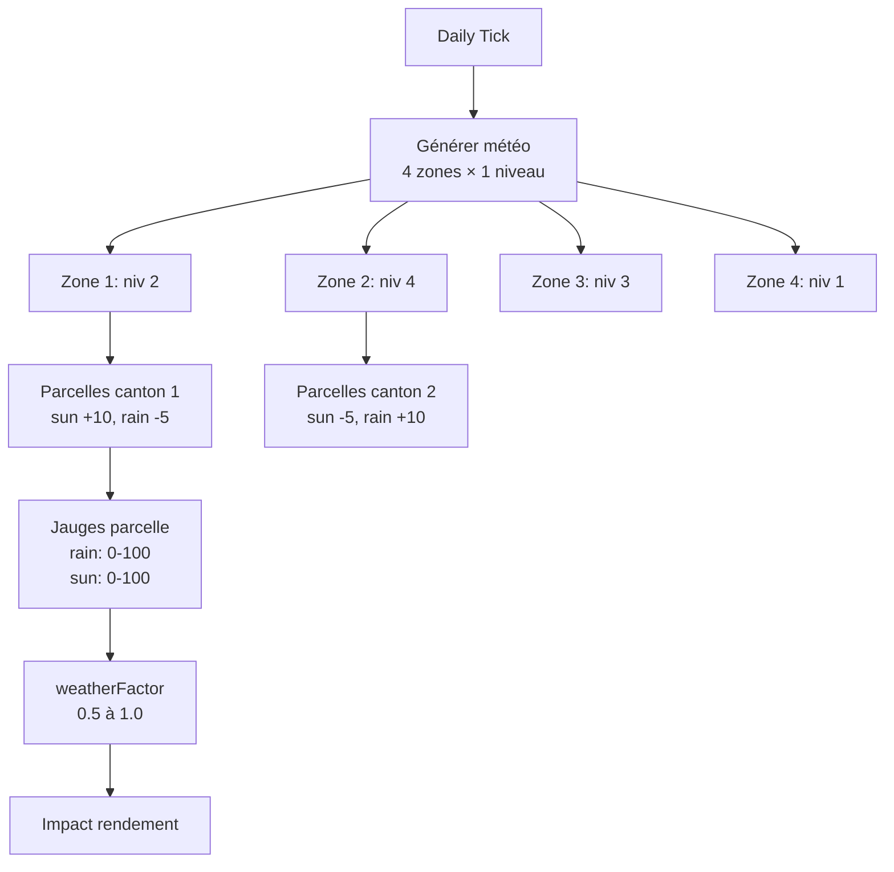
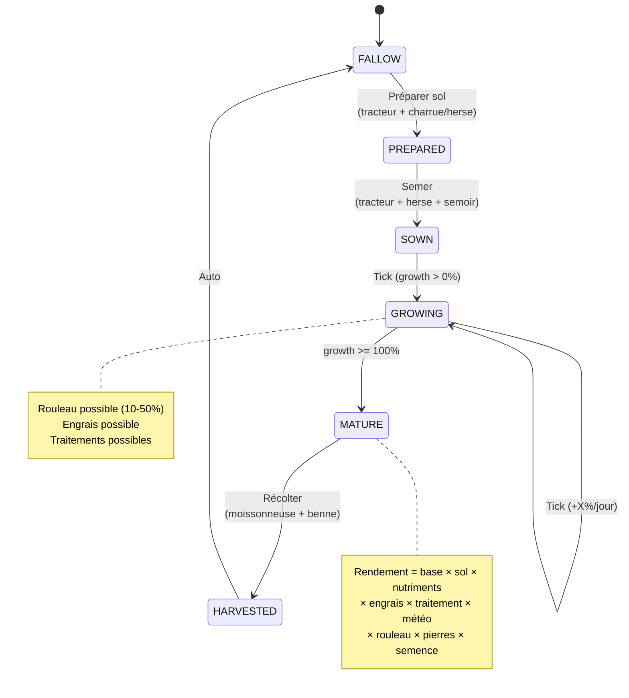
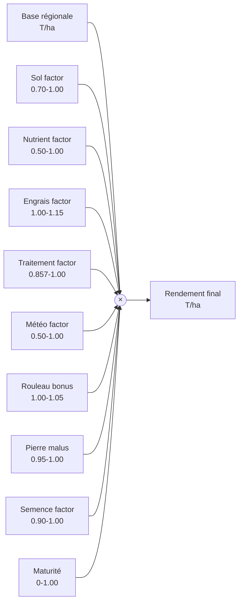
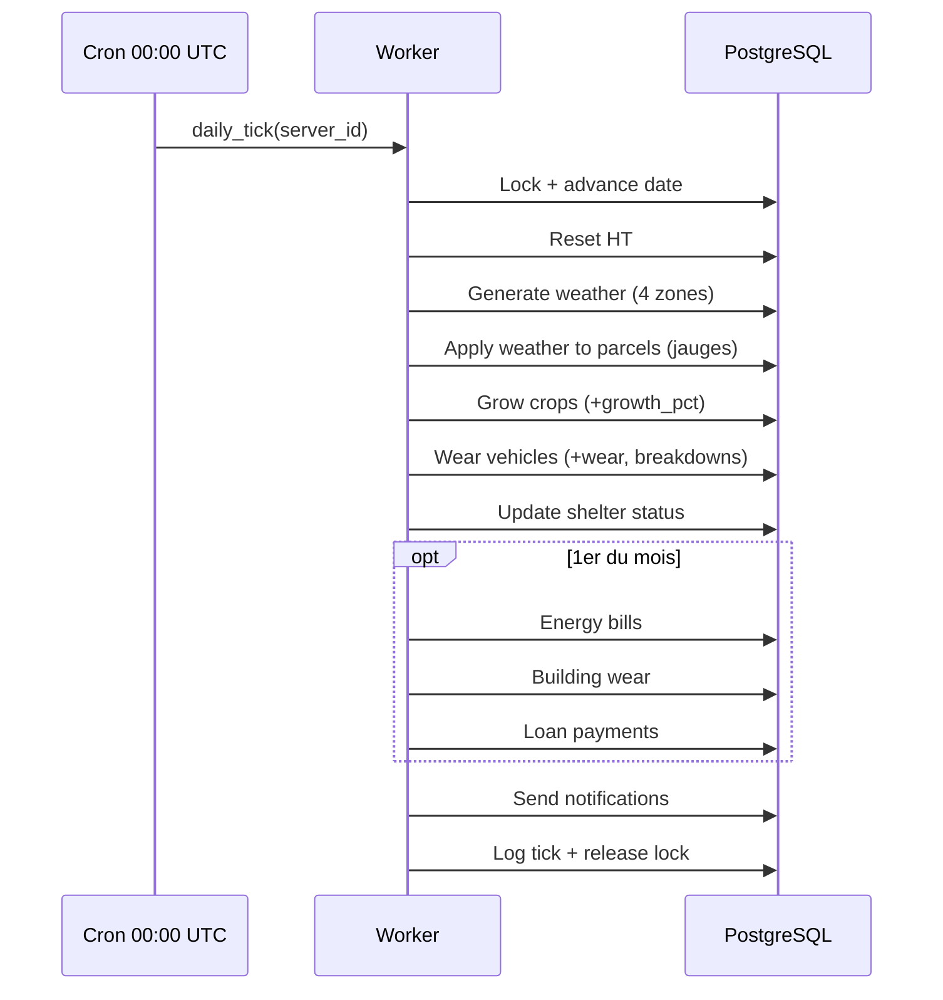
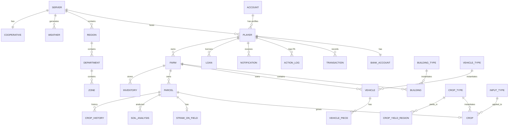

# PHASE 1 — MVP CULTURES — Spécifications Techniques

> **Cultivia Clone — Specs détaillées Phase 1**
> Chaque feature est spécifiée pour être codée sans ambiguïté.
> Référence : 01_DATA_MODEL.md, 02_GAME_SYSTEMS.md, 03_CONTENT_DATA.md, PHASE0_INFRASTRUCTURE.md
> Dépendance : Phase 0 (auth, serveurs, temps, HT, économie, zones, notifications)

---

## Table des matières

1. [Feature 1 — Système de parcelles](#feature-1--système-de-parcelles)
2. [Feature 2 — Gestion du sol](#feature-2--gestion-du-sol)
3. [Feature 3 — Système de bâtiments](#feature-3--système-de-bâtiments)
4. [Feature 4 — Catalogue matériels MVP](#feature-4--catalogue-matériels-mvp)
5. [Feature 5 — Achat/vente matériels](#feature-5--achatvente-matériels)
6. [Feature 6 — Moteur météo](#feature-6--moteur-météo)
7. [Feature 7 — Moteur de culture](#feature-7--moteur-de-culture)
8. [Feature 8 — Engrais & traitements](#feature-8--engrais--traitements)
9. [Feature 9 — Semences](#feature-9--semences)
10. [Feature 10 — Le Marché Central](#feature-10--coopérative-cultivia)
11. [Feature 11 — Système HVC](#feature-11--système-hvc)
12. [Feature 12 — Prêts bancaires](#feature-12--prêts-bancaires)
13. [Feature 13 — Paille & foin](#feature-13--paille--foin)
14. [Feature 14 — Fumier](#feature-14--fumier)
15. [Annexe A — Daily Tick Phase 1](#annexe-a--daily-tick-phase-1)
16. [Annexe B — Constantes Phase 1](#annexe-b--constantes-phase-1)
17. [Annexe C — Diagramme ER Phase 1](#annexe-c--diagramme-er-phase-1)

---

## Feature 1 — Système de parcelles

### 1.1 Description

Les parcelles sont l'unité de production végétale. Un joueur achète des parcelles à la Le Marché Central (PNJ) dans un canton donnée. Chaque parcelle a une surface (en m²), un type (champ, pré), une qualité de sol (1-3), et des réserves nutritives. Les parcelles sont localisées dans un canton, ce qui détermine le canton météo et les rendements régionaux. Le prix d'achat dépend du serveur (`price_per_ha`), de la surface et de la qualité du sol.

**Règles métier :**
- Surface : 10 000 m² (1 ha) à `max_parcel_ha × 10 000` m² (100 ha standard, 200 ha CA/US)
- Types MVP : `field` (champ) et `meadow` (pré)
- Qualité sol : 1 (mauvaise), 2 (moyenne), 3 (bonne) — déterminée aléatoirement à l'achat
- Prix achat = `server.price_per_ha × (area_m2 / 10000) × quality_factor`
  - quality_factor : 1=0.80, 2=1.00, 3=1.20
- Revente à la Coop = 50% du prix d'achat (pas de plus-value entre joueurs en Phase 1)
- Le joueur doit se déplacer dans le canton de la parcelle pour agir dessus (coût HT déplacement)
- Pierres : niveau 0-100, réduit le rendement, broyable avec broyeur de pierres

### 1.2 Schéma BDD

```sql
CREATE TABLE parcel (
  id              SERIAL PRIMARY KEY,
  farm_id         INT NOT NULL REFERENCES farm(id) ON DELETE CASCADE,
  prefecture_id         INT NOT NULL REFERENCES zone(id),
  type            VARCHAR(20) NOT NULL CHECK (type IN ('field','meadow')),
  area_m2         INT NOT NULL CHECK (area_m2 BETWEEN 10000 AND 2000000),
  soil_quality    SMALLINT NOT NULL CHECK (soil_quality BETWEEN 1 AND 3),
  stones_level    SMALLINT NOT NULL DEFAULT 0 CHECK (stones_level BETWEEN 0 AND 100),
  bought_at       TIMESTAMPTZ NOT NULL DEFAULT now(),
  bought_price    DECIMAL(12,2) NOT NULL,
  -- Éléments nutritifs (voir Feature 2)
  n_reserve       DECIMAL(8,2) NOT NULL DEFAULT 50.00,
  p_reserve       DECIMAL(8,2) NOT NULL DEFAULT 50.00,
  k_reserve       DECIMAL(8,2) NOT NULL DEFAULT 50.00,
  ca_reserve      DECIMAL(8,2) NOT NULL DEFAULT 50.00,
  mg_reserve      DECIMAL(8,2) NOT NULL DEFAULT 50.00,
  s_reserve       DECIMAL(8,2) NOT NULL DEFAULT 50.00,
  last_soil_analysis TIMESTAMPTZ,
  -- Jauges météo (voir Feature 6)
  rain_gauge      SMALLINT NOT NULL DEFAULT 50 CHECK (rain_gauge BETWEEN 0 AND 100),
  sun_gauge       SMALLINT NOT NULL DEFAULT 50 CHECK (sun_gauge BETWEEN 0 AND 100),
  -- Fatigue du sol (voir proposition 1.3)
  fatigue_index   SMALLINT NOT NULL DEFAULT 0 CHECK (fatigue_index BETWEEN 0 AND 100)
  -- <!-- PO-VALIDATED: 1.3 -->
);
CREATE INDEX idx_parcel_farm ON parcel(farm_id);
CREATE INDEX idx_parcel_zone ON parcel(prefecture_id);

-- Table farm (rappel Phase 0, ajout si pas déjà créée)
CREATE TABLE IF NOT EXISTS farm (
  id          SERIAL PRIMARY KEY,
  player_id   INT NOT NULL REFERENCES player(id) ON DELETE CASCADE,
  prefecture_id     INT NOT NULL REFERENCES zone(id),
  name        VARCHAR(100) NOT NULL,
  is_primary  BOOLEAN NOT NULL DEFAULT true,
  created_at  TIMESTAMPTZ NOT NULL DEFAULT now()
);
CREATE INDEX idx_farm_player ON farm(player_id);
```

### 1.3 Logique métier

```
// ─── CONSTANTES ───
QUALITY_PRICE_FACTOR = { 1: 0.80, 2: 1.00, 3: 1.20 }
QUALITY_INITIAL_RESERVES = {
  1: { n: 30, p: 30, k: 30, ca: 30, mg: 30, s: 30 },
  2: { n: 50, p: 50, k: 50, ca: 50, mg: 50, s: 50 },
  3: { n: 70, p: 70, k: 70, ca: 70, mg: 70, s: 70 }
}
RESALE_FACTOR = 0.50  // revente = 50% du prix d'achat
SOIL_ANALYSIS_COST = 50.00  // € par analyse
SOIL_ANALYSIS_PA = 0.5

// ─── ACHETER UNE PARCELLE ───
function buyParcel(player_id, prefecture_id, type, area_m2):
    player = getPlayer(player_id)
    server = getServer(player.server_id)
    farm = getPrimaryFarm(player_id)

    ASSERT type IN ('field', 'meadow')                          → 400
    ASSERT area_m2 >= 10000                                     → 400 "Min 1 ha"
    ASSERT area_m2 <= server.max_parcel_ha * 10000              → 400 "Max dépassé"
    ASSERT area_m2 % 10000 == 0                                 → 400 "Multiple de 1 ha"

    // Qualité aléatoire pondérée
    quality = weightedRandom({ 1: 0.25, 2: 0.50, 3: 0.25 })

    // Calcul prix
    ha = area_m2 / 10000
    price = server.price_per_ha * ha * QUALITY_PRICE_FACTOR[quality]

    // Coût HT déplacement vers le canton
    move_cost = calculateMoveCost(farm.prefecture_id, prefecture_id)
    ASSERT canPerformAction(player_id, move_cost + 1.0)         → 403 "PA insuffisants"

    // Débit
    debit(player_id, price, 'parcel_buy',
          'Achat parcelle ' + type + ' ' + ha + ' ha zone ' + prefecture_id,
          'parcel', NULL)

    // Dépense HT (déplacement + action achat)
    IF move_cost > 0:
        spendPA(player_id, move_cost, 'move', { to_prefecture_id: prefecture_id })
    spendPA(player_id, 1.0, 'parcel_buy', { area_m2, prefecture_id })

    // Réserves initiales selon qualité
    reserves = QUALITY_INITIAL_RESERVES[quality]

    // Pierres aléatoires (0-30 pour qualité 3, 0-60 pour qualité 1)
    stones = randomInt(0, (4 - quality) * 20)

    parcel = INSERT INTO parcel (farm_id, prefecture_id, type, area_m2, soil_quality,
                                  stones_level, bought_price,
                                  n_reserve, p_reserve, k_reserve,
                                  ca_reserve, mg_reserve, s_reserve)
             VALUES (farm.id, prefecture_id, type, area_m2, quality,
                     stones, price,
                     reserves.n, reserves.p, reserves.k,
                     reserves.ca, reserves.mg, reserves.s)
             RETURNING *

    RETURN parcel

// ─── VENDRE UNE PARCELLE ───
function sellParcel(player_id, parcel_id):
    parcel = getParcel(parcel_id)
    ASSERT parcel.farm.player_id == player_id                   → 403
    ASSERT NOT EXISTS crop WHERE parcel_id = parcel_id
           AND harvested_at IS NULL                             → 409 "Culture en cours"

    resale_price = parcel.bought_price * RESALE_FACTOR

    credit(player_id, resale_price, 'parcel_sell',
           'Vente parcelle ' + parcel.area_m2/10000 + ' ha',
           'parcel', parcel_id)

    DELETE FROM parcel WHERE id = parcel_id
    RETURN { resale_price }

// ─── LISTER MES PARCELLES ───
function getMyParcels(player_id) -> list:
    farm = getPrimaryFarm(player_id)
    RETURN SELECT p.*, z.canton_number, d.name AS dept_name, r.name AS region_name
           FROM parcel p
           JOIN zone z ON z.id = p.prefecture_id
           JOIN department d ON d.id = z.department_id
           JOIN region r ON r.id = d.region_id
           WHERE p.farm_id = farm.id
           ORDER BY p.bought_at DESC
```

### 1.4 API Endpoints

#### POST `/api/parcels/buy`

```
Headers: Authorization: Bearer <access_token>
Request:
{
  "prefecture_id": 5,
  "type": "field",
  "area_m2": 100000
}

Response 201:
{
  "id": 1,
  "prefecture_id": 5,
  "type": "field",
  "area_m2": 100000,
  "soil_quality": 2,
  "stones_level": 12,
  "bought_price": 40000.00,
  "n_reserve": 50.00, "p_reserve": 50.00, "k_reserve": 50.00,
  "ca_reserve": 50.00, "mg_reserve": 50.00, "s_reserve": 50.00,
  "rain_gauge": 50, "sun_gauge": 50
}

Erreurs:
  400 — Surface invalide, type invalide
  403 — Fonds ou HT insuffisants
```

#### POST `/api/parcels/:id/sell`

```
Response 200:
{ "resale_price": 20000.00 }

Erreurs:
  403 — Pas propriétaire
  409 — Culture en cours sur la parcelle
```

#### GET `/api/parcels`

```
Response 200:
{
  "parcels": [
    {
      "id": 1, "prefecture_id": 5, "type": "field", "area_m2": 100000,
      "soil_quality": 2, "stones_level": 12,
      "n_reserve": 50.00, "p_reserve": 50.00, "k_reserve": 50.00,
      "ca_reserve": 50.00, "mg_reserve": 50.00, "s_reserve": 50.00,
      "rain_gauge": 65, "sun_gauge": 72,
      "canton_number": 5, "dept_name": "Paris", "region_name": "Île-de-France",
      "crop": null
    }
  ]
}
```

#### GET `/api/parcels/:id`

```
Response 200: (détail complet avec crop en cours si existante + available_actions)

Réf: REVIEW_FINALE I2 — Le champ available_actions est calculé côté serveur
pour permettre au frontend de griser les boutons et afficher les tooltips.

{
  "id": 1, "prefecture_id": 5, "type": "field", "area_m2": 100000,
  "soil_quality": 2, "stones_level": 12,
  "n_reserve": 50.00, ...,
  "rain_gauge": 65, "sun_gauge": 72,
  "crop": { ... } | null,
  "available_actions": {
    "prepare": { "possible": true, "pa_cost": 5.0, "hvc_cost": 19.2, "money_cost": 0 },
    "sow": { "possible": false, "reason": "PARCEL_NOT_PREPARED" },
    "harvest": { "possible": false, "reason": "PARCEL_CROP_NOT_MATURE", "growth_pct": 45.2 },
    "fertilize": { "possible": false, "reason": "VEHICLE_MISSING", "details": "Épandeur à engrais requis" },
    "treat": { "possible": true, "pa_cost": 3.5, "available": ["herbicide","insecticide"] },
    "roll": { "possible": false, "reason": "VEHICLE_MISSING", "details": "Rouleau requis" }
  }
}

Erreurs: 404
```

### 1.5 Tests

**Tests unitaires :**
- Achat parcelle 10 ha qualité 2 sur FR1 (4000€/ha) → prix = 40 000€
- Achat parcelle 10 ha qualité 1 → prix = 32 000€ (×0.80)
- Achat parcelle 10 ha qualité 3 → prix = 48 000€ (×1.20)
- Achat parcelle < 1 ha → 400
- Achat parcelle > max_parcel_ha → 400
- Achat parcelle surface non multiple de 10000 → 400
- Achat parcelle fonds insuffisants → 403
- Achat parcelle HT insuffisants → 403
- Vente parcelle → crédit 50% du prix d'achat
- Vente parcelle avec culture en cours → 409
- Vente parcelle d'un autre joueur → 403
- Réserves initiales qualité 1 → toutes à 30
- Réserves initiales qualité 3 → toutes à 70
- Pierres qualité 3 → entre 0 et 20
- Pierres qualité 1 → entre 0 et 60

**Tests d'intégration :**
- Flux complet : achat → vérifier solde débité → lister → vendre → vérifier solde crédité
- Achat dans zone distante → HT déplacement + HT achat déduits
- Vérifier que la parcelle est bien liée à la farm du joueur

---

## Feature 2 — Gestion du sol

### 2.1 Description

<!-- PO-VALIDATED: 4.2 -->

Chaque parcelle possède 6 réserves nutritives : Azote (N), Phosphore (P), Potassium (K), Calcium (Ca), Magnésium (Mg), Soufre (S). Les réserves sont exprimées en kg/ha (0-100). Les cultures consomment des nutriments selon leurs besoins (table `03_CONTENT_DATA §7`). Les engrais et le fumier rechargent les réserves. L'analyse de sol révèle les niveaux exacts (sinon le joueur voit des jauges approximatives : rouge/orange/vert).

**Affichage simplifié (défaut) :** Les 6 nutriments sont regroupés en 3 indicateurs lisibles pour le joueur :
- **Fertilité** = moyenne(N, P, K) — capacité productive du sol
- **Structure** = moyenne(Ca, Mg) — structure physique du sol
- **Oligo-éléments** = S — éléments traces

**Mode expert (toggle) :** Le joueur peut activer un mode expert dans les paramètres pour voir les 6 nutriments détaillés (N, P, K, Ca, Mg, S). Les formules backend restent identiques dans les deux modes — seul l'affichage change.

**Règles métier :**
- Réserves : 0 (épuisé) à 100 (saturé)
- Consommation par culture = `besoin_min + random(0, besoin_max - besoin_min)` kg/T de rendement × rendement réel
- Si une réserve < 20 → facteur rendement pénalisé
- Analyse de sol : 50€, 0.5 HT, révèle les 6 valeurs exactes pendant 1 saison (21 jours)
- Sans analyse : affichage par palier (0-20: rouge, 21-50: orange, 51-100: vert)

### 2.2 Schéma BDD

```sql
-- Les réserves sont dans la table parcel (n_reserve, p_reserve, etc.)
-- Voir Feature 1

-- Historique des analyses de sol
CREATE TABLE soil_analysis (
  id          SERIAL PRIMARY KEY,
  parcel_id   INT NOT NULL REFERENCES parcel(id) ON DELETE CASCADE,
  n_value     DECIMAL(8,2) NOT NULL,
  p_value     DECIMAL(8,2) NOT NULL,
  k_value     DECIMAL(8,2) NOT NULL,
  ca_value    DECIMAL(8,2) NOT NULL,
  mg_value    DECIMAL(8,2) NOT NULL,
  s_value     DECIMAL(8,2) NOT NULL,
  analyzed_at TIMESTAMPTZ NOT NULL DEFAULT now(),
  expires_at  TIMESTAMPTZ NOT NULL  -- analyzed_at + 21 jours
);
CREATE INDEX idx_soil_analysis_parcel ON soil_analysis(parcel_id, analyzed_at DESC);
```

### 2.3 Logique métier

```
// ─── CONSTANTES ───
RESERVE_MIN = 0.00
RESERVE_MAX = 100.00
ANALYSIS_COST = 50.00
ANALYSIS_PA = 0.5
ANALYSIS_DURATION_DAYS = 21  // 1 saison

// Seuils d'affichage sans analyse
GAUGE_RED = 20      // 0-20 : rouge (carence)
GAUGE_ORANGE = 50   // 21-50 : orange (moyen)
                    // 51-100 : vert (bon)

// ─── FACTEUR NUTRITIF POUR LE RENDEMENT ───
// Chaque élément contribue au facteur global
// Si tous les éléments sont >= 50 → facteur = 1.0
// Si un élément est à 0 → sa contribution = 0.5
// Formule par élément : factor_i = 0.5 + 0.5 × min(reserve_i, 50) / 50
// Facteur global = moyenne des 6 facteurs élémentaires

function calculateNutrientFactor(parcel) -> float:
    elements = [parcel.n_reserve, parcel.p_reserve, parcel.k_reserve,
                parcel.ca_reserve, parcel.mg_reserve, parcel.s_reserve]
    total = 0.0
    FOR EACH reserve IN elements:
        capped = min(reserve, 50.0)
        factor_i = 0.5 + 0.5 * (capped / 50.0)
        total += factor_i
    RETURN total / 6.0  // entre 0.5 et 1.0

// ─── CONSOMMER LES NUTRIMENTS (appelé à la récolte) ───
function consumeNutrients(parcel_id, crop_type, yield_tons, area_ha):
    parcel = SELECT * FROM parcel WHERE id = parcel_id FOR UPDATE
    needs = crop_type.nutrient_needs  // ex: { n: [20,30], p: [0.5,1.5], ... }

    // Consommation = random(min, max) × yield_tons (par hectare)
    consumed = {}
    FOR EACH element IN ['n','p','k','ca','mg','s']:
        [need_min, need_max] = needs[element]
        per_ton = need_min + random() * (need_max - need_min)
        consumed[element] = per_ton * yield_tons  // kg/ha consommés

    // Appliquer la consommation
    UPDATE parcel SET
        n_reserve  = GREATEST(0, n_reserve  - consumed.n),
        p_reserve  = GREATEST(0, p_reserve  - consumed.p),
        k_reserve  = GREATEST(0, k_reserve  - consumed.k),
        ca_reserve = GREATEST(0, ca_reserve - consumed.ca),
        mg_reserve = GREATEST(0, mg_reserve - consumed.mg),
        s_reserve  = GREATEST(0, s_reserve  - consumed.s)
    WHERE id = parcel_id

    RETURN consumed

// ─── RECHARGER LES NUTRIMENTS (engrais/fumier) ───
function addNutrients(parcel_id, nutrients):
    // nutrients = { n: X, p: Y, k: Z, ca: A, mg: B, s: C } en kg/ha
    UPDATE parcel SET
        n_reserve  = LEAST(100, n_reserve  + nutrients.n),
        p_reserve  = LEAST(100, p_reserve  + nutrients.p),
        k_reserve  = LEAST(100, k_reserve  + nutrients.k),
        ca_reserve = LEAST(100, ca_reserve + nutrients.ca),
        mg_reserve = LEAST(100, mg_reserve + nutrients.mg),
        s_reserve  = LEAST(100, s_reserve  + nutrients.s)
    WHERE id = parcel_id

// ─── ANALYSE DE SOL ───
function analyzeSoil(player_id, parcel_id):
    parcel = getParcel(parcel_id)
    ASSERT parcel.farm.player_id == player_id                   → 403

    debit(player_id, ANALYSIS_COST, 'soil_analysis',
          'Analyse de sol parcelle #' + parcel_id, 'parcel', parcel_id)
    spendPA(player_id, ANALYSIS_PA, 'soil_analysis', { parcel_id })

    analysis = INSERT INTO soil_analysis
               (parcel_id, n_value, p_value, k_value, ca_value, mg_value, s_value, expires_at)
               VALUES (parcel_id, parcel.n_reserve, parcel.p_reserve, parcel.k_reserve,
                       parcel.ca_reserve, parcel.mg_reserve, parcel.s_reserve,
                       now() + INTERVAL '21 days')

    UPDATE parcel SET last_soil_analysis = now() WHERE id = parcel_id
    RETURN analysis

// ─── AFFICHAGE SOL (avec ou sans analyse) ───
function getSoilDisplay(parcel) -> object:
    has_valid_analysis = parcel.last_soil_analysis IS NOT NULL
                         AND parcel.last_soil_analysis > now() - INTERVAL '21 days'

    IF has_valid_analysis:
        RETURN {
            mode: 'precise',
            n: parcel.n_reserve, p: parcel.p_reserve, k: parcel.k_reserve,
            ca: parcel.ca_reserve, mg: parcel.mg_reserve, s: parcel.s_reserve
        }
    ELSE:
        RETURN {
            mode: 'gauge',
            n: gaugeLevel(parcel.n_reserve),
            p: gaugeLevel(parcel.p_reserve),
            k: gaugeLevel(parcel.k_reserve),
            ca: gaugeLevel(parcel.ca_reserve),
            mg: gaugeLevel(parcel.mg_reserve),
            s: gaugeLevel(parcel.s_reserve)
        }

function gaugeLevel(reserve) -> string:
    IF reserve <= GAUGE_RED: RETURN 'red'
    IF reserve <= GAUGE_ORANGE: RETURN 'orange'
    RETURN 'green'
```

### 2.4 API Endpoints

#### POST `/api/parcels/:id/analyze-soil`

```
Response 200:
{
  "analysis": {
    "n": 45.30, "p": 62.10, "k": 38.50,
    "ca": 55.00, "mg": 48.20, "s": 41.80
  },
  "expires_at": "2026-04-25T20:00:00Z",
  "cost": 50.00
}

Erreurs: 403 (pas propriétaire), 403 (fonds/PA insuffisants)
```

#### GET `/api/parcels/:id/soil`

```
// Avec analyse valide :
Response 200:
{
  "mode": "precise",
  "n": 45.30, "p": 62.10, "k": 38.50,
  "ca": 55.00, "mg": 48.20, "s": 41.80,
  "nutrient_factor": 0.87,
  "analysis_expires_at": "2026-04-25T20:00:00Z"
}

// Sans analyse :
Response 200:
{
  "mode": "gauge",
  "n": "orange", "p": "green", "k": "orange",
  "ca": "green", "mg": "orange", "s": "orange",
  "nutrient_factor": null,
  "simplified": {
    "fertility": "orange",
    "structure": "green",
    "trace_elements": "orange"
  }
}
```

### 2.5 Tests

**Tests unitaires :**
- `calculateNutrientFactor` toutes réserves à 100 → 1.0
- `calculateNutrientFactor` toutes réserves à 50 → 1.0
- `calculateNutrientFactor` toutes réserves à 0 → 0.5
- `calculateNutrientFactor` toutes réserves à 25 → 0.75
- `consumeNutrients` blé 7T/ha → N diminue de 140-210 (20-30 × 7)
- `consumeNutrients` ne descend jamais sous 0
- `addNutrients` ne dépasse jamais 100
- `gaugeLevel(0)` → 'red'
- `gaugeLevel(20)` → 'red'
- `gaugeLevel(21)` → 'orange'
- `gaugeLevel(50)` → 'orange'
- `gaugeLevel(51)` → 'green'
- Analyse de sol → valeurs exactes retournées
- Analyse expirée (>21j) → mode gauge

**Tests d'intégration :**
- Semer → récolter → vérifier que les réserves ont diminué
- Épandre engrais → vérifier que les réserves ont augmenté
- Analyse → GET soil → mode precise → attendre 21j → GET soil → mode gauge

---

## Feature 3 — Système de bâtiments

### 3.1 Description

<!-- PO-VALIDATED: 4.9 -->

Les bâtiments sont les infrastructures de la ferme. En Phase 1 MVP, 4 types : hangar (stockage matériels + produits), silo (stockage récoltes), entrepôt (stockage balles/semences/engrais/traitements), fosse à fumier (stockage fumier). Chaque bâtiment a un niveau (1-5), une taille, un coût de construction, et une consommation énergétique mensuelle. **Les bâtiments de niveau 1 sont construits instantanément (pas de délai). Les améliorations vers les niveaux 2+ ont un délai de construction.** L'entretien mensuel coûte 0.3 HT par bâtiment.

**Règles métier :**
- Niveaux 1-5 : chaque niveau augmente la capacité et réduit la consommation énergétique
- Énergie : facturée mensuellement, coût = `base_kwh × size × level_factor × season_factor`
  - level_factor : niv1=1.0, niv2=0.9, niv3=0.8, niv4=0.7, niv5=0.6
  - season_factor : hiver=1.3, été=1.1, printemps/automne=1.0
- Usure : +0.5%/mois, réparable
- Destruction : récupération 10% du coût total investi
- Amélioration de niveau : coût = `base_cost × size × 0.5` par niveau supplémentaire

### 3.2 Schéma BDD

```sql
CREATE TABLE building_type (
  id                  SERIAL PRIMARY KEY,
  name                VARCHAR(50) NOT NULL UNIQUE,
  slug                VARCHAR(30) NOT NULL UNIQUE,
  category            CHAR(1) NOT NULL DEFAULT 'b' CHECK (category IN ('b','a')),
  unit                VARCHAR(10) NOT NULL DEFAULT 'm2',
  base_cost_per_unit  DECIMAL(10,2) NOT NULL,
  energy_kwh_base     DECIMAL(8,2) NOT NULL DEFAULT 0,
  max_level           SMALLINT NOT NULL DEFAULT 5,
  description         TEXT
);

-- Seed data Phase 1
-- INSERT INTO building_type (name, slug, unit, base_cost_per_unit, energy_kwh_base) VALUES
-- ('Hangar',          'hangar',       'm2',    15.00,  0.02),
-- ('Silo',            'silo',         'tonne', 50.00,  0.05),
-- ('Entrepôt',        'entrepot',     'm2',    20.00,  0.03),
-- ('Fosse à fumier',  'fosse_fumier', 'tonne', 30.00,  0.01);

CREATE TABLE building (
  id                SERIAL PRIMARY KEY,
  farm_id           INT NOT NULL REFERENCES farm(id) ON DELETE CASCADE,
  building_type_id  INT NOT NULL REFERENCES building_type(id),
  size              DECIMAL(10,2) NOT NULL,
  level             SMALLINT NOT NULL DEFAULT 1 CHECK (level BETWEEN 1 AND 5),
  wear_pct          DECIMAL(5,2) NOT NULL DEFAULT 0 CHECK (wear_pct BETWEEN 0 AND 100),
  energy_monthly    DECIMAL(10,2) NOT NULL DEFAULT 0,
  built_at          TIMESTAMPTZ NOT NULL DEFAULT now(),
  last_maintenance  TIMESTAMPTZ
);
CREATE INDEX idx_building_farm ON building(farm_id);
CREATE INDEX idx_building_type ON building(building_type_id);
```

### 3.3 Logique métier

```
// ─── CONSTANTES ───
LEVEL_FACTOR = { 1: 1.0, 2: 0.9, 3: 0.8, 4: 0.7, 5: 0.6 }
SEASON_ENERGY_FACTOR = { 'winter': 1.3, 'spring': 1.0, 'summer': 1.1, 'autumn': 1.0 }
ELEC_PRICE_KWH = 0.08
WEAR_PER_MONTH = 0.5       // % usure par mois
MAINTENANCE_PA = 0.3        // HT par bâtiment par mois
DESTRUCTION_RECOVERY = 0.10 // 10% du coût total
UPGRADE_COST_FACTOR = 0.50  // 50% du coût base par niveau
MAX_FREE_BUILDINGS = 10     // 10 premiers sans délai

// ─── CONSTRUIRE UN BÂTIMENT ───
function buildBuilding(player_id, building_type_slug, size):
    player = getPlayer(player_id)
    farm = getPrimaryFarm(player_id)
    btype = SELECT * FROM building_type WHERE slug = building_type_slug
    ASSERT btype EXISTS                                         → 404

    ASSERT size > 0                                             → 400

    cost = btype.base_cost_per_unit * size
    pa_cost = 2.0  // HT fixe pour construire

    ASSERT canPerformAction(player_id, pa_cost)                 → 403 "PA insuffisants"
    debit(player_id, cost, 'building', 'Construction ' + btype.name + ' ' + size + ' ' + btype.unit,
          'building', NULL)
    spendPA(player_id, pa_cost, 'build', { building_type: btype.slug, size })

    // Calcul énergie mensuelle initiale
    energy = btype.energy_kwh_base * size * LEVEL_FACTOR[1]

    building = INSERT INTO building (farm_id, building_type_id, size, energy_monthly)
               VALUES (farm.id, btype.id, size, energy)
               RETURNING *
    RETURN building

// ─── AMÉLIORER UN BÂTIMENT ───
function upgradeBuilding(player_id, building_id):
    building = getBuilding(building_id)
    ASSERT building.farm.player_id == player_id                 → 403
    ASSERT building.level < 5                                   → 409 "Niveau max atteint"

    btype = getType(building.building_type_id)
    upgrade_cost = btype.base_cost_per_unit * building.size * UPGRADE_COST_FACTOR

    debit(player_id, upgrade_cost, 'building_upgrade',
          'Amélioration ' + btype.name + ' niveau ' + (building.level + 1),
          'building', building_id)
    spendPA(player_id, 1.0, 'upgrade_building', { building_id })

    new_level = building.level + 1
    new_energy = btype.energy_kwh_base * building.size * LEVEL_FACTOR[new_level]

    UPDATE building SET level = new_level, energy_monthly = new_energy
           WHERE id = building_id
    RETURN { new_level, new_energy, upgrade_cost }

// ─── DÉTRUIRE UN BÂTIMENT ───
function destroyBuilding(player_id, building_id):
    building = getBuilding(building_id)
    ASSERT building.farm.player_id == player_id                 → 403

    // Vérifier que le bâtiment est vide (pas de stock dedans)
    stock = SELECT SUM(quantity) FROM inventory WHERE building_id = building_id
    ASSERT stock == 0 OR stock IS NULL                          → 409 "Bâtiment non vide"

    btype = getType(building.building_type_id)
    total_invested = btype.base_cost_per_unit * building.size
                     + btype.base_cost_per_unit * building.size * UPGRADE_COST_FACTOR * (building.level - 1)
    recovery = total_invested * DESTRUCTION_RECOVERY

    credit(player_id, recovery, 'building_destroy',
           'Destruction ' + btype.name, 'building', building_id)
    spendPA(player_id, 1.0, 'destroy_building', { building_id })

    DELETE FROM building WHERE id = building_id
    RETURN { recovery }

// ─── ENTRETIEN MENSUEL (appelé par le tick au 1er du mois) ───
function processMonthlyBuildingMaintenance(server_id):
    buildings = SELECT b.*, f.player_id
                FROM building b
                JOIN farm f ON f.id = b.farm_id
                JOIN player p ON p.id = f.player_id
                WHERE p.server_id = server_id

    FOR EACH building IN buildings:
        // Usure mensuelle
        UPDATE building SET wear_pct = LEAST(100, wear_pct + WEAR_PER_MONTH)
               WHERE id = building.id

// ─── FACTURE ÉNERGIE MENSUELLE (appelé par le tick au 1er du mois) ───
function processMonthlyEnergy(server_id, current_season):
    season_factor = SEASON_ENERGY_FACTOR[current_season]

    players_buildings = SELECT f.player_id,
                               SUM(b.energy_monthly * season_factor) AS total_kwh
                        FROM building b
                        JOIN farm f ON f.id = b.farm_id
                        JOIN player p ON p.id = f.player_id
                        WHERE p.server_id = server_id
                        GROUP BY f.player_id

    FOR EACH pb IN players_buildings:
        cost = pb.total_kwh * ELEC_PRICE_KWH
        IF cost > 0:
            debit(pb.player_id, cost, 'energy',
                  'Facture électricité mensuelle (' + pb.total_kwh + ' kWh)',
                  NULL, NULL)

// ─── ENTRETIEN MANUEL (HT) ───
function maintainBuilding(player_id, building_id):
    building = getBuilding(building_id)
    ASSERT building.farm.player_id == player_id                 → 403

    spendPA(player_id, MAINTENANCE_PA, 'maintain_building', { building_id })

    // Réduit l'usure de 5%
    UPDATE building SET wear_pct = GREATEST(0, wear_pct - 5.0),
                        last_maintenance = now()
           WHERE id = building_id
    RETURN { new_wear_pct: GREATEST(0, building.wear_pct - 5.0) }
```

### 3.4 API Endpoints

#### POST `/api/buildings`

```
Request: { "type": "hangar", "size": 500 }
Response 201: { "id": 1, "type": "hangar", "size": 500, "level": 1, "cost": 7500.00, "energy_monthly": 10.00 }
Erreurs: 400, 403 (fonds/PA), 404 (type inconnu)
```

#### POST `/api/buildings/:id/upgrade`

```
Response 200: { "new_level": 2, "upgrade_cost": 3750.00, "new_energy_monthly": 9.00 }
Erreurs: 403, 409 (niveau max)
```

#### POST `/api/buildings/:id/destroy`

```
Response 200: { "recovery": 750.00 }
Erreurs: 403, 409 (non vide)
```

#### POST `/api/buildings/:id/maintain`

```
Response 200: { "new_wear_pct": 2.5, "pa_spent": 0.3 }
Erreurs: 403
```

#### GET `/api/buildings`

```
Response 200: { "buildings": [ { "id": 1, "type": "hangar", "size": 500, "level": 1, "wear_pct": 0.5, ... } ] }
```

### 3.5 Tests

**Tests unitaires :**
- Construction hangar 500 m² → coût = 500 × 15 = 7 500€
- Construction silo 100 T → coût = 100 × 50 = 5 000€
- Upgrade niveau 1→2 hangar 500 m² → coût = 500 × 15 × 0.5 = 3 750€
- Upgrade niveau 5 → 409
- Destruction hangar niv1 500 m² → récupération = 7500 × 0.10 = 750€
- Destruction hangar niv3 → récupération inclut coût upgrades
- Destruction bâtiment non vide → 409
- Énergie mensuelle hangar 500 m² niv1 hiver → 500 × 0.02 × 1.0 × 1.3 = 13 kWh → 1.04€
- Énergie mensuelle hangar 500 m² niv5 été → 500 × 0.02 × 0.6 × 1.1 = 6.6 kWh → 0.53€
- Usure mensuelle → +0.5%
- Entretien → -5% usure, min 0

**Tests d'intégration :**
- Construire 10 bâtiments → pas de délai
- Tick mensuel → usure augmente, facture énergie débitée
- Construire → upgrader → détruire → vérifier solde cohérent

---

## Feature 4 — Catalogue matériels MVP

### 4.1 Description

Le catalogue matériels définit les 8 types de matériels disponibles en Phase 1 : tracteur, charrue, herse rotative, semoir, moissonneuse-batteuse, benne, épandeur à engrais, pulvérisateur. Chaque matériel a un prix neuf, une puissance (CV), une consommation HVC, une largeur de travail, un nombre de pièces détachées, et un taux d'usure.

**Matériels MVP :**

| Matériel | Famille | Motorisé | Prix neuf | CV | Pièces | Largeur (m) |
|----------|---------|----------|-----------|-----|--------|-------------|
| Tracteur 80 CV | motor | Oui | 35 000€ | 80 | 4 | — |
| Tracteur 120 CV | motor | Oui | 55 000€ | 120 | 4 | — |
| Tracteur 180 CV | motor | Oui | 85 000€ | 180 | 5 | — |
| Charrue 4 corps | soil | Non | 8 000€ | — | 3 | 1.4 |
| Charrue 6 corps | soil | Non | 14 000€ | — | 3 | 2.1 |
| Herse rotative 3m | soil | Non | 12 000€ | — | 3 | 3.0 |
| Herse rotative 6m | soil | Non | 22 000€ | — | 3 | 6.0 |
| Semoir 3m | sowing | Non | 15 000€ | — | 3 | 3.0 |
| Semoir 6m | sowing | Non | 28 000€ | — | 3 | 6.0 |
| Moissonneuse 300 CV | cutting | Oui | 180 000€ | 300 | 5 | 6.0 |
| Moissonneuse 450 CV | cutting | Oui | 280 000€ | 450 | 5 | 9.0 |
| Benne 12T | transport | Non | 12 000€ | — | 2 | — |
| Benne 18T | transport | Non | 18 000€ | — | 2 | — |
| Épandeur engrais 1500L | treatment | Non | 6 000€ | — | 2 | 18.0 |
| Pulvérisateur 2500L | treatment | Non | 18 000€ | — | 3 | 24.0 |
| Épandeur fumier 10T | treatment | Non | 15 000€ | — | 3 | 8.0 |

### 4.2 Schéma BDD

```sql
CREATE TABLE vehicle_type (
  id              SERIAL PRIMARY KEY,
  name            VARCHAR(80) NOT NULL,
  slug            VARCHAR(50) NOT NULL UNIQUE,
  family          VARCHAR(20) NOT NULL,
  brand           VARCHAR(50),
  model           VARCHAR(80),
  power_cv        SMALLINT,
  is_motorized    BOOLEAN NOT NULL DEFAULT false,
  base_price      DECIMAL(12,2) NOT NULL,
  hvc_travel      DECIMAL(6,3) DEFAULT 0.05,   -- L/CV/HT trajet
  hvc_work        DECIMAL(6,3),                 -- L/CV/HT travail
  work_width_m    DECIMAL(4,1),                 -- largeur de travail
  maneuverability SMALLINT DEFAULT 3 CHECK (maneuverability BETWEEN 1 AND 5),
  min_tractor_cv  SMALLINT,                     -- puissance min tracteur requis (outils tractés)
  piece_count     SMALLINT NOT NULL DEFAULT 3 CHECK (piece_count BETWEEN 1 AND 5),
  pa_maintenance  DECIMAL(4,2) NOT NULL DEFAULT 1.0,
  pa_repair       DECIMAL(4,2) NOT NULL DEFAULT 2.0,
  wear_base_day   DECIMAL(5,3) NOT NULL DEFAULT 0.10  -- usure base/jour (%)
);

CREATE TABLE vehicle (
  id              SERIAL PRIMARY KEY,
  farm_id         INT NOT NULL REFERENCES farm(id) ON DELETE CASCADE,
  vehicle_type_id INT NOT NULL REFERENCES vehicle_type(id),
  wear_pct        DECIMAL(5,2) NOT NULL DEFAULT 0 CHECK (wear_pct BETWEEN 0 AND 100),
  is_broken       BOOLEAN NOT NULL DEFAULT false,
  is_sheltered    BOOLEAN NOT NULL DEFAULT false,
  bought_at       TIMESTAMPTZ NOT NULL DEFAULT now(),
  bought_price    DECIMAL(12,2) NOT NULL
);
CREATE INDEX idx_vehicle_farm ON vehicle(farm_id);

CREATE TABLE vehicle_piece (
  id          SERIAL PRIMARY KEY,
  vehicle_id  INT NOT NULL REFERENCES vehicle(id) ON DELETE CASCADE,
  piece_num   SMALLINT NOT NULL,
  wear_pct    DECIMAL(5,2) NOT NULL DEFAULT 0 CHECK (wear_pct BETWEEN 0 AND 100),
  replaced_at TIMESTAMPTZ,
  UNIQUE(vehicle_id, piece_num)
);
```

### 4.3 Logique métier

```
// ─── USURE QUOTIDIENNE (appelé par le daily tick) ───
// Formule : usure_jour = wear_base_day + (is_sheltered ? 0.10 : 0.30)
// Si abrité sous hangar : +0.10%/jour
// Si non abrité : +0.30%/jour
// wear_base_day est le taux de base du type de matériel

function dailyVehicleWear(server_id):
    vehicles = SELECT v.*, vt.wear_base_day
               FROM vehicle v
               JOIN vehicle_type vt ON vt.id = v.vehicle_type_id
               JOIN farm f ON f.id = v.farm_id
               JOIN player p ON p.id = f.player_id
               WHERE p.server_id = server_id

    FOR EACH v IN vehicles:
        shelter_wear = 0.10 IF v.is_sheltered ELSE 0.30
        daily_wear = v.wear_base_day + shelter_wear
        new_wear = LEAST(100, v.wear_pct + daily_wear)

        UPDATE vehicle SET wear_pct = new_wear WHERE id = v.id

        // Panne aléatoire si usure > 70%
        IF new_wear > 70:
            breakdown_chance = (new_wear - 70) / 100.0  // 0-30% de chance
            IF random() < breakdown_chance:
                UPDATE vehicle SET is_broken = true WHERE id = v.id

// ─── VÉRIFIER ABRI ───
function updateShelterStatus(farm_id):
    // Un matériel est abrité s'il y a assez de place dans les hangars
    hangars = SELECT SUM(size) AS total_m2 FROM building b
              JOIN building_type bt ON bt.id = b.building_type_id
              WHERE b.farm_id = farm_id AND bt.slug = 'hangar'

    vehicles = SELECT v.id, vt.name FROM vehicle v
               JOIN vehicle_type vt ON vt.id = v.vehicle_type_id
               WHERE v.farm_id = farm_id
               ORDER BY vt.base_price DESC  // les plus chers en premier

    used_m2 = 0
    FOR EACH v IN vehicles:
        space_needed = 20  // m² par matériel (simplifié)
        IF used_m2 + space_needed <= hangars.total_m2:
            UPDATE vehicle SET is_sheltered = true WHERE id = v.id
            used_m2 += space_needed
        ELSE:
            UPDATE vehicle SET is_sheltered = false WHERE id = v.id

// ─── ARGUS (valeur occasion) ───
// Prix occasion = prix_neuf × (1 - usure/100) × 0.85
function calculateArgus(vehicle) -> float:
    vtype = getVehicleType(vehicle.vehicle_type_id)
    RETURN vtype.base_price * (1.0 - vehicle.wear_pct / 100.0) * 0.85
```

### 4.4 API Endpoints

#### GET `/api/vehicle-types`

```
Response 200:
{
  "types": [
    {
      "id": 1, "name": "Tracteur 80 CV", "slug": "tracteur_80",
      "family": "motor", "power_cv": 80, "is_motorized": true,
      "base_price": 35000.00, "work_width_m": null, "piece_count": 4
    }, ...
  ]
}
```

#### GET `/api/vehicles`

```
Response 200:
{
  "vehicles": [
    {
      "id": 1, "type": "Tracteur 80 CV", "family": "motor",
      "wear_pct": 5.20, "is_broken": false, "is_sheltered": true,
      "bought_price": 35000.00, "argus": 28322.50,
      "pieces": [ { "piece_num": 1, "wear_pct": 3.0 }, ... ]
    }
  ]
}
```

### 4.5 Tests

**Tests unitaires :**
- Usure quotidienne abrité : 0.10 + 0.10 = 0.20%/jour
- Usure quotidienne non abrité : 0.10 + 0.30 = 0.40%/jour
- Usure ne dépasse pas 100%
- Panne à 70% usure → chance = 0%
- Panne à 85% usure → chance = 15%
- Panne à 100% usure → chance = 30%
- Argus tracteur neuf (0% usure) → 35000 × 1.0 × 0.85 = 29 750€
- Argus tracteur 50% usure → 35000 × 0.5 × 0.85 = 14 875€
- Shelter : 2 matériels, hangar 30 m² → 1 abrité, 1 non

**Tests d'intégration :**
- Tick quotidien → usure augmente sur tous les matériels
- Construire hangar → matériels passent en abrité → usure réduite

---

## Feature 5 — Achat/vente matériels

### 5.1 Description

Les joueurs achètent du matériel neuf à la Le Marché Central (PNJ) ou d'occasion à d'autres joueurs. Le prix neuf est fixe (catalogue). Le prix occasion est basé sur l'argus (prix neuf × état × 0.85). L'usure quotidienne dégrade la valeur. La vente à la Coop se fait à 60% de l'argus. La vente entre joueurs se fait via annonces (Phase 3) ; en Phase 1, seule la vente à la Coop est disponible.

**Règles métier :**
- Achat neuf : prix catalogue, 0% usure, pièces neuves
- Vente Coop : 60% de l'argus actuel
- Argus = `base_price × (1 - wear_pct/100) × 0.85`
- Matériel cassé : non vendable, doit être réparé d'abord
- Réparation : coût = `base_price × 0.05`, HT = `pa_repair` du type
- Entretien mensuel : `pa_maintenance` HT par matériel

### 5.2 Schéma BDD

```sql
-- Utilise les tables vehicle et vehicle_type de Feature 4
-- Pas de table supplémentaire en Phase 1
```

### 5.3 Logique métier

```
// ─── ACHETER NEUF ───
function buyVehicle(player_id, vehicle_type_id):
    vtype = SELECT * FROM vehicle_type WHERE id = vehicle_type_id
    ASSERT vtype EXISTS                                         → 404
    player = getPlayer(player_id)
    farm = getPrimaryFarm(player_id)

    debit(player_id, vtype.base_price, 'vehicle_buy',
          'Achat neuf ' + vtype.name, 'vehicle', NULL)
    spendPA(player_id, 1.0, 'vehicle_buy', { vehicle_type_id })

    vehicle = INSERT INTO vehicle (farm_id, vehicle_type_id, bought_price)
              VALUES (farm.id, vehicle_type_id, vtype.base_price)
              RETURNING *

    // Créer les pièces détachées
    FOR i IN 1..vtype.piece_count:
        INSERT INTO vehicle_piece (vehicle_id, piece_num) VALUES (vehicle.id, i)

    // Mettre à jour le statut d'abri
    updateShelterStatus(farm.id)

    RETURN vehicle

// ─── VENDRE À LA COOP ───
function sellVehicleToCoop(player_id, vehicle_id):
    vehicle = getVehicle(vehicle_id)
    ASSERT vehicle.farm.player_id == player_id                  → 403
    ASSERT vehicle.is_broken == false                           → 409 "Matériel en panne"

    argus = calculateArgus(vehicle)
    sell_price = argus * 0.60

    credit(player_id, sell_price, 'vehicle_sell',
           'Vente Coop ' + vehicle.type.name, 'vehicle', vehicle_id)
    spendPA(player_id, 0.5, 'vehicle_sell', { vehicle_id })

    DELETE FROM vehicle_piece WHERE vehicle_id = vehicle_id
    DELETE FROM vehicle WHERE id = vehicle_id

    updateShelterStatus(vehicle.farm_id)
    RETURN { sell_price, argus }

// ─── RÉPARER ───
function repairVehicle(player_id, vehicle_id):
    vehicle = getVehicle(vehicle_id)
    ASSERT vehicle.farm.player_id == player_id                  → 403
    ASSERT vehicle.is_broken == true                            → 409 "Pas en panne"

    vtype = getVehicleType(vehicle.vehicle_type_id)
    repair_cost = vtype.base_price * 0.05

    debit(player_id, repair_cost, 'vehicle_repair',
          'Réparation ' + vtype.name, 'vehicle', vehicle_id)
    spendPA(player_id, vtype.pa_repair, 'vehicle_repair', { vehicle_id })

    // Réparation : remet en service, réduit usure de 10%
    UPDATE vehicle SET is_broken = false,
                       wear_pct = GREATEST(0, wear_pct - 10.0)
           WHERE id = vehicle_id
    RETURN { repair_cost, new_wear_pct: GREATEST(0, vehicle.wear_pct - 10.0) }

// ─── ENTRETIEN MENSUEL ───
function maintainVehicle(player_id, vehicle_id):
    vehicle = getVehicle(vehicle_id)
    ASSERT vehicle.farm.player_id == player_id                  → 403

    vtype = getVehicleType(vehicle.vehicle_type_id)
    spendPA(player_id, vtype.pa_maintenance, 'vehicle_maintain', { vehicle_id })

    // Réduit l'usure de 3%
    UPDATE vehicle SET wear_pct = GREATEST(0, wear_pct - 3.0)
           WHERE id = vehicle_id
    RETURN { new_wear_pct: GREATEST(0, vehicle.wear_pct - 3.0) }

// ─── REMPLACER UNE PIÈCE ───
function replacePiece(player_id, vehicle_id, piece_num):
    vehicle = getVehicle(vehicle_id)
    ASSERT vehicle.farm.player_id == player_id                  → 403

    piece = SELECT * FROM vehicle_piece
            WHERE vehicle_id = vehicle_id AND piece_num = piece_num
    ASSERT piece EXISTS                                         → 404

    vtype = getVehicleType(vehicle.vehicle_type_id)
    piece_cost = vtype.base_price * 0.02  // 2% du prix neuf par pièce

    debit(player_id, piece_cost, 'vehicle_piece',
          'Pièce #' + piece_num + ' ' + vtype.name, 'vehicle', vehicle_id)
    spendPA(player_id, 0.5, 'replace_piece', { vehicle_id, piece_num })

    UPDATE vehicle_piece SET wear_pct = 0, replaced_at = now()
           WHERE vehicle_id = vehicle_id AND piece_num = piece_num
    RETURN { piece_cost }
```

### 5.4 API Endpoints

#### POST `/api/vehicles/buy`

```
Request: { "vehicle_type_id": 1 }
Response 201: { "id": 1, "type": "Tracteur 80 CV", "wear_pct": 0, "bought_price": 35000.00, "pieces": [...] }
Erreurs: 403 (fonds/PA), 404 (type inconnu)
```

#### POST `/api/vehicles/:id/sell`

```
Response 200: { "sell_price": 15127.50, "argus": 25212.50 }
Erreurs: 403, 409 (en panne)
```

#### POST `/api/vehicles/:id/repair`

```
Response 200: { "repair_cost": 1750.00, "new_wear_pct": 55.0 }
Erreurs: 403, 409 (pas en panne)
```

#### POST `/api/vehicles/:id/maintain`

```
Response 200: { "new_wear_pct": 12.0, "pa_spent": 1.0 }
```

#### POST `/api/vehicles/:id/pieces/:num/replace`

```
Response 200: { "piece_cost": 700.00 }
Erreurs: 403, 404 (pièce inexistante)
```

### 5.5 Tests

**Tests unitaires :**
- Achat neuf tracteur 80 CV → solde -35000, vehicle créé, 4 pièces créées
- Vente Coop tracteur neuf → argus = 35000 × 1.0 × 0.85 = 29750 → vente = 29750 × 0.60 = 17850€
- Vente Coop tracteur 50% usure → argus = 14875 → vente = 8925€
- Vente matériel cassé → 409
- Réparation → coût = 5% prix neuf, usure -10%, is_broken = false
- Réparation matériel pas cassé → 409
- Entretien → usure -3%
- Remplacement pièce → coût = 2% prix neuf, pièce wear = 0

**Tests d'intégration :**
- Achat → usure quotidienne → vente → vérifier prix cohérent avec usure
- Achat → panne → réparation → vente → OK

---

## Feature 6 — Moteur météo

### 6.1 Description

La météo est générée quotidiennement par le tick pour chaque canton météo (1-4). Elle influence les jauges eau et soleil de chaque parcelle, qui impactent le rendement des cultures. 5 niveaux de météo : 1 (très ensoleillé) à 5 (forte pluie). Le vent et la grêle sont des événements rares supplémentaires.

**Règles métier :**
- 4 zones météo par serveur (attribuées aux régions)
- Chaque jour, un niveau météo (1-5) est tiré aléatoirement avec pondération saisonnière
- Impact sur les jauges parcelle :
  - Niveau 1 (très ensoleillé) : soleil +15, pluie -10
  - Niveau 2 (ensoleillé) : soleil +10, pluie -5
  - Niveau 3 (couvert) : soleil +0, pluie +0
  - Niveau 4 (pluie) : soleil -5, pluie +10
  - Niveau 5 (forte pluie) : soleil -10, pluie +15
- Grêle : 2% de chance en été, détruit 10-30% de la récolte en cours
- Vent : 5% de chance, pas d'impact direct en Phase 1

### 6.2 Schéma BDD

```sql
CREATE TABLE weather (
  id            SERIAL PRIMARY KEY,
  server_id     INT NOT NULL REFERENCES server(id),
  weather_zone  SMALLINT NOT NULL CHECK (weather_zone BETWEEN 1 AND 4),
  game_day      INT NOT NULL,
  game_year     INT NOT NULL,
  level         SMALLINT NOT NULL CHECK (level BETWEEN 1 AND 5),
  wind          BOOLEAN NOT NULL DEFAULT false,
  hail          BOOLEAN NOT NULL DEFAULT false,
  UNIQUE(server_id, weather_zone, game_day, game_year)
);
CREATE INDEX idx_weather_lookup ON weather(server_id, weather_zone, game_year, game_day);
```

### 6.3 Logique métier

```
// ─── CONSTANTES ───
// Pondération météo par saison (probabilité de chaque niveau 1-5)
WEATHER_WEIGHTS = {
  'winter':  [0.05, 0.15, 0.25, 0.35, 0.20],  // pluie fréquente
  'spring':  [0.15, 0.30, 0.25, 0.20, 0.10],  // équilibré
  'summer':  [0.30, 0.35, 0.20, 0.10, 0.05],  // soleil dominant
  'autumn':  [0.10, 0.15, 0.25, 0.30, 0.20]   // pluie fréquente
}

// Impact sur les jauges
WEATHER_IMPACT = {
  1: { sun: +15, rain: -10 },  // très ensoleillé
  2: { sun: +10, rain:  -5 },  // ensoleillé
  3: { sun:   0, rain:   0 },  // couvert
  4: { sun:  -5, rain: +10 },  // pluie
  5: { sun: -10, rain: +15 }   // forte pluie
}

HAIL_CHANCE_SUMMER = 0.02   // 2% en été
HAIL_CHANCE_OTHER = 0.005   // 0.5% autres saisons
HAIL_DAMAGE_MIN = 0.10      // 10% de dégâts
HAIL_DAMAGE_MAX = 0.30      // 30% de dégâts
WIND_CHANCE = 0.05           // 5%

// ─── GÉNÉRER LA MÉTÉO DU JOUR (appelé par le tick) ───
function generateDailyWeather(server_id, game_day, game_year, season):
    FOR zone IN 1..4:
        // Tirer le niveau météo
        weights = WEATHER_WEIGHTS[season]
        level = weightedRandom(weights)  // retourne 1-5

        // Grêle
        hail_chance = HAIL_CHANCE_SUMMER IF season == 'summer' ELSE HAIL_CHANCE_OTHER
        hail = random() < hail_chance

        // Vent
        wind = random() < WIND_CHANCE

        INSERT INTO weather (server_id, weather_zone, game_day, game_year, level, wind, hail)
        VALUES (server_id, zone, game_day, game_year, level, wind, hail)

    // Appliquer l'impact sur les parcelles
    applyWeatherToParcel(server_id, game_day, game_year)

// ─── APPLIQUER LA MÉTÉO AUX PARCELLES ───
function applyWeatherToParcel(server_id, game_day, game_year):
    // Pour chaque parcelle du serveur, mettre à jour les jauges
    parcels_with_weather = SELECT p.id, w.level, w.hail
        FROM parcel p
        JOIN farm f ON f.id = p.farm_id
        JOIN player pl ON pl.id = f.player_id
        JOIN zone z ON z.id = p.prefecture_id
        JOIN department d ON d.id = z.department_id
        JOIN region r ON r.id = d.region_id
        JOIN weather w ON w.server_id = pl.server_id
                       AND w.weather_zone = r.weather_zone
                       AND w.game_day = game_day
                       AND w.game_year = game_year
        WHERE pl.server_id = server_id

    FOR EACH pw IN parcels_with_weather:
        impact = WEATHER_IMPACT[pw.level]

        UPDATE parcel SET
            rain_gauge = LEAST(100, GREATEST(0, rain_gauge + impact.rain)),
            sun_gauge  = LEAST(100, GREATEST(0, sun_gauge + impact.sun))
        WHERE id = pw.id

        // Dégâts grêle sur culture en cours
        IF pw.hail:
            crop = SELECT * FROM crop WHERE parcel_id = pw.id AND harvested_at IS NULL
            IF crop EXISTS AND crop.growth_pct > 0:
                damage = HAIL_DAMAGE_MIN + random() * (HAIL_DAMAGE_MAX - HAIL_DAMAGE_MIN)
                new_growth = GREATEST(0, crop.growth_pct * (1.0 - damage))
                UPDATE crop SET growth_pct = new_growth WHERE id = crop.id

// ─── FACTEURS MÉTÉO POUR LE RENDEMENT ───
// Convertit les jauges (0-100) en facteur (0.5-1.0)
function weatherGaugeFactor(gauge_value) -> float:
    IF gauge_value >= 40 AND gauge_value <= 70:
        RETURN 1.0  // zone optimale
    ELIF gauge_value < 40:
        RETURN 0.5 + 0.5 * (gauge_value / 40.0)  // 0.5 à 1.0
    ELSE:  // > 70
        RETURN 0.5 + 0.5 * ((100 - gauge_value) / 30.0)  // 1.0 à 0.5

function calculateWeatherFactor(parcel) -> float:
    rain_factor = weatherGaugeFactor(parcel.rain_gauge)
    sun_factor = weatherGaugeFactor(parcel.sun_gauge)
    RETURN (rain_factor + sun_factor) / 2.0
```

### 6.4 API Endpoints

#### GET `/api/weather`

```
Headers: Authorization: Bearer <access_token>

Response 200:
{
  "today": {
    "game_day": 25, "game_year": 1, "season": "spring",
    "zones": [
      { "zone": 1, "level": 2, "label": "Ensoleillé", "wind": false, "hail": false },
      { "zone": 2, "level": 4, "label": "Pluie", "wind": true, "hail": false },
      { "zone": 3, "level": 3, "label": "Couvert", "wind": false, "hail": false },
      { "zone": 4, "level": 1, "label": "Très ensoleillé", "wind": false, "hail": false }
    ]
  }
}
```

#### GET `/api/weather/history`

```
Query: ?weather_zone=2&days=7
Response 200:
{
  "history": [
    { "game_day": 25, "level": 4, "wind": true, "hail": false },
    { "game_day": 24, "level": 2, "wind": false, "hail": false },
    ...
  ]
}
```

### 6.5 Tests

**Tests unitaires :**
- Génération météo été → niveau 1-2 plus fréquent que 4-5
- Génération météo hiver → niveau 4-5 plus fréquent que 1-2
- Impact niveau 1 → sun +15, rain -10
- Impact niveau 5 → sun -10, rain +15
- Jauges bornées 0-100 (pas de dépassement)
- `weatherGaugeFactor(50)` → 1.0
- `weatherGaugeFactor(0)` → 0.5
- `weatherGaugeFactor(100)` → 0.5
- `weatherGaugeFactor(40)` → 1.0
- `weatherGaugeFactor(70)` → 1.0
- `weatherGaugeFactor(20)` → 0.75
- Grêle en été → 2% de chance
- Grêle → culture perd 10-30% de croissance

**Tests d'intégration :**
- Tick → météo générée pour les 4 zones
- Tick → jauges parcelles mises à jour
- Tick avec grêle → culture impactée
- 7 ticks consécutifs → historique météo consultable

### 6.6 Diagramme



---

## Feature 7 — Moteur de culture

### 7.1 Description

Le moteur de culture est le cœur du gameplay Phase 1. Il gère le cycle de vie complet d'une culture : jachère → préparation sol → semis → pousse → maturation → récolte. La croissance est quotidienne (tick). Le rendement final dépend de multiples facteurs : base régionale, sol, nutriments, engrais, traitements, météo, rouleau.

**State machine :**
```
FALLOW → PREPARED (labour/hersage)
PREPARED → SOWN (semis dans la fenêtre)
SOWN → GROWING (automatique, tick)
GROWING → MATURE (growth_pct >= 100%)
MATURE → HARVESTED (action joueur)
HARVESTED → FALLOW (automatique)
```

**8 cultures MVP :** blé, orge, maïs grain, maïs ensilé, colza, tournesol, pois, betterave.

### 7.2 Schéma BDD

```sql
CREATE TABLE crop_type (
  id              SERIAL PRIMARY KEY,
  name            VARCHAR(50) NOT NULL UNIQUE,
  slug            VARCHAR(30) NOT NULL UNIQUE,
  category        VARCHAR(20) NOT NULL,
  seed_kg_per_ha  DECIMAL(8,2) NOT NULL,
  seed_price_kg   DECIMAL(6,2) NOT NULL,
  base_price_ton  DECIMAL(10,2) NOT NULL,
  rotation_years  SMALLINT NOT NULL DEFAULT 1,
  sow_months      SMALLINT[] NOT NULL,
  harvest_months  SMALLINT[] NOT NULL,
  growth_days     SMALLINT NOT NULL,  -- nb jours de pousse totale
  harvest_machine VARCHAR(30) NOT NULL,
  produces_straw  BOOLEAN NOT NULL DEFAULT false,
  straw_yield_t_ha DECIMAL(4,1) DEFAULT 0,
  nutrient_needs  JSONB NOT NULL DEFAULT '{}'
);

-- Seed data 8 cultures MVP
-- INSERT INTO crop_type (name, slug, category, seed_kg_per_ha, seed_price_kg, base_price_ton,
--   rotation_years, sow_months, harvest_months, growth_days, harvest_machine, produces_straw,
--   straw_yield_t_ha, nutrient_needs) VALUES
-- ('Blé',           'wheat',      'cereal',  150, 0.35, 100, 1, '{10,11}', '{7,8}',  56, 'combine', true,  8, '{"n":[20,30],"p":[0.5,1.5],"k":[1,3],"ca":[5,9],"mg":[2,4],"s":[4,6]}'),
-- ('Orge',          'barley',     'cereal',  150, 0.35, 105, 1, '{10,11}', '{6,7}',  49, 'combine', true,  8, '{"n":[18,24],"p":[0.5,1.5],"k":[1,3],"ca":[5,9],"mg":[2,4],"s":[4,6]}'),
-- ('Maïs grain',    'corn_grain', 'cereal',  25,  0.80, 110, 2, '{5,6}',   '{10,11}',42, 'combine', false, 0, '{"n":[22,32],"p":[7,11],"k":[4,6],"ca":[5,7],"mg":[2,4],"s":[0,0]}'),
-- ('Maïs ensilé',   'corn_silage','cereal',  25,  0.80, 45,  2, '{5,6}',   '{10,11}',42, 'forage',  false, 0, '{"n":[10,16],"p":[5,7],"k":[12,16],"ca":[3,5],"mg":[2,4],"s":[0,0]}'),
-- ('Colza',         'rapeseed',   'oilseed', 4,   3.50, 220, 2, '{8,9}',   '{6,7}',  63, 'combine', false, 0, '{"n":[50,56],"p":[12,16],"k":[8,12],"ca":[77,87],"mg":[9,13],"s":[59,69]}'),
-- ('Tournesol',     'sunflower',  'oilseed', 150, 0.50, 230, 3, '{4,5}',   '{8,9}',  35, 'combine', false, 0, '{"n":[30,36],"p":[12,18],"k":[20,26],"ca":[52,62],"mg":[12,18],"s":[0,0]}'),
-- ('Pois',          'pea',        'legume',  150, 0.45, 120, 3, '{3,4}',   '{7,8}',  35, 'combine', true,  6, '{"n":[0,0],"p":[9,13],"k":[13,19],"ca":[2,4],"mg":[3,5],"s":[2,4]}'),
-- ('Betterave',     'sugar_beet', 'root',    150, 0.40, 120, 4, '{4,5}',   '{10,11}',49, 'beet_harvester', false, 0, '{"n":[1,3],"p":[0.5,1.5],"k":[4,6],"ca":[5,7],"mg":[0.5,1.5],"s":[0.5,1.5]}');

CREATE TABLE crop_yield_region (
  id           SERIAL PRIMARY KEY,
  crop_type_id INT NOT NULL REFERENCES crop_type(id),
  region_id    INT NOT NULL REFERENCES region(id),
  yield_ton_ha DECIMAL(6,2),
  UNIQUE(crop_type_id, region_id)
);

CREATE TABLE crop (
  id            SERIAL PRIMARY KEY,
  parcel_id     INT NOT NULL REFERENCES parcel(id),
  crop_type_id  INT NOT NULL REFERENCES crop_type(id),
  seed_type     VARCHAR(5) NOT NULL DEFAULT 'standard',
  state         VARCHAR(15) NOT NULL DEFAULT 'sown',
  -- states: 'sown','growing','mature','harvested'
  growth_pct    DECIMAL(5,2) NOT NULL DEFAULT 0,
  quality       SMALLINT CHECK (quality BETWEEN 1 AND 3),
  sown_at       TIMESTAMPTZ NOT NULL DEFAULT now(),
  harvested_at  TIMESTAMPTZ,
  yield_tons    DECIMAL(10,3),
  treated_fungicide   BOOLEAN DEFAULT false,
  treated_herbicide   BOOLEAN DEFAULT false,
  treated_insecticide BOOLEAN DEFAULT false,
  rolled        BOOLEAN DEFAULT false,
  fertilized    BOOLEAN DEFAULT false,
  UNIQUE(parcel_id, harvested_at)  -- 1 culture active par parcelle (harvested_at NULL)
);
CREATE INDEX idx_crop_parcel ON crop(parcel_id) WHERE harvested_at IS NULL;

-- Historique des cultures par parcelle (pour rotation)
CREATE TABLE crop_history (
  id            SERIAL PRIMARY KEY,
  parcel_id     INT NOT NULL REFERENCES parcel(id),
  crop_type_id  INT NOT NULL REFERENCES crop_type(id),
  sown_year     INT NOT NULL,
  harvested_year INT
);
CREATE INDEX idx_crop_history_parcel ON crop_history(parcel_id, crop_type_id);
```

### 7.3 Logique métier

```
// ─── CONSTANTES ───
SOIL_QUALITY_FACTOR = { 1: 0.70, 2: 0.85, 3: 1.00 }
SEED_TYPE_FACTOR = { 'standard': 1.00, 'certified': 1.10 }
// <!-- PO-VALIDATED: 4.7 -->

// ─── PRÉPARER LE SOL (labour) ───
function prepareSoil(player_id, parcel_id):
    parcel = getParcel(parcel_id)
    ASSERT parcel.farm.player_id == player_id                   → 403
    ASSERT NOT EXISTS active crop on parcel                     → 409

    // Vérifier matériel : tracteur + charrue (via vehicle_type_action)
    tractor = findVehicle(player_id, 'motor')
    plow = findVehicleForAction(player_id, 'plow')
    ASSERT tractor EXISTS AND NOT tractor.is_broken             → 409 "Tracteur requis"
    ASSERT plow EXISTS AND NOT plow.is_broken                   → 409 "Charrue requise"

    // Coût HT
    ha = parcel.area_m2 / 10000
    pa_cost = ha * 0.5  // 0.5 HT/ha pour le labour
    move_cost = calculateMoveCost(farm.prefecture_id, parcel.prefecture_id)

    ASSERT canPerformAction(player_id, move_cost + pa_cost)     → 403

    IF move_cost > 0:
        spendPA(player_id, move_cost, 'move', { to_prefecture_id: parcel.prefecture_id })
    spendPA(player_id, pa_cost, 'prepare_soil', { parcel_id })

    // Consommation HVC (voir Feature 11)
    consumeHVC(player_id, tractor, pa_cost)

    RETURN { pa_spent: pa_cost }

// ─── SEMER ───
function sow(player_id, parcel_id, crop_type_slug, seed_type):
    parcel = getParcel(parcel_id)
    crop_type = SELECT * FROM crop_type WHERE slug = crop_type_slug
    server = getServerForPlayer(player_id)

    ASSERT parcel.farm.player_id == player_id                   → 403
    ASSERT crop_type EXISTS                                     → 404
    ASSERT seed_type IN ('standard', 'certified')                → 400
    ASSERT NOT EXISTS active crop on parcel                     → 409 "Culture déjà en cours"
    ASSERT parcel.type == 'field'                               → 400 "Parcelle non cultivable"

    // Vérifier fenêtre de semis
    ASSERT server.current_month IN crop_type.sow_months         → 400 "Hors période de semis"

    // Vérifier rotation
    ASSERT canSowRotation(parcel_id, crop_type.id, server.current_year, crop_type.rotation_years)
                                                                → 409 "Rotation non respectée"

    // Vérifier matériel : tracteur + herse + semoir (via vehicle_type_action)
    tractor = findVehicle(player_id, 'motor')
    herse = findVehicleForAction(player_id, 'harrow')
    semoir = findVehicleForAction(player_id, 'sow')
    ASSERT tractor AND herse AND semoir (all not broken)        → 409 "Matériel manquant"

    // Coût semences
    ha = parcel.area_m2 / 10000
    seed_qty = crop_type.seed_kg_per_ha * ha
    seed_cost = seed_qty * crop_type.seed_price_kg

    // Vérifier stock semences en entrepôt OU acheter à la Coop
    // En Phase 1 : achat automatique à la Coop
    debit(player_id, seed_cost, 'seed_purchase',
          'Semences ' + crop_type.name + ' ' + seed_qty + ' kg',
          'crop_type', crop_type.id)

    // HT
    pa_cost = ha * 0.8  // 0.8 HT/ha pour hersage + semis
    move_cost = calculateMoveCost(farm.prefecture_id, parcel.prefecture_id)
    total_pa = move_cost + pa_cost

    ASSERT canPerformAction(player_id, total_pa)                → 403
    IF move_cost > 0:
        spendPA(player_id, move_cost, 'move', { to_prefecture_id: parcel.prefecture_id })
    spendPA(player_id, pa_cost, 'sow', { parcel_id, crop_type: crop_type_slug })

    consumeHVC(player_id, tractor, pa_cost)

    crop = INSERT INTO crop (parcel_id, crop_type_id, seed_type, state, growth_pct)
           VALUES (parcel_id, crop_type.id, seed_type, 'sown', 0)
           RETURNING *

    INSERT INTO crop_history (parcel_id, crop_type_id, sown_year)
           VALUES (parcel_id, crop_type.id, server.current_year)

    RETURN crop

// ─── VÉRIFIER ROTATION ───
function canSowRotation(parcel_id, crop_type_id, current_year, rotation_years) -> bool:
    last = SELECT MAX(sown_year) FROM crop_history
           WHERE parcel_id = parcel_id AND crop_type_id = crop_type_id
    IF last IS NULL: RETURN true
    RETURN (current_year - last) >= rotation_years

// ─── TROUVER UN MATÉRIEL PAR ACTION (Réf: REVIEW_FINALE I1) ───
// Remplace findVehicle(player_id, family, slug_contains) par une recherche via vehicle_type_action
function findVehicleForAction(player_id, action) -> vehicle | null:
    farm = getPrimaryFarm(player_id)
    RETURN SELECT v.*, vt.*
           FROM vehicle v
           JOIN vehicle_type vt ON vt.id = v.vehicle_type_id
           JOIN vehicle_type_action vta ON vta.vehicle_type_id = vt.id
           WHERE v.farm_id = farm.id
           AND vta.action = action
           AND v.is_broken = false
           ORDER BY vt.work_width_m DESC NULLS LAST
           LIMIT 1

// ─── ACTIONS DISPONIBLES SUR UNE PARCELLE (Réf: REVIEW_FINALE I2) ───
// Retourne les actions possibles avec coûts estimés, pour griser les boutons côté frontend
function getAvailableActions(player_id, parcel_id) -> object:
    parcel = getParcel(parcel_id)
    player = getPlayer(player_id)
    farm = getPrimaryFarm(player_id)
    server = getServer(player.server_id)
    crop = getActiveCrop(parcel_id)  // null si jachère
    ha = parcel.area_m2 / 10000
    move_cost = calculateMoveCost(farm.prefecture_id, parcel.prefecture_id)

    actions = {}

    // --- Préparer le sol (labour) ---
    IF crop IS NULL:
        tractor = findVehicle(player_id, 'motor')
        plow = findVehicleForAction(player_id, 'plow')
        pa_cost = move_cost + ha * 0.5
        hvc_cost = IF tractor THEN tractor.power_cv * 0.12 * (ha * 0.5) ELSE 0
        IF NOT tractor OR tractor.is_broken:
            actions.prepare = { possible: false, reason: 'VEHICLE_MISSING', details: 'Tracteur requis' }
        ELIF NOT plow:
            actions.prepare = { possible: false, reason: 'VEHICLE_MISSING', details: 'Charrue requise' }
        ELIF player.ht_today < pa_cost:
            actions.prepare = { possible: false, reason: 'PLAYER_INSUFFICIENT_HT', pa_cost }
        ELIF getHVCStock(farm.id) < hvc_cost:
            actions.prepare = { possible: false, reason: 'VEHICLE_NO_FUEL', hvc_cost }
        ELSE:
            actions.prepare = { possible: true, pa_cost, hvc_cost, money_cost: 0 }

    // --- Semer ---
    IF crop IS NULL AND parcel.soil_state == 'prepared':
        semoir = findVehicleForAction(player_id, 'sow')
        herse = findVehicleForAction(player_id, 'harrow')
        tractor = findVehicle(player_id, 'motor')
        pa_cost = move_cost + ha * 0.8
        hvc_cost = IF tractor THEN tractor.power_cv * 0.12 * (ha * 0.8) ELSE 0
        IF NOT tractor OR NOT herse OR NOT semoir:
            actions.sow = { possible: false, reason: 'VEHICLE_MISSING', details: 'Tracteur + Herse + Semoir requis' }
        ELIF player.ht_today < pa_cost:
            actions.sow = { possible: false, reason: 'PLAYER_INSUFFICIENT_HT', pa_cost }
        ELSE:
            actions.sow = { possible: true, pa_cost, hvc_cost, money_cost: 'variable (semences)' }
    ELIF crop IS NULL AND parcel.soil_state != 'prepared':
        actions.sow = { possible: false, reason: 'PARCEL_NOT_PREPARED' }

    // --- Récolter ---
    IF crop AND crop.state == 'mature':
        harvester = findVehicleForAction(player_id, 'harvest_combine')
        benne = findVehicleForAction(player_id, 'transport')
        silo = findBuildingWithCapacity(player_id, 'silo', estimateYield(crop, parcel))
        pa_cost = move_cost + ha * 0.6
        hvc_cost = IF harvester THEN harvester.power_cv * 0.125 * (ha * 0.6) ELSE 0
        IF NOT harvester:
            actions.harvest = { possible: false, reason: 'VEHICLE_MISSING', details: 'Moissonneuse requise' }
        ELIF NOT benne:
            actions.harvest = { possible: false, reason: 'VEHICLE_MISSING', details: 'Benne requise' }
        ELIF NOT silo:
            actions.harvest = { possible: false, reason: 'STOCK_NO_SILO', details: 'Silo plein — agrandissez ou vendez du stock' }
        ELIF player.ht_today < pa_cost:
            actions.harvest = { possible: false, reason: 'PLAYER_INSUFFICIENT_HT', pa_cost }
        ELIF getHVCStock(farm.id) < hvc_cost:
            actions.harvest = { possible: false, reason: 'VEHICLE_NO_FUEL', hvc_cost }
        ELSE:
            actions.harvest = { possible: true, pa_cost, hvc_cost, money_cost: 0 }
    ELIF crop AND crop.state != 'mature':
        actions.harvest = { possible: false, reason: 'PARCEL_CROP_NOT_MATURE', growth_pct: crop.growth_pct }

    // --- Fertiliser ---
    IF crop AND crop.state IN ('sown','growing') AND NOT crop.fertilized:
        spreader = findVehicleForAction(player_id, 'spread_fertilizer')
        tractor = findVehicle(player_id, 'motor')
        pa_cost = move_cost + ha * 0.3
        hvc_cost = IF tractor THEN tractor.power_cv * 0.12 * (ha * 0.3) ELSE 0
        IF NOT spreader:
            actions.fertilize = { possible: false, reason: 'VEHICLE_MISSING', details: 'Épandeur à engrais requis' }
        ELSE:
            actions.fertilize = { possible: true, pa_cost, hvc_cost, money_cost: 'variable (engrais)' }

    // --- Traiter ---
    IF crop AND crop.state IN ('sown','growing'):
        sprayer = findVehicleForAction(player_id, 'spray')
        treatments_available = []
        IF NOT crop.treated_fungicide: treatments_available.push('fungicide')
        IF NOT crop.treated_herbicide: treatments_available.push('herbicide')
        IF NOT crop.treated_insecticide: treatments_available.push('insecticide')
        IF treatments_available.length > 0:
            IF NOT sprayer:
                actions.treat = { possible: false, reason: 'VEHICLE_MISSING', details: 'Pulvérisateur requis' }
            ELSE:
                pa_cost = move_cost + ha * 0.25
                actions.treat = { possible: true, pa_cost, available: treatments_available }

    // --- Rouleau ---
    IF crop AND crop.state == 'growing' AND crop.growth_pct BETWEEN 10 AND 50 AND NOT crop.rolled:
        roller = findVehicleForAction(player_id, 'roll')
        IF NOT roller:
            actions.roll = { possible: false, reason: 'VEHICLE_MISSING', details: 'Rouleau requis' }
        ELSE:
            actions.roll = { possible: true, pa_cost: move_cost + ha * 0.3 }

    RETURN actions

// ─── CROISSANCE QUOTIDIENNE (appelé par le tick) ───
function dailyCropGrowth(server_id):
    crops = SELECT c.*, ct.growth_days, p.rain_gauge, p.sun_gauge
            FROM crop c
            JOIN crop_type ct ON ct.id = c.crop_type_id
            JOIN parcel p ON p.id = c.parcel_id
            JOIN farm f ON f.id = p.farm_id
            JOIN player pl ON pl.id = f.player_id
            WHERE pl.server_id = server_id
            AND c.harvested_at IS NULL
            AND c.state IN ('sown', 'growing')

    FOR EACH crop IN crops:
        // Croissance de base = 100 / growth_days
        base_growth = 100.0 / crop.growth_days

        // Facteur météo (jauges)
        weather_factor = calculateWeatherFactor(crop)  // 0.5-1.0

        daily_growth = base_growth * weather_factor

        new_pct = LEAST(100.0, crop.growth_pct + daily_growth)
        new_state = 'growing'
        IF new_pct >= 100.0:
            new_state = 'mature'

        IF crop.state == 'sown' AND new_pct > 0:
            new_state = 'growing' IF new_pct < 100 ELSE 'mature'

        UPDATE crop SET growth_pct = new_pct, state = new_state
               WHERE id = crop.id

// ─── RÉCOLTER ───
// IMPORTANT: BEGIN/COMMIT transaction obligatoire (addToInventory + consumeNutrients + UPDATE crop)
function harvest(player_id, parcel_id):
    parcel = getParcel(parcel_id)
    crop = SELECT c.*, ct.* FROM crop c
           JOIN crop_type ct ON ct.id = c.crop_type_id
           WHERE c.parcel_id = parcel_id AND c.harvested_at IS NULL
    ASSERT crop EXISTS                                          → 404 "Pas de culture"
    ASSERT crop.state == 'mature'                               → 409 "Culture pas encore mature"
    ASSERT parcel.farm.player_id == player_id                   → 403

    // Vérifier matériel de récolte (via vehicle_type_action)
    IF crop.harvest_machine == 'combine':
        harvester = findVehicleForAction(player_id, 'harvest_combine')
    ELIF crop.harvest_machine == 'beet_harvester':
        harvester = findVehicleForAction(player_id, 'harvest_beet')
    ASSERT harvester EXISTS AND NOT harvester.is_broken         → 409 "Machine de récolte requise"

    // Vérifier benne pour transport
    benne = findVehicleForAction(player_id, 'transport')
    ASSERT benne EXISTS AND NOT benne.is_broken                 → 409 "Benne requise"

    // Réf: REVIEW_FINALE R13 — Vérifier capacité silo AVANT la récolte
    estimated_yield_tons = estimateYield(crop, parcel)
    silo = findBuildingWithCapacity(player_id, 'silo', estimated_yield_tons)
    ASSERT silo EXISTS                                          → 409 "STOCK_NO_SILO: Silo plein — agrandissez ou vendez du stock"

    ha = parcel.area_m2 / 10000

    // ═══════════════════════════════════════════════════
    // FORMULE DE RENDEMENT COMPLÈTE
    // ═══════════════════════════════════════════════════
    region_id = getRegionForParcel(parcel_id)
    base_yield = SELECT yield_ton_ha FROM crop_yield_region
                 WHERE crop_type_id = crop.crop_type_id AND region_id = region_id
    ASSERT base_yield IS NOT NULL                               → 500 "Rendement non défini"

    // 1. Facteur qualité sol
    soil_factor = SOIL_QUALITY_FACTOR[parcel.soil_quality]

    // 2. Facteur nutriments
    nutrient_factor = calculateNutrientFactor(parcel)

    // 3. Facteur engrais (1.0 si pas d'engrais, 1.10-1.15 si engrais)
    fertilizer_factor = 1.0
    IF crop.fertilized:
        fertilizer_factor = 1.10  // bonus engrais chimique
        // Fumier donne 1.08 (voir Feature 14)

    // 4. Facteur traitement (1.0 si traité, 0.85 si non traité)
    treatment_factor = 1.0
    IF NOT crop.treated_herbicide:
        treatment_factor *= 0.95  // mauvaises herbes
    IF NOT crop.treated_fungicide:
        treatment_factor *= 0.95  // champignons
    IF NOT crop.treated_insecticide:
        treatment_factor *= 0.95  // insectes
    // Non traité du tout : 0.95³ ≈ 0.857

    // 5. Facteur météo
    weather_factor = calculateWeatherFactor(parcel)

    // 6. Bonus rouleau
    roller_bonus = 1.0
    IF crop.rolled AND crop.category IN ('cereal'):
        roller_bonus = 1.03 + random() * 0.02  // 1.03 à 1.05

    // 7. Malus pierres
    stone_malus = 1.0 - (parcel.stones_level * 0.0005)  // 0-5% malus

    // 8. Facteur type semence
    seed_factor = SEED_TYPE_FACTOR[crop.seed_type]

    // 9. Facteur maturité
    maturity_factor = crop.growth_pct / 100.0

    yield_per_ha = base_yield
                 * soil_factor
                 * nutrient_factor
                 * fertilizer_factor
                 * treatment_factor
                 * weather_factor
                 * roller_bonus
                 * stone_malus
                 * seed_factor
                 * maturity_factor

    total_yield = yield_per_ha * ha

    // Qualité de récolte
    quality = determineCropQuality(parcel, crop)

    // HT récolte
    pa_cost = ha * 0.6
    move_cost = calculateMoveCost(farm.prefecture_id, parcel.prefecture_id)
    ASSERT canPerformAction(player_id, move_cost + pa_cost)     → 403

    IF move_cost > 0:
        spendPA(player_id, move_cost, 'move', { to_prefecture_id: parcel.prefecture_id })
    spendPA(player_id, pa_cost, 'harvest', { parcel_id })

    // HVC moissonneuse
    consumeHVC(player_id, harvester, pa_cost)

    // Consommer les nutriments du sol
    consumeNutrients(parcel_id, crop, yield_per_ha, ha)

    // Stocker la récolte
    addToInventory(player_id, silo.id, crop.slug, quality, total_yield * 1000, 'kg')

    // Paille (si applicable)
    IF crop.produces_straw:
        straw_yield = crop.straw_yield_t_ha * ha
        // Paille reste au sol, pressable ensuite (Feature 13)

    // Mettre à jour la culture
    UPDATE crop SET state = 'harvested', harvested_at = now(),
                    yield_tons = total_yield, quality = quality
           WHERE id = crop.id

    UPDATE crop_history SET harvested_year = server.current_year
           WHERE parcel_id = parcel_id AND crop_type_id = crop.crop_type_id
           AND harvested_year IS NULL

    RETURN {
        yield_tons: total_yield,
        yield_per_ha: yield_per_ha,
        quality: quality,
        factors: { soil_factor, nutrient_factor, fertilizer_factor,
                   treatment_factor, weather_factor, roller_bonus,
                   stone_malus, seed_factor, maturity_factor }
    }

// ─── QUALITÉ DE RÉCOLTE ───
function determineCropQuality(parcel, crop) -> int:
    score = 0
    IF parcel.soil_quality == 3: score += 2
    ELIF parcel.soil_quality == 2: score += 1
    IF crop.treated_fungicide AND crop.treated_herbicide: score += 1
    IF calculateWeatherFactor(parcel) > 0.8: score += 1
    IF crop.fertilized: score += 1

    IF score >= 4: RETURN 3  // bonne
    IF score >= 2: RETURN 2  // moyenne
    RETURN 1                 // mauvaise

// ─── PASSER LE ROULEAU ───
function rollCrop(player_id, parcel_id):
    parcel = getParcel(parcel_id)
    crop = getActiveCrop(parcel_id)
    ASSERT crop EXISTS AND crop.state == 'growing'              → 409
    ASSERT crop.growth_pct BETWEEN 10 AND 50                    → 409 "Trop tôt ou trop tard"
    ASSERT NOT crop.rolled                                      → 409 "Déjà roulé"

    rouleau = findVehicleForAction(player_id, 'roll')
    tractor = findVehicle(player_id, 'motor')
    ASSERT rouleau AND tractor                                  → 409

    ha = parcel.area_m2 / 10000
    pa_cost = ha * 0.3
    spendPA(player_id, pa_cost, 'roll', { parcel_id })
    consumeHVC(player_id, tractor, pa_cost)

    UPDATE crop SET rolled = true WHERE id = crop.id
    RETURN { rolled: true }
```

### 7.4 API Endpoints

#### POST `/api/parcels/:id/prepare`

```
Response 200: { "pa_spent": 5.0, "hvc_consumed": 20.0 }
Erreurs: 403, 409 (culture en cours, matériel manquant)
```

#### POST `/api/parcels/:id/sow`

```
Request: { "crop_type": "wheat", "seed_type": "GP" }
Response 201:
{
  "crop_id": 1, "crop_type": "wheat", "seed_type": "GP",
  "state": "sown", "growth_pct": 0,
  "seed_cost": 525.00, "pa_spent": 8.0
}
Erreurs: 400 (hors période, type invalide), 403, 409 (rotation, matériel)
```

#### POST `/api/parcels/:id/harvest`

```
Response 200:
{
  "yield_tons": 68.5, "yield_per_ha": 6.85, "quality": 2,
  "factors": {
    "base": 7.0, "soil_factor": 0.85, "nutrient_factor": 0.92,
    "fertilizer_factor": 1.10, "treatment_factor": 0.95,
    "weather_factor": 0.88, "roller_bonus": 1.04,
    "stone_malus": 0.99, "seed_factor": 1.00, "maturity_factor": 1.00
  },
  "straw_available": true, "straw_tons": 80.0
}
Erreurs: 403, 404, 409 (pas mature, matériel manquant)
```

#### POST `/api/parcels/:id/roll`

```
Response 200: { "rolled": true, "pa_spent": 3.0 }
Erreurs: 409 (pas le bon stade, déjà roulé)
```

#### GET `/api/crop-types`

```
Response 200: { "types": [ { "slug": "wheat", "name": "Blé", "sow_months": [10,11], ... } ] }
```

### 7.5 Tests

**Tests unitaires :**
- Rendement blé IDF qualité 3, tout optimal → 7.7 × 1.0 × 1.0 × 1.10 × 1.0 × 1.0 × 1.04 × 1.0 × 1.0 × 1.0 = ~8.81 T/ha
- Rendement blé IDF qualité 1, rien traité → 7.7 × 0.70 × 0.5 × 1.0 × 0.857 × 0.5 × 1.0 × 1.0 × 1.0 × 1.0 = ~1.16 T/ha
- Semis hors période → 400
- Semis rotation non respectée → 409
- Semis sans tracteur → 409
- Croissance quotidienne blé (56 jours) → +1.786%/jour × weather_factor
- Croissance atteint 100% → state = 'mature'
- Récolte avant mature → 409
- Qualité : sol 3 + traité + bonne météo + engrais → qualité 3
- Qualité : sol 1 + rien → qualité 1
- Rouleau entre 10-50% croissance → OK
- Rouleau à 60% → 409
- Facteur semence standard=1.0, G=0.95, P=0.90

**Tests d'intégration :**
- Flux complet : préparer → semer blé → tick ×56 → récolter → stock en silo
- Vérifier que les nutriments du sol diminuent après récolte
- Vérifier que la rotation bloque le re-semis la même année
- Vérifier que la météo impacte la croissance quotidienne

### 7.6 Diagramme





---

## Feature 8 — Engrais & traitements

### 8.1 Description

Les engrais chimiques et traitements phytosanitaires sont achetés à la Le Marché Central et épandus sur les parcelles pour améliorer le rendement. Les engrais rechargent les réserves nutritives du sol. Les traitements (fongicide, herbicide, insecticide) protègent la culture et améliorent le facteur traitement du rendement.

**Règles métier :**
- Engrais chimique NPK : apporte N, P, K en proportions configurables
- 1 passage engrais par culture (épandeur à engrais requis)
- 3 types de traitements : fongicide, herbicide, insecticide (pulvérisateur requis)
- 1 passage par type de traitement par culture
- Coût HT : proportionnel à la surface

### 8.2 Schéma BDD

```sql
CREATE TABLE input_type (
  id          SERIAL PRIMARY KEY,
  name        VARCHAR(80) NOT NULL,
  slug        VARCHAR(30) NOT NULL UNIQUE,
  category    VARCHAR(20) NOT NULL,  -- 'fertilizer','fungicide','herbicide','insecticide'
  price_per_unit DECIMAL(8,2) NOT NULL,
  unit        VARCHAR(10) NOT NULL DEFAULT 'kg',
  dose_per_ha DECIMAL(8,2) NOT NULL,  -- quantité par hectare
  nutrients   JSONB DEFAULT '{}',     -- pour engrais : { n: X, p: Y, k: Z, ca: A, mg: B, s: C }
  description TEXT
);

-- Seed data
-- INSERT INTO input_type (name, slug, category, price_per_unit, unit, dose_per_ha, nutrients) VALUES
-- ('Engrais NPK 15-15-15', 'npk_15_15_15', 'fertilizer', 0.45, 'kg', 300, '{"n":15,"p":15,"k":15,"ca":0,"mg":0,"s":0}'),
-- ('Engrais azoté 33.5N',  'ammonitrate',  'fertilizer', 0.35, 'kg', 250, '{"n":33.5,"p":0,"k":0,"ca":0,"mg":0,"s":0}'),
-- ('Engrais PK 0-25-25',   'pk_25_25',     'fertilizer', 0.50, 'kg', 200, '{"n":0,"p":25,"k":25,"ca":0,"mg":0,"s":0}'),
-- ('Fongicide',             'fungicide',    'fungicide',   25.00, 'L', 2,   '{}'),
-- ('Herbicide',             'herbicide',    'herbicide',   20.00, 'L', 3,   '{}'),
-- ('Insecticide',           'insecticide',  'insecticide', 30.00, 'L', 1.5, '{}');
```

### 8.3 Logique métier

```
// ─── ÉPANDRE ENGRAIS ───
function applyFertilizer(player_id, parcel_id, input_type_slug):
    parcel = getParcel(parcel_id)
    crop = getActiveCrop(parcel_id)
    input = SELECT * FROM input_type WHERE slug = input_type_slug
    ASSERT input EXISTS AND input.category == 'fertilizer'      → 400
    ASSERT parcel.farm.player_id == player_id                   → 403
    ASSERT crop EXISTS AND crop.state IN ('sown','growing')     → 409 "Pas de culture active"
    ASSERT NOT crop.fertilized                                  → 409 "Déjà fertilisé"

    // Matériel requis : tracteur + épandeur engrais (via vehicle_type_action)
    tractor = findVehicle(player_id, 'motor')
    spreader = findVehicleForAction(player_id, 'spread_fertilizer')
    ASSERT tractor AND spreader (not broken)                    → 409

    ha = parcel.area_m2 / 10000
    quantity = input.dose_per_ha * ha
    cost = quantity * input.price_per_unit

    debit(player_id, cost, 'fertilizer_purchase',
          input.name + ' ' + quantity + ' ' + input.unit, 'input_type', input.id)

    pa_cost = ha * 0.3
    move_cost = calculateMoveCost(farm.prefecture_id, parcel.prefecture_id)
    IF move_cost > 0:
        spendPA(player_id, move_cost, 'move', { to_prefecture_id: parcel.prefecture_id })
    spendPA(player_id, pa_cost, 'fertilize', { parcel_id, input: input_type_slug })
    consumeHVC(player_id, tractor, pa_cost)

    // Recharger les nutriments du sol
    // nutrients en % → convertir en kg/ha : dose_per_ha × nutrient% / 100
    nutrients_kg = {}
    FOR EACH elem IN ['n','p','k','ca','mg','s']:
        nutrients_kg[elem] = input.dose_per_ha * (input.nutrients[elem] OR 0) / 100.0
    addNutrients(parcel_id, nutrients_kg)

    UPDATE crop SET fertilized = true WHERE id = crop.id
    RETURN { cost, quantity, nutrients_added: nutrients_kg }

// ─── TRAITER (fongicide/herbicide/insecticide) ───
function applyTreatment(player_id, parcel_id, treatment_slug):
    parcel = getParcel(parcel_id)
    crop = getActiveCrop(parcel_id)
    input = SELECT * FROM input_type WHERE slug = treatment_slug
    ASSERT input EXISTS AND input.category IN ('fungicide','herbicide','insecticide') → 400
    ASSERT crop EXISTS AND crop.state IN ('sown','growing')     → 409

    // Vérifier pas déjà traité pour ce type
    IF input.category == 'fungicide':
        ASSERT NOT crop.treated_fungicide                       → 409
    ELIF input.category == 'herbicide':
        ASSERT NOT crop.treated_herbicide                       → 409
    ELIF input.category == 'insecticide':
        ASSERT NOT crop.treated_insecticide                     → 409

    // Matériel : tracteur + pulvérisateur (via vehicle_type_action)
    tractor = findVehicle(player_id, 'motor')
    sprayer = findVehicleForAction(player_id, 'spray')
    ASSERT tractor AND sprayer (not broken)                     → 409

    ha = parcel.area_m2 / 10000
    quantity = input.dose_per_ha * ha
    cost = quantity * input.price_per_unit

    debit(player_id, cost, 'treatment_purchase',
          input.name + ' ' + quantity + ' ' + input.unit, 'input_type', input.id)

    pa_cost = ha * 0.25
    move_cost = calculateMoveCost(farm.prefecture_id, parcel.prefecture_id)
    IF move_cost > 0:
        spendPA(player_id, move_cost, 'move', { to_prefecture_id: parcel.prefecture_id })
    spendPA(player_id, pa_cost, 'treat', { parcel_id, treatment: treatment_slug })
    consumeHVC(player_id, tractor, pa_cost)

    // Marquer le traitement
    IF input.category == 'fungicide':
        UPDATE crop SET treated_fungicide = true WHERE id = crop.id
    ELIF input.category == 'herbicide':
        UPDATE crop SET treated_herbicide = true WHERE id = crop.id
    ELIF input.category == 'insecticide':
        UPDATE crop SET treated_insecticide = true WHERE id = crop.id

    RETURN { cost, quantity }
```

### 8.4 API Endpoints

#### POST `/api/parcels/:id/fertilize`

```
Request: { "input_type": "npk_15_15_15" }
Response 200:
{
  "cost": 1350.00, "quantity_kg": 3000,
  "nutrients_added": { "n": 45.0, "p": 45.0, "k": 45.0, "ca": 0, "mg": 0, "s": 0 }
}
Erreurs: 400, 403, 409 (déjà fertilisé, matériel manquant)
```

#### POST `/api/parcels/:id/treat`

```
Request: { "treatment": "herbicide" }
Response 200: { "cost": 600.00, "quantity_l": 30 }
Erreurs: 400, 403, 409 (déjà traité, matériel manquant)
```

#### GET `/api/input-types`

```
Response 200: { "inputs": [ { "slug": "npk_15_15_15", "name": "Engrais NPK 15-15-15", "category": "fertilizer", "price_per_unit": 0.45, ... } ] }
```

### 8.5 Tests

**Tests unitaires :**
- Engrais NPK 15-15-15 sur 10 ha → 300 kg/ha × 10 = 3000 kg → coût = 1350€
- Nutriments ajoutés : 300 × 15/100 = 45 kg/ha de N, P, K chacun
- Réserves sol augmentent de 45 (bornées à 100)
- Double fertilisation → 409
- Traitement herbicide 10 ha → 3 L/ha × 10 = 30 L → coût = 600€
- Double traitement même type → 409
- Traitement sans pulvérisateur → 409
- Facteur rendement : 3 traitements → 1.0, 0 traitement → 0.857

**Tests d'intégration :**
- Fertiliser → récolter → vérifier fertilizer_factor = 1.10
- Traiter 3 types → récolter → vérifier treatment_factor = 1.0
- Ne pas traiter → récolter → vérifier treatment_factor ≈ 0.857

---

## Feature 9 — Semences

### 9.1 Description

<!-- PO-VALIDATED: 4.7 -->

Les semences sont nécessaires pour semer. Deux types de semences : **Standard** (rendement de base) et **Certifiée** (+10% rendement, +50% prix). En Phase 1, les semences sont achetées automatiquement à la Le Marché Central lors du semis. La quantité dépend de la culture et de la surface.

**Règles métier :**
- Standard : facteur rendement 1.00, prix ×1.0
- Certifiée : facteur rendement 1.10, prix ×1.50
- Quantité = `seed_kg_per_ha × surface_ha`
- Coût = `quantité × seed_price_kg × type_price_factor`

### 9.2 Schéma BDD

```sql
-- Pas de table supplémentaire. Les données semences sont dans crop_type.
-- Le type de semence est stocké dans crop.seed_type.
-- Valeurs possibles : 'standard', 'certified'
```

### 9.3 Logique métier

```
// ─── CONSTANTES ───
SEED_TYPE_PRICE_FACTOR = { 'standard': 1.00, 'certified': 1.50 }
SEED_TYPE_YIELD_FACTOR = { 'standard': 1.00, 'certified': 1.10 }

// ─── CALCULER LE COÛT SEMENCES ───
function calculateSeedCost(crop_type, area_m2, seed_type) -> { quantity_kg, cost }:
    ha = area_m2 / 10000
    quantity_kg = crop_type.seed_kg_per_ha * ha
    cost = quantity_kg * crop_type.seed_price_kg * SEED_TYPE_PRICE_FACTOR[seed_type]
    RETURN { quantity_kg, cost }

// Exemple : Blé Standard sur 10 ha
// quantity = 150 × 10 = 1500 kg
// cost = 1500 × 0.35 × 1.00 = 525.00€

// Exemple : Blé Certifié sur 10 ha
// cost = 1500 × 0.35 × 1.50 = 787.50€
```

### 9.4 API Endpoints

#### GET `/api/seed-calculator`

```
Query: ?crop_type=wheat&area_m2=100000&seed_type=standard
Response 200:
{
  "crop_type": "wheat",
  "area_ha": 10,
  "seed_type": "standard",
  "quantity_kg": 1500,
  "price_per_kg": 0.35,
  "type_factor": 1.00,
  "total_cost": 525.00,
  "yield_factor": 1.00
}
```

### 9.5 Tests

**Tests unitaires :**
- Blé Standard 10 ha → 1500 kg, 525.00€
- Blé Certifié 10 ha → 1500 kg, 787.50€
- Maïs grain Standard 10 ha → 250 kg, 200.00€
- Colza Certifié 10 ha → 40 kg, 210.00€
- Facteur rendement Standard=1.0, Certifié=1.10

---

## Feature 10 — Le Marché Central

### 10.1 Description

<!-- PO-VALIDATED: 4.4 -->

La Le Marché Central est le PNJ central du jeu. Elle achète les récoltes des joueurs et vend les intrants (semences, engrais, traitements, HVC). Les prix de vente des récoltes sont basés sur un cours de référence avec une variation saisonnière. Les prix d'achat des intrants sont fixes.

**Règles métier :**
- Prix vente récolte = `base_price_ton × quality_factor × season_factor`
  - quality_factor : 1=0.85, 2=1.00, 3=1.10
  - season_factor : récolte en saison = 0.90 (offre abondante), hors saison = 1.10
- Pas de limite de quantité (la Coop achète tout)
- **Consultation gratuite (0 HT)** : le joueur peut consulter les prix librement
- **Transaction : 0.5 HT** par opération d'achat ou de vente
- Le joueur doit avoir la récolte en silo

### 10.2 Schéma BDD

```sql
CREATE TABLE cooperative (
  id         SERIAL PRIMARY KEY,
  server_id  INT NOT NULL REFERENCES server(id) UNIQUE,
  hvc_price  DECIMAL(4,2) NOT NULL DEFAULT 0.60,
  elec_price DECIMAL(4,2) NOT NULL DEFAULT 0.08
);

-- Prix de référence par culture (peut varier par saison via le code)
-- Les prix de base sont dans crop_type.base_price_ton
```

### 10.3 Logique métier

```
// ─── CONSTANTES ───
QUALITY_SELL_FACTOR = { 1: 0.85, 2: 1.00, 3: 1.10 }
PA_COOP_TRAVEL = 0       // <!-- PO-VALIDATED: 4.4 --> Consultation gratuite
PA_COOP_TRANSACTION = 0.5

// Saisons de récolte par culture (offre abondante → prix bas)
HARVEST_SEASONS = {
  'wheat': 'summer', 'barley': 'summer', 'corn_grain': 'autumn',
  'corn_silage': 'autumn', 'rapeseed': 'summer', 'sunflower': 'summer',
  'pea': 'summer', 'sugar_beet': 'autumn'
}

// ─── CALCULER LE PRIX DE VENTE ───
function calculateSellPrice(crop_type, quality, current_season) -> float:
    base = crop_type.base_price_ton
    quality_factor = QUALITY_SELL_FACTOR[quality]

    harvest_season = HARVEST_SEASONS[crop_type.slug]
    season_factor = 0.90 IF current_season == harvest_season ELSE 1.10

    RETURN base * quality_factor * season_factor

// Exemple : Blé qualité 2 vendu en été (saison récolte)
// 100 × 1.00 × 0.90 = 90.00 €/T

// Exemple : Blé qualité 3 vendu en hiver (hors saison)
// 100 × 1.10 × 1.10 = 121.00 €/T

// ─── VENDRE À LA COOP ───
function sellToCoop(player_id, product_slug, quality, quantity_kg):
    player = getPlayer(player_id)
    server = getServer(player.server_id)
    crop_type = SELECT * FROM crop_type WHERE slug = product_slug
    ASSERT crop_type EXISTS                                     → 404

    // Vérifier stock
    inventory = SELECT * FROM inventory
                WHERE farm_id = farm.id AND product = product_slug
                AND quality = quality AND quantity >= quantity_kg
    ASSERT inventory EXISTS                                     → 409 "Stock insuffisant"

    quantity_tons = quantity_kg / 1000.0
    price_per_ton = calculateSellPrice(crop_type, quality, server.current_season)
    total = price_per_ton * quantity_tons

    // HT
    total_pa = PA_COOP_TRAVEL + PA_COOP_TRANSACTION
    ASSERT canPerformAction(player_id, total_pa)                → 403
    spendPA(player_id, PA_COOP_TRAVEL, 'coop_travel', {})
    spendPA(player_id, PA_COOP_TRANSACTION, 'coop_sell', { product: product_slug, quantity_kg })

    // Retirer du stock
    UPDATE inventory SET quantity = quantity - quantity_kg
           WHERE id = inventory.id
    // Supprimer si quantité = 0
    DELETE FROM inventory WHERE id = inventory.id AND quantity <= 0

    credit(player_id, total, 'coop_sale',
           'Vente Coop ' + quantity_tons + 'T ' + crop_type.name + ' Q' + quality,
           'crop_type', crop_type.id)

    RETURN { price_per_ton, quantity_tons, total, quality_factor: QUALITY_SELL_FACTOR[quality] }

// ─── ACHETER INTRANTS À LA COOP ───
// En Phase 1, les achats d'intrants sont intégrés dans les actions
// (semis → achat auto semences, fertilize → achat auto engrais, etc.)
// Pas d'endpoint séparé nécessaire.
```

### 10.4 API Endpoints

#### POST `/api/coop/sell`

```
Request: { "product": "wheat", "quality": 2, "quantity_kg": 50000 }
Response 200:
{
  "price_per_ton": 90.00,
  "quantity_tons": 50.0,
  "total": 4500.00,
  "season_factor": 0.90,
  "quality_factor": 1.00
}
Erreurs: 403 (HT), 404 (produit inconnu), 409 (stock insuffisant)
```

#### GET `/api/coop/prices`

```
Response 200:
{
  "season": "summer",
  "prices": [
    {
      "product": "wheat", "name": "Blé", "base_price_ton": 100.00,
      "prices_by_quality": {
        "1": { "price": 76.50, "season_factor": 0.90, "quality_factor": 0.85 },
        "2": { "price": 90.00, "season_factor": 0.90, "quality_factor": 1.00 },
        "3": { "price": 99.00, "season_factor": 0.90, "quality_factor": 1.10 }
      }
    }, ...
  ]
}
```

### 10.5 Tests

**Tests unitaires :**
- Prix blé Q2 été → 100 × 1.00 × 0.90 = 90€/T
- Prix blé Q3 hiver → 100 × 1.10 × 1.10 = 121€/T
- Prix blé Q1 été → 100 × 0.85 × 0.90 = 76.50€/T
- Vente 50T blé Q2 été → 50 × 90 = 4500€
- Vente stock insuffisant → 409
- HT insuffisants → 403
- Stock diminue après vente
- Solde augmente après vente

**Tests d'intégration :**
- Récolter blé → stocker en silo → vendre à la Coop → vérifier solde + stock

---

## Feature 11 — Système HVC

### 11.1 Description

Le HVC (Huile Végétale Carburant) est le carburant des matériels motorisés. Chaque action impliquant un matériel motorisé consomme du HVC. Le HVC est stocké dans une cuve (accessoire de bâtiment) et acheté à la Le Marché Central à 0.60€/L.

**Règles métier :**
- Consommation trajet = `CV × hvc_travel × PA_dépensés`
- Consommation travail = `CV × hvc_work × PA_dépensés`
- hvc_travel = 0.05 L/CV/HT (standard pour tous les motorisés)
- hvc_work varie par type (voir catalogue)
- Le joueur doit avoir assez de HVC en cuve
- Achat HVC à la Coop : 0.60€/L, livraison instantanée en cuve

### 11.2 Schéma BDD

```sql
-- Le HVC est stocké dans inventory avec product = 'hvc'
-- La cuve HVC est un building_type accessoire

-- Ajout au seed building_type :
-- INSERT INTO building_type (name, slug, category, unit, base_cost_per_unit, energy_kwh_base)
-- VALUES ('Cuve HVC', 'cuve_hvc', 'a', 'litre', 0.50, 0);
```

### 11.3 Logique métier

```
// ─── CONSTANTES ───
HVC_COOP_PRICE = 0.60  // €/L
HVC_TRAVEL_RATE = 0.05 // L/CV/HT (trajet)

// Taux de travail par type de matériel motorisé
HVC_WORK_RATES = {
  'tracteur':       0.12,   // L/CV/HT au travail (moyenne)
  'moissonneuse':   0.125,
  'ensileuse':      0.150,
  'arracheuse_bett':0.150,
  'pulve_auto':     0.120,
  'telescopique':   0.120
}

// ─── CONSOMMER DU HVC ───
function consumeHVC(player_id, vehicle, pa_spent, is_travel=false):
    vtype = getVehicleType(vehicle.vehicle_type_id)
    IF NOT vtype.is_motorized: RETURN 0  // outils tractés ne consomment pas directement

    rate = HVC_TRAVEL_RATE IF is_travel ELSE (vtype.hvc_work OR HVC_TRAVEL_RATE)
    consumption = vtype.power_cv * rate * pa_spent

    farm = getFarmForVehicle(vehicle)

    // Vérifier stock HVC
    // IMPORTANT: SELECT ... FOR UPDATE sur le stock HVC avant déduction
    hvc_stock = SELECT quantity FROM inventory
                WHERE farm_id = farm.id AND product = 'hvc'
                FOR UPDATE
    ASSERT hvc_stock >= consumption                             → 409 "HVC insuffisant"

    // Déduire du stock
    UPDATE inventory SET quantity = quantity - consumption
           WHERE farm_id = farm.id AND product = 'hvc'

    RETURN consumption

// ─── ACHETER DU HVC ───
function buyHVC(player_id, liters):
    ASSERT liters > 0                                           → 400
    farm = getPrimaryFarm(player_id)

    // Vérifier capacité cuve
    cuve = SELECT b.size FROM building b
           JOIN building_type bt ON bt.id = b.building_type_id
           WHERE b.farm_id = farm.id AND bt.slug = 'cuve_hvc'
    ASSERT cuve EXISTS                                          → 409 "Pas de cuve HVC"

    current_stock = SELECT COALESCE(quantity, 0) FROM inventory
                    WHERE farm_id = farm.id AND product = 'hvc'
    ASSERT current_stock + liters <= cuve.size                  → 409 "Cuve pleine"

    cost = liters * HVC_COOP_PRICE
    debit(player_id, cost, 'hvc_purchase',
          'Achat HVC ' + liters + ' L', NULL, NULL)
    spendPA(player_id, PA_COOP_TRAVEL + 0.5, 'buy_hvc', { liters })

    // Ajouter au stock
    UPSERT inventory (farm_id, product, quantity, unit)
           VALUES (farm.id, 'hvc', liters, 'L')
           ON CONFLICT (farm_id, building_id, product, quality)
           DO UPDATE SET quantity = quantity + liters

    RETURN { cost, liters, new_stock: current_stock + liters }
```

### 11.4 API Endpoints

#### POST `/api/hvc/buy`

```
Request: { "liters": 500 }
Response 200: { "cost": 300.00, "liters": 500, "new_stock": 1200 }
Erreurs: 400, 403 (fonds/PA), 409 (pas de cuve, cuve pleine)
```

#### GET `/api/hvc/stock`

```
Response 200: { "stock_liters": 1200, "cuve_capacity": 5000, "price_per_liter": 0.60 }
```

### 11.5 Tests

**Tests unitaires :**
- Consommation tracteur 80 CV, travail 2 HT → 80 × 0.12 × 2 = 19.2 L
- Consommation moissonneuse 300 CV, travail 5 HT → 300 × 0.125 × 5 = 187.5 L
- Consommation trajet tracteur 80 CV, 1 HT → 80 × 0.05 × 1 = 4.0 L
- HVC insuffisant → 409
- Achat 500 L → coût = 300€, stock +500
- Achat dépassant capacité cuve → 409
- Pas de cuve → 409

**Tests d'intégration :**
- Construire cuve → acheter HVC → semer (consomme HVC) → vérifier stock diminué
- Semer sans HVC → 409

---

## Feature 12 — Prêts bancaires

### 12.1 Description

Les joueurs peuvent emprunter jusqu'à 150 000€ à la banque. Le taux d'intérêt est variable selon le montant emprunté. Le remboursement est mensuel (chaque 1er du mois Cultivia). Le remboursement anticipé est possible avec une pénalité de 3%.

**Règles métier :**
- Montant max : 120 000€ (total de tous les prêts en cours)
- Durée : 6, 12, 24, 36 ou 48 mois Cultivia
- Taux annuel : 3% (≤50k), 4% (≤100k), 5% (≤150k)
- Mensualité = amortissement constant + intérêts sur le restant dû
- Remboursement anticipé : solde restant + 3% de pénalité
- Prélèvement automatique au 1er du mois par le tick

### 12.2 Schéma BDD

```sql
CREATE TABLE loan (
  id              SERIAL PRIMARY KEY,
  player_id       INT NOT NULL REFERENCES player(id) ON DELETE CASCADE,
  principal       DECIMAL(12,2) NOT NULL CHECK (principal > 0),
  remaining       DECIMAL(12,2) NOT NULL CHECK (remaining >= 0),
  interest_rate   DECIMAL(5,4) NOT NULL,  -- taux annuel (0.0300 = 3%)
  duration_months SMALLINT NOT NULL,
  monthly_payment DECIMAL(10,2) NOT NULL,
  months_paid     SMALLINT NOT NULL DEFAULT 0,
  created_at      TIMESTAMPTZ NOT NULL DEFAULT now(),
  completed_at    TIMESTAMPTZ,
  status          VARCHAR(15) NOT NULL DEFAULT 'active'  -- 'active','completed','early_repaid'
);
CREATE INDEX idx_loan_player ON loan(player_id) WHERE status = 'active';
```

### 12.3 Logique métier

```
// ─── CONSTANTES ───
MAX_TOTAL_LOANS = 150000.00
EARLY_REPAYMENT_PENALTY = 0.03  // 3%
LOAN_DURATIONS = [6, 12, 24, 36, 48]

function getInterestRate(total_borrowed) -> float:
    IF total_borrowed <= 50000: RETURN 0.03
    IF total_borrowed <= 100000: RETURN 0.04
    RETURN 0.05

// ─── CONTRACTER UN PRÊT ───
function takeLoan(player_id, amount, duration_months):
    ASSERT amount > 0                                           → 400
    ASSERT duration_months IN LOAN_DURATIONS                    → 400

    // Vérifier plafond
    current_total = SELECT COALESCE(SUM(remaining), 0) FROM loan
                    WHERE player_id = player_id AND status = 'active'
    ASSERT current_total + amount <= MAX_TOTAL_LOANS            → 409 "Plafond 150k€ atteint"

    rate = getInterestRate(current_total + amount)

    // Mensualité = amortissement + intérêts moyens
    // Amortissement constant = principal / duration
    // Intérêts mois i = remaining_i × rate / 12
    monthly_principal = amount / duration_months
    // Première mensualité (intérêts max)
    first_interest = amount * rate / 12
    monthly_payment = monthly_principal + first_interest  // approximation haute

    // Crédit sur le compte
    credit(player_id, amount, 'loan', 'Prêt bancaire ' + amount + '€ sur ' + duration_months + ' mois',
           'loan', NULL)

    loan = INSERT INTO loan (player_id, principal, remaining, interest_rate,
                             duration_months, monthly_payment)
           VALUES (player_id, amount, amount, rate, duration_months, monthly_payment)
           RETURNING *

    RETURN loan

// ─── REMBOURSEMENT MENSUEL (appelé par le tick au 1er du mois) ───
function processMonthlyLoanPayments(server_id):
    loans = SELECT l.*, p.id AS player_id
            FROM loan l
            JOIN player p ON p.id = l.player_id
            WHERE p.server_id = server_id AND l.status = 'active'

    FOR EACH loan IN loans:
        // Amortissement constant
        monthly_principal = loan.principal / loan.duration_months
        // Intérêts sur le restant dû
        monthly_interest = loan.remaining * loan.interest_rate / 12.0
        total_payment = monthly_principal + monthly_interest

        // Débit (même si solde négatif, tant que > seuil faillite)
        TRY:
            debit(loan.player_id, total_payment, 'loan_payment',
                  'Remboursement prêt #' + loan.id + ' (' + monthly_principal +
                  '€ capital + ' + monthly_interest + '€ intérêts)',
                  'loan', loan.id)
        CATCH insufficient_funds:
            // Notification d'impayé
            createNotification(loan.player_id, 'loan_unpaid', 'critical',
                'Impayé prêt #' + loan.id, 'Fonds insuffisants pour le remboursement.')
            CONTINUE

        new_remaining = loan.remaining - monthly_principal
        new_months_paid = loan.months_paid + 1

        IF new_remaining <= 0.01 OR new_months_paid >= loan.duration_months:
            UPDATE loan SET remaining = 0, months_paid = new_months_paid,
                            status = 'completed', completed_at = now()
                   WHERE id = loan.id
        ELSE:
            UPDATE loan SET remaining = new_remaining, months_paid = new_months_paid
                   WHERE id = loan.id

// ─── REMBOURSEMENT ANTICIPÉ ───
function earlyRepayLoan(player_id, loan_id):
    loan = SELECT * FROM loan WHERE id = loan_id AND player_id = player_id
    ASSERT loan EXISTS AND loan.status == 'active'              → 404

    penalty = loan.remaining * EARLY_REPAYMENT_PENALTY
    total = loan.remaining + penalty

    debit(player_id, total, 'loan_early_repay',
          'Remboursement anticipé prêt #' + loan_id +
          ' (' + loan.remaining + '€ + ' + penalty + '€ pénalité)',
          'loan', loan_id)

    UPDATE loan SET remaining = 0, status = 'early_repaid', completed_at = now()
           WHERE id = loan_id

    RETURN { total_paid: total, penalty, remaining_was: loan.remaining }
```

### 12.4 API Endpoints

#### POST `/api/loans`

```
Request: { "amount": 50000, "duration_months": 24 }
Response 201:
{
  "id": 1, "principal": 50000.00, "remaining": 50000.00,
  "interest_rate": 0.03, "duration_months": 24,
  "monthly_payment": 2208.33
}
Erreurs: 400, 409 (plafond atteint)
```

#### GET `/api/loans`

```
Response 200:
{
  "loans": [ { "id": 1, "principal": 50000, "remaining": 47916.67, "months_paid": 1, ... } ],
  "total_remaining": 47916.67,
  "max_borrowable": 102083.33
}
```

#### POST `/api/loans/:id/early-repay`

```
Response 200: { "total_paid": 49375.00, "penalty": 1437.50, "remaining_was": 47916.67 }
Erreurs: 403 (fonds), 404
```

### 12.5 Tests

**Tests unitaires :**
- Prêt 50k → taux 3%
- Prêt 80k → taux 4%
- Prêt 150k → taux 5%
- Prêt 160k → 409 (plafond)
- 2 prêts : 80k + 80k → 409 (total > 150k)
- Mensualité prêt 50k/24 mois : capital = 2083.33, intérêts mois 1 = 125.00, total = 2208.33
- Remboursement anticipé 47916.67€ restant → pénalité = 1437.50€, total = 49354.17€
- Prêt complété après duration_months → status = 'completed'

**Tests d'intégration :**
- Prêt → vérifier solde crédité → tick mensuel → vérifier débit mensualité
- Prêt → 24 ticks mensuels → prêt complété
- Prêt → remboursement anticipé → prêt fermé

---

## Feature 13 — Paille & foin

### 13.1 Description

Certaines cultures (blé, orge, avoine, triticale, pois) produisent de la paille après récolte. La paille reste au sol et doit être pressée en balles (presse requise). Le foin est produit à partir de l'herbe fauchée sur les prés. Les balles sont stockées en entrepôt ou aire de stockage. La paille sert de litière (Phase 2 élevage) et peut être vendue à la Coop.

**Règles métier :**
- Paille : produite automatiquement à la récolte des céréales/pois
- Rendement paille : ~8 T/ha (céréales), ~6 T/ha (pois)
- Pressage : tracteur + presse requis, 0.4 HT/ha
- Types de balles : carrée 500 kg, carrée 250 kg, ronde 300 kg
- Stockage : entrepôt ou aire de stockage (aire = légère perte 1%/mois)
- Prix vente Coop : paille = 50€/T, foin = 70€/T
- Broyage paille (alternative) : restitue des nutriments au sol (voir 03_CONTENT_DATA §8.1)

### 13.2 Schéma BDD

```sql
-- La paille/foin est stockée dans inventory avec product = 'straw_bale_500' etc.
-- Pas de table supplémentaire.

-- Ajout au seed building_type :
-- INSERT INTO building_type (name, slug, category, unit, base_cost_per_unit, energy_kwh_base)
-- VALUES ('Aire stockage paille/foin', 'aire_stockage', 'b', 'm2', 8.00, 0);

-- Tracking paille au sol (non pressée)
CREATE TABLE straw_on_field (
  id          SERIAL PRIMARY KEY,
  parcel_id   INT NOT NULL REFERENCES parcel(id) ON DELETE CASCADE,
  quantity_kg DECIMAL(10,2) NOT NULL,
  crop_type   VARCHAR(30) NOT NULL,
  created_at  TIMESTAMPTZ NOT NULL DEFAULT now(),
  UNIQUE(parcel_id)  -- 1 seul lot de paille au sol par parcelle
);
```

### 13.3 Logique métier

```
// ─── CONSTANTES ───
STRAW_PRICE_TON = 50.00
HAY_PRICE_TON = 70.00
BALE_TYPES = {
  'square_500': { weight_kg: 500, name: 'Balle carrée 500 kg' },
  'square_250': { weight_kg: 250, name: 'Balle carrée 250 kg' },
  'round_300':  { weight_kg: 300, name: 'Balle ronde 300 kg' }
}
STORAGE_LOSS_OUTDOOR = 0.01  // 1%/mois si aire de stockage extérieure

// Restitutions broyage paille (kg/tonne broyée, par culture)
STRAW_MULCH_NUTRIENTS = {
  'wheat':    { n: 7, p: 1.7, k: 12, ca: 0, mg: 1, s: 0 },
  'barley':   { n: 7, p: 1.0, k: 12, ca: 0, mg: 1, s: 0 },
  'pea':      { n: 9, p: 0,   k: 0,  ca: 0, mg: 0, s: 0 }
}

// ─── PRODUIRE LA PAILLE (appelé automatiquement à la récolte) ───
function produceStraw(parcel_id, crop_type, area_ha):
    IF NOT crop_type.produces_straw: RETURN null

    straw_kg = crop_type.straw_yield_t_ha * area_ha * 1000

    INSERT INTO straw_on_field (parcel_id, quantity_kg, crop_type)
    VALUES (parcel_id, straw_kg, crop_type.slug)
    ON CONFLICT (parcel_id) DO UPDATE SET quantity_kg = straw_kg, crop_type = crop_type.slug

    RETURN { straw_kg }

// ─── PRESSER LA PAILLE ───
function pressStraw(player_id, parcel_id, bale_type_slug):
    parcel = getParcel(parcel_id)
    ASSERT parcel.farm.player_id == player_id                   → 403

    straw = SELECT * FROM straw_on_field WHERE parcel_id = parcel_id
    ASSERT straw EXISTS AND straw.quantity_kg > 0               → 409 "Pas de paille au sol"

    bale = BALE_TYPES[bale_type_slug]
    ASSERT bale EXISTS                                          → 400

    // Matériel : tracteur + presse (via vehicle_type_action)
    tractor = findVehicle(player_id, 'motor')
    press = findVehicleForAction(player_id, 'press_straw')
    ASSERT tractor AND press (not broken)                       → 409

    ha = parcel.area_m2 / 10000
    pa_cost = ha * 0.4
    move_cost = calculateMoveCost(farm.prefecture_id, parcel.prefecture_id)
    IF move_cost > 0:
        spendPA(player_id, move_cost, 'move', { to_prefecture_id: parcel.prefecture_id })
    spendPA(player_id, pa_cost, 'press_straw', { parcel_id })
    consumeHVC(player_id, tractor, pa_cost)

    // Calculer nombre de balles
    nb_bales = floor(straw.quantity_kg / bale.weight_kg)
    total_kg = nb_bales * bale.weight_kg

    // Stocker les balles
    product_name = 'straw_' + bale_type_slug
    addToInventory(player_id, NULL, product_name, NULL, nb_bales, 'unit')

    // Retirer la paille du sol
    remaining = straw.quantity_kg - total_kg
    IF remaining <= 0:
        DELETE FROM straw_on_field WHERE parcel_id = parcel_id
    ELSE:
        UPDATE straw_on_field SET quantity_kg = remaining WHERE parcel_id = parcel_id

    RETURN { nb_bales, bale_type: bale_type_slug, total_kg }

// ─── BROYER LA PAILLE (restitution nutriments) ───
function mulchStraw(player_id, parcel_id):
    straw = SELECT * FROM straw_on_field WHERE parcel_id = parcel_id
    ASSERT straw EXISTS                                         → 409

    nutrients_per_ton = STRAW_MULCH_NUTRIENTS[straw.crop_type]
    IF nutrients_per_ton IS NULL: nutrients_per_ton = { n:7, p:1, k:12, ca:0, mg:1, s:0 }

    tons = straw.quantity_kg / 1000.0
    nutrients = {}
    FOR EACH elem IN ['n','p','k','ca','mg','s']:
        nutrients[elem] = nutrients_per_ton[elem] * tons

    addNutrients(parcel_id, nutrients)

    DELETE FROM straw_on_field WHERE parcel_id = parcel_id

    ha = parcel.area_m2 / 10000
    spendPA(player_id, ha * 0.3, 'mulch_straw', { parcel_id })

    RETURN { nutrients_added: nutrients }
```

### 13.4 API Endpoints

#### POST `/api/parcels/:id/press-straw`

```
Request: { "bale_type": "square_500" }
Response 200: { "nb_bales": 160, "bale_type": "square_500", "total_kg": 80000 }
Erreurs: 403, 409 (pas de paille, matériel manquant)
```

#### POST `/api/parcels/:id/mulch-straw`

```
Response 200: { "nutrients_added": { "n": 56, "p": 13.6, "k": 96, "ca": 0, "mg": 8, "s": 0 } }
Erreurs: 403, 409 (pas de paille)
```

### 13.5 Tests

**Tests unitaires :**
- Récolte blé 10 ha → 80 T paille au sol (8 T/ha × 10)
- Pressage 80 T en balles 500 kg → 160 balles
- Pressage 80 T en balles 250 kg → 320 balles
- Broyage 80 T paille blé → N: 560 kg, P: 136 kg, K: 960 kg
- Paille au sol sans récolte → 409
- Pressage sans presse → 409

**Tests d'intégration :**
- Récolter blé → presser paille → vérifier stock balles → vendre à la Coop
- Récolter blé → broyer paille → vérifier nutriments sol augmentés

---

## Feature 14 — Fumier

### 14.1 Description

Le fumier est un engrais organique produit à partir de la litière animale (paille + déjections). En Phase 1 (sans élevage), le fumier peut être acheté à la Le Marché Central. Il est stocké dans la fosse à fumier et épandu sur les parcelles avec un épandeur à fumier. Le fumier apporte des nutriments au sol selon la table de référence (03_CONTENT_DATA §8).

**Règles métier :**
- Dose standard : 25 T/ha
- Apports par épandage (25 T/ha) : N=137.5, P=65, K=180, Ca=75, Mg=50, S=70 kg/ha
- Prix achat Coop : 15€/T
- Stockage : fosse à fumier requise
- Épandage : tracteur + épandeur à fumier, 0.5 HT/ha
- Bonus rendement fumier : fertilizer_factor = 1.08 (vs 1.10 pour chimique)

### 14.2 Schéma BDD

```sql
-- Le fumier est stocké dans inventory avec product = 'manure'
-- La fosse à fumier est un building_type (déjà défini Feature 3)
```

### 14.3 Logique métier

```
// ─── CONSTANTES ───
MANURE_DOSE_T_HA = 25.0
MANURE_PRICE_TON = 15.00
MANURE_FERTILIZER_FACTOR = 1.08

// Apports nutritifs pour 25 T/ha (kg/ha)
MANURE_NUTRIENTS = { n: 137.5, p: 65.0, k: 180.0, ca: 75.0, mg: 50.0, s: 70.0 }

// ─── ACHETER DU FUMIER ───
function buyManure(player_id, tons):
    ASSERT tons > 0                                             → 400
    farm = getPrimaryFarm(player_id)

    // Vérifier fosse à fumier
    fosse = SELECT b.id, b.size FROM building b
            JOIN building_type bt ON bt.id = b.building_type_id
            WHERE b.farm_id = farm.id AND bt.slug = 'fosse_fumier'
    ASSERT fosse EXISTS                                         → 409 "Pas de fosse à fumier"

    current_stock = getInventoryQuantity(farm.id, 'manure')
    ASSERT current_stock + tons * 1000 <= fosse.size * 1000     → 409 "Fosse pleine"

    cost = tons * MANURE_PRICE_TON
    debit(player_id, cost, 'manure_purchase', 'Achat fumier ' + tons + ' T', NULL, NULL)
    spendPA(player_id, PA_COOP_TRAVEL + 0.5, 'buy_manure', { tons })

    addToInventory(player_id, fosse.id, 'manure', NULL, tons * 1000, 'kg')
    RETURN { cost, tons }

// ─── ÉPANDRE DU FUMIER ───
function spreadManure(player_id, parcel_id):
    parcel = getParcel(parcel_id)
    crop = getActiveCrop(parcel_id)
    ASSERT parcel.farm.player_id == player_id                   → 403

    // Peut épandre sur jachère ou culture en cours
    ha = parcel.area_m2 / 10000
    needed_kg = MANURE_DOSE_T_HA * ha * 1000

    farm = getPrimaryFarm(player_id)
    stock = getInventoryQuantity(farm.id, 'manure')
    ASSERT stock >= needed_kg                                   → 409 "Fumier insuffisant"

    // Matériel : tracteur + épandeur fumier (via vehicle_type_action)
    tractor = findVehicle(player_id, 'motor')
    spreader = findVehicleForAction(player_id, 'spread_manure')
    ASSERT tractor AND spreader (not broken)                    → 409

    pa_cost = ha * 0.5
    move_cost = calculateMoveCost(farm.prefecture_id, parcel.prefecture_id)
    IF move_cost > 0:
        spendPA(player_id, move_cost, 'move', { to_prefecture_id: parcel.prefecture_id })
    spendPA(player_id, pa_cost, 'spread_manure', { parcel_id })
    consumeHVC(player_id, tractor, pa_cost)

    // Retirer du stock
    removeFromInventory(farm.id, 'manure', needed_kg)

    // Ajouter les nutriments au sol
    addNutrients(parcel_id, MANURE_NUTRIENTS)

    // Marquer la culture comme fertilisée (si culture en cours)
    IF crop EXISTS AND crop.state IN ('sown', 'growing'):
        UPDATE crop SET fertilized = true WHERE id = crop.id
        // Note : le fertilizer_factor sera 1.08 pour fumier (vs 1.10 chimique)
        // Distinction gérée dans la formule de rendement

    RETURN { nutrients_added: MANURE_NUTRIENTS, quantity_tons: MANURE_DOSE_T_HA * ha }
```

### 14.4 API Endpoints

#### POST `/api/manure/buy`

```
Request: { "tons": 100 }
Response 200: { "cost": 1500.00, "tons": 100 }
Erreurs: 400, 403, 409 (pas de fosse, fosse pleine)
```

#### POST `/api/parcels/:id/spread-manure`

```
Response 200:
{
  "quantity_tons": 250,
  "nutrients_added": { "n": 137.5, "p": 65.0, "k": 180.0, "ca": 75.0, "mg": 50.0, "s": 70.0 }
}
Erreurs: 403, 409 (fumier insuffisant, matériel manquant)
```

### 14.5 Tests

**Tests unitaires :**
- Achat 100 T fumier → coût = 800€
- Épandage 10 ha → 250 T fumier consommées
- Nutriments ajoutés : N=137.5, P=65, K=180, Ca=75, Mg=50, S=70 kg/ha
- Réserves sol augmentent (bornées à 100)
- Épandage sans fosse → 409
- Épandage sans épandeur fumier → 409
- Épandage stock insuffisant → 409

**Tests d'intégration :**
- Construire fosse → acheter fumier → épandre → vérifier sol enrichi
- Épandre sur culture → récolter → vérifier fertilizer_factor appliqué

---

## Feature 14bis — Fatigue du sol et rotation

<!-- PO-VALIDATED: 1.3 -->

### Description

Indice de fatigue du sol (0-100) affiché sur chaque parcelle. La monoculture augmente la fatigue rapidement, la rotation variée la régénère. Quand fatigue > 80, le rendement chute drastiquement. La courbe est douce jusqu'à 60, puis accélère — le joueur a le temps de réagir.

### Schéma BDD

```sql
-- Colonne fatigue_index ajoutée sur parcel (voir Feature 1)
-- fatigue_index SMALLINT NOT NULL DEFAULT 0 CHECK (fatigue_index BETWEEN 0 AND 100)
```

### Logique métier

```
// ─── DÉGRADATION FATIGUE (appelé à la récolte) ───
function updateFatigue(parcel_id, crop_type_id):
    parcel = SELECT fatigue_index FROM parcel WHERE id = parcel_id

    // Vérifier si même culture que la précédente
    last_crop = SELECT crop_type_id FROM crop_history
                WHERE parcel_id = parcel_id
                ORDER BY sown_year DESC LIMIT 1 OFFSET 1

    IF last_crop IS NOT NULL AND last_crop.crop_type_id == crop_type_id:
        // Monoculture → fatigue augmente fortement
        fatigue_gain = 15
    ELSE:
        // Rotation → fatigue augmente faiblement
        fatigue_gain = 5

    new_fatigue = LEAST(100, parcel.fatigue_index + fatigue_gain)
    UPDATE parcel SET fatigue_index = new_fatigue WHERE id = parcel_id

// ─── RÉGÉNÉRATION FATIGUE (jachère, tick mensuel) ───
function regenerateFatigue(server_id):
    // Parcelles en jachère (pas de culture active) → fatigue diminue
    UPDATE parcel SET fatigue_index = GREATEST(0, fatigue_index - 3)
    WHERE id IN (
        SELECT p.id FROM parcel p
        JOIN farm f ON f.id = p.farm_id
        JOIN player pl ON pl.id = f.player_id
        WHERE pl.server_id = server_id
        AND NOT EXISTS (SELECT 1 FROM crop c WHERE c.parcel_id = p.id AND c.harvested_at IS NULL)
    )

// ─── FACTEUR FATIGUE SUR LE RENDEMENT ───
function fatigueFactor(fatigue_index) -> float:
    IF fatigue_index <= 60:
        RETURN 1.0 - (fatigue_index * 0.002)  // 0-60 → 1.0 à 0.88 (pente douce)
    ELSE:
        RETURN 0.88 - ((fatigue_index - 60) * 0.01)  // 60-100 → 0.88 à 0.48 (pente forte)
```

### Tests

- Monoculture blé 2 ans → fatigue +15 par récolte
- Rotation blé/colza → fatigue +5 par récolte
- Jachère 1 mois → fatigue -3
- fatigueFactor(0) → 1.0
- fatigueFactor(60) → 0.88
- fatigueFactor(80) → 0.68
- fatigueFactor(100) → 0.48

---

## Feature 14ter — Taxes foncières et cotisations MSA

<!-- PO-VALIDATED: 1.6 -->

### Description

Charges fixes réalistes prélevées automatiquement au tick mensuel : taxe foncière (proportionnelle aux hectares) et cotisations MSA (proportionnelles au chiffre d'affaires). Barème progressif : les 100 premiers hectares sont peu taxés, au-delà le taux augmente.

### Logique métier

```
// ─── CONSTANTES ───
// Taxe foncière : barème progressif par ha
TAX_BRACKETS = [
    { max_ha: 100, rate: 5.00 },    // 5€/ha/mois pour les 100 premiers ha
    { max_ha: 500, rate: 12.00 },   // 12€/ha/mois de 101 à 500 ha
    { max_ha: Infinity, rate: 20.00 } // 20€/ha/mois au-delà
]

// Cotisations MSA : % du CA du mois précédent
MSA_RATE = 0.05  // 5% du CA mensuel

// ─── TICK MENSUEL : PRÉLÈVEMENT TAXES ───
function processMonthlyTaxes(server_id):
    players = SELECT p.id, SUM(pa.area_m2) / 10000 AS total_ha
              FROM player p
              JOIN farm f ON f.player_id = p.id
              JOIN parcel pa ON pa.farm_id = f.id
              WHERE p.server_id = server_id
              GROUP BY p.id

    FOR EACH player IN players:
        // Taxe foncière progressive
        tax = calculateProgressiveTax(player.total_ha)
        IF tax > 0:
            debit(player.id, tax, 'tax_property',
                  'Taxe foncière mensuelle (' + player.total_ha + ' ha)')

        // Cotisations MSA sur le CA du mois précédent
        monthly_revenue = SELECT COALESCE(SUM(amount), 0) FROM transaction
                          WHERE player_id = player.id AND amount > 0
                          AND created_at >= now() - INTERVAL '7 days'
        msa = monthly_revenue * MSA_RATE
        IF msa > 0:
            debit(player.id, msa, 'tax_msa',
                  'Cotisations MSA (' + msa + '€ sur CA ' + monthly_revenue + '€)')

function calculateProgressiveTax(total_ha) -> float:
    remaining = total_ha
    tax = 0
    prev_max = 0
    FOR EACH bracket IN TAX_BRACKETS:
        taxable = MIN(remaining, bracket.max_ha - prev_max)
        tax += taxable * bracket.rate
        remaining -= taxable
        prev_max = bracket.max_ha
        IF remaining <= 0: BREAK
    RETURN tax
```

### Tests

- 50 ha → taxe = 50 × 5 = 250€/mois
- 150 ha → taxe = 100 × 5 + 50 × 12 = 1100€/mois
- 0 ha → taxe = 0€
- CA mensuel 10 000€ → MSA = 500€
- CA mensuel 0€ → MSA = 0€

---

## Feature 14quater — Conventions UX Phase 1

<!-- PO-VALIDATED: 3.8, 3.9 -->

### Liens contextuels (3.8)

Convention globale : **tout ID affiché dans le jeu est un lien cliquable** vers la fiche de l'entité. Cela s'applique partout : notifications, résumé quotidien, tableaux, historique de transactions, logs d'actions.

Exemples :
- Notification « Récolte prête sur Parcelle #12 » → clic sur `#12` → `/parcels/12`
- Transaction « Vente Coop 50T Blé » → clic sur `Blé` → `/crop-types/wheat`
- Log HT « Déplacement vers Zone 5 » → clic sur `Zone 5` → `/geography/zones/5`

Implémentation : composant Vue `<EntityLink :type="parcel" :id="12" />` qui génère le lien approprié.

### Focus parcelle (3.9)

Mode plein écran disponible sur la fiche parcelle. Quand activé :
- Le menu latéral et le header (sauf StatusBar) sont masqués
- Seuls restent : la parcelle, ses stats, le stepper d'actions, le matériel disponible
- Bouton « Quitter le focus » en haut à droite
- Raccourci clavier : `F` pour toggle
- Particulièrement utile sur mobile pour réduire le bruit visuel

---

## Annexe A — Daily Tick Phase 1

Le tick Phase 1 étend le tick Phase 0 avec les systèmes de culture, météo, matériels et économie.

```
┌─────────────────────────────────────────────────────────────────┐
│                    DAILY TICK — Phase 1                          │
├─────┬───────────────────────────────────────────────────────────┤
│  1  │ Acquérir le verrou (tick_lock)                            │
│  2  │ Avancer la date (day++, vérifier mois/saison/année)       │
│  3  │ Reset HT de tous les joueurs (ht_today = ht_max)          │
│  4  │ Incrémenter ancienneté joueurs (seniority_days++)         │
│  5  │ Générer la météo du jour (4 zones × 1 niveau)            │
│  6  │ Appliquer la météo aux parcelles (jauges rain/sun)        │
│  7  │ Croissance quotidienne des cultures (+growth_pct)         │
│  8  │ Usure quotidienne des matériels (+wear, pannes)           │
│  9  │ Mettre à jour le statut d'abri des matériels              │
│ 10  │ Si 1er du mois :                                          │
│     │   ├─ Facture énergie bâtiments                            │
│     │   ├─ Usure bâtiments (+0.5%)                              │
│     │   ├─ Remboursement prêts bancaires                        │
│     │   ├─ Perte stockage extérieur paille/foin (-1%)           │
│     │   ├─ Taxes foncières + cotisations MSA (PO 1.6)          │
│     │   └─ Régénération fatigue sol jachère -3 (PO 1.3)        │
│ 11  │ Si changement de saison : notifications                   │
│ 12  │ Envoyer les notifications (tick, météo, solde bas)        │
│ 13  │ Nettoyer les notifications expirées (>30 jours)           │
│ 14  │ Logger le tick (tick_log, durée, statut)                  │
│ 15  │ Libérer le verrou                                         │
└─────┴───────────────────────────────────────────────────────────┘
```



---

## Annexe B — Constantes Phase 1

| Constante | Valeur | Source |
|---|---|---|
| **Parcelles** | | |
| Prix/ha (FR) | 4 000€ | server.price_per_ha |
| Quality factor prix | 1=0.80, 2=1.00, 3=1.20 | Spec |
| Revente Coop | 50% prix achat | Spec |
| Analyse sol | 50€, 0.5 HT | Spec |
| **Bâtiments** | | |
| Énergie kWh | 0.08€ | 03_CONTENT_DATA §1.3 |
| Usure/mois | 0.5% | Spec |
| Entretien HT | 0.3 HT/bâtiment | 03_CONTENT_DATA §1.4 |
| Destruction récup | 10% | 03_CONTENT_DATA §1.4 |
| 10 premiers sans délai | Oui | 03_CONTENT_DATA §1.4 |
| **Matériels** | | |
| Usure abrité | +0.10%/jour | 02_GAME_SYSTEMS §4 |
| Usure non abrité | +0.30%/jour | 02_GAME_SYSTEMS §4 |
| Argus | neuf × (1-usure%) × 0.85 | Spec |
| Vente Coop | 60% argus | Spec |
| Réparation | 5% prix neuf | Spec |
| Pièce | 2% prix neuf | Spec |
| **Météo** | | |
| Zones | 4 | 01_DATA_MODEL §1.2 |
| Niveaux | 1-5 | 01_DATA_MODEL §7.5 |
| Grêle été | 2% chance | Spec |
| Grêle dégâts | 10-30% | Spec |
| **Cultures** | | |
| Soil quality factor | 1=0.70, 2=0.85, 3=1.00 | 02_GAME_SYSTEMS §3.3 |
| Seed type factor | Standard=1.00, Certifié=1.10 | Spec (PO 4.7) |
| Roller bonus | +3-5% (céréales) | 02_GAME_SYSTEMS §3.3 |
| Treatment factor (non traité) | 0.95 par type manquant | Spec |
| Fertilizer factor (chimique) | 1.10 | Spec |
| Fertilizer factor (fumier) | 1.08 | Spec |
| **Économie** | | |
| HVC Coop | 0.60€/L | 03_CONTENT_DATA §4.1 |
| Paille Coop | 50€/T | Spec |
| Foin Coop | 70€/T | Spec |
| Fumier Coop | 15€/T | Spec |
| Quality sell factor | 1=0.85, 2=1.00, 3=1.10 | Spec |
| Season sell factor | récolte=0.90, hors=1.10 | Spec |
| **Prêts** | | |
| Max total | 120 000€ | 01_DATA_MODEL §1.9 |
| Taux ≤50k | 3% | Spec |
| Taux ≤100k | 4% | Spec |
| Taux ≤150k | 5% | Spec |
| Pénalité anticipée | 3% | Spec |
| **Fumier** | | |
| Dose | 25 T/ha | 03_CONTENT_DATA §8 |
| Apports (25T/ha) | N=137.5, P=65, K=180, Ca=75, Mg=50, S=70 | 03_CONTENT_DATA §8 |

---

## Annexe C — Diagramme ER Phase 1



---

## Annexe D — Formules récapitulatives (codables directement)

### Rendement final (T/ha)

```
yield_per_ha = base_yield_region
             × SOIL_QUALITY_FACTOR[soil_quality]           // 0.70 | 0.85 | 1.00
             × nutrient_factor                              // 0.50 - 1.00
             × fertilizer_factor                            // 1.00 | 1.08 (fumier) | 1.10 (chimique)
             × treatment_factor                             // 0.857 - 1.00
             × weather_factor                               // 0.50 - 1.00
             × roller_bonus                                 // 1.00 - 1.05
             × stone_malus                                  // 0.95 - 1.00
             × SEED_TYPE_FACTOR[seed_type]                  // 1.00 (standard) | 1.10 (certifié) — PO 4.7
             × (growth_pct / 100.0)                         // 0.00 - 1.00
```

### Facteur nutriments

```
nutrient_factor = AVG(
  FOR EACH element IN [N, P, K, Ca, Mg, S]:
    0.5 + 0.5 × MIN(reserve_element, 50) / 50
)
// Résultat : 0.50 (tout épuisé) à 1.00 (tout ≥ 50)
```

### Usure matériel quotidienne

```
daily_wear = wear_base_day + (is_sheltered ? 0.10 : 0.30)
// Exemple tracteur abrité : 0.10 + 0.10 = 0.20%/jour
// Exemple tracteur dehors : 0.10 + 0.30 = 0.40%/jour
```

### Argus matériel

```
argus = base_price × (1.0 - wear_pct / 100.0) × 0.85
```

### Consommation HVC

```
hvc_liters = power_cv × rate_per_cv_pa × pa_spent
// Trajet : rate = 0.05 L/CV/HT
// Travail : rate = hvc_work du type (0.08 - 0.20)
```

### Prix vente récolte Coop

```
price_per_ton = base_price_ton
              × QUALITY_SELL_FACTOR[quality]    // 0.85 | 1.00 | 1.10
              × season_factor                    // 0.90 (saison récolte) | 1.10 (hors saison)
```

### Coût HT déplacement

```
IF same_department:
    cost = |zone_depart - zone_arrivee| × 0.25
ELSE:
    cost = 3.0
```

### Mensualité prêt

```
monthly_principal = principal / duration_months
monthly_interest = remaining × annual_rate / 12
monthly_payment = monthly_principal + monthly_interest
```

### Facteur météo (jauge → rendement)

```
function weatherGaugeFactor(gauge: 0-100) -> 0.5-1.0:
    IF 40 <= gauge <= 70: RETURN 1.0
    IF gauge < 40: RETURN 0.5 + 0.5 × (gauge / 40)
    IF gauge > 70: RETURN 0.5 + 0.5 × ((100 - gauge) / 30)

weather_factor = (weatherGaugeFactor(rain) + weatherGaugeFactor(sun)) / 2
```

---

> **Cultivia Clone — PHASE1_CULTURES.md — v1.0**
> 14 features, ~10 nouvelles tables, formules complètes
> Dépendance : Phase 0 (7 features, ~10 tables)
> Prêt pour développement. Un dev peut coder sans poser de questions.
