# PHASE 2 — MVP Élevage Bovins

> **Cultivia Clone — Spécifications Techniques Phase 2**
> Périmètre : système animal générique + bovins 4 races MVP
> Dépendances : Phase 0 (Infrastructure), Phase 1 (Cultures — foin, maïs ensilé, paille)
> Source : GDD 03_ELEVAGE, 01_DATA_MODEL, 02_GAME_SYSTEMS, 03_CONTENT_DATA

---

## Table des matières

1. [Système animal générique](#1-système-animal-générique)
2. [Bovins 4 races MVP](#2-bovins-4-races-mvp)
3. [Bâtiments élevage](#3-bâtiments-élevage)
4. [Alimentation](#4-alimentation)
5. [Abreuvement](#5-abreuvement)
6. [Litière & Fumier](#6-litière--fumier)
7. [Lisier](#7-lisier)
8. [Reproduction](#8-reproduction)
9. [Production lait](#9-production-lait)
10. [Mise au pré](#10-mise-au-pré)
11. [Vente abattoir](#11-vente-abattoir)
12. [Génétique de base](#12-génétique-de-base)

---

## 1. Système animal générique

### 1.1 Description

Chaque animal du jeu possède une fiche individuelle avec : identité, âge, poids, santé (0-100), localisation, état reproductif et indices génétiques. Le cycle de vie suit la machine à états : `NAISSANCE → JEUNE → ADULTE → MORT`.

### 1.2 SQL

<!-- PO-VALIDATED: 1.1 -->

Les tables `animal_species` et `animal_breed` existent déjà (cf. 01_DATA_MODEL §3.1-3.2). On ajoute une table de suivi santé et les colonnes de lignée :

```sql
-- Extension de la table animal existante : ajout colonne health
ALTER TABLE animal ADD COLUMN health SMALLINT NOT NULL DEFAULT 100
  CHECK (health BETWEEN 0 AND 100);

-- Colonne cycle de vie
ALTER TABLE animal ADD COLUMN life_stage VARCHAR(10) NOT NULL DEFAULT 'newborn'
  CHECK (life_stage IN ('newborn','young','adult','dead'));

-- Colonnes lignée (arbre généalogique 3 générations)
ALTER TABLE animal ADD COLUMN parent_father_id BIGINT REFERENCES animal(id) ON DELETE SET NULL;
ALTER TABLE animal ADD COLUMN parent_mother_id BIGINT REFERENCES animal(id) ON DELETE SET NULL;
CREATE INDEX idx_animal_father ON animal(parent_father_id);
CREATE INDEX idx_animal_mother ON animal(parent_mother_id);

-- Historique santé (diagnostics, soins)
CREATE TABLE animal_health_log (
  id          BIGSERIAL PRIMARY KEY,
  animal_id   BIGINT NOT NULL REFERENCES animal(id),
  event_type  VARCHAR(20) NOT NULL, -- 'disease','treatment','vaccination','death'
  description TEXT,
  health_before SMALLINT NOT NULL,
  health_after  SMALLINT NOT NULL,
  created_at  TIMESTAMPTZ NOT NULL DEFAULT now()
);
CREATE INDEX idx_health_log_animal ON animal_health_log(animal_id, created_at DESC);
```

### Arbre généalogique (3 générations)

L'arbre est limité à 3 générations pour des raisons de performance (cf. proposition 1.1). Le joueur peut consulter : parents → grands-parents → arrière-grands-parents. Les traits (indices génétiques) se transmettent avec variance (voir Feature 12).

```
// ─── RÉCUPÉRER L'ARBRE GÉNÉALOGIQUE (3 générations) ───
function getLineage(animal_id, depth=3) -> tree:
    animal = SELECT id, name, breed_id, sex, genetics,
                    parent_father_id, parent_mother_id
             FROM animal WHERE id = animal_id

    IF depth <= 0 OR animal IS NULL: RETURN null

    RETURN {
        id: animal.id,
        name: animal.name,
        sex: animal.sex,
        genetics: animal.genetics,
        father: getLineage(animal.parent_father_id, depth - 1),
        mother: getLineage(animal.parent_mother_id, depth - 1)
    }
```

#### API — Arbre généalogique

```
GET /api/animals/:id/lineage

Response 200:
{
  "id": 42, "name": "Marguerite", "sex": "F",
  "genetics": { "growth": 65, "milk": 72, ... },
  "father": {
    "id": 15, "name": "Taureau Alpha", "sex": "M",
    "genetics": { "growth": 70, ... },
    "father": { "id": 3, ... },
    "mother": { "id": 7, ... }
  },
  "mother": {
    "id": 22, "name": "Belle", "sex": "F",
    "genetics": { "milk": 80, ... },
    "father": null,
    "mother": null
  }
}
```

### 1.3 Logique métier

#### Machine à états — Cycle de vie

```
stateDiagram-v2 (Mermaid ci-dessous)

NAISSANCE: age_days=0, life_stage='newborn'
JEUNE: life_stage='young'
ADULTE: life_stage='adult', is_adult=true
MORT: life_stage='dead'

NAISSANCE → JEUNE : age_days >= seuil_jeune (espèce)
JEUNE → ADULTE : age_days >= seuil_adulte (espèce)
ADULTE → MORT : age_days >= lifespan OU health=0
Tout état → MORT : health=0 (maladie non soignée)
```

**Seuils bovins :**
- newborn → young : 365 jours (12 mois)
- young → adult : 1095 jours (36 mois / 3 ans)
- lifespan : 3650-4380 jours (10-12 ans)

#### Pseudocode — Daily Tick Animal

```pseudo
function dailyTickAnimal(animal):
    if animal.life_stage == 'dead': return

    // 1. Vieillissement
    animal.age_days += 1

    // 2. Transition cycle de vie
    species = getSpecies(animal.breed_id)
    if animal.life_stage == 'newborn' AND animal.age_days >= species.young_threshold:
        animal.life_stage = 'young'
    if animal.life_stage == 'young' AND animal.age_days >= species.adult_threshold:
        animal.life_stage = 'adult'
        animal.is_adult = true

    // 3. Santé — dégradation si besoins non satisfaits
    fed_today = checkFedToday(animal)
    watered_today = checkWateredToday(animal)
    has_litter = checkLitter(animal)  // si en bâtiment litière

    if NOT fed_today:
        animal.days_unfed += 1
        animal.health -= 10 * animal.days_unfed  // dégradation accélérée
    else:
        animal.days_unfed = 0
        if animal.health < 100:
            animal.health = min(100, animal.health + 2)  // récupération lente

    if NOT watered_today:
        animal.health -= 15  // déshydratation critique

    if NOT has_litter AND animal.location_type == 'building':
        animal.health -= 5

    // 4. Mort
    animal.health = max(0, animal.health)
    if animal.health == 0:
        animal.life_stage = 'dead'
        logHealthEvent(animal, 'death', 'Mort par négligence')
        return

    // 5. Mort naturelle (vieillesse)
    max_age = species.lifespan_years * 365
    if animal.age_days >= max_age:
        death_chance = (animal.age_days - max_age) / 365.0  // +100%/an au-delà
        if random() < death_chance:
            animal.life_stage = 'dead'
            animal.health = 0
            logHealthEvent(animal, 'death', 'Mort naturelle')
            return

    // 6. Croissance poids (voir Feature 4 — Alimentation)
    updateWeight(animal)
```

### 1.4 API Endpoints

| Méthode | Endpoint | Description | HT |
|---------|----------|-------------|-----|
| GET | `/api/animals` | Liste paginée (filtres: species, breed, sex, life_stage) | 0 |
| GET | `/api/animals/:id` | Fiche détaillée animal | 0 |
| POST | `/api/animals/buy` | Acheter à la coop | 0.5 |
| DELETE | `/api/animals/:id` | Euthanasie (animal malade) | 0.25 |
| GET | `/api/animals/:id/health-log` | Historique santé | 0 |

### 1.5 Tests

| ID | Test | Résultat attendu |
|----|------|------------------|
| T1.1 | Créer animal, avancer 365 ticks | life_stage passe de 'newborn' à 'young' |
| T1.2 | Avancer 1095 ticks | life_stage passe à 'adult', is_adult=true |
| T1.3 | Ne pas nourrir 5 jours | health = 100 - (10+20+30+40+50) = 0 → mort |
| T1.4 | Ne pas abreuver 7 jours | health = 100 - 7×15 = 0 → mort (jour 7) |
| T1.5 | Nourrir après 2 jours sans | health remonte de +2/jour |
| T1.6 | Animal atteint lifespan max | Probabilité de mort croissante |
| T1.7 | Achat coop jour 1 (régional) | OK |
| T1.8 | Achat coop jour 3 (national) | OK |

### 1.6 Diagramme — Cycle de vie

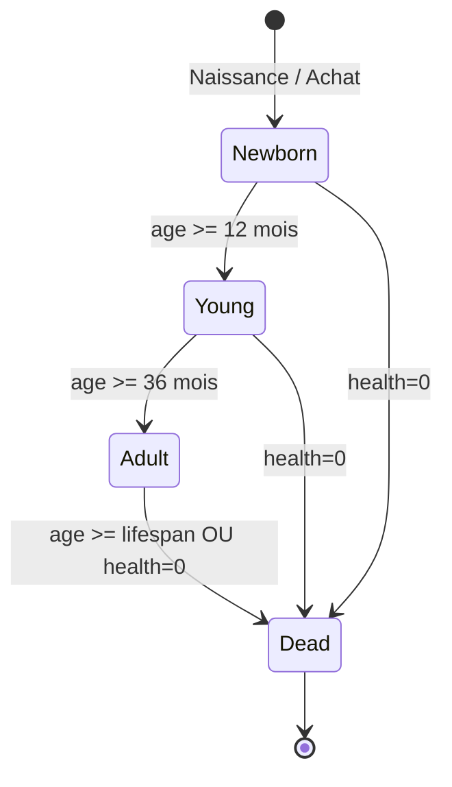

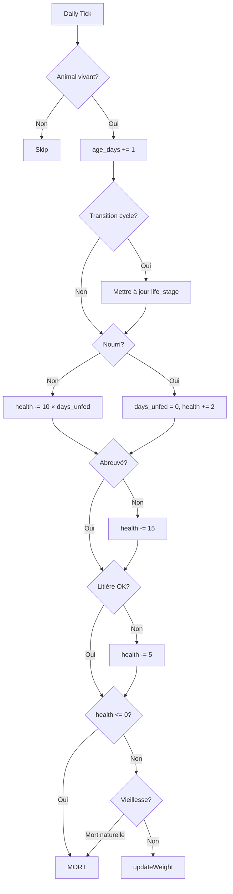

---

## 2. Bovins 4 races MVP

### 2.1 Description

4 races pour le MVP : 2 laitières (Prim'Holstein, Montbéliarde) et 2 allaitantes (Charolaise, Limousine). Chaque race a des caractéristiques de poids, production laitière et rendement carcasse spécifiques.

### 2.2 SQL — Données de référence (seed)

```sql
-- Espèce bovine
INSERT INTO animal_species (name, housing_type, gestation_months, max_insem_per_day,
  slaughter_yield_min, slaughter_yield_max, lifespan_years, pasture_start_month,
  pasture_end_month, bio_eligible)
VALUES ('cattle', 'stable', 9, 4, 0.50, 0.75, 12, 4, 10, true);

-- 4 races MVP
INSERT INTO animal_breed (species_id, name, category, birth_weight_kg, adult_weight_f,
  adult_weight_m, milk_per_day, offspring_min, offspring_max, genetic_indices)
VALUES
  -- Prim'Holstein (laitière)
  ((SELECT id FROM animal_species WHERE name='cattle'),
   'Prim''Holstein', 'dairy', 44, 700, 1000, 28, 1, 1,
   '["growth","prolificacy","appearance","milk","milk_quality"]'),

  -- Montbéliarde (laitière)
  ((SELECT id FROM animal_species WHERE name='cattle'),
   'Montbéliarde', 'dairy', 50, 700, 1000, 25, 1, 1,
   '["growth","prolificacy","appearance","milk","milk_quality"]'),

  -- Charolaise (allaitante)
  ((SELECT id FROM animal_species WHERE name='cattle'),
   'Charolaise', 'beef', 45, 750, 1200, 12, 1, 1,
   '["growth","prolificacy","appearance","milk","milk_quality"]'),

  -- Limousine (allaitante)
  ((SELECT id FROM animal_species WHERE name='cattle'),
   'Limousine', 'beef', 38, 670, 1000, 12, 1, 1,
   '["growth","prolificacy","appearance","milk","milk_quality"]');
```

### 2.3 Logique métier — Caractéristiques par race

| Race | Catégorie | Poids naiss. | Poids ♀ adulte | Poids ♂ adulte | Lait base (L/j) | Rendement carcasse |
|------|-----------|-------------|----------------|----------------|-----------------|-------------------|
| Prim'Holstein | Laitière | 44 kg | 700 kg | 1000 kg | 28 | 50-55% |
| Montbéliarde | Laitière | 50 kg | 700 kg | 1000 kg | 25 | 50-55% |
| Charolaise | Allaitante | 45 kg | 750 kg | 1200 kg | 12 | 55-75% |
| Limousine | Allaitante | 38 kg | 670 kg | 1000 kg | 12 | 55-75% |

#### Croissance de base (kg/jour estimé pour atteindre poids adulte en ~3 ans)

```pseudo
// Croissance linéaire simplifiée
GROWTH_RATE = {
  'Prim\'Holstein': { F: (700-44)/1095 ≈ 0.60, M: (1000-44)/1095 ≈ 0.87 },
  'Montbéliarde':   { F: (700-50)/1095 ≈ 0.59, M: (1000-50)/1095 ≈ 0.87 },
  'Charolaise':     { F: (750-45)/1095 ≈ 0.64, M: (1200-45)/1095 ≈ 1.05 },
  'Limousine':      { F: (670-38)/1095 ≈ 0.58, M: (1000-38)/1095 ≈ 0.88 }
}
```

#### Formule poids quotidien

```
poids_jour = poids_precedent + (croissance_base × qualite_ration × indice_croissance / 50)
```

- `croissance_base` : kg/jour selon race et sexe (table ci-dessus)
- `qualite_ration` : 0.7 (mauvaise), 0.85 (moyenne), 1.0 (bonne)
- `indice_croissance` : indice génétique (0-100, base 50)
- Plafond : poids ne dépasse jamais `adult_weight` × 1.1

### 2.4 API Endpoints

| Méthode | Endpoint | Description |
|---------|----------|-------------|
| GET | `/api/breeds?species=cattle` | Liste races bovines disponibles |
| GET | `/api/breeds/:id` | Détail race (poids, lait, indices) |

### 2.5 Tests

| ID | Test | Résultat attendu |
|----|------|------------------|
| T2.1 | Prim'Holstein ♀, qualité 3, indice 50, 1095 jours | Poids ≈ 700 kg |
| T2.2 | Charolaise ♂, qualité 3, indice 75 | Poids > 1200 kg plafonné à 1320 kg |
| T2.3 | Limousine, qualité 1 (0.7), indice 50 | Poids ≈ 670×0.7 = croissance ralentie |
| T2.4 | Vérifier milk_per_day Prim'Holstein = 28 | OK |
| T2.5 | Vérifier catégorie Charolaise = 'beef' | OK |

### 2.6 Diagramme — Races MVP

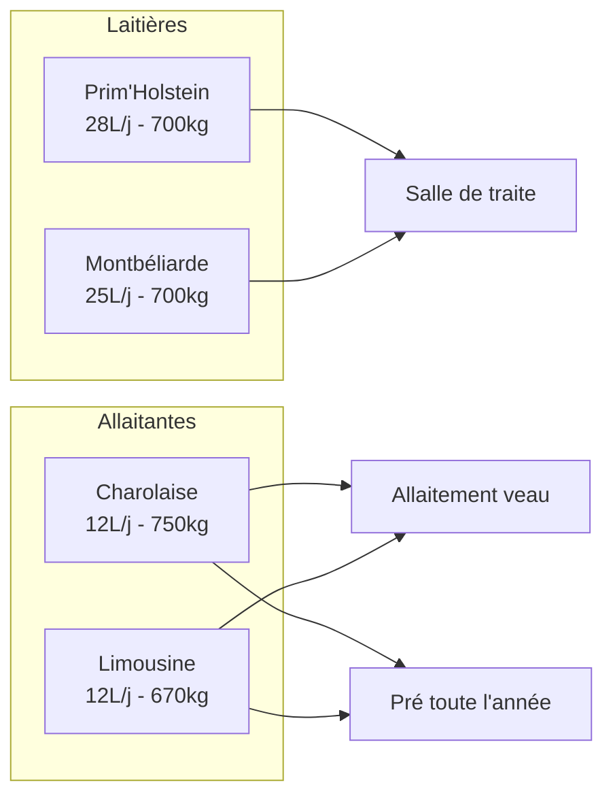

---

## 3. Bâtiments élevage

### 3.1 Description

<!-- PO-VALIDATED: 4.3 -->

La stabulation est le bâtiment principal pour les bovins. Deux modes : litière (paille → fumier) ou caillebotis (→ lisier). 5 niveaux d'équipement (1=basique, 5=optimal). La surface requise dépend du type d'animal.

**Entretien automatique :** L'entretien des bâtiments (0.3 HT/mois + coût €) est prélevé automatiquement dans le tick mensuel. Le joueur ne clique plus pour « entretenir le hangar ». Si les HT sont insuffisants, une notification est envoyée et l'usure n'est pas réduite ce mois-ci.

### 3.2 SQL

```sql
-- Seed building_type pour stabulation
INSERT INTO building_type (name, category, unit, base_cost_per_unit, energy_kwh_base, max_level)
VALUES
  ('stabulation_litiere', 'b', 'm2', 120.00, 0.5, 5),
  ('stabulation_caillebotis', 'b', 'm2', 150.00, 0.8, 5),
  ('salle_traite', 'a', 'unit', 8000.00, 2.0, 5),
  ('cuve_lait', 'a', 'L', 0.50, 0.3, 5),
  ('fosse_fumier', 'b', 'kg', 0.08, 0, 5),
  ('fosse_lisier', 'b', 'L', 0.05, 0, 5),
  ('cuve_eau', 'a', 'L', 0.10, 0.1, 5);

-- Table capacité animale par bâtiment (calculée dynamiquement)
CREATE TABLE building_animal_capacity (
  id          SERIAL PRIMARY KEY,
  building_id INT NOT NULL REFERENCES building(id),
  animal_count INT NOT NULL DEFAULT 0,
  max_capacity INT NOT NULL,  -- calculé: size / surface_par_animal
  updated_at  TIMESTAMPTZ NOT NULL DEFAULT now()
);
```

### 3.3 Logique métier

#### Surface par animal (m²)

| Type animal | Condition | Surface requise |
|-------------|-----------|----------------|
| Taureau | life_stage='adult', sex='M' | 15 m² |
| Vache | life_stage='adult', sex='F' | 12 m² |
| Taurillon | life_stage='young', sex='M' | 8 m² |
| Génisse | life_stage='young', sex='F' | 8 m² |
| Veau | life_stage='newborn' | 5 m² |

#### Pseudocode — Capacité bâtiment

```pseudo
function getRequiredSpace(animal):
    if animal.life_stage == 'adult':
        return 15 if animal.sex == 'M' else 12
    elif animal.life_stage == 'young':
        return 8
    else:  // newborn
        return 5

function canPlaceAnimal(building, animal):
    required = getRequiredSpace(animal)
    used = SUM(getRequiredSpace(a) for a in building.animals WHERE a.life_stage != 'dead')
    return (used + required) <= building.size

function getBuildingCapacity(building):
    return { used: used_space, total: building.size, free: building.size - used_space }
```

#### Consommation énergie mensuelle

<!-- PO-VALIDATED: 4.3 -->

```pseudo
function monthlyEnergyCost(building):
    base_kwh = building_type.energy_kwh_base * building.size
    level_factor = 1.0 - (building.level - 1) * 0.1  // niv5 = 0.6× base
    season_factor = 1.3 if (winter OR summer) else 1.0
    occupancy = building.animal_count / building.max_capacity
    occupancy_factor = max(0.2, occupancy)  // vide = 20% conso
    kwh = base_kwh * level_factor * season_factor * occupancy_factor
    return kwh * 0.08  // €/kWh

// Entretien automatique mensuel (tick)
function monthlyAutoMaintenance(server_id):
    buildings = SELECT b.*, f.player_id
                FROM building b
                JOIN farm f ON f.id = b.farm_id
                JOIN player p ON p.id = f.player_id
                WHERE p.server_id = server_id

    FOR EACH building IN buildings:
        player = getPlayer(building.player_id)
        // Prélèvement HT automatique
        IF player.ht_today >= 0.3:
            spendPA(building.player_id, 0.3, 'auto_maintain_building', { building_id: building.id })
            UPDATE building SET wear_pct = GREATEST(0, wear_pct - 2.0),
                                last_maintenance = now()
                   WHERE id = building.id
        ELSE:
            // HT insuffisants → pas d'entretien, notification
            createNotification(building.player_id, 'maintenance_skipped', 'warning',
                'Entretien impossible : HT insuffisants',
                'Le bâtiment ' + building.id + ' n\'a pas été entretenu ce mois-ci.')
```

### 3.4 API Endpoints

| Méthode | Endpoint | Description | HT |
|---------|----------|-------------|-----|
| POST | `/api/farm/:id/buildings` | Construire bâtiment | 1.0 |
| GET | `/api/buildings/:id/capacity` | Capacité + occupation | 0 |
| POST | `/api/buildings/:id/upgrade` | Améliorer niveau (1→5) | 2.0 |
| POST | `/api/animals/:id/move` | Déplacer animal vers bâtiment | 0.25 |

### 3.5 Tests

| ID | Test | Résultat attendu |
|----|------|------------------|
| T3.1 | Stabulation 100m², placer 8 vaches (8×12=96m²) | OK, 4m² restants |
| T3.2 | Placer 9e vache (96+12=108 > 100) | Erreur: capacité insuffisante |
| T3.3 | Veau grandit → young (5→8m²) | Recalcul capacité automatique |
| T3.4 | Upgrade niveau 1→2 | energy_factor passe de 1.0 à 0.9 |
| T3.5 | Bâtiment vide, hiver | Conso = base × 0.6(niv5) × 1.3(hiver) × 0.2(vide) |
| T3.6 | 10 premiers bâtiments | Pas de délai construction |
| T3.7 | Caillebotis : pas de litière requise | OK, lisier produit |

### 3.6 Diagramme — Bâtiments

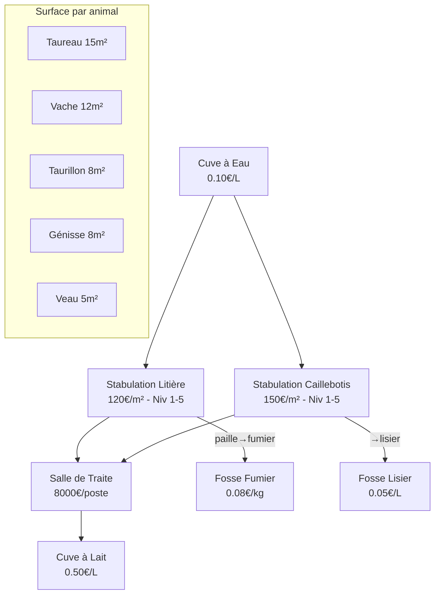

---

## 4. Alimentation

### 4.1 Description

<!-- PO-VALIDATED: 4.1 -->

Chaque bovin doit être nourri quotidiennement avec une ration adaptée à sa tranche d'âge. 7 tranches d'âge, 10+ types de rations de base + compléments. La qualité de ration (1-3) impacte directement la croissance et la production laitière.

**Nourrissage automatique par défaut :** Le joueur configure une ration par bâtiment/troupeau. Cette ration s'applique automatiquement dans le daily tick tant qu'il y a du stock. Le nourrissage manuel reste possible comme override ponctuel (pour ajuster la ration d'un animal spécifique un jour donné). Si le joueur utilise une ration standard du jeu, il n'a pas de malus — les bonus viennent de l'optimisation.

### 4.2 SQL

```sql
-- Table rations bovins (seed data)
-- animal_ration existe déjà (01_DATA_MODEL §3.4), on seed les données

-- Compléments par tranche d'âge
INSERT INTO animal_ration (species_id, age_group, ration_name, components, water_l, total_kg)
VALUES
  -- >36 mois (adultes)
  ((SELECT id FROM animal_species WHERE name='cattle'), 'adult_36+', 'complement',
   '{"barley_wheat_triticale": 7.2, "rapeseed_soy_meal": 4.8, "minerals_vitamins": 1.0}',
   200, 13.0),
  -- 24-36 mois
  ((SELECT id FROM animal_species WHERE name='cattle'), '24-36m', 'complement',
   '{"barley_wheat_triticale": 6.0, "rapeseed_soy_meal": 4.0, "minerals_vitamins": 0.8}',
   100, 10.8),
  -- 18-24 mois
  ((SELECT id FROM animal_species WHERE name='cattle'), '18-24m', 'complement',
   '{"barley_wheat_triticale": 4.0, "rapeseed_soy_meal": 4.0, "minerals_vitamins": 0.6}',
   80, 8.6),
  -- 12-18 mois
  ((SELECT id FROM animal_species WHERE name='cattle'), '12-18m', 'complement',
   '{"barley_wheat_triticale": 2.0, "rapeseed_soy_meal": 4.0, "minerals_vitamins": 0.4}',
   60, 6.4),
  -- 6-12 mois
  ((SELECT id FROM animal_species WHERE name='cattle'), '6-12m', 'complement',
   '{"barley_wheat_triticale": 1.2, "rapeseed_soy_meal": 2.0, "minerals_vitamins": 0.4}',
   40, 3.6),
  -- 3-6 mois
  ((SELECT id FROM animal_species WHERE name='cattle'), '3-6m', 'complement',
   '{"barley_wheat_triticale": 0.6, "rapeseed_soy_meal": 1.2, "minerals_vitamins": 0.4}',
   28, 2.2),
  -- 0-3 mois
  ((SELECT id FROM animal_species WHERE name='cattle'), '0-3m', 'complement',
   '{"young_cattle_concentrate": 8.0}',
   12, 8.0);

-- Rations de base adultes (>36 mois) — 10 options
INSERT INTO animal_ration (species_id, age_group, ration_name, components, water_l, total_kg)
VALUES
  ((SELECT id FROM animal_species WHERE name='cattle'), 'adult_36+', 'foin_mais_ensile',
   '{"hay": 72, "corn_silage": 84}', 200, 169),
  ((SELECT id FROM animal_species WHERE name='cattle'), 'adult_36+', 'paille_mais_ensile',
   '{"straw": 28, "corn_silage": 96}', 200, 137),
  ((SELECT id FROM animal_species WHERE name='cattle'), 'adult_36+', 'paille_betterave',
   '{"straw": 28, "beet": 120}', 200, 161),
  ((SELECT id FROM animal_species WHERE name='cattle'), 'adult_36+', 'paille_pulpe_betterave',
   '{"straw": 28, "beet_pulp": 100}', 200, 141),
  ((SELECT id FROM animal_species WHERE name='cattle'), 'adult_36+', 'foin_mais_ensilage_herbe',
   '{"hay": 56, "corn_silage": 48, "grass_silage": 28}', 200, 146),
  ((SELECT id FROM animal_species WHERE name='cattle'), 'adult_36+', 'mais_ensile_luzerne',
   '{"corn_silage": 60, "alfalfa_pellets": 10}', 200, 83),
  ((SELECT id FROM animal_species WHERE name='cattle'), 'adult_36+', 'foin_mais_sorgho',
   '{"hay": 72, "corn_silage": 42, "sorghum_silage": 42}', 200, 169),
  ((SELECT id FROM animal_species WHERE name='cattle'), 'adult_36+', 'paille_mais_sorgho',
   '{"straw": 28, "corn_silage": 48, "sorghum_silage": 48}', 200, 137),
  ((SELECT id FROM animal_species WHERE name='cattle'), 'adult_36+', 'foin_mais_sorgho_herbe',
   '{"hay": 56, "corn_silage": 24, "sorghum_silage": 24, "grass_silage": 28}', 200, 145),
  ((SELECT id FROM animal_species WHERE name='cattle'), 'adult_36+', 'mais_sorgho_luzerne',
   '{"corn_silage": 30, "sorghum_silage": 30, "alfalfa_pellets": 10}', 200, 83);

-- Table suivi alimentation quotidien
CREATE TABLE animal_feeding_log (
  id          BIGSERIAL PRIMARY KEY,
  animal_id   BIGINT NOT NULL REFERENCES animal(id),
  farm_id     INT NOT NULL REFERENCES farm(id),
  ration_id   INT REFERENCES animal_ration(id),
  quality     SMALLINT NOT NULL CHECK (quality BETWEEN 1 AND 3),
  fed_at      TIMESTAMPTZ NOT NULL DEFAULT now()
);
CREATE INDEX idx_feeding_animal ON animal_feeding_log(animal_id, fed_at DESC);
```

### 4.3 Logique métier

#### Tranches d'âge bovins

| Tranche | Âge (jours) | Âge (mois) | Nom Cultivia |
|---------|-------------|------------|-------------|
| 1 | 0-90 | 0-3 | Veau nouveau-né |
| 2 | 91-180 | 3-6 | Veau |
| 3 | 181-365 | 6-12 | Veau sevré |
| 4 | 366-545 | 12-18 | Taurillon/Génisse |
| 5 | 546-730 | 18-24 | Taurillon/Génisse |
| 6 | 731-1095 | 24-36 | Taurillon/Génisse |
| 7 | >1095 | >36 | Taureau/Vache |

#### Rations complètes par tranche (kg/jour total avec compléments)

| Tranche | Ration base (ex: foin+maïs) | Compléments | Total | Eau (L) |
|---------|---------------------------|-------------|-------|---------|
| >36 mois | 83-169 | 13.0 | 96-182 | 200 |
| 24-36m | 71-144 | 10.8 | 82-155 | 100 |
| 18-24m | 55-112 | 8.6 | 64-121 | 80 |
| 12-18m | 42-85 | 6.4 | 48-91 | 60 |
| 6-12m | 28-57 | 3.6 | 32-61 | 40 |
| 3-6m | 14-29 | 2.2 | 16-31 | 28 |
| 0-3m | Concentré 8kg | 0 | 8 | 12 |

#### Qualité de ration

<!-- PO-VALIDATED: 1.2 -->

```pseudo
QUALITY_FACTOR = { 1: 0.70, 2: 0.85, 3: 1.00 }

// La qualité dépend de la qualité des produits en stock
function getRationQuality(farm, ration_components):
    qualities = []
    for product, qty in ration_components:
        stock = getInventory(farm, product)
        if stock is None OR stock.quantity < qty:
            return null  // stock insuffisant
        qualities.append(stock.quality)
    return min(qualities)  // qualité = pire composant

// Score nutritionnel visible (0-100)
// Calculé à partir de la composition de la ration vs les besoins de l'animal
function calculateNutritionalScore(ration, animal) -> int:
    breed = getBreed(animal.breed_id)
    age_group = getAgeGroup(animal.age_days)
    ideal = getIdealRation(breed, age_group)

    // Score = % de couverture des besoins (énergie + protéines + minéraux)
    energy_coverage = min(1.0, ration.total_energy / ideal.energy)
    protein_coverage = min(1.0, ration.total_protein / ideal.protein)
    mineral_coverage = min(1.0, ration.total_minerals / ideal.minerals)

    score = round((energy_coverage + protein_coverage + mineral_coverage) / 3 * 100)
    RETURN clamp(score, 0, 100)

// Impact graduel du score nutritionnel sur santé et production
// Score >= 70 → pas de malus, bonus progressif sur production
// Score 40-69 → production réduite, santé stable
// Score < 40 → production très réduite, santé se dégrade lentement (-1/jour)
function nutritionalImpact(score):
    IF score >= 70:
        production_factor = 0.85 + (score - 70) * 0.005  // 0.85 à 1.0
        health_delta = 0
    ELIF score >= 40:
        production_factor = 0.60 + (score - 40) * 0.008  // 0.60 à 0.84
        health_delta = 0
    ELSE:
        production_factor = 0.40 + score * 0.005  // 0.40 à 0.60
        health_delta = -1  // santé se dégrade lentement
    RETURN { production_factor, health_delta }
```

#### Formule croissance quotidienne

```
poids_jour = poids_precedent + (croissance_base × qualite_ration × indice_croissance / 50)
```

```pseudo
function updateWeight(animal):
    if animal.life_stage == 'dead': return
    if NOT wasFedToday(animal): return  // pas de croissance sans nourriture

    breed = getBreed(animal.breed_id)
    target_weight = breed.adult_weight_f if animal.sex == 'F' else breed.adult_weight_m
    max_weight = target_weight * 1.1  // plafond +10%

    if animal.weight_kg >= max_weight: return  // déjà au max

    growth_base = (target_weight - breed.birth_weight_kg) / 1095  // kg/jour sur 3 ans
    quality = QUALITY_FACTOR[animal.last_ration_quality]
    idx_growth = animal.genetics.growth OR 50

    daily_gain = growth_base * quality * (idx_growth / 50)
    animal.weight_kg = min(max_weight, animal.weight_kg + daily_gain)
```

#### Pseudocode — Nourrir un groupe d'animaux

```pseudo
function feedAnimals(farm_id, building_id, ration_id, player):
    animals = getAnimalsInBuilding(building_id)
    ration = getRation(ration_id)

    // Calculer besoin total
    total_needs = {}
    for animal in animals:
        age_group = getAgeGroup(animal.age_days)
        base_ration = getRationForAgeGroup(ration_id, age_group)
        complement = getComplementForAgeGroup(age_group)
        for product, qty in (base_ration + complement):
            total_needs[product] = (total_needs[product] OR 0) + qty

    // Vérifier stocks
    for product, qty in total_needs:
        stock = getInventory(farm_id, product)
        if stock.quantity < qty:
            return error("Stock insuffisant: {product}")

    // Déduire stocks
    quality = 3  // sera le min
    for product, qty in total_needs:
        consumed_quality = consumeFromInventory(farm_id, product, qty)
        quality = min(quality, consumed_quality)

    // Marquer nourris
    for animal in animals:
        animal.last_fed_at = now()
        logFeeding(animal, ration_id, quality)

    // Coût HT
    pa_cost = calculateFeedingPA(animals.length)
    deductPA(player, pa_cost)
```

### 4.4 API Endpoints

| Méthode | Endpoint | Description | HT |
|---------|----------|-------------|-----|
| GET | `/api/rations?species=cattle&age_group=adult_36+` | Rations disponibles | 0 |
| POST | `/api/buildings/:id/feed` | Nourrir tous les animaux du bâtiment (override manuel) | Variable |
| POST | `/api/animals/:id/feed` | Nourrir un animal individuel (override manuel) | 0.1 |
| GET | `/api/farm/:id/feed-status` | Statut alimentation (nourris/pas nourris) | 0 |
| PUT | `/api/buildings/:id/ration-config` | Configurer la ration automatique du bâtiment | 0 |
| GET | `/api/buildings/:id/ration-config` | Voir la ration configurée | 0 |

<!-- PO-VALIDATED: 4.1 -->

**Body PUT `/api/buildings/:id/ration-config` :**
```json
{
  "ration_id": 42,
  "auto_feed": true
}
```

Quand `auto_feed: true`, le daily tick applique automatiquement la ration configurée à tous les animaux du bâtiment. Le joueur n'a pas besoin de cliquer chaque jour.

**Body POST `/api/buildings/:id/feed` (override manuel) :**
```json
{
  "ration_id": 42,
  "use_desilage": true
}
```

### 4.5 Tests

| ID | Test | Résultat attendu |
|----|------|------------------|
| T4.1 | Nourrir vache adulte, ration foin+maïs, qualité 3 | Stock -169kg, animal.last_fed_at mis à jour |
| T4.2 | Stock insuffisant (50kg foin, besoin 72kg) | Erreur "Stock insuffisant: hay" |
| T4.3 | Veau 0-3m, ration concentré 8kg | OK, pas de complément |
| T4.4 | Qualité 1 (0.7), indice 50, croissance base 0.60 | gain = 0.60 × 0.7 × 1.0 = 0.42 kg/j |
| T4.5 | Qualité 3 (1.0), indice 75, croissance base 0.60 | gain = 0.60 × 1.0 × 1.5 = 0.90 kg/j |
| T4.6 | Poids atteint 110% adulte | Plus de croissance |
| T4.7 | Animal non nourri | Pas de gain de poids |
| T4.8 | Nourrir 50 vaches d'un coup (bâtiment) | Stock déduit ×50, HT calculé |

### 4.6 Diagramme — Flux alimentation

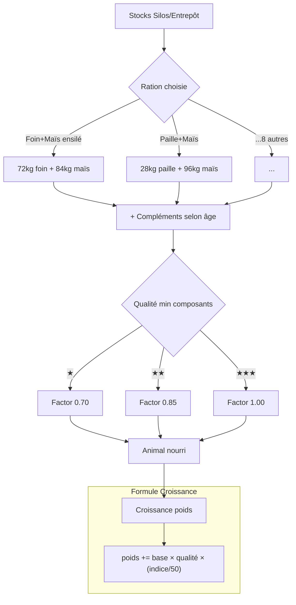

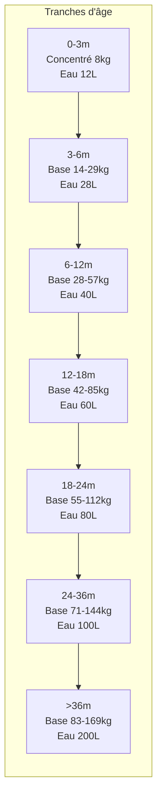

---

## 5. Abreuvement

### 5.1 Description

Chaque bovin a besoin d'eau quotidiennement. L'eau est stockée dans une cuve à eau (bâtiment) ou des bacs à eau (pré). La consommation varie par type d'animal. Sans eau, la santé se dégrade rapidement (-15/jour).

### 5.2 SQL

```sql
-- Table bacs à eau au pré
CREATE TABLE water_trough (
  id          SERIAL PRIMARY KEY,
  parcel_id   INT NOT NULL REFERENCES parcel(id),
  capacity_l  INT NOT NULL,
  current_l   DECIMAL(10,2) NOT NULL DEFAULT 0,
  has_pipeline BOOLEAN NOT NULL DEFAULT false,  -- canalisation auto-remplissage
  created_at  TIMESTAMPTZ NOT NULL DEFAULT now()
);

-- Log consommation eau
CREATE TABLE water_consumption_log (
  id          BIGSERIAL PRIMARY KEY,
  farm_id     INT NOT NULL REFERENCES farm(id),
  source_type VARCHAR(20) NOT NULL, -- 'tank','trough'
  source_id   INT NOT NULL,
  liters      DECIMAL(10,2) NOT NULL,
  animal_count INT NOT NULL,
  consumed_at TIMESTAMPTZ NOT NULL DEFAULT now()
);
```

### 5.3 Logique métier

#### Consommation eau par type (L/jour)

| Type animal | Condition | Eau (L/jour) |
|-------------|-----------|-------------|
| Taureau | adult, M | 200 |
| Vache | adult, F | 200 |
| Taurillon | young, M (24-36m) | 100 |
| Génisse | young, F (24-36m) | 100 |
| Taurillon | young, M (18-24m) | 80 |
| Génisse | young, F (18-24m) | 80 |
| Jeune | young (12-18m) | 60 |
| Veau | 6-12m | 40 |
| Veau | 3-6m | 28 |
| Veau | 0-3m | 12 |

#### Pseudocode — Abreuvement

```pseudo
function waterAnimals(farm_id, building_id):
    animals = getAnimalsInBuilding(building_id)
    total_water = 0

    for animal in animals:
        total_water += getWaterNeed(animal)

    // Source: cuve à eau du bâtiment
    tank = getWaterTank(farm_id, building_id)
    if tank.current_l < total_water:
        return error("Cuve à eau insuffisante: {tank.current_l}L / {total_water}L requis")

    tank.current_l -= total_water
    logWaterConsumption(farm_id, 'tank', tank.id, total_water, animals.length)

    for animal in animals:
        animal.last_watered_at = now()

function waterAnimalsAtPasture(parcel_id):
    animals = getAnimalsOnParcel(parcel_id)
    total_water = SUM(getWaterNeed(a) for a in animals)

    trough = getWaterTrough(parcel_id)
    if trough is None:
        return error("Pas de bac à eau sur cette parcelle")

    if trough.has_pipeline:
        // Remplissage auto depuis cuve ferme
        trough.current_l = trough.capacity_l

    if trough.current_l < total_water:
        return error("Bac à eau insuffisant")

    trough.current_l -= total_water
    for animal in animals:
        animal.last_watered_at = now()

function getWaterNeed(animal):
    age_months = animal.age_days / 30
    if age_months < 3: return 12
    if age_months < 6: return 28
    if age_months < 12: return 40
    if age_months < 18: return 60
    if age_months < 24: return 80
    if age_months < 36: return 100
    return 200  // adulte
```

#### Remplissage cuve

```pseudo
function fillWaterTank(farm_id, tank_id, liters):
    tank = getWaterTank(farm_id, tank_id)
    actual = min(liters, tank.capacity_l - tank.current_l)
    cost = actual * 0.003  // 3€/m³ = 0.003€/L
    deductBalance(farm_id, cost)
    tank.current_l += actual

function fillTroughManually(parcel_id, trough_id, player):
    // Nécessite tonne à eau + tracteur
    trough = getTrough(trough_id)
    trough.current_l = trough.capacity_l
    deductPA(player, 1.0)  // HT pour le trajet + remplissage
```

### 5.4 API Endpoints

| Méthode | Endpoint | Description | HT |
|---------|----------|-------------|-----|
| POST | `/api/buildings/:id/water` | Abreuver animaux en bâtiment | 0.25 |
| POST | `/api/parcels/:id/water` | Abreuver animaux au pré | 0.25 |
| POST | `/api/water-tanks/:id/fill` | Remplir cuve eau | 0.5 |
| POST | `/api/water-troughs/:id/fill` | Remplir bac pré (tonne à eau) | 1.0 |
| GET | `/api/farm/:id/water-status` | Niveaux cuves et bacs | 0 |

### 5.5 Tests

| ID | Test | Résultat attendu |
|----|------|------------------|
| T5.1 | 10 vaches adultes, cuve 5000L | Consommation 2000L, reste 3000L |
| T5.2 | Cuve 100L, besoin 2000L | Erreur "Cuve insuffisante" |
| T5.3 | Bac pré avec canalisation | Auto-remplissage avant consommation |
| T5.4 | Veau 0-3m, consommation | 12L/jour |
| T5.5 | Pas d'abreuvement 1 jour | health -= 15 au tick |
| T5.6 | Remplir cuve 1000L | Coût = 3€, cuve += 1000L |

### 5.6 Diagramme — Circuit eau

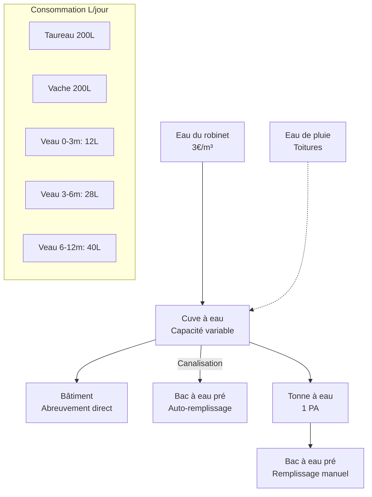

---

## 6. Litière & Fumier

### 6.1 Description

En stabulation litière, chaque bovin consomme de la paille quotidiennement. La paille souillée se transforme en fumier, stocké en fosse à fumier, puis épandable sur les parcelles (25 T/ha). Sans litière, la santé se dégrade (-5/jour).

### 6.2 SQL

```sql
-- Log litière/fumier quotidien
CREATE TABLE litter_log (
  id            BIGSERIAL PRIMARY KEY,
  building_id   INT NOT NULL REFERENCES building(id),
  farm_id       INT NOT NULL REFERENCES farm(id),
  straw_used_kg DECIMAL(10,2) NOT NULL,
  manure_produced_kg DECIMAL(10,2) NOT NULL,
  created_at    TIMESTAMPTZ NOT NULL DEFAULT now()
);
CREATE INDEX idx_litter_building ON litter_log(building_id, created_at DESC);
```

### 6.3 Logique métier

#### Consommation paille (kg/jour)

| Type animal | Condition | Paille (kg/jour) |
|-------------|-----------|-----------------|
| Taureau | adult, M | 90 |
| Vache | adult, F | 72 |
| Taurillon | young, M | 48 |
| Génisse | young, F | 48 |
| Veau | newborn | 30 |

#### Transformation paille → fumier

```pseudo
STRAW_TO_MANURE_RATIO = 1.2  // 1 kg paille → 1.2 kg fumier (absorption déjections)

function dailyLitter(building):
    if building.type != 'stabulation_litiere': return  // caillebotis = pas de litière

    animals = getAnimalsInBuilding(building.id)
    total_straw = 0

    for animal in animals:
        total_straw += getStrawNeed(animal)

    // Vérifier stock paille
    straw_stock = getInventory(building.farm_id, 'straw_bale')
    if straw_stock.quantity < total_straw:
        // Litière insuffisante → dégradation santé
        for animal in animals:
            animal.health -= 5
        logHealthEvent(animals, 'disease', 'Litière insuffisante')
        return

    // Consommer paille
    consumeFromInventory(building.farm_id, 'straw_bale', total_straw)

    // Produire fumier
    manure_kg = total_straw * STRAW_TO_MANURE_RATIO
    fosse = getManurePit(building.farm_id)
    if fosse is None:
        return error("Pas de fosse à fumier")

    if fosse.current + manure_kg > fosse.capacity:
        // Fosse pleine → fumier perdu (ou erreur)
        manure_kg = fosse.capacity - fosse.current

    addToInventory(building.farm_id, fosse.id, 'manure', manure_kg)
    logLitter(building.id, total_straw, manure_kg)

function getStrawNeed(animal):
    if animal.life_stage == 'adult':
        return 90 if animal.sex == 'M' else 72
    elif animal.life_stage == 'young':
        return 48
    else:
        return 30
```

#### Épandage fumier

```pseudo
MANURE_PER_HA = 25000  // 25 T/ha = 25000 kg/ha
MANURE_NUTRIENTS = { N: 137.5, P: 65, K: 180, Ca: 75, Mg: 50, S: 70 }  // kg/ha

function spreadManure(farm_id, parcel_id, player):
    parcel = getParcel(parcel_id)
    area_ha = parcel.area_m2 / 10000
    needed_kg = area_ha * MANURE_PER_HA

    fosse = getManurePit(farm_id)
    if fosse.current < needed_kg:
        return error("Fumier insuffisant: {fosse.current}kg / {needed_kg}kg")

    // Nécessite: tracteur + épandeur à fumier
    if NOT hasEquipment(farm_id, 'manure_spreader'):
        return error("Épandeur à fumier requis")

    consumeFromInventory(farm_id, fosse.id, 'manure', needed_kg)

    // Enrichir sol
    for nutrient, value in MANURE_NUTRIENTS:
        parcel[nutrient + '_reserve'] += value

    deductPA(player, calculateSpreadPA(parcel.area_m2))
```

### 6.4 API Endpoints

| Méthode | Endpoint | Description | HT |
|---------|----------|-------------|-----|
| POST | `/api/buildings/:id/litter` | Pailler un bâtiment | 0.5 |
| GET | `/api/farm/:id/manure-status` | Niveau fosse fumier | 0 |
| POST | `/api/parcels/:id/spread-manure` | Épandre fumier | Variable |

### 6.5 Tests

| ID | Test | Résultat attendu |
|----|------|------------------|
| T6.1 | 10 vaches litière, 1 jour | 720kg paille consommée, 864kg fumier produit |
| T6.2 | 1 taureau + 5 vaches | 90 + 360 = 450kg paille/jour |
| T6.3 | Stock paille insuffisant | health -= 5 pour chaque animal |
| T6.4 | Fosse pleine | Fumier excédentaire perdu |
| T6.5 | Épandage 1ha | 25T fumier consommé, sol enrichi (N+137.5, etc.) |
| T6.6 | Bâtiment caillebotis | Pas de litière requise, pas de fumier |

### 6.6 Diagramme — Cycle litière/fumier

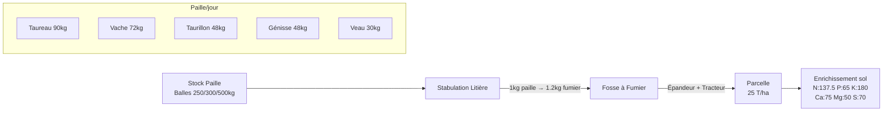

---

## 7. Lisier

### 7.1 Description

En stabulation caillebotis, les bovins produisent du lisier (pas de paille nécessaire). Le lisier est stocké en fosse à lisier puis épandu sur les parcelles (15 m³/ha). Alternative au fumier avec des apports nutritifs différents.

### 7.2 SQL

```sql
-- Log lisier quotidien
CREATE TABLE slurry_log (
  id            BIGSERIAL PRIMARY KEY,
  building_id   INT NOT NULL REFERENCES building(id),
  farm_id       INT NOT NULL REFERENCES farm(id),
  slurry_liters DECIMAL(10,2) NOT NULL,
  created_at    TIMESTAMPTZ NOT NULL DEFAULT now()
);
CREATE INDEX idx_slurry_building ON slurry_log(building_id, created_at DESC);
```

### 7.3 Logique métier

#### Production lisier (L/jour) — caillebotis uniquement

| Type animal | Condition | Lisier (L/jour) |
|-------------|-----------|----------------|
| Taureau | adult, M | 200 |
| Vache | adult, F | 200 |
| Taurillon | young, M | 140 |
| Génisse | young, F | 140 |
| Veau | newborn | 60 |

#### Pseudocode

```pseudo
function dailySlurry(building):
    if building.type != 'stabulation_caillebotis': return

    animals = getAnimalsInBuilding(building.id)
    total_slurry = 0

    for animal in animals:
        total_slurry += getSlurryProduction(animal)

    fosse = getSlurryPit(building.farm_id)
    if fosse is None:
        return error("Pas de fosse à lisier")

    actual = min(total_slurry, fosse.capacity - fosse.current)
    addToInventory(building.farm_id, fosse.id, 'slurry', actual)
    logSlurry(building.id, actual)

function getSlurryProduction(animal):
    if animal.life_stage == 'adult': return 200
    elif animal.life_stage == 'young': return 140
    else: return 60

// Épandage lisier
SLURRY_PER_HA = 15  // 15 m³/ha = 15000 L/ha
SLURRY_NUTRIENTS = { N: 75, P: 60, K: 45, Ca: 45, Mg: 15, S: 35 }

function spreadSlurry(farm_id, parcel_id, player):
    parcel = getParcel(parcel_id)
    area_ha = parcel.area_m2 / 10000
    needed_l = area_ha * 15000

    fosse = getSlurryPit(farm_id)
    if fosse.current < needed_l:
        return error("Lisier insuffisant")

    if NOT hasEquipment(farm_id, 'slurry_tanker'):
        return error("Tonne à lisier requise")

    consumeFromInventory(farm_id, fosse.id, 'slurry', needed_l)
    for nutrient, value in SLURRY_NUTRIENTS:
        parcel[nutrient + '_reserve'] += value

    deductPA(player, calculateSpreadPA(parcel.area_m2))
```

### 7.4 API Endpoints

| Méthode | Endpoint | Description | HT |
|---------|----------|-------------|-----|
| GET | `/api/farm/:id/slurry-status` | Niveau fosse lisier | 0 |
| POST | `/api/parcels/:id/spread-slurry` | Épandre lisier | Variable |

### 7.5 Tests

| ID | Test | Résultat attendu |
|----|------|------------------|
| T7.1 | 10 vaches caillebotis, 1 jour | 2000L lisier produit |
| T7.2 | 1 taureau + 5 vaches + 4 veaux | 200+1000+240 = 1440L/jour |
| T7.3 | Fosse pleine | Lisier excédentaire perdu |
| T7.4 | Épandage 1ha | 15000L consommé, sol enrichi |
| T7.5 | Bâtiment litière | Pas de lisier produit |

### 7.6 Diagramme — Cycle lisier

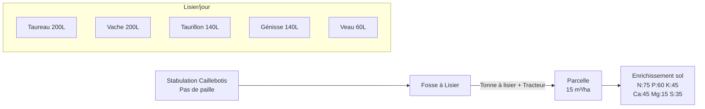

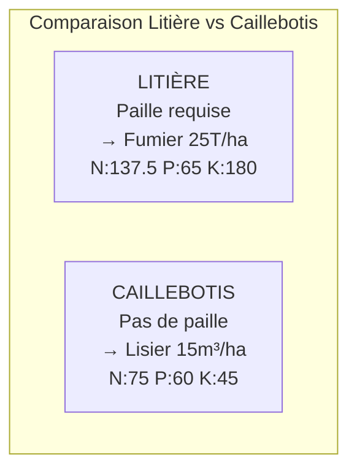

---

## 8. Reproduction

### 8.1 Description

Deux modes d'insémination : naturelle (taureau, max 4/jour) ou artificielle (inséminateur + dose CIA). Gestation de 9 mois Cultivia (63 jours réels). 1 veau par portée. Délai minimum de 3 mois (21 jours réels) entre deux gestations. Génisse inséminable à 27 mois, taureau reproducteur à 3 ans.

### 8.2 SQL

```sql
-- La table insemination existe déjà (01_DATA_MODEL §3.8)
-- On ajoute une table de suivi gestation

CREATE TABLE gestation (
  id            BIGSERIAL PRIMARY KEY,
  mother_id     BIGINT NOT NULL REFERENCES animal(id),
  father_id     BIGINT REFERENCES animal(id),       -- NULL si IA
  cia_dose_id   INT REFERENCES cia_dose(id),         -- NULL si naturelle
  insemination_id BIGINT NOT NULL REFERENCES insemination(id),
  start_date    TIMESTAMPTZ NOT NULL DEFAULT now(),
  due_date      TIMESTAMPTZ NOT NULL,                -- start + 63 jours réels (9 mois sim)
  birth_date    TIMESTAMPTZ,                         -- NULL tant que pas né
  offspring_id  BIGINT REFERENCES animal(id),        -- FK vers le veau né
  status        VARCHAR(15) NOT NULL DEFAULT 'ongoing'
    CHECK (status IN ('ongoing','born','failed'))
);
CREATE INDEX idx_gestation_mother ON gestation(mother_id, status);
```

### 8.3 Logique métier

#### Constantes reproduction bovine

```pseudo
CATTLE_REPRODUCTION = {
  female_min_age_days: 810,    // 27 mois
  male_min_age_days: 1095,     // 3 ans (36 mois)
  gestation_days: 63,          // 9 mois sim = 63 jours réels
  cooldown_days: 21,           // 3 mois sim = 21 jours réels
  max_natural_per_day: 4,      // inséminations naturelles max/jour par taureau
  offspring_count: 1
}
```

#### Pseudocode — Insémination naturelle

```pseudo
function inseminateNatural(female_id, male_id, player):
    female = getAnimal(female_id)
    male = getAnimal(male_id)

    // Validations
    if female.sex != 'F': return error("L'animal n'est pas une femelle")
    if male.sex != 'M': return error("L'animal n'est pas un mâle")
    if female.breed_id != male.breed_id: return error("Races différentes, croisement interdit")
    if female.age_days < 810: return error("Génisse trop jeune (min 27 mois)")
    if male.age_days < 1095: return error("Taureau trop jeune (min 3 ans)")
    if female.health < 50: return error("Femelle en mauvaise santé")
    if male.health < 50: return error("Mâle en mauvaise santé")

    // Vérifier pas déjà gestante
    if hasActiveGestation(female_id):
        return error("Déjà en gestation")

    // Vérifier cooldown (3 mois après dernière mise bas)
    last_birth = getLastBirthDate(female_id)
    if last_birth AND (now() - last_birth) < 21 days:
        return error("Délai de 3 mois non respecté")

    // Vérifier quota journalier taureau
    today_count = getInseminationCountToday(male_id)
    if today_count >= 4:
        return error("Taureau: max 4 inséminations/jour atteint")

    // Créer insémination
    insem = createInsemination(female_id, male_id, null, 'natural', true)

    // Créer gestation
    due_date = now() + 63 days
    createGestation(female_id, male_id, null, insem.id, due_date)
    female.pregnant_until = due_date

    deductPA(player, 0.5)

function inseminateArtificial(female_id, dose_id, player):
    female = getAnimal(female_id)
    dose = getCIADose(dose_id)

    // Mêmes validations femelle que naturelle
    if female.age_days < 810: return error("Trop jeune")
    if hasActiveGestation(female_id): return error("Déjà gestante")
    // ... cooldown check ...

    // Vérifier dose compatible (même race)
    if dose.breed_id != female.breed_id: return error("Dose incompatible")
    if dose.doses_left <= 0: return error("Plus de doses")

    // Nécessite inséminateur (employé)
    if NOT hasEmployee(female.farm_id, 'inseminator'):
        return error("Inséminateur requis")

    dose.doses_left -= 1
    insem = createInsemination(female_id, null, dose.id, 'artificial', true)
    due_date = now() + 63 days
    createGestation(female_id, dose.animal_id, dose.id, insem.id, due_date)
    female.pregnant_until = due_date

    deductPA(player, 0.5)
```

#### Pseudocode — Mise bas (daily tick)

```pseudo
function dailyTickGestation():
    gestations = getGestationsDueToday()  // WHERE due_date <= now() AND status='ongoing'

    for g in gestations:
        mother = getAnimal(g.mother_id)
        father_genetics = getGeneticsFromSource(g)  // père ou dose CIA

        // Déterminer sexe aléatoire
        sex = 'M' if random() < 0.5 else 'F'

        // Calculer génétique enfant (voir Feature 12)
        child_genetics = calculateOffspringGenetics(mother.genetics, father_genetics)

        // Créer le veau
        breed = getBreed(mother.breed_id)
        calf = createAnimal({
            farm_id: mother.farm_id,
            breed_id: mother.breed_id,
            sex: sex,
            birth_date: now(),
            weight_kg: breed.birth_weight_kg,
            age_days: 0,
            life_stage: 'newborn',
            location_type: mother.location_type,
            building_id: mother.building_id,
            parcel_id: mother.parcel_id,
            genetics: child_genetics,
            bought_from: 'born',
            parent_father_id: g.father_id,   // <!-- PO-VALIDATED: 1.1 --> Lignée
            parent_mother_id: g.mother_id     // <!-- PO-VALIDATED: 1.1 --> Lignée
        })

        // Mettre à jour gestation
        g.status = 'born'
        g.birth_date = now()
        g.offspring_id = calf.id

        // Mettre à jour mère
        mother.pregnant_until = null
```

### 8.4 API Endpoints

| Méthode | Endpoint | Description | HT |
|---------|----------|-------------|-----|
| POST | `/api/animals/:id/inseminate` | Inséminer (naturelle ou IA) | 0.5 |
| GET | `/api/animals/:id/gestation` | Statut gestation | 0 |
| GET | `/api/farm/:id/gestations` | Toutes gestations en cours | 0 |
| GET | `/api/animals/:id/offspring` | Descendants d'un animal | 0 |

**Body POST inseminate :**
```json
{
  "method": "natural",
  "male_id": 42
}
// OU
{
  "method": "artificial",
  "dose_id": 15
}
```

### 8.5 Tests

| ID | Test | Résultat attendu |
|----|------|------------------|
| T8.1 | Inséminer génisse 27 mois + taureau 3 ans, même race | Gestation créée, due_date = +63j |
| T8.2 | Génisse 20 mois | Erreur "trop jeune" |
| T8.3 | Taureau 2 ans | Erreur "trop jeune" |
| T8.4 | Races différentes | Erreur "croisement interdit" |
| T8.5 | Femelle déjà gestante | Erreur "déjà en gestation" |
| T8.6 | Taureau 5e insémination du jour | Erreur "max 4/jour" |
| T8.7 | Mise bas après 63 jours | Veau créé, poids = birth_weight, genetics calculée |
| T8.8 | Réinséminer 10 jours après mise bas | Erreur "délai 3 mois" |
| T8.9 | Réinséminer 22 jours après mise bas | OK |
| T8.10 | IA sans inséminateur | Erreur "inséminateur requis" |

### 8.6 Diagramme — Reproduction

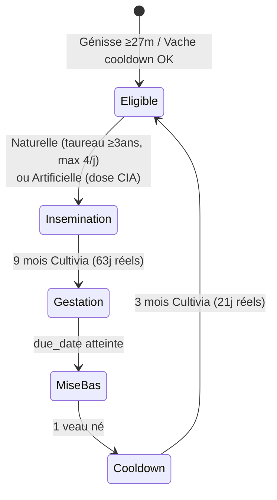

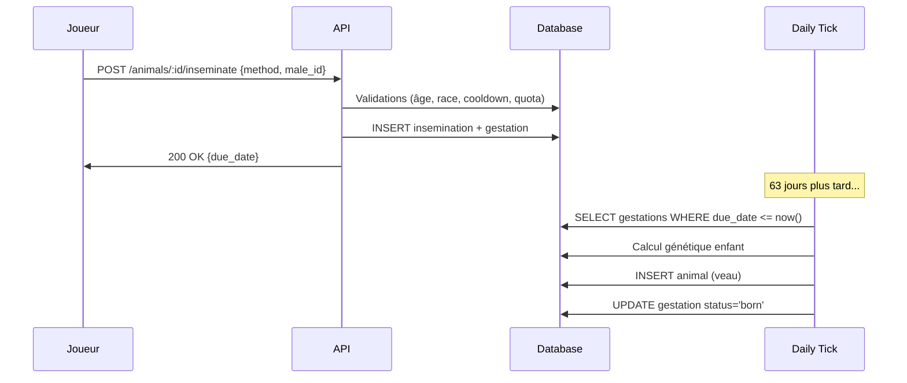

---

## 9. Production lait

### 9.1 Description

Les vaches adultes en lactation produisent du lait, récoltable par traite (1 à 4 fois/jour). Nécessite une salle de traite et une cuve à lait. La production varie de 10 à 28 L/jour selon la race, la génétique et la qualité de ration.

### 9.2 SQL

```sql
-- milk_production existe déjà (01_DATA_MODEL §3.5)
-- On ajoute un suivi lactation

CREATE TABLE lactation (
  id            BIGSERIAL PRIMARY KEY,
  animal_id     BIGINT NOT NULL REFERENCES animal(id),
  start_date    TIMESTAMPTZ NOT NULL,
  end_date      TIMESTAMPTZ,  -- NULL = en cours
  total_liters  DECIMAL(12,2) NOT NULL DEFAULT 0,
  avg_quality   DECIMAL(5,2) NOT NULL DEFAULT 50
);
CREATE INDEX idx_lactation_animal ON lactation(animal_id, start_date DESC);
```

### 9.3 Logique métier

#### Production laitière par race (L/jour base)

| Race | Catégorie | Base lait (L/jour) | Plage réelle |
|------|-----------|-------------------|-------------|
| Prim'Holstein | Laitière | 28 | 10-28 |
| Montbéliarde | Laitière | 25 | 10-25 |
| Charolaise | Allaitante | 12 | 5-12 |
| Limousine | Allaitante | 12 | 5-12 |

#### Formule production laitière quotidienne

```
lait_jour = base_race × (indice_lait / 50) × qualite_ration × random(0.85, 1.15)
```

#### Pseudocode — Calcul production

```pseudo
function calculateDailyMilk(animal):
    if animal.sex != 'F': return 0
    if animal.life_stage != 'adult': return 0
    if NOT animal.is_lactating: return 0
    if animal.is_nursing: return 0  // allaitement = pas de traite

    breed = getBreed(animal.breed_id)
    base = breed.milk_per_day  // 28, 25, 12...

    idx_milk = animal.genetics.milk OR 50
    milk_factor = idx_milk / 50.0  // indice 50 = ×1.0, indice 75 = ×1.5

    quality = QUALITY_FACTOR[animal.last_ration_quality]  // 0.7, 0.85, 1.0
    variation = 0.85 + random() * 0.30  // 0.85 à 1.15

    daily_milk = base * milk_factor * quality * variation
    return max(0, round(daily_milk, 2))
```

#### Pseudocode — Traite

```pseudo
MAX_MILKINGS_PER_DAY = 4
MILKING_WINDOWS = [6, 12, 18, 24]  // heures

function milkAnimals(building_id, player):
    // Vérifier salle de traite
    milking_parlor = getMilkingParlor(building_id)
    if milking_parlor is None:
        return error("Salle de traite requise")

    // Vérifier cuve à lait
    milk_tank = getMilkTank(building_id)
    if milk_tank is None:
        return error("Cuve à lait requise")

    // Déterminer numéro de traite du jour
    milking_num = getMilkingCountToday(building_id) + 1
    if milking_num > MAX_MILKINGS_PER_DAY:
        return error("Maximum 4 traites/jour atteint")

    animals = getAnimalsInBuilding(building_id)
    lactating = [a for a in animals if a.is_lactating AND a.sex == 'F' AND NOT a.is_nursing]

    total_liters = 0
    for animal in lactating:
        daily_total = calculateDailyMilk(animal)
        per_milking = daily_total / MAX_MILKINGS_PER_DAY  // réparti sur 4 traites
        ql = animal.genetics.milk_quality OR 50

        // Vérifier capacité cuve
        if milk_tank.current + per_milking > milk_tank.capacity:
            return error("Cuve à lait pleine")

        milk_tank.current += per_milking
        total_liters += per_milking

        // Log production
        createMilkProduction(animal.id, animal.farm_id, per_milking, ql, milking_num)

    deductPA(player, calculateMilkingPA(lactating.length))
    return { liters: total_liters, animals: lactating.length, milking_num }
```

#### Lactation — Déclenchement et fin

```pseudo
// La lactation commence après mise bas
function onBirth(mother):
    mother.is_lactating = true
    createLactation(mother.id, now())

// La lactation dure tant que la vache est traite régulièrement
// Si pas traite pendant 7 jours → tarissement
function dailyTickLactation(animal):
    if NOT animal.is_lactating: return
    last_milking = getLastMilkingDate(animal.id)
    if last_milking AND (now() - last_milking) > 7 days:
        animal.is_lactating = false
        endLactation(animal.id, now())
```

#### Qualité Lait (QL) — Impact prix de vente

```pseudo
// Prix pour 1000L selon indice QL (conventionnel)
MILK_PRICE_TABLE = {
    [0, 10]:   265,
    [10, 20]:  275,
    [20, 30]:  285,
    [30, 40]:  295,
    [40, 50]:  305,
    [50, 60]:  320,
    [60, 70]:  340,
    [70, 80]:  360,
    [80, 90]:  380,
    [90, 100]: 400
}

function getMilkPrice(ql_index, is_bio):
    base = MILK_PRICE_TABLE[floor(ql_index / 10)]
    if is_bio: base *= 1.20
    return base  // €/1000L
```

### 9.4 API Endpoints

| Méthode | Endpoint | Description | HT |
|---------|----------|-------------|-----|
| POST | `/api/buildings/:id/milk` | Traire toutes les vaches du bâtiment | Variable |
| GET | `/api/farm/:id/milk-production` | Production lait (jour/semaine/mois) | 0 |
| GET | `/api/animals/:id/lactation` | Historique lactation animal | 0 |
| POST | `/api/farm/:id/sell-milk` | Vendre lait (coop/laiterie) | 0.5 |

### 9.5 Tests

| ID | Test | Résultat attendu |
|----|------|------------------|
| T9.1 | Prim'Holstein, indice lait 50, qualité 3 | ~28L/jour (±15%) |
| T9.2 | Montbéliarde, indice lait 75, qualité 3 | ~25 × 1.5 = ~37.5L/jour |
| T9.3 | Charolaise, indice lait 50, qualité 1 | ~12 × 0.7 = ~8.4L/jour |
| T9.4 | 4 traites/jour | OK, 5e traite refusée |
| T9.5 | Vache non lactante | Production = 0 |
| T9.6 | Vache en allaitement | Pas de traite possible |
| T9.7 | Pas de traite 7 jours | Tarissement, is_lactating=false |
| T9.8 | Cuve pleine | Erreur "cuve pleine" |
| T9.9 | Vente lait QL=50 | Prix = 320€/1000L |
| T9.10 | Vente lait QL=90, BIO | Prix = 480€/1000L |

### 9.6 Diagramme — Production lait

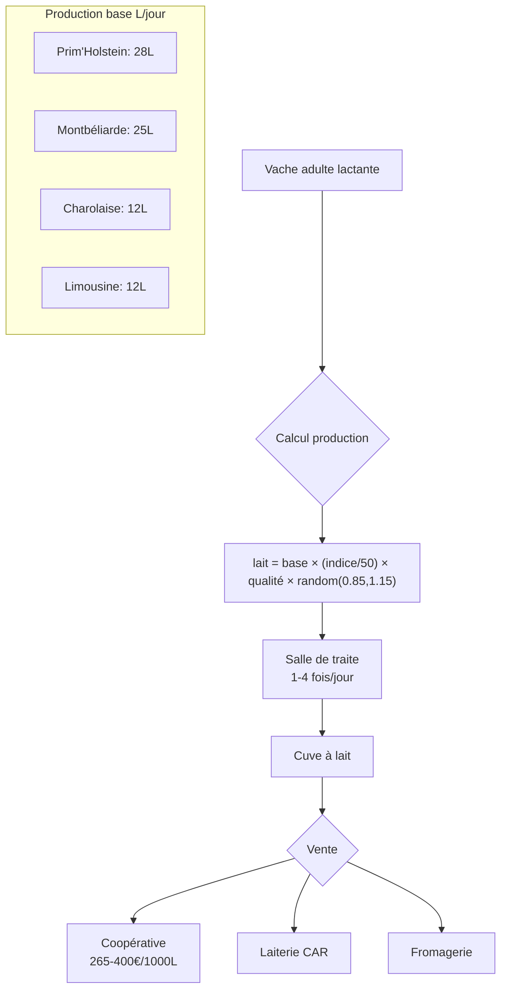

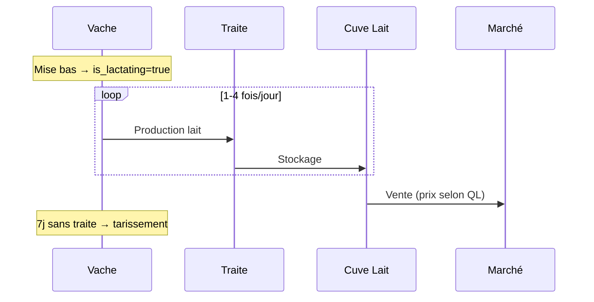

---

## 10. Mise au pré

### 10.1 Description

Les bovins peuvent pâturer en prairie. Les laitières sortent d'avril à octobre. Les allaitantes restent au pré toute l'année avec une ration hivernale (novembre→mars). Chaque animal consomme une surface d'herbe par jour (m²). Au pré, pas besoin de ration de base (sauf hiver allaitantes), mais eau obligatoire via bacs.

### 10.2 SQL

```sql
-- Table suivi pâturage
CREATE TABLE pasture_session (
  id          BIGSERIAL PRIMARY KEY,
  animal_id   BIGINT NOT NULL REFERENCES animal(id),
  parcel_id   INT NOT NULL REFERENCES parcel(id),
  start_date  TIMESTAMPTZ NOT NULL DEFAULT now(),
  end_date    TIMESTAMPTZ,  -- NULL = en cours
  is_winter_ration BOOLEAN NOT NULL DEFAULT false
);
CREATE INDEX idx_pasture_animal ON pasture_session(animal_id, end_date);
```

### 10.3 Logique métier

#### Périodes de pâturage

| Catégorie race | Sortie | Rentrée | Hiver au pré |
|---------------|--------|---------|-------------|
| Laitière (Prim'Holstein, Montbéliarde) | Avril (mois sim 4) | Octobre (mois sim 10) | Non |
| Allaitante (Charolaise, Limousine) | Avril | Toute l'année | Oui + ration hivernale Nov→Mars |

#### Consommation herbe (m²/jour)

| Type animal | Condition | Herbe (m²/jour) |
|-------------|-----------|-----------------|
| Taureau | adult, M | 88 |
| Vache | adult, F | 80 |
| Taurillon | young, M | 80 |
| Génisse | young, F | 72 |
| Veau | newborn | 56 |

#### Ration hivernale au pré (allaitantes, Nov→Mars, kg/jour)

| Tranche | Foin | Orge/blé/trit. | Tourteau | Min.&Vit. | Eau (L) | Total |
|---------|------|---------------|----------|-----------|---------|-------|
| >36 mois | 44 | 6.6 | 2.2 | 1 | 200 | 53.8 |
| 24-36m | 36 | 5.4 | 1.8 | 0.8 | 100 | 44 |
| 18-24m | 28 | 4.2 | 1.4 | 0.7 | 80 | 34 |
| 12-18m | 20 | 3 | 1 | 0.5 | 60 | 25 |
| 6-12m | 16 | 2.4 | 0.8 | 0.4 | 40 | 20 |
| 3-6m | 12 | 1.2 | 0.6 | 0.3 | 28 | 15 |
| 0-3m | 0 | 0 | 0 | 0 | 12 | 0 |

#### Pseudocode — Mise au pré

```pseudo
function moveToPassture(animal_id, parcel_id, player):
    animal = getAnimal(animal_id)
    parcel = getParcel(parcel_id)
    breed = getBreed(animal.breed_id)
    server = getServer(player)

    // Vérifier type parcelle
    if parcel.type != 'meadow':
        return error("La parcelle doit être un pré")

    // Vérifier saison
    month = server.current_month
    is_dairy = breed.category == 'dairy'
    if is_dairy AND (month < 4 OR month > 10):
        return error("Laitières: pâturage avril-octobre uniquement")

    // Vérifier herbe disponible
    grass_need = getGrassNeed(animal)  // m²/jour
    grass_available = getGrassAvailable(parcel)  // m² d'herbe à 100%
    animals_on_parcel = getAnimalsOnParcel(parcel_id)
    total_daily_need = SUM(getGrassNeed(a) for a in animals_on_parcel) + grass_need

    // Herbe doit tenir au moins 7 jours
    if grass_available < total_daily_need * 7:
        return error("Herbe insuffisante sur cette parcelle")

    // Vérifier bac à eau
    trough = getWaterTrough(parcel_id)
    if trough is None:
        return error("Bac à eau requis sur le pré")

    // Déplacer animal
    animal.location_type = 'pasture'
    animal.building_id = null
    animal.parcel_id = parcel_id
    createPastureSession(animal_id, parcel_id)

    // Nécessite bétaillère pour le transport
    deductPA(player, 0.5)

function getGrassNeed(animal):
    if animal.life_stage == 'adult':
        return 88 if animal.sex == 'M' else 80
    elif animal.life_stage == 'young':
        return 80 if animal.sex == 'M' else 72
    else:
        return 56
```

#### Pseudocode — Tick quotidien pâturage

```pseudo
function dailyTickPasture():
    sessions = getActivePastureSessions()

    for session in sessions:
        animal = getAnimal(session.animal_id)
        parcel = getParcel(session.parcel_id)
        server = getServer(animal.farm_id)
        breed = getBreed(animal.breed_id)

        // Consommer herbe
        grass_need = getGrassNeed(animal)
        consumeGrass(parcel, grass_need)

        // Vérifier si ration hivernale nécessaire (allaitantes)
        month = server.current_month
        is_beef = breed.category == 'beef'
        is_winter = (month >= 11 OR month <= 3)

        if is_beef AND is_winter:
            session.is_winter_ration = true
            // Doit être nourri avec ration hivernale (Feature 4)
            if NOT wasFedWinterRation(animal):
                animal.health -= 10

        // Laitières: rentrer automatiquement en novembre
        is_dairy = breed.category == 'dairy'
        if is_dairy AND month > 10:
            returnToBuilding(animal)
            session.end_date = now()

        // Outdoor tracking (pour label BIO)
        animal.outdoor_pct = calculateOutdoorPercentage(animal)
```

### 10.4 API Endpoints

| Méthode | Endpoint | Description | HT |
|---------|----------|-------------|-----|
| POST | `/api/animals/:id/to-pasture` | Mettre au pré | 0.5 |
| POST | `/api/animals/:id/to-building` | Rentrer en bâtiment | 0.5 |
| POST | `/api/parcels/:id/move-herd` | Déplacer troupeau entier | 1.0 |
| GET | `/api/parcels/:id/pasture-status` | Herbe restante + animaux | 0 |

### 10.5 Tests

| ID | Test | Résultat attendu |
|----|------|------------------|
| T10.1 | Prim'Holstein au pré en avril | OK |
| T10.2 | Prim'Holstein au pré en décembre | Erreur "avril-octobre" |
| T10.3 | Charolaise au pré en décembre | OK (allaitante) |
| T10.4 | Charolaise au pré hiver sans ration | health -= 10 |
| T10.5 | 10 vaches, pré 1ha, 1 jour | 10×80 = 800m² herbe consommée |
| T10.6 | Herbe insuffisante (<7j) | Erreur "herbe insuffisante" |
| T10.7 | Pas de bac à eau | Erreur "bac requis" |
| T10.8 | Laitière en novembre | Rentrée automatique |
| T10.9 | outdoor_pct > 50% | Éligible BIO |

### 10.6 Diagramme — Mise au pré

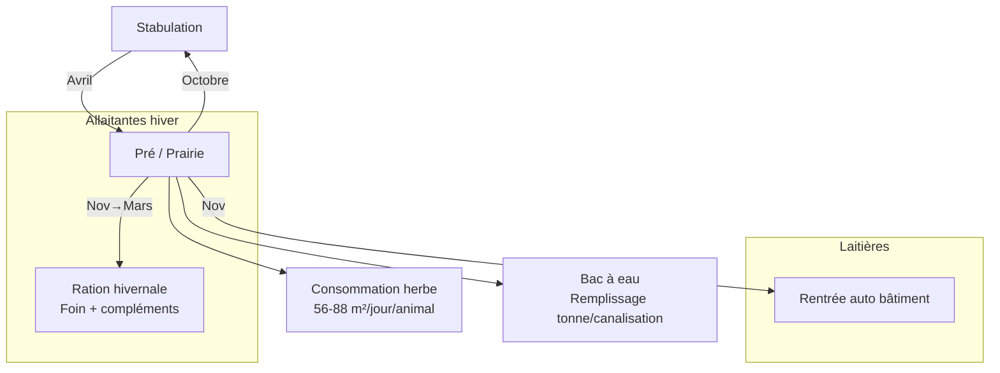

```mermaid
gantt
    title Calendrier pâturage bovins
    dateFormat  MM
    axisFormat %b

    section Laitières
    En bâtiment       :done, 01, 03
    Au pré             :active, 04, 10
    En bâtiment       :done, 11, 12

    section Allaitantes
    Au pré + ration hiver :crit, 01, 03
    Au pré (herbe)        :active, 04, 10
    Au pré + ration hiver :crit, 11, 12
```

---

## 11. Vente abattoir

### 11.1 Description

Les animaux peuvent être vendus à l'abattoir. Le prix dépend du poids de carcasse (rendement 50-75% selon race), de la conformation (A-E) et de l'engraissement (1-5). La génétique (indice Allure) influence la conformation. Les allaitantes ont un meilleur rendement carcasse.

### 11.2 SQL

```sql
CREATE TABLE slaughter_record (
  id              BIGSERIAL PRIMARY KEY,
  animal_id       BIGINT NOT NULL REFERENCES animal(id),
  farm_id         INT NOT NULL REFERENCES farm(id),
  live_weight_kg  DECIMAL(8,2) NOT NULL,
  carcass_weight_kg DECIMAL(8,2) NOT NULL,
  yield_pct       DECIMAL(5,2) NOT NULL,
  conformation    CHAR(1) NOT NULL CHECK (conformation IN ('A','B','C','D','E')),
  fattening       SMALLINT NOT NULL CHECK (fattening BETWEEN 1 AND 5),
  price_per_kg    DECIMAL(6,2) NOT NULL,
  total_price     DECIMAL(12,2) NOT NULL,
  genetic_bonus_pct DECIMAL(5,2) NOT NULL DEFAULT 0,
  is_bio          BOOLEAN NOT NULL DEFAULT false,
  slaughtered_at  TIMESTAMPTZ NOT NULL DEFAULT now()
);
CREATE INDEX idx_slaughter_farm ON slaughter_record(farm_id, slaughtered_at DESC);
```

### 11.3 Logique métier

#### Rendement carcasse par catégorie

| Catégorie | Rendement base | Plage |
|-----------|---------------|-------|
| Laitière | 52% | 50-55% |
| Allaitante | 65% | 55-75% |

#### Formule rendement carcasse

```
rendement_carcasse = base_race + (indice_allure × 0.1)
```

- `base_race` : 52% (laitière) ou 65% (allaitante)
- `indice_allure` : 0-100, base 50
- Résultat plafonné aux bornes de la catégorie

#### Conformation (A=meilleur, E=pire)

```pseudo
function calculateConformation(animal):
    idx_allure = animal.genetics.appearance OR 50
    breed = getBreed(animal.breed_id)

    if breed.category == 'beef':
        // Allaitantes: A à C
        if idx_allure >= 75: return 'A'
        if idx_allure >= 50: return 'B'
        return 'C'
    else:
        // Laitières: C à E
        if idx_allure >= 75: return 'C'
        if idx_allure >= 40: return 'D'
        return 'E'
```

#### Engraissement (1-5, optimal=3)

```pseudo
function calculateFattening(animal):
    breed = getBreed(animal.breed_id)
    target = breed.adult_weight_f if animal.sex == 'F' else breed.adult_weight_m
    ratio = animal.weight_kg / target

    if ratio < 0.7: return 1    // très maigre
    if ratio < 0.85: return 2   // maigre
    if ratio < 1.05: return 3   // optimal
    if ratio < 1.15: return 4   // gras
    return 5                     // très gras
```

#### Prix de vente

```pseudo
// Prix base viande bovine (€/kg carcasse)
BASE_MEAT_PRICE = {
    'A': { 1: 3.80, 2: 4.20, 3: 4.50, 4: 4.00, 5: 3.50 },
    'B': { 1: 3.40, 2: 3.80, 3: 4.10, 4: 3.60, 5: 3.10 },
    'C': { 1: 3.00, 2: 3.40, 3: 3.70, 4: 3.20, 5: 2.70 },
    'D': { 1: 2.60, 2: 3.00, 3: 3.30, 4: 2.80, 5: 2.30 },
    'E': { 1: 2.20, 2: 2.60, 3: 2.90, 4: 2.40, 5: 1.90 }
}

function slaughterAnimal(animal_id, player):
    animal = getAnimal(animal_id)
    breed = getBreed(animal.breed_id)

    // Rendement carcasse
    idx_allure = animal.genetics.appearance OR 50
    base_yield = 0.52 if breed.category == 'dairy' else 0.65
    yield_pct = base_yield + (idx_allure * 0.001)  // 0.1% par point
    yield_pct = clamp(yield_pct,
        0.50 if breed.category == 'dairy' else 0.55,
        0.55 if breed.category == 'dairy' else 0.75)

    carcass_kg = animal.weight_kg * yield_pct

    // Conformation et engraissement
    conformation = calculateConformation(animal)
    fattening = calculateFattening(animal)

    // Prix
    price_per_kg = BASE_MEAT_PRICE[conformation][fattening]

    // Bonus génétique (+1 à +10%)
    genetic_value = animal.genetic_value
    genetic_bonus = clamp(genetic_value / 10, 0.01, 0.10)

    // Bonus BIO (+20%)
    bio_bonus = 1.20 if animal.is_bio else 1.0

    total = carcass_kg * price_per_kg * (1 + genetic_bonus) * bio_bonus

    // Enregistrer
    createSlaughterRecord(animal, carcass_kg, yield_pct, conformation, fattening, price_per_kg, total)
    animal.life_stage = 'dead'
    creditBalance(player, total)
    deductPA(player, 0.25)

    return { carcass_kg, yield_pct, conformation, fattening, price_per_kg, total }
```

### 11.4 API Endpoints

| Méthode | Endpoint | Description | HT |
|---------|----------|-------------|-----|
| POST | `/api/animals/:id/slaughter` | Vendre à l'abattoir | 0.25 |
| GET | `/api/animals/:id/slaughter-estimate` | Estimation prix avant vente | 0 |
| GET | `/api/farm/:id/slaughter-history` | Historique ventes abattoir | 0 |

### 11.5 Tests

| ID | Test | Résultat attendu |
|----|------|------------------|
| T11.1 | Charolaise 750kg, allure 50 | rendement ≈ 65+5 = 70%, carcasse 525kg |
| T11.2 | Prim'Holstein 700kg, allure 50 | rendement ≈ 52+5 = 55% max, carcasse 385kg |
| T11.3 | Conformation allaitante allure 80 | 'A' |
| T11.4 | Conformation laitière allure 80 | 'C' |
| T11.5 | Engraissement poids=target | fattening=3 (optimal) |
| T11.6 | Engraissement poids=50% target | fattening=1 (maigre) |
| T11.7 | Vente BIO | Prix × 1.20 |
| T11.8 | Animal mort après vente | life_stage='dead' |

### 11.6 Diagramme — Vente abattoir

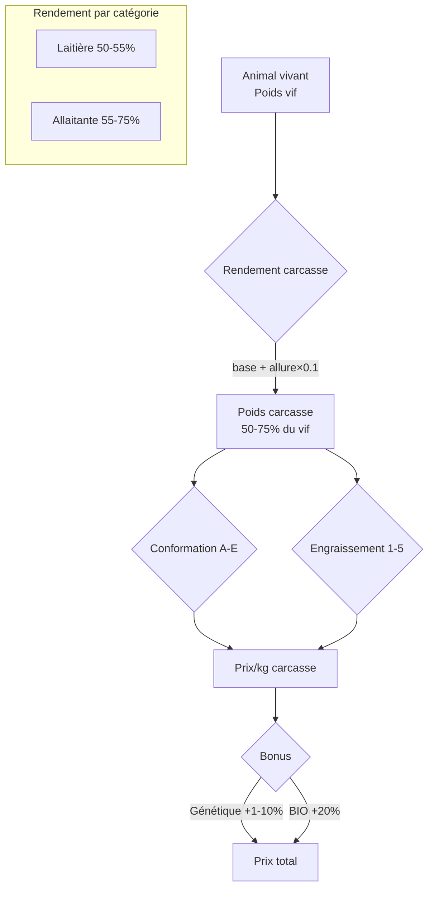

---

## 12. Génétique de base

### 12.1 Description

Chaque bovin possède 5 indices génétiques (0-100, base 50) : Croissance, Prolificité, Allure, Lait, Qualité Lait (QL). À la naissance, les indices sont calculés par héritage des parents + aléa. La génétique impacte la croissance, la production laitière, le rendement carcasse et la valeur marchande.

### 12.2 SQL

```sql
-- La génétique est stockée en JSONB dans animal.genetics (01_DATA_MODEL §3.3)
-- Format: {"growth": 50, "prolificacy": 50, "appearance": 50, "milk": 50, "milk_quality": 50}

-- Table moyenne génétique serveur (pour valorisation)
CREATE TABLE genetic_server_avg (
  id          SERIAL PRIMARY KEY,
  server_id   INT NOT NULL REFERENCES server(id),
  breed_id    INT NOT NULL REFERENCES animal_breed(id),
  index_name  VARCHAR(20) NOT NULL,
  avg_value   DECIMAL(6,2) NOT NULL DEFAULT 50,
  updated_at  TIMESTAMPTZ NOT NULL DEFAULT now(),
  UNIQUE(server_id, breed_id, index_name)
);

-- Vue valorisation génétique
CREATE OR REPLACE VIEW animal_genetic_summary AS
SELECT
  a.id,
  a.farm_id,
  a.breed_id,
  (a.genetics->>'growth')::DECIMAL AS idx_growth,
  (a.genetics->>'prolificacy')::DECIMAL AS idx_prolificacy,
  (a.genetics->>'appearance')::DECIMAL AS idx_appearance,
  (a.genetics->>'milk')::DECIMAL AS idx_milk,
  (a.genetics->>'milk_quality')::DECIMAL AS idx_milk_quality,
  (
    COALESCE((a.genetics->>'growth')::DECIMAL, 50) +
    COALESCE((a.genetics->>'prolificacy')::DECIMAL, 50) +
    COALESCE((a.genetics->>'appearance')::DECIMAL, 50) +
    COALESCE((a.genetics->>'milk')::DECIMAL, 50) +
    COALESCE((a.genetics->>'milk_quality')::DECIMAL, 50)
  ) AS genetic_sum
FROM animal a
WHERE a.life_stage != 'dead';
```

### 12.3 Logique métier

#### Les 5 indices bovins

| Indice | Clé JSON | Impact | Formule d'impact |
|--------|----------|--------|-----------------|
| Croissance | `growth` | Vitesse prise de poids | `croissance_base × (growth/50)` |
| Prolificité | `prolificacy` | Pas d'impact MVP (1 veau fixe) | Réservé Phase future |
| Allure | `appearance` | Rendement carcasse + conformation | `base + (appearance×0.1)` |
| Lait | `milk` | Production laitière | `base_race × (milk/50)` |
| Qualité Lait | `milk_quality` | Prix de vente du lait | Table prix QL |

#### Formule héritage génétique

```
indice_enfant = (indice_pere + indice_mere) / 2 + random(-5, +5)
```

- Résultat borné entre 0 et 100
- `random(-5, +5)` : variation aléatoire uniforme entière

#### Pseudocode — Calcul génétique enfant

```pseudo
GENETIC_INDICES = ['growth', 'prolificacy', 'appearance', 'milk', 'milk_quality']

function calculateOffspringGenetics(mother_genetics, father_genetics):
    child = {}
    for index in GENETIC_INDICES:
        mother_val = mother_genetics[index] OR 50
        father_val = father_genetics[index] OR 50

        // Moyenne parentale + aléa
        base = (mother_val + father_val) / 2
        variation = randomInt(-5, 5)  // entier entre -5 et +5
        child[index] = clamp(round(base + variation), 0, 100)

    return child
```

#### Génétique à l'achat (coop)

```pseudo
function generateCoopGenetics():
    // Animaux de la coop : indices autour de 50 (±10)
    genetics = {}
    for index in GENETIC_INDICES:
        genetics[index] = clamp(50 + randomInt(-10, 10), 0, 100)
    return genetics
```

#### Valorisation génétique

```pseudo
function calculateGeneticValue(animal):
    if NOT animal.is_adult: return 0
    if animal.bought_from != 'born': return 0  // né à la ferme uniquement

    breed = getBreed(animal.breed_id)
    server = getServer(animal.farm_id)

    // Somme des indices
    total = SUM(animal.genetics[idx] for idx in GENETIC_INDICES)

    // Moyenne serveur pour cette race
    server_avg = getServerAverage(server.id, breed.id)

    // Bonus vente: +1% à +10% selon écart à la moyenne
    if total > server_avg:
        bonus_pct = min(10, (total - server_avg) / 10)
    else:
        bonus_pct = 0

    // Valorisation monétaire (vente entre joueurs)
    // Bovins: 2€/point au-dessus de la moyenne
    monetary_value = max(0, (total - server_avg)) * 2.0

    animal.genetic_value = bonus_pct
    return { bonus_pct, monetary_value, total, server_avg }
```

#### Mise à jour moyenne serveur (tick hebdomadaire)

```pseudo
function updateServerGeneticAverages(server_id):
    for breed in getAllBreeds('cattle'):
        for index in GENETIC_INDICES:
            avg = SELECT AVG((genetics->>index)::DECIMAL)
                  FROM animal
                  WHERE breed_id = breed.id
                    AND farm_id IN (SELECT id FROM farm WHERE player_id IN
                        (SELECT id FROM player WHERE server_id = server_id))
                    AND life_stage = 'adult'
                    AND bought_from = 'born'

            UPSERT genetic_server_avg SET avg_value = COALESCE(avg, 50)
              WHERE server_id = server_id AND breed_id = breed.id AND index_name = index
```

### 12.4 API Endpoints

| Méthode | Endpoint | Description | HT |
|---------|----------|-------------|-----|
| GET | `/api/animals/:id/genetics` | Indices génétiques détaillés | 0 |
| GET | `/api/genetics/server-avg?breed_id=X` | Moyennes serveur par race | 0 |
| GET | `/api/genetics/ranking?breed_id=X&index=milk` | Classement génétique | 0 |
| GET | `/api/animals/:id/genetic-value` | Valorisation génétique | 0 |

### 12.5 Tests

| ID | Test | Résultat attendu |
|----|------|------------------|
| T12.1 | Père growth=60, mère growth=80 | Enfant growth ∈ [65, 75] (70±5) |
| T12.2 | Père milk=100, mère milk=100 | Enfant milk ∈ [95, 100] (borné à 100) |
| T12.3 | Père=0, mère=0 | Enfant ∈ [0, 5] (borné à 0) |
| T12.4 | Achat coop | Tous indices ∈ [40, 60] |
| T12.5 | Animal né ferme, adulte, somme > avg serveur | genetic_value > 0 |
| T12.6 | Animal acheté coop | genetic_value = 0 (pas né ferme) |
| T12.7 | Impact growth=75 sur croissance | gain × 1.5 vs indice 50 |
| T12.8 | Impact milk=75 sur lait | production × 1.5 vs indice 50 |
| T12.9 | Impact appearance=75 sur carcasse | rendement +7.5% vs base |
| T12.10 | 100 naissances, vérifier distribution | Moyenne enfants ≈ moyenne parents |

### 12.6 Diagramme — Système génétique

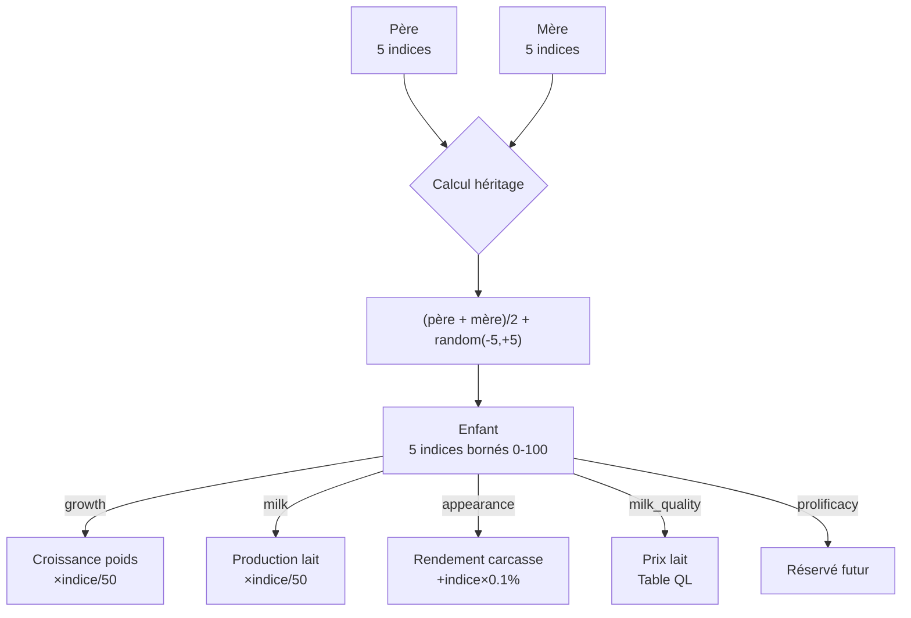

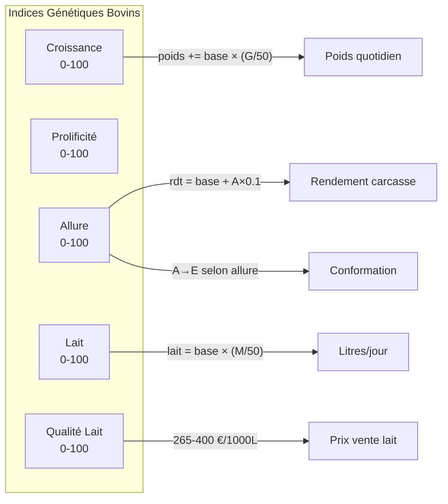

---

## Annexe A — Diagramme ER Phase 2

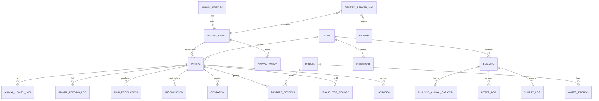

---

## Annexe B — Flux global Daily Tick Phase 2

```mermaid
flowchart TD
    TICK[Daily Tick 00:00 UTC] --> A1[1. Vieillissement animaux<br/>age_days += 1]
    A1 --> A1b[1b. Nourrissage auto<br/>ration configurée appliquée<br/>PO 4.1]
    A1b --> A2[2. Transitions cycle vie<br/>newborn→young→adult]
    A2 --> A3[3. Vérif alimentation<br/>health -= si pas nourri]
    A3 --> A4[4. Vérif abreuvement<br/>health -= 15 si pas abreuvé]
    A4 --> A5[5. Vérif litière<br/>health -= 5 si manquante]
    A5 --> A6[6. Mort si health=0<br/>ou vieillesse]
    A6 --> A7[7. Croissance poids<br/>formule croissance]
    A7 --> A8[8. Production litière/fumier<br/>ou lisier]
    A8 --> A9[9. Consommation herbe pré<br/>m²/jour]
    A9 --> A10[10. Gestations à terme<br/>→ naissance veaux]
    A10 --> A11[11. Tarissement<br/>7j sans traite]
    A11 --> A12[12. Rentrée auto laitières<br/>si novembre]
    A12 --> A13[13. Mise à jour outdoor_pct]
```

---

## Annexe C — Résumé des formules critiques

| Formule | Expression | Variables |
|---------|-----------|----------|
| **Poids quotidien** | `poids += croissance_base × qualite_ration × (indice_croissance/50)` | croissance_base: kg/j par race/sexe, qualité: 0.7/0.85/1.0 |
| **Lait quotidien** | `base_race × (indice_lait/50) × qualite_ration × random(0.85,1.15)` | base: 12-28 L/j selon race |
| **Rendement carcasse** | `base_race + (indice_allure × 0.1)` | base: 52% (lait) ou 65% (viande), borné 50-75% |
| **Indice enfant** | `(indice_pere + indice_mere)/2 + random(-5,+5)` | Borné [0, 100] |
| **Santé dégradation** | `health -= 10×days_unfed` (faim), `-15` (soif), `-5` (litière) | health: 0-100 |
| **Consommation herbe** | `56-88 m²/jour` selon type animal | Taureau 88, Vache 80, Jeune M 80, Jeune F 72, Veau 56 |

---

> **Cultivia Clone — PHASE2_ELEVAGE.md — v1.0**
> 12 features, ~15 tables (nouvelles + seeds), 4 races MVP
> Dépendances: Phase 0 (bâtiments, inventaire), Phase 1 (foin, maïs ensilé, paille, herbe)
> Source: GDD 03_ELEVAGE, 01_DATA_MODEL, 02_GAME_SYSTEMS, 03_CONTENT_DATA
