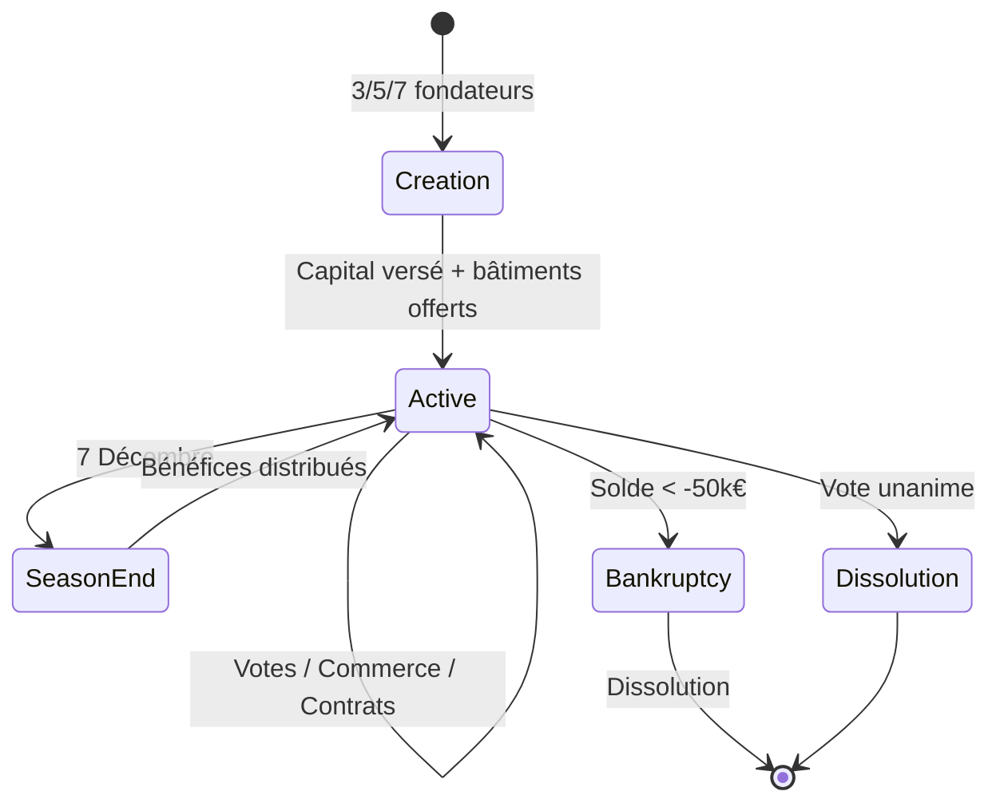
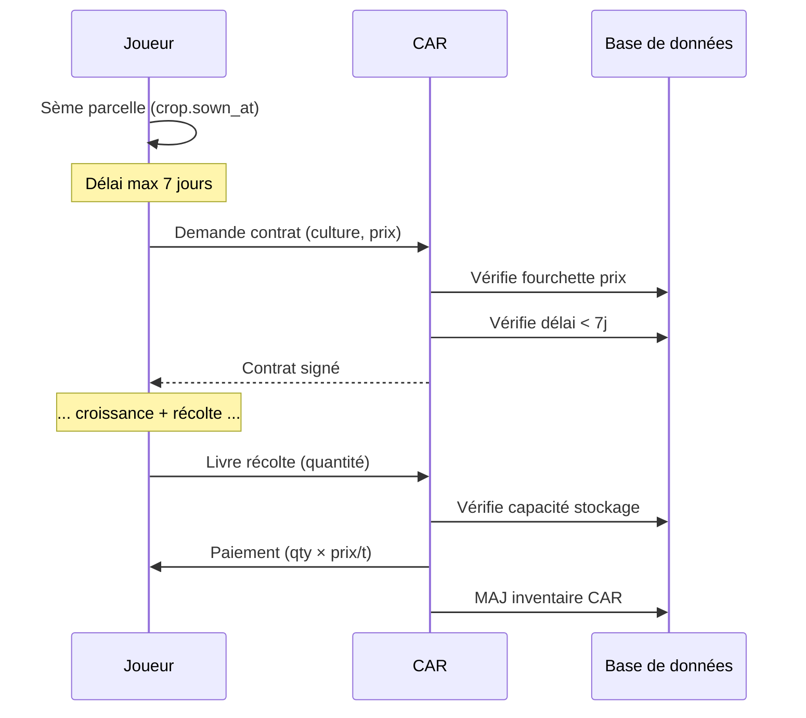
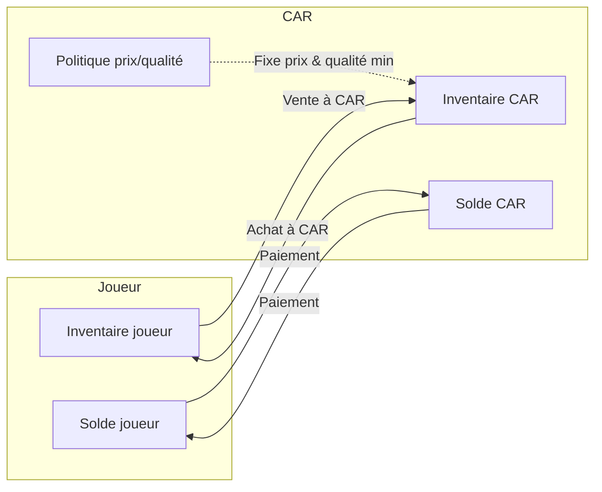
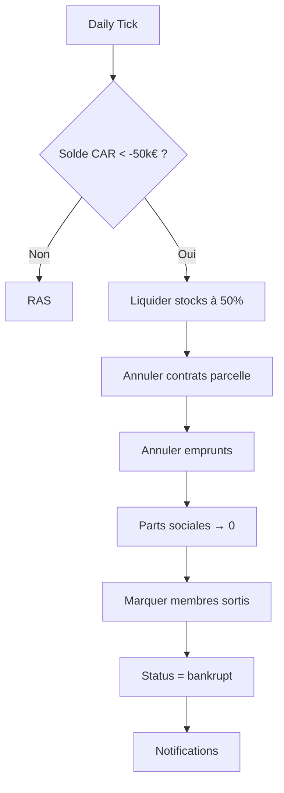
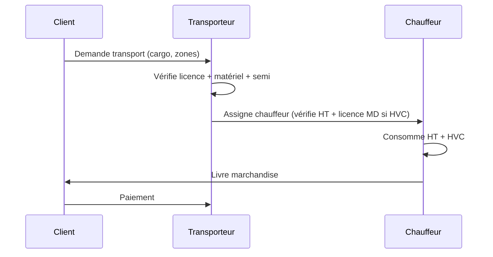
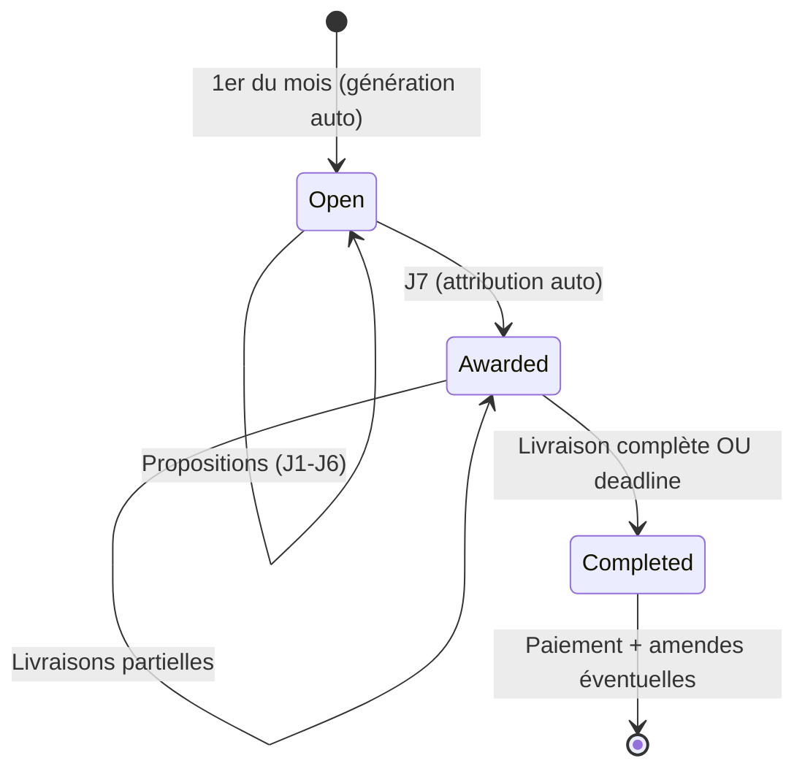

# PHASE 3 — Économie & Commerce

> **Cultivia Clone — Spécifications techniques détaillées**
> Réf : 01_DATA_MODEL.md, 02_GAME_SYSTEMS.md, GDD/01_ECONOMIE.md
> 15 features · SQL · Logique métier · API · Tests · Diagrammes

---

## Table des matières

1. [CAR — Création & Gestion](#1-car--création--gestion)
2. [CAR — Contrats parcelle](#2-car--contrats-parcelle)
3. [CAR — Achat/Vente récoltes](#3-car--achatvente-récoltes)
4. [CAR — Emprunts](#4-car--emprunts)
5. [CAR — Faillite](#5-car--faillite)
6. [Annonces](#6-annonces)
7. [Amis privilégiés](#7-amis-privilégiés)
8. [Transport routier](#8-transport-routier)
9. [Vente parcelles entre joueurs](#9-vente-parcelles-entre-joueurs)
10. [Commerce animaux entre joueurs](#10-commerce-animaux-entre-joueurs)
11. [Épargne](#11-épargne)
12. [Parts sociales CAR](#12-parts-sociales-car)
13. [Employé agricole](#13-employé-agricole)
14. [ETA](#14-eta)
15. [Appels d'offres usines](#15-appels-doffres-usines)

---

## 1. CAR — Création & Gestion

### 1.1 Description

La Coopérative Agricole Régionale (CAR) est une structure multi-joueurs régionale. 3, 5 ou 7 associés fondateurs mettent en commun un capital (max 1M€) pour créer une entité économique disposant de bâtiments (silo, entrepôt), d'un compte bancaire propre, et d'un système de vote pour les décisions collectives. Les bénéfices sont redistribués en fin de saison au prorata des parts.

### 1.2 Règles métier

- **Éligibilité fondateur** : ancienneté ≥ 90 jours, Licence Pro actif, activité CAR débloquée
- **Nombre d'associés** : exactement 3, 5 ou 7 (fixé à la création, non modifiable)
- **Capital initial** : chaque fondateur apporte une part ; total ≤ 1 000 000 €
- **Région** : 1 CAR par région max par groupe de fondateurs ; tous les fondateurs doivent avoir une ferme dans la même région
- **Bâtiments offerts** : 1 silo (100t) + 1 entrepôt (100m²) à la création
- **Vote** : majorité simple (>50% des associés) pour toute décision (prix, contrats, emprunts, dividendes)
- **Bénéfices fin de saison** : calculés le 7 Décembre Cultivia, distribués au prorata du capital détenu
- **Un joueur** ne peut être associé que d'**une seule CAR** à la fois
- **Démission** : possible, parts remboursées à 1€/part après 84 jours de détention

### 1.3 SQL

```sql
-- Table principale déjà dans 01_DATA_MODEL (coop_regional, coop_member)
-- Tables complémentaires :

CREATE TABLE car_vote (
  id            SERIAL PRIMARY KEY,
  car_id        INT NOT NULL REFERENCES coop_regional(id),
  proposer_id   INT NOT NULL REFERENCES player(id),
  subject       VARCHAR(50) NOT NULL,  -- 'set_price','accept_crop','loan','dividend','expel_member'
  payload       JSONB NOT NULL,        -- {crop:'wheat', price:95.00} etc.
  votes_for     INT NOT NULL DEFAULT 0,
  votes_against INT NOT NULL DEFAULT 0,
  status        VARCHAR(10) NOT NULL DEFAULT 'pending', -- 'pending','passed','rejected','expired'
  created_at    TIMESTAMPTZ NOT NULL DEFAULT now(),
  expires_at    TIMESTAMPTZ NOT NULL   -- +3 jours Cultivia
);

CREATE TABLE car_vote_ballot (
  id        SERIAL PRIMARY KEY,
  vote_id   INT NOT NULL REFERENCES car_vote(id),
  player_id INT NOT NULL REFERENCES player(id),
  choice    BOOLEAN NOT NULL,          -- true=pour, false=contre
  voted_at  TIMESTAMPTZ NOT NULL DEFAULT now(),
  UNIQUE(vote_id, player_id)
);

CREATE TABLE car_building (
  id              SERIAL PRIMARY KEY,
  car_id          INT NOT NULL REFERENCES coop_regional(id),
  building_type   VARCHAR(30) NOT NULL, -- 'silo','warehouse','shop'
  capacity        DECIMAL(12,2) NOT NULL,
  unit            VARCHAR(10) NOT NULL DEFAULT 't', -- t, m2
  cost            DECIMAL(12,2) NOT NULL DEFAULT 0,
  built_at        TIMESTAMPTZ NOT NULL DEFAULT now()
);

CREATE TABLE car_inventory (
  id          BIGSERIAL PRIMARY KEY,
  car_id      INT NOT NULL REFERENCES coop_regional(id),
  building_id INT NOT NULL REFERENCES car_building(id),
  product     VARCHAR(50) NOT NULL,
  quality     SMALLINT CHECK (quality BETWEEN 1 AND 3),
  quantity    DECIMAL(14,2) NOT NULL DEFAULT 0,
  unit        VARCHAR(10) NOT NULL DEFAULT 'kg',
  UNIQUE(car_id, building_id, product, quality)
);

CREATE TABLE car_season_report (
  id              SERIAL PRIMARY KEY,
  car_id          INT NOT NULL REFERENCES coop_regional(id),
  season          INT NOT NULL,
  revenue         DECIMAL(14,2) NOT NULL DEFAULT 0,
  expenses        DECIMAL(14,2) NOT NULL DEFAULT 0,
  profit          DECIMAL(14,2) NOT NULL DEFAULT 0,
  distributed     DECIMAL(14,2) NOT NULL DEFAULT 0,
  created_at      TIMESTAMPTZ NOT NULL DEFAULT now(),
  UNIQUE(car_id, season)
);
```

### 1.4 Logique métier

```
function createCAR(founder_ids: int[], name: string, region_id: int, capital_per_player: map<int,decimal>):
    VALIDATE len(founder_ids) IN (3, 5, 7)
    VALIDATE sum(capital_per_player.values()) <= 1_000_000
    FOR EACH pid IN founder_ids:
        VALIDATE player[pid].seniority_days >= 90
        VALIDATE player[pid].license_expires > now()
        VALIDATE hasUnlock(pid, 'car')
        VALIDATE player[pid] has farm in region_id
        VALIDATE player[pid] not already in another CAR
        VALIDATE player[pid].balance >= capital_per_player[pid]

    BEGIN TRANSACTION
        INSERT coop_regional(region_id, name, max_members=len(founder_ids), capital=sum)
        FOR EACH pid: 
            debit player balance by capital_per_player[pid]
            INSERT coop_member(car_id, player_id=pid, is_founder=true, shares=capital_per_player[pid])
        credit coop_regional.balance by total capital
        INSERT car_building(silo 100t) -- offert
        INSERT car_building(warehouse 100m²) -- offert
    COMMIT

function distributeSeasonProfits(car_id: int):
    -- Appelé par le daily tick le 7 Décembre Cultivia
    report = calculateSeasonReport(car_id)
    IF report.profit <= 0: RETURN
    total_shares = SUM(coop_member.shares WHERE car_id)
    FOR EACH member IN coop_member WHERE car_id:
        share_pct = member.shares / total_shares
        payout = report.profit * share_pct
        credit member.player.balance by payout
        INSERT transaction(player_id, amount=payout, category='car_dividend')
    debit coop_regional.balance by total distributed

function submitVote(car_id, proposer_id, subject, payload):
    VALIDATE proposer_id is member of car_id
    INSERT car_vote(..., expires_at = now() + 3 CULTIVIA_DAYS)

function castBallot(vote_id, player_id, choice):
    VALIDATE vote is 'pending' AND not expired
    VALIDATE player_id is member of vote.car_id
    INSERT car_vote_ballot(vote_id, player_id, choice)
    UPDATE car_vote SET votes_for/against
    -- Auto-resolve si majorité atteinte
    total_members = COUNT(coop_member WHERE car_id)
    IF votes_for > total_members / 2: SET status='passed', apply decision
    IF votes_against >= ceil(total_members / 2): SET status='rejected'
```

### 1.5 API Endpoints

| Méthode | Endpoint | Description |
|---|---|---|
| POST | `/api/car` | Créer une CAR |
| GET | `/api/car/:id` | Détails CAR (membres, capital, solde, bâtiments) |
| GET | `/api/car/:id/inventory` | Stocks CAR |
| POST | `/api/car/:id/buildings` | Construire bâtiment CAR |
| POST | `/api/car/:id/votes` | Proposer un vote |
| GET | `/api/car/:id/votes` | Liste des votes en cours |
| POST | `/api/car/:id/votes/:vid/ballot` | Voter |
| GET | `/api/car/:id/reports` | Rapports saisonniers |
| POST | `/api/car/:id/resign` | Démissionner |

### 1.6 Tests

| ID | Scénario | Résultat attendu |
|---|---|---|
| CAR-01 | Création avec 3 joueurs éligibles, capital 300k€ | CAR créée, soldes débités, silo+entrepôt créés |
| CAR-02 | Création avec 4 joueurs | Rejet : nombre invalide |
| CAR-03 | Création avec joueur < 90j ancienneté | Rejet : ancienneté insuffisante |
| CAR-04 | Création capital > 1M€ | Rejet : capital max dépassé |
| CAR-05 | Joueur déjà dans une CAR tente de créer/rejoindre | Rejet |
| CAR-06 | Vote majorité 2/3 sur CAR à 3 membres | Vote passe dès 2 votes pour |
| CAR-07 | Vote expire après 3 jours sans majorité | Status = expired |
| CAR-08 | Distribution bénéfices fin saison, profit 100k€, 2 membres 60/40% | 60k€ et 40k€ distribués |
| CAR-09 | Distribution avec profit négatif | Aucune distribution |
| CAR-10 | Fondateurs dans régions différentes | Rejet |

### 1.7 Diagramme — Cycle de vie CAR



---

## 2. CAR — Contrats parcelle

### 2.1 Description

Un contrat parcelle lie un joueur-membre à sa CAR : la CAR s'engage à racheter **toute** la récolte d'une parcelle, quelle que soit la qualité ou le rendement, à un prix négocié. Le contrat doit être signé dans les 7 jours suivant le semis.

### 2.2 Règles métier

- **Éligibilité** : le joueur doit être membre de la CAR
- **Délai** : signature dans les 7 jours Cultivia après le semis (crop.sown_at + 7 jours)
- **Prix** : négocié entre le joueur et la CAR, dans les fourchettes fixées par vote des associés
- **Engagement** : la CAR rachète 100% de la récolte, sans condition de qualité
- **Livraison** : le joueur livre à la CAR après récolte ; la CAR doit avoir la capacité silo/entrepôt
- **Paiement** : à la livraison
- **1 contrat par parcelle** par cycle de culture
- **Annulation** : impossible après signature

### 2.3 SQL

```sql
-- car_contract déjà dans 01_DATA_MODEL, on enrichit :

CREATE TABLE car_price_range (
  id            SERIAL PRIMARY KEY,
  car_id        INT NOT NULL REFERENCES coop_regional(id),
  crop_type_id  INT NOT NULL REFERENCES crop_type(id),
  min_price     DECIMAL(10,2) NOT NULL,
  max_price     DECIMAL(10,2) NOT NULL,
  set_by_vote   INT REFERENCES car_vote(id),
  updated_at    TIMESTAMPTZ NOT NULL DEFAULT now(),
  UNIQUE(car_id, crop_type_id),
  CHECK(min_price <= max_price)
);

-- Enrichissement de car_contract :
ALTER TABLE car_contract ADD COLUMN parcel_id INT REFERENCES parcel(id);
ALTER TABLE car_contract ADD COLUMN status VARCHAR(15) NOT NULL DEFAULT 'active';
  -- 'active','delivered','paid','cancelled'
ALTER TABLE car_contract ADD COLUMN delivered_qty DECIMAL(12,2);
ALTER TABLE car_contract ADD COLUMN paid_at TIMESTAMPTZ;
```

### 2.4 Logique métier

```
function signParcelContract(car_id, player_id, parcel_id, crop_type_id, price_per_ton):
    crop = getCropOnParcel(parcel_id)
    VALIDATE crop IS NOT NULL AND crop.crop_type_id == crop_type_id
    VALIDATE (now() - crop.sown_at) <= 7 CULTIVIA_DAYS
    VALIDATE player_id is member of car_id
    VALIDATE no existing active contract on this parcel for this crop cycle
    range = car_price_range WHERE car_id AND crop_type_id
    VALIDATE range EXISTS AND price_per_ton BETWEEN range.min_price AND range.max_price
    INSERT car_contract(car_id, player_id, crop_type_id, parcel_id, price_per_ton, status='active')
    UPDATE crop SET car_contract_id = new_contract.id

function deliverContractCrop(contract_id, quantity_tons):
    contract = car_contract[contract_id]
    VALIDATE contract.status == 'active'
    VALIDATE CAR has storage capacity for quantity
    total_payment = quantity_tons * contract.price_per_ton
    VALIDATE coop_regional.balance >= total_payment
    BEGIN TRANSACTION
        UPDATE car_contract SET delivered_qty=quantity_tons, status='delivered'
        ADD to car_inventory
        DEBIT coop_regional.balance by total_payment
        CREDIT player.balance by total_payment
        UPDATE car_contract SET status='paid', paid_at=now()
        INSERT transaction for both player and CAR
    COMMIT
```

### 2.5 API Endpoints

| Méthode | Endpoint | Description |
|---|---|---|
| POST | `/api/car/:id/contracts` | Signer un contrat parcelle |
| GET | `/api/car/:id/contracts` | Liste des contrats |
| GET | `/api/car/:id/price-ranges` | Fourchettes de prix par culture |
| POST | `/api/car/:id/contracts/:cid/deliver` | Livrer la récolte |

### 2.6 Tests

| ID | Scénario | Résultat attendu |
|---|---|---|
| CC-01 | Signature J+5 après semis, prix dans fourchette | Contrat créé |
| CC-02 | Signature J+8 après semis | Rejet : délai dépassé |
| CC-03 | Prix hors fourchette | Rejet |
| CC-04 | Joueur non-membre | Rejet |
| CC-05 | Parcelle sans culture active | Rejet |
| CC-06 | Livraison récolte 50t à 100€/t | 5000€ crédités au joueur, stock CAR +50t |
| CC-07 | Livraison quand CAR n'a pas assez de capacité silo | Rejet |
| CC-08 | Double contrat sur même parcelle même cycle | Rejet |

### 2.7 Diagramme — Flux contrat parcelle



---

## 3. CAR — Achat/Vente récoltes

### 3.1 Description

La CAR achète des récoltes aux joueurs (membres ou non selon politique) et les revend. Les prix d'achat et de vente sont fixés par vote des associés, exprimés en % du prix de référence Le Marché Central. La CAR peut refuser certains types de récoltes.

### 3.2 Règles métier

- **Prix** : fixés par vote, exprimés en % marge sur le prix de référence (ex: achat à 90% du cours, vente à 110%)
- **Qualité** : seule la bonne qualité (3) est acceptée par défaut ; les autres qualités selon politique votée
- **Refus** : la CAR peut voter pour refuser certaines cultures
- **Stock** : limité par la capacité des bâtiments CAR (silos/entrepôts)
- **Acheteurs** : tout joueur de la région peut acheter à la CAR
- **Vendeurs** : membres de la CAR uniquement (sauf politique contraire votée)
- **PA** : coût de déplacement vers la CAR (0.25 HT/zone ou distance réelle entre cantons)

### 3.3 SQL

```sql
CREATE TABLE car_trade_policy (
  id            SERIAL PRIMARY KEY,
  car_id        INT NOT NULL REFERENCES coop_regional(id),
  crop_type_id  INT NOT NULL REFERENCES crop_type(id),
  buy_enabled   BOOLEAN NOT NULL DEFAULT true,
  sell_enabled  BOOLEAN NOT NULL DEFAULT true,
  buy_pct       DECIMAL(5,2) NOT NULL DEFAULT 90.00,   -- % du prix référence
  sell_pct      DECIMAL(5,2) NOT NULL DEFAULT 110.00,
  min_quality   SMALLINT NOT NULL DEFAULT 3,
  set_by_vote   INT REFERENCES car_vote(id),
  updated_at    TIMESTAMPTZ NOT NULL DEFAULT now(),
  UNIQUE(car_id, crop_type_id)
);

CREATE TABLE car_trade (
  id          BIGSERIAL PRIMARY KEY,
  car_id      INT NOT NULL REFERENCES coop_regional(id),
  player_id   INT NOT NULL REFERENCES player(id),
  direction   CHAR(1) NOT NULL CHECK (direction IN ('B','S')), -- B=CAR buys, S=CAR sells
  product     VARCHAR(50) NOT NULL,
  quality     SMALLINT NOT NULL,
  quantity    DECIMAL(14,2) NOT NULL,
  unit_price  DECIMAL(10,2) NOT NULL,
  total       DECIMAL(14,2) NOT NULL,
  created_at  TIMESTAMPTZ NOT NULL DEFAULT now()
);
```

### 3.4 Logique métier

```
function sellToCAR(car_id, player_id, product, quality, quantity):
    policy = car_trade_policy WHERE car_id AND crop_type_id=product
    VALIDATE policy.buy_enabled == true
    VALIDATE quality >= policy.min_quality
    VALIDATE player has quantity in inventory
    ref_price = getCoopPrice(product, quality)
    unit_price = ref_price * (policy.buy_pct / 100)
    total = quantity * unit_price
    VALIDATE coop_regional.balance >= total
    VALIDATE CAR has storage capacity
    BEGIN TRANSACTION
        DEBIT player inventory
        CREDIT car_inventory
        DEBIT coop_regional.balance
        CREDIT player.balance
        INSERT car_trade(direction='B', ...)
    COMMIT

function buyFromCAR(car_id, player_id, product, quality, quantity):
    policy = car_trade_policy WHERE car_id AND crop_type_id=product
    VALIDATE policy.sell_enabled == true
    VALIDATE car_inventory has quantity of product/quality
    ref_price = getCoopPrice(product, quality)
    unit_price = ref_price * (policy.sell_pct / 100)
    total = quantity * unit_price
    VALIDATE player.balance >= total
    VALIDATE player has storage capacity
    BEGIN TRANSACTION
        DEBIT car_inventory
        CREDIT player inventory
        CREDIT coop_regional.balance
        DEBIT player.balance
        INSERT car_trade(direction='S', ...)
    COMMIT
```

### 3.5 API Endpoints

| Méthode | Endpoint | Description |
|---|---|---|
| GET | `/api/car/:id/trade-policies` | Politiques achat/vente par culture |
| POST | `/api/car/:id/sell` | Vendre une récolte à la CAR |
| POST | `/api/car/:id/buy` | Acheter une récolte à la CAR |
| GET | `/api/car/:id/trades` | Historique des transactions |

### 3.6 Tests

| ID | Scénario | Résultat attendu |
|---|---|---|
| CT-01 | Vente 10t blé qualité 3 à CAR (buy_pct=90%, ref=100€/t) | Joueur reçoit 900€, stock CAR +10t |
| CT-02 | Vente qualité 1 quand min_quality=3 | Rejet |
| CT-03 | Vente culture désactivée (buy_enabled=false) | Rejet |
| CT-04 | Achat quand stock CAR insuffisant | Rejet |
| CT-05 | Achat quand solde joueur insuffisant | Rejet |
| CT-06 | Vente quand solde CAR insuffisant | Rejet |

### 3.7 Diagramme — Flux achat/vente




---

## 4. CAR — Emprunts

### 4.1 Description

Les membres d'une CAR peuvent emprunter de l'argent à la CAR à taux 0%. Le montant maximum empruntable est égal au capital de la CAR. Le remboursement est dû en fin de saison (7 Décembre) ou par anticipation sans pénalité.

### 4.2 Règles métier

- **Taux** : 0% (pas d'intérêts)
- **Montant max** : ≤ capital de la CAR (coop_regional.capital)
- **Cumul** : total des emprunts en cours de tous les membres ≤ capital
- **Éligibilité** : membre de la CAR uniquement
- **Approbation** : par vote des associés (majorité simple)
- **Remboursement** : automatique le 7 Décembre Cultivia (fin de saison)
- **Remboursement anticipé** : possible à tout moment, sans pénalité
- **Défaut** : si le joueur ne peut pas rembourser en fin de saison → dette reportée, intérêts de retard 0% mais blocage des dividendes
- **Solde CAR** : l'emprunt est débité du solde CAR (pas du capital)

### 4.3 SQL

```sql
CREATE TABLE car_loan (
  id            SERIAL PRIMARY KEY,
  car_id        INT NOT NULL REFERENCES coop_regional(id),
  player_id     INT NOT NULL REFERENCES player(id),
  amount        DECIMAL(12,2) NOT NULL,
  remaining     DECIMAL(12,2) NOT NULL,
  vote_id       INT NOT NULL REFERENCES car_vote(id),
  status        VARCHAR(15) NOT NULL DEFAULT 'active', -- 'active','repaid','defaulted'
  granted_at    TIMESTAMPTZ NOT NULL DEFAULT now(),
  due_at        TIMESTAMPTZ NOT NULL, -- 7 Décembre de la saison en cours
  repaid_at     TIMESTAMPTZ
);
```

### 4.4 Logique métier

```
function requestCARLoan(car_id, player_id, amount):
    VALIDATE player_id is member of car_id
    total_outstanding = SUM(car_loan.remaining WHERE car_id AND status='active')
    VALIDATE (total_outstanding + amount) <= coop_regional.capital
    VALIDATE coop_regional.balance >= amount
    -- Crée un vote pour approbation
    vote = submitVote(car_id, player_id, 'loan', {player: player_id, amount})
    RETURN vote.id  -- le prêt sera créé quand le vote passe

function onLoanVotePassed(vote):
    payload = vote.payload
    BEGIN TRANSACTION
        INSERT car_loan(car_id, player_id=payload.player, amount, remaining=amount, vote_id, due_at=nextSeasonEnd())
        DEBIT coop_regional.balance by amount
        CREDIT player.balance by amount
        INSERT transaction for both
    COMMIT

function repayLoan(loan_id, amount):
    loan = car_loan[loan_id]
    VALIDATE loan.status == 'active'
    VALIDATE amount <= loan.remaining
    VALIDATE player.balance >= amount
    BEGIN TRANSACTION
        DEBIT player.balance by amount
        CREDIT coop_regional.balance by amount
        UPDATE car_loan SET remaining -= amount
        IF remaining == 0: SET status='repaid', repaid_at=now()
        INSERT transaction for both
    COMMIT

function seasonEndLoanCollection(car_id):
    -- Appelé par daily tick le 7 Décembre
    FOR EACH loan IN car_loan WHERE car_id AND status='active':
        IF player.balance >= loan.remaining:
            repayLoan(loan.id, loan.remaining)
        ELSE:
            -- Prélève ce qui est possible, reste en défaut
            available = max(0, player.balance)
            IF available > 0: repayLoan(loan.id, available)
            UPDATE car_loan SET status='defaulted'
            -- Bloquer dividendes du joueur jusqu'au remboursement
```

### 4.5 API Endpoints

| Méthode | Endpoint | Description |
|---|---|---|
| POST | `/api/car/:id/loans` | Demander un emprunt (crée un vote) |
| GET | `/api/car/:id/loans` | Liste des emprunts |
| POST | `/api/car/:id/loans/:lid/repay` | Rembourser (total ou partiel) |

### 4.6 Tests

| ID | Scénario | Résultat attendu |
|---|---|---|
| CL-01 | Emprunt 50k€, capital CAR 100k€, aucun emprunt en cours | Vote créé |
| CL-02 | Emprunt 60k€ quand 50k€ déjà empruntés, capital 100k€ | Rejet : dépasse capital |
| CL-03 | Vote approuvé → prêt accordé | Solde joueur +50k€, solde CAR -50k€ |
| CL-04 | Remboursement anticipé 20k€ | Remaining = 30k€ |
| CL-05 | Fin de saison, joueur a assez | Remboursement auto, status=repaid |
| CL-06 | Fin de saison, joueur n'a pas assez | Prélèvement partiel, status=defaulted |
| CL-07 | Joueur non-membre demande emprunt | Rejet |

---

## 5. CAR — Faillite

### 5.1 Description

Si le solde bancaire de la CAR descend sous -30 000€, la faillite est déclenchée automatiquement. La CAR est dissoute, les parts sociales sont perdues, les stocks sont liquidés.

### 5.2 Règles métier

- **Seuil** : balance < -30 000€
- **Déclenchement** : automatique par le daily tick (vérification quotidienne)
- **Conséquences** :
  - Dissolution immédiate de la CAR
  - Parts sociales de tous les détenteurs → valeur 0 (perte totale)
  - Stocks CAR liquidés au prix Le Marché Central (50% du cours) → crédités au solde CAR
  - Emprunts en cours → annulés (perte pour la CAR)
  - Contrats parcelle en cours → annulés
  - Bâtiments CAR → détruits (pas de récupération)
  - Laiterie/Huilerie/Sucrerie → détruites
  - Solde résiduel (même négatif) → absorbé par le système (sink)
- **Notification** : tous les membres et détenteurs de parts sont notifiés
- **Cooldown** : les anciens membres ne peuvent pas recréer de CAR pendant 1 saison (84 jours)

### 5.3 SQL

```sql
ALTER TABLE coop_regional ADD COLUMN status VARCHAR(15) NOT NULL DEFAULT 'active';
  -- 'active','bankrupt','dissolved'
ALTER TABLE coop_regional ADD COLUMN dissolved_at TIMESTAMPTZ;

ALTER TABLE coop_member ADD COLUMN left_at TIMESTAMPTZ;
ALTER TABLE coop_member ADD COLUMN leave_reason VARCHAR(20);
  -- 'resigned','bankruptcy','expelled'
```

### 5.4 Logique métier

```
function checkCARBankruptcy():
    -- Appelé par daily tick
    FOR EACH car IN coop_regional WHERE status='active' AND balance < -50000:
        triggerBankruptcy(car.id)

function triggerBankruptcy(car_id):
    BEGIN TRANSACTION
        -- 1. Liquider les stocks
        FOR EACH item IN car_inventory WHERE car_id:
            liquidation_price = getCoopPrice(item.product, item.quality) * 0.50
            revenue = item.quantity * liquidation_price
            CREDIT coop_regional.balance by revenue
            DELETE car_inventory item

        -- 2. Annuler contrats parcelle
        UPDATE car_contract SET status='cancelled' WHERE car_id AND status='active'

        -- 3. Annuler emprunts
        UPDATE car_loan SET status='defaulted' WHERE car_id AND status='active'

        -- 4. Annuler parts sociales (tous détenteurs)
        UPDATE car_share SET value=0, status='lost' WHERE car_id

        -- 5. Marquer membres comme sortis
        UPDATE coop_member SET left_at=now(), leave_reason='bankruptcy' WHERE car_id

        -- 6. Dissoudre la CAR
        UPDATE coop_regional SET status='bankrupt', dissolved_at=now()

        -- 7. Notifier tous les joueurs concernés
        FOR EACH member: sendNotification(member.player_id, 'car_bankruptcy', {car_id})
        FOR EACH shareholder: sendNotification(shareholder.player_id, 'shares_lost', {car_id})
    COMMIT
```

### 5.5 API Endpoints

| Méthode | Endpoint | Description |
|---|---|---|
| GET | `/api/car/:id/status` | Statut CAR (inclut alerte si proche du seuil) |

*La faillite est automatique — pas d'endpoint de déclenchement manuel.*

### 5.6 Tests

| ID | Scénario | Résultat attendu |
|---|---|---|
| CB-01 | Solde CAR = -49 999€ | Pas de faillite |
| CB-02 | Solde CAR = -50 001€ | Faillite déclenchée |
| CB-03 | Faillite : joueur avait 10 000 parts | Parts perdues (valeur 0) |
| CB-04 | Faillite : contrat parcelle actif | Contrat annulé |
| CB-05 | Faillite : emprunt en cours 30k€ | Emprunt annulé |
| CB-06 | Faillite : stock 100t blé qualité 3 | Liquidé à 50% cours, crédité au solde |
| CB-07 | Ancien membre tente de créer CAR avant 84j | Rejet : cooldown |

### 5.7 Diagramme — Processus faillite



---

## 6. Annonces

### 6.1 Description

Les joueurs peuvent publier des annonces pour vendre du matériel ou des marchandises. Coût de parution : 800€ (sauf marchandises entre amis privilégiés : gratuit). Durée : 7 jours. Portée régionale ou nationale (national nécessite un transporteur).

### 6.2 Règles métier

- **Types** : `vehicle` (matériel), `product` (marchandises), `animal`
- **Coût** : 800€ pour matériel ; 800€ pour marchandises (0€ si amis privilégiés)
- **Durée** : 7 jours Cultivia, suppression automatique à expiration
- **Prix** : libre, fixé par le vendeur
- **Portée** :
  - Régional : visible par les joueurs de la même région
  - National : visible par tous, mais nécessite un transporteur pour la livraison
- **Livraison** :
  - Même région + amis privilégiés : livraison directe par le vendeur
  - Inter-régional : transporteur obligatoire (licence compte d'autrui)
- **Annulation** : le vendeur peut retirer son annonce (pas de remboursement des frais)
- **Achat** : l'acheteur paie le prix affiché ; le vendeur est crédité immédiatement
- **1 annonce par item** (pas de doublon sur le même véhicule/lot)

### 6.3 SQL

```sql
-- listing déjà dans 01_DATA_MODEL, on enrichit :
ALTER TABLE listing ADD COLUMN scope VARCHAR(10) NOT NULL DEFAULT 'regional';
  -- 'regional','national'
ALTER TABLE listing ADD COLUMN fee DECIMAL(10,2) NOT NULL DEFAULT 1500;
ALTER TABLE listing ADD COLUMN transport_job_id INT REFERENCES transport_job(id);
ALTER TABLE listing ADD COLUMN region_id INT REFERENCES region(id);
ALTER TABLE listing ADD COLUMN description TEXT;
```

### 6.4 Logique métier

```
function createListing(seller_id, type, item_id, quantity, price, scope):
    VALIDATE seller owns item/quantity
    VALIDATE no active listing for same item
    fee = 1500
    IF type == 'product' AND isFriendPrivileged(seller_id, target=null):
        fee = 0  -- sera vérifié à l'achat pour amis privilégiés
    VALIDATE player.balance >= fee
    BEGIN TRANSACTION
        DEBIT player.balance by fee
        INSERT transaction(category='listing_fee')
        INSERT listing(seller_id, type, item_id, quantity, price, scope,
                       region_id=getPlayerRegion(seller_id),
                       expires_at=now()+7 CULTIVIA_DAYS, fee)
    COMMIT

function buyListing(listing_id, buyer_id):
    listing = listing[listing_id]
    VALIDATE listing.sold_at IS NULL AND listing.expires_at > now()
    VALIDATE buyer_id != listing.seller_id
    VALIDATE buyer.balance >= listing.price
    IF listing.scope == 'national' AND getPlayerRegion(buyer_id) != listing.region_id:
        VALIDATE transport available (transport_job created separately)
    BEGIN TRANSACTION
        DEBIT buyer.balance by listing.price
        CREDIT seller.balance by listing.price
        Transfer item/quantity from seller to buyer
        UPDATE listing SET buyer_id, sold_at=now()
        INSERT transactions for both
    COMMIT

function expireListings():
    -- Daily tick
    UPDATE listing SET status='expired'
    WHERE sold_at IS NULL AND expires_at <= now()
```

### 6.5 API Endpoints

| Méthode | Endpoint | Description |
|---|---|---|
| POST | `/api/listings` | Créer une annonce |
| GET | `/api/listings` | Rechercher (filtres: type, scope, region, product) |
| GET | `/api/listings/:id` | Détail annonce |
| POST | `/api/listings/:id/buy` | Acheter |
| DELETE | `/api/listings/:id` | Retirer annonce |

### 6.6 Tests

| ID | Scénario | Résultat attendu |
|---|---|---|
| AN-01 | Annonce matériel, solde > 800€ | Annonce créée, 800€ débités |
| AN-02 | Annonce matériel, solde < 800€ | Rejet |
| AN-03 | Annonce marchandise entre amis privilégiés | Annonce créée, 0€ débités |
| AN-04 | Achat annonce régionale même région | Transfert immédiat |
| AN-05 | Achat annonce nationale sans transporteur | Rejet |
| AN-06 | Annonce expire après 7 jours | Status = expired |
| AN-07 | Vendeur retire annonce | Annonce supprimée, pas de remboursement |
| AN-08 | Double annonce sur même véhicule | Rejet |
| AN-09 | Acheteur = vendeur | Rejet |


---

## 7. Amis privilégiés

### 7.1 Description

Les amis privilégiés sont des joueurs de la même région qui peuvent commercer directement entre eux sans frais d'annonce pour les marchandises. Le commerce se fait via le tableau de bord, sans passer par le système d'annonces classique.

### 7.2 Règles métier

- **Condition** : les deux joueurs doivent être amis ET dans la même région
- **Activation** : flag `is_privileged=true` sur la relation friendship
- **Commerce direct** : vente/achat de produits (récoltes, aliments, etc.) via interface dédiée
- **Pas de frais** : 0€ de frais d'annonce pour les marchandises
- **Matériel** : les annonces de matériel restent à 800€ même entre amis privilégiés
- **Prix** : libre, fixé par le vendeur
- **Livraison** : directe (même région, pas de transporteur)
- **PA** : coût de déplacement standard (0.25 HT/zone)

### 7.3 SQL

```sql
-- friendship déjà dans 01_DATA_MODEL avec is_privileged
-- Table de commerce direct :

CREATE TABLE friend_trade (
  id          BIGSERIAL PRIMARY KEY,
  seller_id   INT NOT NULL REFERENCES player(id),
  buyer_id    INT NOT NULL REFERENCES player(id),
  product     VARCHAR(50) NOT NULL,
  quality     SMALLINT CHECK (quality BETWEEN 1 AND 3),
  quantity    DECIMAL(14,2) NOT NULL,
  unit_price  DECIMAL(10,2) NOT NULL,
  total       DECIMAL(14,2) NOT NULL,
  status      VARCHAR(10) NOT NULL DEFAULT 'pending', -- 'pending','accepted','rejected','expired'
  created_at  TIMESTAMPTZ NOT NULL DEFAULT now(),
  expires_at  TIMESTAMPTZ NOT NULL, -- +7 jours
  completed_at TIMESTAMPTZ
);
```

### 7.4 Logique métier

```
function setPrivilegedFriend(player_a, player_b):
    VALIDATE friendship exists between player_a and player_b
    VALIDATE both players are in the same region
    UPDATE friendship SET is_privileged=true

function createFriendOffer(seller_id, buyer_id, product, quality, quantity, unit_price):
    VALIDATE friendship(seller_id, buyer_id).is_privileged == true
    VALIDATE sameRegion(seller_id, buyer_id)
    VALIDATE seller has quantity in inventory
    INSERT friend_trade(seller_id, buyer_id, ..., expires_at=now()+7 CULTIVIA_DAYS)

function acceptFriendOffer(trade_id, buyer_id):
    trade = friend_trade[trade_id]
    VALIDATE trade.buyer_id == buyer_id AND trade.status == 'pending'
    VALIDATE buyer.balance >= trade.total
    VALIDATE seller still has quantity
    BEGIN TRANSACTION
        DEBIT buyer.balance, CREDIT seller.balance
        Transfer inventory seller → buyer
        UPDATE friend_trade SET status='accepted', completed_at=now()
        INSERT transactions for both
    COMMIT
```

### 7.5 API Endpoints

| Méthode | Endpoint | Description |
|---|---|---|
| PATCH | `/api/friends/:id/privileged` | Activer/désactiver ami privilégié |
| GET | `/api/friends/privileged` | Liste amis privilégiés |
| POST | `/api/friends/trades` | Proposer une vente à un ami |
| GET | `/api/friends/trades` | Offres reçues/envoyées |
| POST | `/api/friends/trades/:id/accept` | Accepter une offre |
| POST | `/api/friends/trades/:id/reject` | Refuser une offre |

### 7.6 Tests

| ID | Scénario | Résultat attendu |
|---|---|---|
| AP-01 | Activer ami privilégié, même région | OK |
| AP-02 | Activer ami privilégié, régions différentes | Rejet |
| AP-03 | Vente marchandise entre amis privilégiés | 0€ frais, transfert direct |
| AP-04 | Vente à un joueur non-ami privilégié | Rejet (doit passer par annonces) |
| AP-05 | Offre expire après 7 jours | Status = expired |
| AP-06 | Acheteur n'a pas assez de solde | Rejet |

---

## 8. Transport routier

### 8.1 Description

Le transport routier permet de déplacer des marchandises entre régions. Il nécessite un tracteur routier, des semi-remorques spécialisées, une licence (compte propre OU compte d'autrui, non cumulables), et des chauffeurs.

### 8.2 Règles métier

- **Matériel** :
  - Tracteur routier (motorisé, consommation 24-28L HVC/HT)
  - Semi benne (récoltes, aliments)
  - Semi plateau (balles, semences, engrais, traitements)
  - Semi porte-engin (matériels agricoles)
  - Semi citerne (lait, HVC avec licence MD, sucre, mélasse)
- **Licences** (gratuites, valables 84 jours) :
  - Compte propre : transports pour soi-même uniquement
  - Compte d'autrui : transports pour des clients
  - **Non cumulables** : une seule licence active à la fois
- **Chauffeurs** :
  - Salaire : 270€/jour
  - HT : 32 HT/jour dédiés transport
  - Double équipage : 2 chauffeurs = 64 HT/jour
  - Licence MD requise pour transport HVC (citerne)
- **Consommation** : 24-28L HVC par HT parcouru
- **Coût transport** : amortissement + personnel + HVC + distance + manutention + marge

### 8.3 SQL

```sql
-- transport_license et transport_job déjà dans 01_DATA_MODEL, on enrichit :

CREATE TABLE transport_vehicle (
  id              SERIAL PRIMARY KEY,
  player_id       INT NOT NULL REFERENCES player(id),
  vehicle_id      INT NOT NULL REFERENCES vehicle(id),
  role            VARCHAR(15) NOT NULL, -- 'tractor','semi_tipper','semi_flatbed','semi_lowloader','semi_tanker'
  UNIQUE(vehicle_id)
);

CREATE TABLE transport_driver (
  id              SERIAL PRIMARY KEY,
  player_id       INT NOT NULL REFERENCES player(id),
  employee_id     INT NOT NULL REFERENCES employee(id),
  has_md_license  BOOLEAN NOT NULL DEFAULT false,
  ht_today        DECIMAL(6,2) NOT NULL DEFAULT 32,
  UNIQUE(employee_id)
);

ALTER TABLE transport_job ADD COLUMN semi_type VARCHAR(20);
ALTER TABLE transport_job ADD COLUMN driver_id INT REFERENCES transport_driver(id);
ALTER TABLE transport_job ADD COLUMN hvc_consumed DECIMAL(10,2) NOT NULL DEFAULT 0;
ALTER TABLE transport_job ADD COLUMN pa_consumed DECIMAL(6,2) NOT NULL DEFAULT 0;
ALTER TABLE transport_job ADD COLUMN distance_cantons INT NOT NULL DEFAULT 0;
ALTER TABLE transport_job ADD COLUMN completed_at TIMESTAMPTZ;
```

### 8.4 Logique métier

```
function requestTransportLicense(player_id, type):
    VALIDATE type IN ('own_account', 'third_party')
    existing = transport_license WHERE player_id AND valid_until > now()
    VALIDATE existing IS NULL  -- non cumulable
    INSERT transport_license(player_id, type, valid_until=now()+84 CULTIVIA_DAYS)

function createTransportJob(transporter_id, client_id, cargo_type, quantity, from_canton, to_canton, price):
    license = transport_license WHERE transporter_id AND valid_until > now()
    VALIDATE license EXISTS
    IF transporter_id != client_id:
        VALIDATE license.type == 'third_party'
    ELSE:
        VALIDATE license.type == 'own_account'
    VALIDATE transporter has tractor_routier + appropriate semi
    IF cargo_type == 'hvc':
        VALIDATE driver has_md_license
    distance = calculateZoneDistance(from_canton, to_canton)
    INSERT transport_job(...)

function executeTransport(job_id):
    job = transport_job[job_id]
    driver = transport_driver[job.driver_id]
    pa_needed = calculateTransportPA(job.distance_cantons)
    VALIDATE driver.ht_today >= pa_needed
    hvc_per_pa = random(24, 28)  -- L/PA
    hvc_needed = pa_needed * hvc_per_pa
    VALIDATE transporter has hvc_needed in inventory
    BEGIN TRANSACTION
        DEBIT driver.ht_today by pa_needed
        DEBIT transporter HVC inventory by hvc_needed
        Transfer cargo from origin to destination
        IF job.transporter_id != job.client_id:
            DEBIT client.balance by job.price
            CREDIT transporter.balance by job.price
        UPDATE transport_job SET status='completed', hvc_consumed, pa_consumed, completed_at=now()
    COMMIT
```

### 8.5 API Endpoints

| Méthode | Endpoint | Description |
|---|---|---|
| POST | `/api/transport/license` | Demander une licence |
| GET | `/api/transport/license` | Ma licence active |
| POST | `/api/transport/jobs` | Créer un job de transport |
| GET | `/api/transport/jobs` | Mes jobs (transporteur ou client) |
| POST | `/api/transport/jobs/:id/execute` | Exécuter le transport |
| POST | `/api/transport/drivers` | Embaucher un chauffeur |

### 8.6 Tests

| ID | Scénario | Résultat attendu |
|---|---|---|
| TR-01 | Demande licence compte propre, aucune licence active | OK, valide 84j |
| TR-02 | Demande licence alors qu'une autre est active | Rejet : non cumulable |
| TR-03 | Transport pour autrui avec licence compte propre | Rejet |
| TR-04 | Transport HVC sans licence MD chauffeur | Rejet |
| TR-05 | Transport cantons, conso 26L/PA | HVC consommé correctement |
| TR-06 | Chauffeur n'a pas assez de HT | Rejet |
| TR-07 | Double équipage = 64 HT/jour | HT correctement doublés |
| TR-08 | Licence expire après 84 jours | Licence invalide |

### 8.7 Diagramme — Flux transport



---

## 9. Vente parcelles entre joueurs

### 9.1 Description

Un joueur peut vendre une parcelle à un autre joueur à un prix libre. Une taxe sur la plus-value (50-90% selon l'ancienneté de détention) est prélevée pour limiter la spéculation foncière.

### 9.2 Règles métier

- **Prix** : libre, fixé par le vendeur
- **Taxe plus-value** (sur la différence prix_vente - prix_achat) :
  - < 1 an (< 84j) : 90%
  - 1-2 ans (84-168j) : 80%
  - 2-3 ans (168-252j) : 70%
  - 3-4 ans (252-336j) : 60%
  - 4-5 ans (336-420j) : 55%
  - > 5 ans (> 420j) : 50%
- **Pas de taxe** si moins-value (prix_vente ≤ prix_achat)
- **Conditions** :
  - Parcelle sans culture active en cours
  - Parcelle sans contrat CAR actif
  - Acheteur doit avoir une ferme dans la même canton ou zone adjacente
- **Vente à Cultivia** : possible après 5 saisons (420j), à 25% du prix estimé
- **Transfert** : la parcelle change de farm_id

### 9.3 SQL

```sql
CREATE TABLE parcel_sale (
  id              SERIAL PRIMARY KEY,
  parcel_id       INT NOT NULL REFERENCES parcel(id),
  seller_id       INT NOT NULL REFERENCES player(id),
  buyer_id        INT REFERENCES player(id),       -- NULL si vente ouverte
  asking_price    DECIMAL(12,2) NOT NULL,
  bought_price    DECIMAL(12,2) NOT NULL,           -- prix d'achat original
  tax_rate        DECIMAL(4,2),
  tax_amount      DECIMAL(12,2) DEFAULT 0,
  net_revenue     DECIMAL(12,2),
  status          VARCHAR(15) NOT NULL DEFAULT 'listed', -- 'listed','sold','cancelled','expired'
  created_at      TIMESTAMPTZ NOT NULL DEFAULT now(),
  expires_at      TIMESTAMPTZ NOT NULL,
  sold_at         TIMESTAMPTZ
);
```

### 9.4 Logique métier

```
function calculateCapitalGainsTax(bought_price, sale_price, days_held):
    IF sale_price <= bought_price: RETURN 0  -- pas de plus-value
    gain = sale_price - bought_price
    rate = CASE
        WHEN days_held < 84  THEN 0.90
        WHEN days_held < 168 THEN 0.80
        WHEN days_held < 252 THEN 0.70
        WHEN days_held < 336 THEN 0.60
        WHEN days_held < 420 THEN 0.55
        ELSE 0.50
    END
    RETURN gain * rate

function listParcelForSale(seller_id, parcel_id, asking_price, buyer_id=null):
    parcel = parcel[parcel_id]
    VALIDATE parcel.farm.player_id == seller_id
    VALIDATE no active crop on parcel
    VALIDATE no active car_contract on parcel
    VALIDATE no existing active sale for this parcel
    INSERT parcel_sale(parcel_id, seller_id, buyer_id, asking_price,
                       bought_price=parcel.bought_price,
                       expires_at=now()+7 CULTIVIA_DAYS)

function buyParcel(sale_id, buyer_id):
    sale = parcel_sale[sale_id]
    VALIDATE sale.status == 'listed'
    IF sale.buyer_id IS NOT NULL: VALIDATE sale.buyer_id == buyer_id
    VALIDATE buyer.balance >= sale.asking_price
    buyer_farm = getFarmInZone(buyer_id, parcel.prefecture_id)  -- ou zone adjacente
    VALIDATE buyer_farm EXISTS

    days_held = (now() - parcel.bought_at) in CULTIVIA_DAYS
    tax = calculateCapitalGainsTax(sale.bought_price, sale.asking_price, days_held)
    net = sale.asking_price - tax

    BEGIN TRANSACTION
        DEBIT buyer.balance by sale.asking_price
        CREDIT seller.balance by net
        -- taxe = sink (absorbée par le système)
        UPDATE parcel SET farm_id=buyer_farm.id, bought_at=now(), bought_price=sale.asking_price
        UPDATE parcel_sale SET status='sold', tax_rate, tax_amount=tax, net_revenue=net, sold_at=now()
        INSERT transactions
    COMMIT
```

### 9.5 API Endpoints

| Méthode | Endpoint | Description |
|---|---|---|
| POST | `/api/parcels/:id/sell` | Mettre en vente |
| GET | `/api/parcels/for-sale` | Parcelles en vente (filtres zone/région) |
| POST | `/api/parcels/sales/:id/buy` | Acheter |
| DELETE | `/api/parcels/sales/:id` | Annuler la vente |

### 9.6 Tests

| ID | Scénario | Résultat attendu |
|---|---|---|
| PV-01 | Vente parcelle détenue 50j, prix 10k€, achat 5k€ | Taxe 90% sur 5k€ = 4500€, net = 5500€ |
| PV-02 | Vente parcelle détenue 500j, prix 10k€, achat 5k€ | Taxe 50% sur 5k€ = 2500€, net = 7500€ |
| PV-03 | Vente à perte (prix < achat) | Pas de taxe |
| PV-04 | Parcelle avec culture active | Rejet |
| PV-05 | Acheteur sans ferme dans le canton | Rejet |
| PV-06 | Acheteur solde insuffisant | Rejet |


---

## 10. Commerce animaux entre joueurs

### 10.1 Description

Les joueurs peuvent vendre et acheter des animaux entre eux via annonces ou amis privilégiés. Les animaux achetés au négociant ne sont pas revendables à d'autres joueurs (abattoir uniquement).

### 10.2 Règles métier

- **Canaux** : annonces (800€), amis privilégiés (gratuit si même région)
- **Restriction négociant** : animaux achetés via `bought_from='dealer'` → vente uniquement à l'abattoir
- **Prix** : libre
- **Transport** : inter-régional nécessite un transporteur avec semi bétaillère
- **Conditions** :
  - L'acheteur doit avoir un bâtiment adapté (étable, porcherie, etc.) avec capacité suffisante
  - L'animal ne doit pas être en gestation, malade, ou en gavage
  - Animaux fusionnés industriellement (`is_fused=true`) : non vendables entre joueurs
- **Transfert** : l'animal change de farm_id

### 10.3 SQL

```sql
CREATE TABLE animal_sale (
  id            SERIAL PRIMARY KEY,
  animal_id     BIGINT NOT NULL REFERENCES animal(id),
  seller_id     INT NOT NULL REFERENCES player(id),
  buyer_id      INT REFERENCES player(id),
  price         DECIMAL(12,2) NOT NULL,
  listing_id    INT REFERENCES listing(id),
  status        VARCHAR(15) NOT NULL DEFAULT 'listed', -- 'listed','sold','cancelled'
  created_at    TIMESTAMPTZ NOT NULL DEFAULT now(),
  sold_at       TIMESTAMPTZ
);
```

### 10.4 Logique métier

```
function listAnimalForSale(seller_id, animal_id, price, buyer_id=null):
    animal = animal[animal_id]
    VALIDATE animal.farm.player_id == seller_id
    VALIDATE animal.bought_from != 'dealer'
    VALIDATE animal.is_fused == false
    VALIDATE animal.is_sick == false
    VALIDATE animal.pregnant_until IS NULL
    VALIDATE animal.foie_gras == false OR phase NOT IN ('gavage')
    INSERT animal_sale(...)

function buyAnimal(sale_id, buyer_id):
    sale = animal_sale[sale_id]
    animal = animal[sale.animal_id]
    VALIDATE buyer.balance >= sale.price
    -- Vérifier bâtiment adapté avec capacité
    building = findSuitableBuilding(buyer_id, animal.breed.species.housing_type)
    VALIDATE building EXISTS AND hasCapacity(building, 1)
    BEGIN TRANSACTION
        DEBIT buyer.balance by sale.price
        CREDIT seller.balance by sale.price
        UPDATE animal SET farm_id=buyer_farm.id, building_id=building.id, bought_from='player'
        UPDATE animal_sale SET status='sold', buyer_id, sold_at=now()
        INSERT transactions
    COMMIT
```

### 10.5 API Endpoints

| Méthode | Endpoint | Description |
|---|---|---|
| POST | `/api/animals/:id/list-sale` | Mettre en vente |
| GET | `/api/animals/for-sale` | Animaux en vente |
| POST | `/api/animals/sales/:id/buy` | Acheter |
| DELETE | `/api/animals/sales/:id` | Annuler |

### 10.6 Tests

| ID | Scénario | Résultat attendu |
|---|---|---|
| AV-01 | Vente vache née à la ferme | OK |
| AV-02 | Vente animal acheté au négociant | Rejet |
| AV-03 | Vente animal fusionné | Rejet |
| AV-04 | Vente animal malade | Rejet |
| AV-05 | Vente animal en gestation | Rejet |
| AV-06 | Acheteur sans bâtiment adapté | Rejet |
| AV-07 | Acheteur bâtiment plein | Rejet |
| AV-08 | Achat inter-régional sans transporteur | Rejet |

---

## 11. Épargne

### 11.1 Description

3 formules d'épargne à taux fixe. Plafond 100k€ par formule. Les 3 sont cumulables. Intérêts versés à la date anniversaire. Clôture anticipée = perte totale des intérêts.

### 11.2 Règles métier

- **Formules** :
  - Courte : 1 an Cultivia (84j), 5%/an
  - Moyenne : 3 ans Cultivia (252j), 6%/an
  - Longue : 5 ans Cultivia (420j), 7%/an
- **Plafond** : 100 000€ par épargne
- **Cumul** : les 3 formules sont cumulables simultanément (max 300k€ total)
- **Intérêts** : versés à chaque date anniversaire d'ouverture (tous les 84j)
- **Clôture anticipée** : possible à tout moment, capital rendu, **aucun intérêt versé**
- **Maturité** : à l'échéance, capital + intérêts versés automatiquement
- **Sink** : immobilisation de capital ; **Faucet** : intérêts versés par le système

### 11.3 SQL

```sql
-- savings déjà dans 01_DATA_MODEL, on enrichit :
ALTER TABLE savings ADD COLUMN status VARCHAR(10) NOT NULL DEFAULT 'active';
  -- 'active','matured','closed_early'
ALTER TABLE savings ADD COLUMN total_interest_paid DECIMAL(12,2) NOT NULL DEFAULT 0;
ALTER TABLE savings ADD COLUMN next_interest_at TIMESTAMPTZ;
ALTER TABLE savings ADD COLUMN closed_at TIMESTAMPTZ;
```

### 11.4 Logique métier

```
function openSavings(player_id, duration, amount):
    VALIDATE duration IN (1, 3, 5)
    rate = CASE duration WHEN 1 THEN 5.00 WHEN 3 THEN 6.00 WHEN 5 THEN 7.00 END
    VALIDATE amount > 0 AND amount <= 100000
    VALIDATE player.balance >= amount
    -- Vérifier qu'il n'a pas déjà une épargne active de cette durée
    existing = savings WHERE player_id AND duration AND status='active'
    VALIDATE existing IS NULL
    BEGIN TRANSACTION
        DEBIT player.balance by amount
        INSERT savings(player_id, duration, rate, amount, status='active',
                       matures_at=now()+(duration*84 CULTIVIA_DAYS),
                       next_interest_at=now()+84 CULTIVIA_DAYS)
        INSERT transaction(category='savings_deposit')
    COMMIT

function processInterests():
    -- Daily tick
    FOR EACH s IN savings WHERE status='active' AND next_interest_at <= now():
        interest = s.amount * (s.rate / 100)
        CREDIT player.balance by interest
        UPDATE savings SET total_interest_paid += interest, next_interest_at += 84 CULTIVIA_DAYS
        INSERT transaction(category='savings_interest')
        IF next_interest_at > matures_at:
            -- Maturité atteinte
            CREDIT player.balance by s.amount
            UPDATE savings SET status='matured', closed_at=now()
            INSERT transaction(category='savings_matured')

function closeEarly(savings_id):
    s = savings[savings_id]
    VALIDATE s.status == 'active'
    BEGIN TRANSACTION
        CREDIT player.balance by s.amount  -- capital seulement, PAS d'intérêts
        UPDATE savings SET status='closed_early', closed_at=now()
        INSERT transaction(category='savings_early_close')
    COMMIT
```

### 11.5 API Endpoints

| Méthode | Endpoint | Description |
|---|---|---|
| POST | `/api/savings` | Ouvrir une épargne |
| GET | `/api/savings` | Mes épargnes |
| POST | `/api/savings/:id/close` | Clôture anticipée |

### 11.6 Tests

| ID | Scénario | Résultat attendu |
|---|---|---|
| EP-01 | Ouvrir épargne 1an, 80k€ | OK, solde -80k€ |
| EP-02 | Ouvrir épargne > 100k€ | Rejet : plafond |
| EP-03 | Ouvrir 2e épargne même durée | Rejet : déjà active |
| EP-04 | Ouvrir 3 épargnes différentes | OK (cumul autorisé) |
| EP-05 | Date anniversaire (84j) épargne 5%, 100k€ | +5000€ intérêts |
| EP-06 | Clôture anticipée après 50j | Capital rendu, 0€ intérêts |
| EP-07 | Maturité épargne 1an | Capital + intérêts versés, status=matured |
| EP-08 | Solde insuffisant pour ouvrir | Rejet |

---

## 12. Parts sociales CAR

### 12.1 Description

Les joueurs peuvent acheter des parts sociales d'une CAR à 1€/part. Les dividendes sont versés chaque saison. La revente n'est possible qu'après 84 jours de détention, à 1€/part, uniquement à la CAR émettrice. En cas de faillite, les parts sont perdues.

### 12.2 Règles métier

- **Prix** : 1€/part (fixe)
- **Éligibilité achat** : ancienneté ≥ 90 jours, Licence Pro actif
- **Émission** : la CAR émet des parts par vote, max 10× le capital de base par émission
- **Fréquence émission** : 1 fois par 84 jours (1 an Cultivia)
- **Dividendes** : versés 1 fois par saison (21j), taux fixé par vote des associés
- **Dividendes versés même si CAR déficitaire** (décision des associés)
- **Revente** : après 84 jours de détention minimum, à 1€/part, à la CAR émettrice uniquement
- **Faillite** : parts → valeur 0, perte totale
- **Pas de droit de vote** : les détenteurs de parts non-associés n'ont pas de droit de vote

### 12.3 SQL

```sql
CREATE TABLE car_share_emission (
  id            SERIAL PRIMARY KEY,
  car_id        INT NOT NULL REFERENCES coop_regional(id),
  total_shares  INT NOT NULL,
  price_per_share DECIMAL(4,2) NOT NULL DEFAULT 1.00,
  vote_id       INT NOT NULL REFERENCES car_vote(id),
  emitted_at    TIMESTAMPTZ NOT NULL DEFAULT now()
);

CREATE TABLE car_share (
  id            SERIAL PRIMARY KEY,
  car_id        INT NOT NULL REFERENCES coop_regional(id),
  player_id     INT NOT NULL REFERENCES player(id),
  emission_id   INT NOT NULL REFERENCES car_share_emission(id),
  quantity      INT NOT NULL,
  bought_at     TIMESTAMPTZ NOT NULL DEFAULT now(),
  status        VARCHAR(10) NOT NULL DEFAULT 'held', -- 'held','sold','lost'
  sold_at       TIMESTAMPTZ
);

CREATE TABLE car_dividend (
  id            SERIAL PRIMARY KEY,
  car_id        INT NOT NULL REFERENCES coop_regional(id),
  season        INT NOT NULL,
  rate_pct      DECIMAL(5,2) NOT NULL,
  total_paid    DECIMAL(14,2) NOT NULL DEFAULT 0,
  paid_at       TIMESTAMPTZ NOT NULL DEFAULT now(),
  UNIQUE(car_id, season)
);
```

### 12.4 Logique métier

```
function emitShares(car_id, total_shares, vote_id):
    car = coop_regional[car_id]
    VALIDATE total_shares <= car.capital * 10
    last_emission = car_share_emission WHERE car_id ORDER BY emitted_at DESC LIMIT 1
    IF last_emission: VALIDATE (now() - last_emission.emitted_at) >= 84 CULTIVIA_DAYS
    INSERT car_share_emission(car_id, total_shares, vote_id)

function buyShares(car_id, player_id, quantity, emission_id):
    emission = car_share_emission[emission_id]
    available = emission.total_shares - SUM(car_share.quantity WHERE emission_id)
    VALIDATE quantity <= available
    VALIDATE player.seniority_days >= 90
    VALIDATE player.license_expires > now()
    cost = quantity * 1.00
    VALIDATE player.balance >= cost
    BEGIN TRANSACTION
        DEBIT player.balance by cost
        CREDIT coop_regional.balance by cost
        INSERT car_share(car_id, player_id, emission_id, quantity)
        INSERT transaction
    COMMIT

function payDividends(car_id, season, rate_pct):
    -- Déclenché par vote des associés en fin de saison
    shareholders = car_share WHERE car_id AND status='held'
    total_shares = SUM(shareholders.quantity)
    FOR EACH sh IN shareholders:
        dividend = sh.quantity * (rate_pct / 100)
        CREDIT sh.player.balance by dividend
        INSERT transaction(category='car_share_dividend')
    total_paid = total_shares * (rate_pct / 100)
    DEBIT coop_regional.balance by total_paid
    INSERT car_dividend(car_id, season, rate_pct, total_paid)

function sellShares(share_id, player_id):
    share = car_share[share_id]
    VALIDATE share.player_id == player_id
    VALIDATE share.status == 'held'
    VALIDATE (now() - share.bought_at) >= 84 CULTIVIA_DAYS
    refund = share.quantity * 1.00
    BEGIN TRANSACTION
        CREDIT player.balance by refund
        DEBIT coop_regional.balance by refund
        UPDATE car_share SET status='sold', sold_at=now()
        INSERT transaction
    COMMIT
```

### 12.5 API Endpoints

| Méthode | Endpoint | Description |
|---|---|---|
| POST | `/api/car/:id/shares/emit` | Émettre des parts (via vote) |
| POST | `/api/car/:id/shares/buy` | Acheter des parts |
| POST | `/api/car/:id/shares/:sid/sell` | Revendre des parts |
| GET | `/api/car/:id/shares` | Parts disponibles / détenues |
| GET | `/api/car/:id/dividends` | Historique dividendes |

### 12.6 Tests

| ID | Scénario | Résultat attendu |
|---|---|---|
| PS-01 | Achat 1000 parts à 1€ | Solde -1000€, parts créées |
| PS-02 | Achat avec ancienneté < 90j | Rejet |
| PS-03 | Revente après 84j | Solde +1000€, parts status=sold |
| PS-04 | Revente avant 84j | Rejet |
| PS-05 | Dividendes 5% sur 1000 parts | +50€ versés |
| PS-06 | Faillite CAR avec parts détenues | Parts status=lost, valeur 0 |
| PS-07 | Émission 2e fois avant 84j | Rejet |
| PS-08 | Émission > 10× capital | Rejet |


---

## 13. Employé agricole

### 13.1 Description

Un joueur peut embaucher un employé agricole pour obtenir des HT supplémentaires. Coût : 1 600€/mois Cultivia. Contrat d'1 mois renouvelable.

### 13.2 Règles métier

- **Salaire** : 1 600€/mois Cultivia (prélevé le 1er du mois = chaque lundi)
- **Durée** : contrat de 1 mois Cultivia (7 jours réels), renouvelable
- **PA** : +4 HT/jour par employé agricole
- **Licenciement** : possible à tout moment, pas de préavis
- **Non-paiement** : si le joueur n'a pas assez de solde le jour du prélèvement → employé licencié automatiquement
- **Limite** : pas de limite explicite au nombre d'employés, mais chaque employé est rattaché à une ferme
- **Rôle** : `farm_worker` pour l'employé agricole généraliste

### 13.3 SQL

```sql
-- employee déjà dans 01_DATA_MODEL
-- Pas de nouvelle table, on utilise employee avec role='farm_worker'
-- Ajout pour le suivi de paie :

CREATE TABLE salary_payment (
  id          BIGSERIAL PRIMARY KEY,
  employee_id INT NOT NULL REFERENCES employee(id),
  player_id   INT NOT NULL REFERENCES player(id),
  amount      DECIMAL(10,2) NOT NULL,
  period_month INT NOT NULL,  -- mois Cultivia
  paid_at     TIMESTAMPTZ NOT NULL DEFAULT now(),
  status      VARCHAR(10) NOT NULL DEFAULT 'paid' -- 'paid','failed'
);
```

### 13.4 Logique métier

```
function hireEmployee(farm_id, role='farm_worker'):
    player = farm[farm_id].player
    VALIDATE player.balance >= 1600  -- premier mois
    BEGIN TRANSACTION
        INSERT employee(farm_id, role='farm_worker', salary=1600, pa_per_day=4, hired_at=now())
        DEBIT player.balance by 1600
        INSERT salary_payment(employee_id, player_id, amount=1600, period_month=currentSimMonth())
        INSERT transaction(category='salary')
    COMMIT

function processMonthlyPayroll():
    -- Daily tick, uniquement le 1er du mois Cultivia (lundi)
    IF getDayOfWeek(current_sim_day) != 1: RETURN
    FOR EACH emp IN employee WHERE contract_end IS NULL OR contract_end > now():
        player = emp.farm.player
        IF player.balance >= emp.salary:
            DEBIT player.balance by emp.salary
            INSERT salary_payment(status='paid')
            INSERT transaction(category='salary')
        ELSE:
            -- Licenciement automatique
            UPDATE employee SET contract_end=now()
            INSERT salary_payment(status='failed')
            sendNotification(player.id, 'employee_fired_no_funds', {employee_id: emp.id})

function fireEmployee(employee_id, player_id):
    emp = employee[employee_id]
    VALIDATE emp.farm.player_id == player_id
    UPDATE employee SET contract_end=now()
```

### 13.5 API Endpoints

| Méthode | Endpoint | Description |
|---|---|---|
| POST | `/api/farm/:id/employees` | Embaucher |
| GET | `/api/farm/:id/employees` | Liste employés |
| DELETE | `/api/farm/:id/employees/:eid` | Licencier |
| GET | `/api/farm/:id/employees/payroll` | Historique paie |

### 13.6 Tests

| ID | Scénario | Résultat attendu |
|---|---|---|
| EM-01 | Embauche employé, solde > 1600€ | Employé créé, 1600€ débités |
| EM-02 | Embauche, solde < 1600€ | Rejet |
| EM-03 | Paie mensuelle, solde suffisant | 1600€ débités |
| EM-04 | Paie mensuelle, solde insuffisant | Employé licencié auto |
| EM-05 | Licenciement manuel | contract_end = now |
| EM-06 | HT supplémentaires ajoutés au joueur | +4 HT/jour |

---

## 14. ETA (Entreprise de Travaux Agricoles)

### 14.1 Description

Un joueur peut créer une ETA pour proposer des prestations de travaux agricoles à d'autres joueurs. Licence annuelle 5 000€, minimum 5 matériels pour parcelles, tarifs libres, système de notation par les clients.

### 14.2 Règles métier

- **Licence** : 5 000€/an Cultivia (84 jours), renouvelable
- **Matériels minimum** : 5 matériels adaptés aux travaux de parcelles (tracteur, charrue, semoir, etc.)
- **Périmètre** : secteur + province (département + départements adjacents)
- **Tarifs** : libres, fixés par le joueur ETA
- **Notation** : les clients notent la prestation (1-5 étoiles), moyenne visible
- **PA** : le travail consomme les HT du joueur ETA (ou de ses employés)
- **Matériel** : le matériel de l'ETA est utilisé (usure, consommation HVC)
- **Facturation** : le client paie à la fin de la prestation

### 14.3 SQL

```sql
-- eta déjà dans 01_DATA_MODEL, on enrichit :

CREATE TABLE eta_service (
  id              SERIAL PRIMARY KEY,
  eta_id          INT NOT NULL REFERENCES eta(id),
  service_type    VARCHAR(30) NOT NULL, -- 'plowing','sowing','harvesting','spraying','baling'...
  price_per_ha    DECIMAL(10,2) NOT NULL,
  vehicle_id      INT NOT NULL REFERENCES vehicle(id),
  updated_at      TIMESTAMPTZ NOT NULL DEFAULT now(),
  UNIQUE(eta_id, service_type)
);

CREATE TABLE eta_job (
  id              SERIAL PRIMARY KEY,
  eta_id          INT NOT NULL REFERENCES eta(id),
  client_id       INT NOT NULL REFERENCES player(id),
  parcel_id       INT NOT NULL REFERENCES parcel(id),
  service_type    VARCHAR(30) NOT NULL,
  area_ha         DECIMAL(8,2) NOT NULL,
  price           DECIMAL(10,2) NOT NULL,
  pa_consumed     DECIMAL(6,2) NOT NULL DEFAULT 0,
  hvc_consumed    DECIMAL(10,2) NOT NULL DEFAULT 0,
  status          VARCHAR(15) NOT NULL DEFAULT 'pending', -- 'pending','accepted','in_progress','completed','cancelled'
  rating          SMALLINT CHECK (rating BETWEEN 1 AND 5),
  created_at      TIMESTAMPTZ NOT NULL DEFAULT now(),
  completed_at    TIMESTAMPTZ
);
```

### 14.4 Logique métier

```
function createETA(player_id, prefecture_id):
    VALIDATE player owns >= 5 vehicles suitable for field work
    VALIDATE player.balance >= 5000
    BEGIN TRANSACTION
        DEBIT player.balance by 5000
        INSERT eta(player_id, license_until=now()+84 CULTIVIA_DAYS, prefecture_id)
        INSERT transaction(category='eta_license')
    COMMIT

function renewETALicense(eta_id):
    eta = eta[eta_id]
    VALIDATE player.balance >= 5000
    VALIDATE player still owns >= 5 suitable vehicles
    DEBIT player.balance by 5000
    UPDATE eta SET license_until += 84 CULTIVIA_DAYS

function requestETAJob(eta_id, client_id, parcel_id, service_type):
    eta = eta[eta_id]
    VALIDATE eta.license_until > now()
    VALIDATE parcel is within ETA's service area (same dept + adjacent)
    service = eta_service WHERE eta_id AND service_type
    price = service.price_per_ha * parcel.area_m2 / 10000
    INSERT eta_job(eta_id, client_id, parcel_id, service_type, area_ha, price)

function completeETAJob(job_id):
    job = eta_job[job_id]
    -- Calculer HT et HVC nécessaires
    pa = costTravailParcelle(job.area_ha, vehicle.largeur, vehicle.maniabilite, vehicle.has_gps, false)
    VALIDATE eta_player has enough HT
    hvc = calculateHVCConsumption(vehicle, pa)
    VALIDATE eta_player has enough HVC
    BEGIN TRANSACTION
        DEBIT eta_player HT and HVC
        Apply work effect on parcel (same as if owner did it)
        DEBIT client.balance by job.price
        CREDIT eta_player.balance by job.price
        UPDATE eta_job SET status='completed', pa_consumed=pa, hvc_consumed=hvc, completed_at=now()
        UPDATE vehicle wear
    COMMIT

function rateETAJob(job_id, client_id, rating):
    job = eta_job[job_id]
    VALIDATE job.client_id == client_id AND job.status == 'completed'
    UPDATE eta_job SET rating
    UPDATE eta SET rating = AVG(eta_job.rating WHERE eta_id AND rating IS NOT NULL)
```

### 14.5 API Endpoints

| Méthode | Endpoint | Description |
|---|---|---|
| POST | `/api/eta` | Créer une ETA |
| GET | `/api/eta/:id` | Détails ETA (services, note) |
| POST | `/api/eta/:id/renew` | Renouveler licence |
| PUT | `/api/eta/:id/services` | Configurer tarifs |
| POST | `/api/eta/:id/jobs` | Demander une prestation |
| POST | `/api/eta/jobs/:jid/accept` | Accepter un job |
| POST | `/api/eta/jobs/:jid/complete` | Terminer un job |
| POST | `/api/eta/jobs/:jid/rate` | Noter la prestation |
| GET | `/api/eta/nearby` | ETA disponibles dans ma zone |

### 14.6 Tests

| ID | Scénario | Résultat attendu |
|---|---|---|
| ET-01 | Création ETA avec 5 matériels, solde > 5k€ | ETA créée |
| ET-02 | Création ETA avec 3 matériels | Rejet : minimum 5 |
| ET-03 | Licence expirée, tentative de job | Rejet |
| ET-04 | Job sur parcelle hors périmètre | Rejet |
| ET-05 | Job complété, client facturé | Paiement transféré |
| ET-06 | Notation 4/5 après job | Note ETA mise à jour |
| ET-07 | Renouvellement avec < 5 matériels | Rejet |

---

## 15. Appels d'offres usines

### 15.1 Description

Des usines (PNJ) émettent des appels d'offres mensuels pour acheter des récoltes en grande quantité. Durée 1-3 mois. Forte amende en cas de non-livraison. Bon moyen d'écouler les récoltes de mauvaise qualité.

### 15.2 Règles métier

- **Émission** : le 1er jour de chaque mois Cultivia (lundi), par des usines PNJ
- **Proposition** : les joueurs (via leur CAR) proposent jusqu'au 6e jour (samedi)
- **Attribution** : basée sur prix proposé, quantité disponible, distance
- **Durée contrat** : 1 à 3 mois Cultivia (7-21 jours réels)
- **Livraison** : en plusieurs fois possible, dans le délai du contrat
- **Paiement** : à la livraison complète de la quantité contractée
- **Amende non-livraison** : forte pénalité si quantité non livrée à l'échéance (% du montant contracté)
- **Qualité** : toutes qualités acceptées (bon moyen d'écouler qualité 1-2)
- **Transport** : le joueur/CAR organise le transport vers l'usine
- **Quantités** : centaines de tonnes typiquement

### 15.3 SQL

```sql
CREATE TABLE factory (
  id          SERIAL PRIMARY KEY,
  server_id   INT NOT NULL REFERENCES server(id),
  name        VARCHAR(100) NOT NULL,
  prefecture_id     INT NOT NULL REFERENCES zone(id),
  type        VARCHAR(30) NOT NULL  -- 'sugar','oil','feed','cereal','meat'
);

CREATE TABLE tender (
  id              SERIAL PRIMARY KEY,
  factory_id      INT NOT NULL REFERENCES factory(id),
  product         VARCHAR(50) NOT NULL,
  quantity_tons   DECIMAL(12,2) NOT NULL,
  max_price_ton   DECIMAL(10,2) NOT NULL,  -- prix plafond
  duration_months SMALLINT NOT NULL CHECK (duration_months BETWEEN 1 AND 3),
  penalty_pct     DECIMAL(5,2) NOT NULL DEFAULT 20.00, -- % amende sur non-livré
  status          VARCHAR(15) NOT NULL DEFAULT 'open', -- 'open','awarded','completed','expired'
  published_at    TIMESTAMPTZ NOT NULL DEFAULT now(),
  proposal_deadline TIMESTAMPTZ NOT NULL,  -- 6e jour du mois
  delivery_deadline TIMESTAMPTZ NOT NULL,
  CONSTRAINT valid_deadlines CHECK (proposal_deadline < delivery_deadline)
);

CREATE TABLE tender_proposal (
  id          SERIAL PRIMARY KEY,
  tender_id   INT NOT NULL REFERENCES tender(id),
  player_id   INT NOT NULL REFERENCES player(id),
  car_id      INT REFERENCES coop_regional(id),
  price_ton   DECIMAL(10,2) NOT NULL,
  quantity    DECIMAL(12,2) NOT NULL,
  distance    INT NOT NULL,  -- zones
  score       DECIMAL(10,2),  -- calculé pour attribution
  status      VARCHAR(15) NOT NULL DEFAULT 'submitted', -- 'submitted','awarded','rejected'
  submitted_at TIMESTAMPTZ NOT NULL DEFAULT now(),
  UNIQUE(tender_id, player_id)
);

CREATE TABLE tender_delivery (
  id            SERIAL PRIMARY KEY,
  tender_id     INT NOT NULL REFERENCES tender(id),
  proposal_id   INT NOT NULL REFERENCES tender_proposal(id),
  player_id     INT NOT NULL REFERENCES player(id),
  quantity_tons DECIMAL(12,2) NOT NULL,
  delivered_at  TIMESTAMPTZ NOT NULL DEFAULT now()
);
```

### 15.4 Logique métier

```
function generateTenders():
    -- Daily tick, uniquement le 1er du mois Cultivia (lundi)
    IF getDayOfWeek(current_sim_day) != 1: RETURN
    FOR EACH factory IN factory:
        -- Générer 1-3 appels d'offres aléatoires
        product = randomProductForFactory(factory.type)
        quantity = random(100, 1000)  -- tonnes
        max_price = getCoopPrice(product) * random(0.80, 1.10)
        duration = random(1, 3)
        INSERT tender(factory_id, product, quantity_tons, max_price_ton, duration_months,
                      proposal_deadline=now()+5 CULTIVIA_DAYS,
                      delivery_deadline=now()+(duration*7) CULTIVIA_DAYS)

function submitProposal(tender_id, player_id, car_id, price_ton, quantity):
    tender = tender[tender_id]
    VALIDATE tender.status == 'open'
    VALIDATE now() <= tender.proposal_deadline
    VALIDATE price_ton <= tender.max_price_ton
    VALIDATE quantity <= tender.quantity_tons
    VALIDATE player/CAR has stock or production capacity
    distance = calculateZoneDistance(player_zone, tender.factory.prefecture_id)
    INSERT tender_proposal(tender_id, player_id, car_id, price_ton, quantity, distance)

function awardTenders():
    -- Daily tick, le jour après proposal_deadline
    FOR EACH tender WHERE status='open' AND proposal_deadline < now():
        proposals = tender_proposal WHERE tender_id ORDER BY score DESC
        -- Score = f(price_ton ASC, quantity DESC, distance ASC)
        FOR EACH p IN proposals:
            p.score = (1 / p.price_ton) * 100 + p.quantity * 0.1 - p.distance * 0.5
        remaining = tender.quantity_tons
        FOR EACH p IN proposals ORDER BY score DESC:
            IF remaining <= 0: BREAK
            awarded_qty = min(p.quantity, remaining)
            UPDATE tender_proposal SET status='awarded', quantity=awarded_qty
            remaining -= awarded_qty
        UPDATE tender SET status='awarded'

function deliverTender(tender_id, proposal_id, player_id, quantity_tons):
    proposal = tender_proposal[proposal_id]
    VALIDATE proposal.status == 'awarded'
    VALIDATE player has quantity in inventory
    total_delivered = SUM(tender_delivery.quantity_tons WHERE proposal_id)
    VALIDATE (total_delivered + quantity_tons) <= proposal.quantity
    BEGIN TRANSACTION
        DEBIT player/CAR inventory
        INSERT tender_delivery(...)
        payment = quantity_tons * proposal.price_ton
        CREDIT player.balance by payment
        INSERT transaction(category='tender_delivery')
        -- Vérifier si livraison complète
        IF (total_delivered + quantity_tons) >= proposal.quantity:
            UPDATE tender_proposal SET status='completed'
    COMMIT

function checkTenderDeadlines():
    -- Daily tick
    FOR EACH tender WHERE status='awarded' AND delivery_deadline < now():
        FOR EACH proposal WHERE tender_id AND status='awarded':
            delivered = SUM(tender_delivery.quantity_tons WHERE proposal_id)
            shortfall = proposal.quantity - delivered
            IF shortfall > 0:
                penalty = shortfall * proposal.price_ton * (tender.penalty_pct / 100)
                DEBIT player.balance by penalty
                INSERT transaction(category='tender_penalty')
        UPDATE tender SET status='completed'
```

### 15.5 API Endpoints

| Méthode | Endpoint | Description |
|---|---|---|
| GET | `/api/tenders` | Appels d'offres ouverts |
| GET | `/api/tenders/:id` | Détail appel d'offres |
| POST | `/api/tenders/:id/propose` | Soumettre une proposition |
| POST | `/api/tenders/:id/deliver` | Livrer |
| GET | `/api/tenders/my-proposals` | Mes propositions |

### 15.6 Tests

| ID | Scénario | Résultat attendu |
|---|---|---|
| AO-01 | Génération appels d'offres le 1er du mois | Tenders créés |
| AO-02 | Proposition avant deadline, prix ≤ max | OK |
| AO-03 | Proposition après deadline | Rejet |
| AO-04 | Proposition prix > max | Rejet |
| AO-05 | Attribution : meilleur score gagne | Proposal status=awarded |
| AO-06 | Livraison partielle 50/100t | Delivery enregistrée, reste 50t |
| AO-07 | Livraison complète | Paiement total, status=completed |
| AO-08 | Deadline passée, 30t non livrées, penalty 20% | Amende = 30 × prix × 20% |
| AO-09 | Double proposition même joueur même tender | Rejet (UNIQUE) |

### 15.7 Diagramme — Cycle appel d'offres



---

## Annexe A — Diagramme ER Phase 3

```mermaid
erDiagram
    COOP_REGIONAL ||--o{ COOP_MEMBER : has
    COOP_REGIONAL ||--o{ CAR_VOTE : has
    COOP_REGIONAL ||--o{ CAR_CONTRACT : signs
    COOP_REGIONAL ||--o{ CAR_BUILDING : owns
    COOP_REGIONAL ||--o{ CAR_INVENTORY : stores
    COOP_REGIONAL ||--o{ CAR_LOAN : grants
    COOP_REGIONAL ||--o{ CAR_TRADE_POLICY : defines
    COOP_REGIONAL ||--o{ CAR_TRADE : records
    COOP_REGIONAL ||--o{ CAR_SHARE_EMISSION : emits
    COOP_REGIONAL ||--o{ CAR_SHARE : has
    COOP_REGIONAL ||--o{ CAR_DIVIDEND : pays
    COOP_REGIONAL ||--o{ CAR_SEASON_REPORT : generates

    CAR_VOTE ||--o{ CAR_VOTE_BALLOT : has

    PLAYER ||--o{ COOP_MEMBER : joins
    PLAYER ||--o{ CAR_CONTRACT : signs
    PLAYER ||--o{ CAR_LOAN : borrows
    PLAYER ||--o{ CAR_SHARE : buys
    PLAYER ||--o{ LISTING : creates
    PLAYER ||--o{ FRIEND_TRADE : trades
    PLAYER ||--o{ FRIENDSHIP : has
    PLAYER ||--o{ TRANSPORT_LICENSE : holds
    PLAYER ||--o{ TRANSPORT_DRIVER : employs
    PLAYER ||--o{ PARCEL_SALE : sells
    PLAYER ||--o{ ANIMAL_SALE : sells
    PLAYER ||--o{ SAVINGS : invests
    PLAYER ||--o{ EMPLOYEE : employs
    PLAYER ||--o| ETA : operates
    PLAYER ||--o{ TENDER_PROPOSAL : submits

    ETA ||--o{ ETA_SERVICE : offers
    ETA ||--o{ ETA_JOB : performs

    FACTORY ||--o{ TENDER : publishes
    TENDER ||--o{ TENDER_PROPOSAL : receives
    TENDER ||--o{ TENDER_DELIVERY : tracks
```



---

## Annexe B — Résumé des daily tick Phase 3

| Ordre | Action | Condition |
|---|---|---|
| 10.1 | Vérifier faillite CAR | Quotidien |
| 10.2 | Prélever salaires employés | 1er du mois (lundi) |
| 10.3 | Prélever salaires chauffeurs | Quotidien |
| 10.4 | Verser intérêts épargne | Si next_interest_at ≤ now() |
| 10.5 | Expirer annonces | Si expires_at ≤ now() |
| 10.6 | Expirer offres amis | Si expires_at ≤ now() |
| 10.7 | Distribuer bénéfices CAR | 7 Décembre Cultivia |
| 10.8 | Rembourser emprunts CAR | 7 Décembre Cultivia |
| 10.9 | Générer appels d'offres | 1er du mois (lundi) |
| 10.10 | Attribuer appels d'offres | Lendemain deadline propositions |
| 10.11 | Vérifier deadlines livraison | Quotidien |
| 10.12 | Renouveler/expirer licences | Quotidien |
| 10.13 | Verser dividendes parts sociales | Fin de saison (vote) |

---

> **PHASE3_ECONOMIE.md — v1.0**
> 15 features · ~20 nouvelles tables · ~50 endpoints · ~100 tests
> Réf : 01_DATA_MODEL.md, 02_GAME_SYSTEMS.md, GDD/01_ECONOMIE.md
